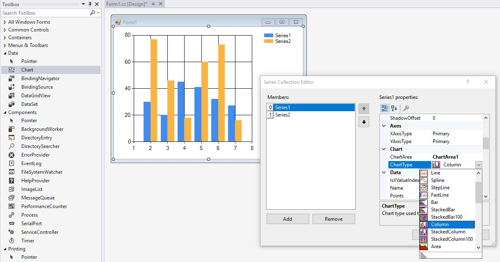
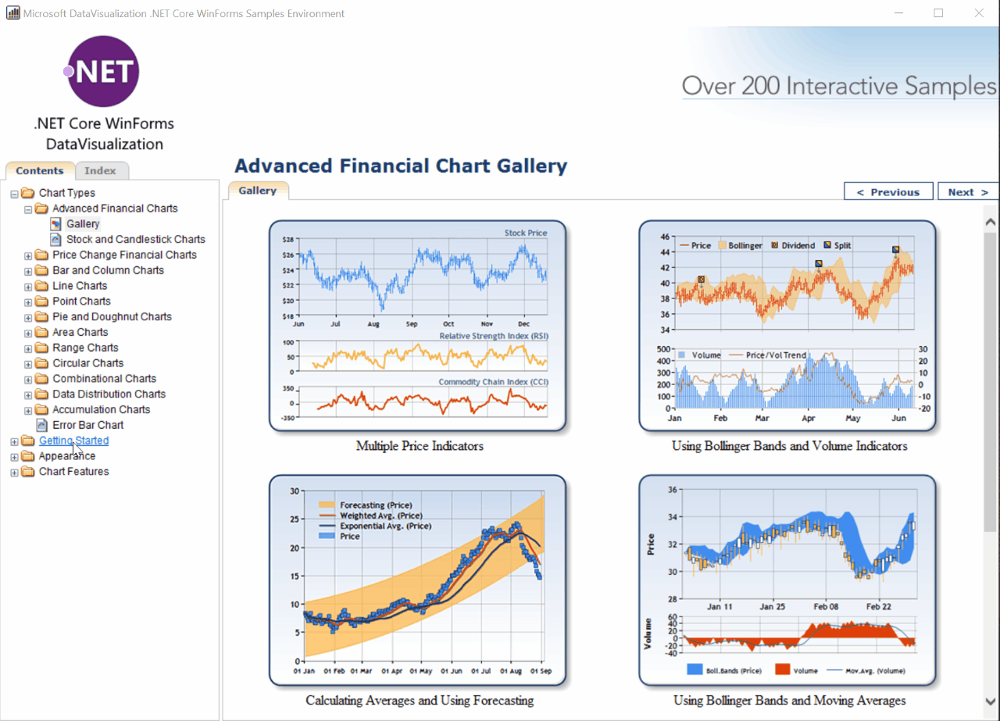

# Announcing .NET Core 3 Preview 4

Today, we are announcing .NET Core 3.0 Preview 4. It includes a chart control for Windows Forms, HTTP/2 support, GC updates to use less memory, support for CPU limits with Docker, the addition of PowerShell in .NET Core SDK Docker container images, and other improvements. If you missed it, check out the improvements we released in [.NET Core 3.0 Preview 3](https://devblogs.microsoft.com/dotnet/announcing-net-core-3-preview-3/) just last month.

[Download .NET Core 3 Preview 4](https://dotnet.microsoft.com/download/dotnet-core/3.0) right now on Windows, macOS and Linux.

## WinForms Chart control now available for .NET Core

We've been hearing that some developers were not able to migrate their existing .NET Framework applications to .NET Core because they had a dependency on the [Chart control](https://docs.microsoft.com/en-us/dotnet/api/system.windows.forms.datavisualization.charting.chart?view=netframework-4.7.2). We've fixed that for you!

The [System.Windows.Forms.DataVisualization](https://www.nuget.org/packages/System.Windows.Forms.DataVisualization/) package (which includes the chart control) is now available on NuGet, for .NET Core. You can now include this control in your .NET Core WinForms applications!



We ported the `System.Windows.Forms.DataVisualization` library to .NET Core over the last few sprints. The source for the chart control is available at [dotnet/winforms-datavisualization](https://github.com/dotnet/winforms-datavisualization), on GitHub. The control was migrated to ease porting to .NET Core 3, but isn't a component we intend to innovate in. For more advanced data visualization scenarios check out [Power BI](https://powerbi.microsoft.com/).

The best way to familiarize yourself with the Charting control is to take a look at our [ChartSamples project](https://github.com/dotnet/winforms-datavisualization/tree/master/sample/ChartSamples). It contains all existing chart types and can guide you through every step.



### Enabling the Chart control in your .NET project

To use the Chart control in your WinForms Core project add a reference to the [System.Windows.Forms.DataVisualization NuGet package](https://www.nuget.org/packages/System.Windows.Forms.DataVisualization/). You can do it by either searching for `System.Windows.Forms.DataVisualization` in the NuGet Package Manager (don't forget to check **Include prerelease** box) or by adding the following lines in your `.csproj` file.

````xml
<ItemGroup>
    <PackageReference Include="System.Windows.Forms.DataVisualization" Version="1.0.0-prerelease.19212.2"/>
</ItemGroup>
````

Note: The WinForms designer is currently under development and you won't be able to configure the control from the designer just yet. For now you can either use a code-first approach or you can create and configure the control in a .NET Framework application using the designer and then port your project to .NET Core. Porting guidelines are available in the [**How to port desktop applications to .NET Core 3.0**](https://devblogs.microsoft.com/dotnet/how-to-port-desktop-applications-to-net-core-3-0/) post.

## WPF

The WPF team [published more components](https://github.com/dotnet/wpf/pull/504) to [dotnet/wpf](https://github.com/dotnet/wpf) between the Preview 3 and Preview 4 releases.

The following components are now available as source:

* [Microsoft.NET.Sdk.WindowsDesktop](https://github.com/dotnet/wpf/tree/master/packaging/Microsoft.NET.Sdk.WindowsDesktop) -- this is the MSBuild SDK (as in "SDK style project" SDK) for Windows Desktop apps.
* [Microsoft.Dotnet.Wpf.ProjectTemplates](https://github.com/dotnet/wpf/tree/master/packaging/Microsoft.Dotnet.Wpf.ProjectTemplates) -- these are the project templates for WPF.
* [PresentationBuildTasks](https://github.com/dotnet/wpf/tree/master/src/Microsoft.DotNet.Wpf/src/PresentationBuildTasks) -- these are the tasks that are used to compile Xaml.

The team published an engineering write-up on what they've been working on. You can expect them to publish more code to GitHub soon.

## Improving .NET Core Version APIs

We have [improved the .NET Core version APIs](https://github.com/dotnet/coreclr/issues/22844) in .NET Core 3.0. They now return the version information you would expect. These changes while they are objectively better are technically breaking and may break applications that rely on version APIs for various information.

You can now get access to the following information via existing APIs:

```console
C:\testapps\versioninfo>dotnet run
.NET Core version:
Environment.Version: 3.0.0
RuntimeInformation.FrameworkDescription: .NET Core 3.0.0-preview4.19113.15
CoreFX Build: 3.0.0-preview4.19113.15
CoreFX Hash: add4cacbfb7f7d3f5f07630d10b24e38da4ad027
```

The [code to produce that output](https://github.com/richlander/testapps/blob/master/versioninfo/Program.cs) follows:

```csharp
  WriteLine(".NET Core version:");
  WriteLine($"Environment.Version: {Environment.Version}");
  WriteLine($"RuntimeInformation.FrameworkDescription: {RuntimeInformation.FrameworkDescription}");
  WriteLine($"CoreCLR Build: {((AssemblyInformationalVersionAttribute[])typeof(object).Assembly.GetCustomAttributes(typeof(AssemblyInformationalVersionAttribute),false))[0].InformationalVersion.Split('+')[0]}");
  WriteLine($"CoreCLR Hash: {((AssemblyInformationalVersionAttribute[])typeof(object).Assembly.GetCustomAttributes(typeof(AssemblyInformationalVersionAttribute), false))[0].InformationalVersion.Split('+')[1]}");
  WriteLine($"CoreFX Build: {((AssemblyInformationalVersionAttribute[])typeof(Uri).Assembly.GetCustomAttributes(typeof(AssemblyInformationalVersionAttribute),false))[0].InformationalVersion.Split('+')[0]}");
  WriteLine($"CoreFX Hash: {((AssemblyInformationalVersionAttribute[])typeof(Uri).Assembly.GetCustomAttributes(typeof(AssemblyInformationalVersionAttribute), false))[0].InformationalVersion.Split('+')[1]}");
  ```

## Tiered Compilation (TC) Update

[Tiered compilation (TC)](https://devblogs.microsoft.com/dotnet/tiered-compilation-preview-in-net-core-2-1/) is a runtime feature that is able to control the compilation speed and quality of the JIT to achieve various performance outcomes. It is enabled by default in .NET Core 3.0 builds.

The fundamental benefit and capability of TC is to enable (re-)jitting methods with slower but faster to produce or higher quality but slower to produce code in order to increase performance of an application as it goes through various stages of execution, from startup through steady-state. This contrasts with the non-TC approach, where every method is compiled a single way (the same as the high-quality tier), which is biased to steady-state over startup performance.

We are considering what the [default TC configuration should be for the final 3.0 release](https://github.com/dotnet/coreclr/issues/24064). We have been investigating the performance impact (positive and/or negative) for a variety of application scenarios, with the goal of selecting a default that is good for all scenarios, and providing configuration switches to enable developers to opt apps into other configurations.

TC remains enabled in Preview 4, but we changed the functionality that is enabled by default. We are looking for feedback and additional data to help us decide if this new configuration is best, or if we need to make more changes. Our goal is to select the best overall default, and then provide one or more configuration switches to enable other opt-in behaviors.

There are two tiers, tier 0 and tier 1. At startup, tier 0 code can be one of the following:

* Ahead-of-time compiled [Ready to Run (R2R)](https://github.com/dotnet/coreclr/blob/master/Documentation/botr/readytorun-overview.md) code.
* Tier 0 jitted code, produced by "Quick JIT". Quick JIT applies fewer optimizations (similar to "minopts") to compile code faster.

Both of these types of tier 0 code can be "upgraded" to tier 1 code, which is fully-optimized jitted code.

In preview 4, R2R tiering is enabled by default and tier 0 jitted code (or Quick JIT) is disabled. This means that all jitted code is jitted as tier 1, by default. Tier 1 code is higher quality (executes faster), but takes longer to generate, so can increase startup time. For Preview 3, TC, including Quick JIT, were enabled.

To enable Quick JIT (tier 0 jitted code):

```xml
<TieredCompilationQuickJit>true</TieredCompilationQuickJit>
```

To disable TC completely:

```xml
 <TieredCompilation>false</TieredCompilation>
```

Please try out the various compilation modes, including the Preview 4 default, and give us feedback.

## HTTP/2 Support

We now have support for [HTTP/2](https://en.wikipedia.org/wiki/HTTP/2) in HttpClient. The new protocol is a requirement for some APIs, like [gRPC](https://github.com/grpc/) and [Apple Push Notification Service](https://developer.apple.com/library/archive/documentation/NetworkingInternet/Conceptual/RemoteNotificationsPG/APNSOverview.html#//apple_ref/doc/uid/TP40008194-CH8-SW1). We expect more services to require HTTP/2 in the future.

ASP.NET also has support for HTTP/2, however it is an independent implementation that is optimized for scale.

In Preview 4, HTTP/2 is not enabled by default, but can be enabled with one of the following methods:

* Set `AppContext.SetSwitch("System.Net.Http.SocketsHttpHandler.Http2Support", true);` app context setting
* Set `DOTNET_SYSTEM_NET_HTTP_SOCKETSHTTPHANDLER_HTTP2SUPPORT` environment variable to `true`

These configurations (either one) need to be set before using HttpClient if you intend to use HTTP/2.

Note: the preferred HTTP protocol version will be negotiated via TLS/ALPN and HTTP/2 will only be used if the server selects to use it.

## SDK Docker Images Contain PowerShell Core

[PowerShell Core](https://github.com/powershell/powershell) has been added to the .NET Core SDK Docker container images, per [requests from the community](https://github.com/dotnet/dotnet-docker/issues/360). PowerShell Core is a cross-platform (Windows, Linux, and macOS) automation and configuration tool/framework that works well with your existing tools and is optimized for dealing with structured data (e.g. JSON, CSV, XML, etc.), REST APIs, and object models. It includes a command-line shell, an associated scripting language and a framework for processing cmdlets.

You can try out PowerShell Core, as part of the .NET Core SDK container image, by running the following Docker command:

```console
docker run --rm mcr.microsoft.com/dotnet/core/sdk:3.0 pwsh -c Write-Host "Hello Powershell"
```

There are two main scenarios that having PowerShell inside the .NET Core SDK container image enables, which were not otherwise possible:

* Write .NET Core application [Dockerfiles with PowerShell syntax](https://github.com/dotnet/dotnet-docker/blob/master/3.0/sdk/nanoserver-1809/amd64/Dockerfile) for any OS.
* Write .NET Core application/library build logic that can be easily containerized.

Example syntax for launching PowerShell for a (volume-mounted) containerized build:

* `docker run -it -v c:\myrepo:/myrepo -w /myrepo mcr.microsoft.com/dotnet/core/sdk:3.0 pwsh build.ps1`
* `docker run -it -v c:\myrepo:/myrepo -w /myrepo mcr.microsoft.com/dotnet/core/sdk:3.0 ./build.ps1`

For the second example to work, on Linux, the `.ps1` file needs to have the following pattern, and needs to be formatted with Unix (LF) not Windows (CRLF) line endings:

```powershell
#!/usr/bin/env pwsh
Write-Host "test"
```

If you are new to PowerShell and would like to learn more, we recommend reviewing the [getting started](https://github.com/PowerShell/PowerShell/tree/master/docs/learning-powershell) documentation.

Note: PowerShell Core is now available as part of [.NET Core 3.0 SDK container images](https://hub.docker.com/_/microsoft-dotnet-core-sdk/). It is not part of the [.NET Core 3.0 SDK](https://dotnet.microsoft.com/download/dotnet-core/3.0).

## Better support Docker CPU (--cpus) Limits

The Docker client allows limiting memory and CPU. We improved support for [memory limits](https://devblogs.microsoft.com/dotnet/announcing-net-core-3-preview-3/) in Preview 3, and have now started [improving CPU limits support](https://github.com/dotnet/coreclr/commit/aea3b1a80d6c114e3e67bc9521bf39a8a17371d1).

### Round up the value of the CPU limit

In the case where `--cpus` is set to a value close (enough) to a smaller integer (for example, 1.499999999), the runtime would previously round that value down (in this case, to 1). As a result, the runtime would take  advantage of less CPU than requested, leading to CPU underutilization.

By rounding up the value, the runtime augments the pressure on the OS threads scheduler, but even in the worst case scenario (`--cpus=1.000000001` -- previously rounded down to 1, now rounded to 2), we have not observed any overutilization of the CPU leading to performance degradation.

### Thread pool honors CPU limits

The next step is ensuring that the thread pool honors CPU limits. Part of the algorithm of the thread pool is computing CPU busy time, which is, in part, a function of available CPUs. By taking CPU limits into account when computing CPU busy time, we avoid various heuristic of the threadpool competing with each other: one trying to allocate more threads to increase the CPU busy time, and the other one trying to allocate less threads because adding more threads doesn't improve the throughput.

## Making GC Heap Sizes Smaller by default

While working on [improving support for docker memory limits](https://devblogs.microsoft.com/dotnet/announcing-net-core-3-preview-3/) as part of Preview 3, we were inspired to make more general GC policy updates to improve memory usage for a broader set of applications (even when not running in a container). The changes better align the generation 0 allocation budget with modern processor cache sizes and cache hierarchy.

[Damian Edwards](https://twitter.com/DamianEdwards) on our team noticed that the [memory usage of the ASP.NET benchmarks were cut in half](https://twitter.com/DamianEdwards/status/1093981272362254336) with no negative effect on other performance metrics. That's a staggering improvement! As he says, these are the new defaults, with no change required to his (or your) code (other than adopting .NET Core 3.0).

The memory savings that we saw with the ASP.NET benchmarks may or may not be representative of what you'll see with your application. We'd like to hear how these changes reduce memory usage for your application.

## Better support for many proc machines

Based on .NET's Windows heritage, the GC needed to implement the [Windows concept of processor groups](https://docs.microsoft.com/en-us/windows/desktop/ProcThread/processor-groups) to support  machines with > 64 processors. This implementation was made in .NET Framework, 5-10 years ago. With .NET Core, we made the choice initially for the Linux PAL to emulate that same concept, even though it doesn't exist in Linux.

We have since abandoned this concept in the GC and transitioned it exclusively to the Windows PAL. We also now expose a configuration switch, GCHeapAffinitizeRanges, to specify affinity masks on machines with >64 processors. [Maoni Stephens](https://twitter.com/maoni0) wrote about this change in [Making CPU configuration better for GC on machines with > 64 CPUs](https://blogs.msdn.microsoft.com/maoni/2019/04/03/making-cpu-configuration-better-for-gc-on-machines-with-64-cpus/).

## GC Large page support (delete for Preview 4 -- Preview 5 feature)

[Large Pages](https://docs.microsoft.com/en-us/windows/desktop/Memory/large-page-support) (a.k.a [Huge Pages](https://wiki.debian.org/Hugepages) on Linux) is a feature where the operating system is able to establish memory regions larger than the native page size (often 4K) to improve performance of the application requesting these large pages.

When a virtual-to-physical address translation occurs, a cache called the [Translation lookaside buffer (TLB)](https://en.wikipedia.org/wiki/Translation_lookaside_buffer) is first consulted (often in parallel) to check if a physical translation for the virtual address being accessed is available to avoid doing a page-table walk which can be expensive. Each large-page translation uses a single translation buffer inside the CPU. The size of this buffer is typically three orders of magnitude larger than the native page size; this increases the efficiency of the translation buffer, which can increase performance for frequently accessed memory.

The GC can now be configured with the [GCLargePages](https://github.com/dotnet/coreclr/blob/master/src/inc/clrconfigvalues.h#L326) opt-in feature to choose to [allocate large pages on Windows](https://github.com/dotnet/coreclr/pull/23251). Using large pages reduces TLB misses therefore can potentially increase application perf in general, however, it has its own set of [limitations](https://docs.microsoft.com/en-us/windows/desktop/Memory/large-page-support), such as:

1. it requires contiguous physical space to back up a virtual large page they are hard to come by. So we ask you to specify us the heap size (conveniently with the GCHeapHardLimit config we added in preview 2) and GC can grab all of it upfront – if we wait it’s very likely we won’t be able to find more large pages.

2. you’ll need to give the [SeLockMemoryPrivilege permission](https://github.com/dotnet/core-eng/issues/5776) to even the administrators group.

The current support does come with the following caveats:

1. The Linux support isn’t implemented yet, but we are working on adding it – it’s a matter of adding large pages in the Linux PAL implementation.

2. The bigger caveat is due to the combination of the restriction in large pages on Windows and how GCHeapHardLimit was implemented. On Windows you cannot reserve and then commit large pages (ie, you have to reserve and commit at the same time). And the implementation of GCHeapHardLimit required us to reserve 3x of the limit which is not a problem on 64-bit since it’s just reserve. But with large pages you have to commit so right now it commits 3x of the limit you specify. We will be checking in a change soon that makes this go to 2x (2x is because we do not know how the large and small object distribution will be on the heap). We will be looking at further size reduction in the coming months.

## Hardware Intrinsic API changes

The `Avx2.ConvertToVector256*` methods were changed to return a signed, rather than unsigned type. This puts them inline with the `Sse41.ConvertToVector128*` methods and the corresponding native intrinsics. As an example, `Vector256<ushort> ConvertToVector256UInt16(Vector128<byte>)` is now `Vector256<short> ConvertToVector256Int16(Vector128<byte>)`.

The `Sse41/Avx.ConvertToVector128/256*` methods were split into those that take a `Vector128/256<T>` and those that take a `T*`. As an example, `ConvertToVector256Int16(Vector128<byte>)` now also has a `ConvertToVector256Int16(byte*)` overload. This was done because the underlying instruction which takes an address does a partial vector read (rather than a full vector read or a scalar read). This meant we were not able to always emit the optimal instruction coding when the user had to do a read from memory. This split, allows the user to explicitly select the addressing form of the instruction when needed (such as when you don't already have a `Vector128<T>`).

The `FloatComparisonMode` enum entries and the `Sse`/`Sse2.Compare` methods were renamed to clarify that the operation is ordered/unordered and not the inputs. They were also reordered to be more consistent across the SSE and AVX implementations. An example is that `Sse.CompareEqualOrderedScalar` is now `Sse.CompareScalarOrderedEqual`. Likewise, for the AVX versions, `Avx.CompareScalar(left, right, FloatComparisonMode.OrderedEqualNonSignalling)` is now `Avx.CompareScalar(left, right, FloatComparisonMode.EqualOrderedNonSignalling)`.

The ARM64 intrinsics are not going to be considered stable for .NET Core 3.0. They were removed from in box and moved to a separate `System.Runtime.Intrinsics.Experimental` package that is available on our MyGet feed. This is a similar mechanism to what we did for the x86 intrinsics in .NET Core 2.1

## Assembly Load Context Improvements

Enhancements to AssemblyLoadContext:

* Enable naming contexts
* Added the ability to enumerate ALCs
* Added the ability to enumerate assemblies within an ALC
* Made the type concrete – so instantiation is easier (no requirement for custom types for simple scenarios)

See [dotnet/corefx #34791](https://github.com/dotnet/corefx/issues/34791) for more details.

The [appwithalc](https://github.com/richlander/testapps/blob/master/appwithalc/appwithalc/Program.cs) sample demonstrates these new capabilities. The output from that sample is displayed below.

```console
Hello ALC(World)!

Enumerate over all ALCs:
Default

Enumerate over all assemblies in "Default" ALC:
System.Private.CoreLib, Version=4.0.0.0, Culture=neutral, PublicKeyToken=7cec85d7bea7798e
appwithalc, Version=1.0.0.0, Culture=neutral, PublicKeyToken=null
System.Runtime, Version=4.2.1.0, Culture=neutral, PublicKeyToken=b03f5f7f11d50a3a
System.Runtime.Loader, Version=4.1.0.0, Culture=neutral, PublicKeyToken=b03f5f7f11d50a3a
interfaces, Version=1.0.0.0, Culture=neutral, PublicKeyToken=null
System.Console, Version=4.1.1.0, Culture=neutral, PublicKeyToken=b03f5f7f11d50a3a
System.Runtime.Extensions, Version=4.2.1.0, Culture=neutral, PublicKeyToken=b03f5f7f11d50a3a
System.Threading, Version=4.1.1.0, Culture=neutral, PublicKeyToken=b03f5f7f11d50a3a
System.Text.Encoding.Extensions, Version=4.1.1.0, Culture=neutral, PublicKeyToken=b03f5f7f11d50a3a

Load "library" assembly via new "my custom ALC" ALC
Foo: Hello

Enumerate over all assemblies in "my custom ALC" ALC:
library, Version=1.0.0.0, Culture=neutral, PublicKeyToken=null

Enumerate over all ALCs:
Default
my custom ALC

Load "library" assembly via Assembly.LoadFile
Foo: Hello

Enumerate over all ALCs:
Default
my custom ALC
Assembly.LoadFile(C:\git\testapps\appwithalc\appwithalc\bin\Debug\netcoreapp3.0\library.dll)
```

## Closing

Thanks for trying out .NET Core 3.0. Please continue to give us feedback, either in the comments or on GitHub. We are listening carefully and will continue to make changes based on your feedback.

Take a look at the [.NET Core 3.0 Preview 1](https://blogs.msdn.microsoft.com/dotnet/2018/12/04/announcing-net-core-3-preview-1-and-open-sourcing-windows-desktop-frameworks/), [Preview 2](https://devblogs.microsoft.com/dotnet/announcing-net-core-3-preview-2/) and [3.0 Preview 3](https://devblogs.microsoft.com/dotnet/announcing-net-core-3-preview-3/) posts if you missed those. With this post, they describe the complete set of new capabilities that have been added so far with the .NET Core 3.0 release.
