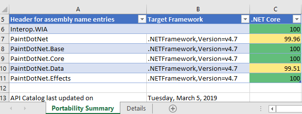

# Porting desktop apps to .NET Core

Since I've been working with the community on porting desktop applications from
.NET Framework to .NET Core, I've noticed that there are two camps of folks:
some want a very simple and short list of instructions to get their apps ported
to .NET Core while others prefer a more principled approach with more background
information. Instead of writing up a "Swiss Army knife"-document, we are going
to publish two blog posts, one for each camp:

* **This post is the simple case**. It's focused on simple instructions and
  smaller applications and is the easiest way to move your app to .NET Core.

* **We will publish another post for more complicated cases**. This post will
  focus more on non-trivial applications, such WPF application with dependencies
  on WCF and third-party UI packages.

If you prefer watching videos instead of reading, here is the video where I do
everything that is described below.

***Insert Video!!!***

## Step 0 - Prerequisites

To port your desktop apps to Core, you'll need [.NET Core 3][core-installation]
and Visual Studio 2019.

## Step 1 - Run portability analyzer

Before porting, you should check how compatible your application is with .NET
Core. To do so, download and run [.NET Portability Analyzer][api-port].

* On the first tab, **Portability Summary**, if you have only 100% in **.NET
  Core** column (everything is highlighted in green), your code is fully
  compatible, go to **Step 2**.
* If you have values of less than 100%, first look at all assemblies that aren't
  part of you application. For those, check if their authors are providing
  versions for .NET Core or .NET Standard.
* Now look at the other part of assemblies that are coming from your code. If
  you don't have any of your assemblies listed in the portability report, go to
  **Step 2**. If you do, open **Details** tab, filter the table by clicking on
  the column **Assembly** and only focus on the ones that are from your
  application. Walk the list and refactor your code to stop
  using the API or replace the API usage with alternatives from .NET Core.

  

## Step 2 - Migrate to SDK-style .csproj

* In **Solution Explorer** right-click on your project (not on the solution!).
  Do you see **Edit Project File**? If you do, you already use the SDK-style
  project file, so you should move to **Step 3**. If not, do the following.

    1. Check in the **Solution Explorer** if your project contains a
       `packages.config` file. If you don't, no action is needed, if you do,
       right-click on `packages.config` and choose **Migrate packages.config to
       PackageReference**. Then click **OK**.

    1. Open your project file by right-clicking on the project and choose **Unload
       Project**. Then right-click on the project and choose **Edit \<your project
       name\>.csproj**.

    1. Copy the content of the project file somewhere, for example into Notepad,
       so you can search in it later.

    1. Delete everything from your project file opened in Visual Studio (I know
       it sounds aggressive 😊, but we will add only needed content from the
       copy we've just made in a few steps). Instead of the text you've just
       deleted, paste the following code.

       For a WinForms application:

       ```xml
       <Project Sdk="Microsoft.NET.Sdk.WindowsDesktop">
         <PropertyGroup>
           <OutputType>WinExe</OutputType>
           <TargetFramework>net472</TargetFramework>
           <UseWindowsForms>true</UseWindowsForms>
           <GenerateAssemblyInfo>false</GenerateAssemblyInfo>
         </PropertyGroup>
       </Project>
       ```

       For a WPF application:

       ```xml
       <Project Sdk="Microsoft.NET.Sdk.WindowsDesktop">
         <PropertyGroup>
           <OutputType>WinExe</OutputType>
           <TargetFramework>net472</TargetFramework>
           <UseWPF>true</UseWPF>
           <GenerateAssemblyInfo>false</GenerateAssemblyInfo>
         </PropertyGroup>
       </Project>
       ```

    1. In Notepad, search for `PackageReference`. If you did not find anything,
       move on. If you found `PackageReference`, copy the entire `<ItemGroup>`
       that contains `PackageReference` in your project file, opened in Visual
       Studio, right below the lines you've pasted in the step above. Do it for
       each occurrence of the `PackageReference` you have found. The copied
       block should look like this.

        ```xml
        <ItemGroup>
            <PackageReference Include="NUnit">
              <Version>3.11.0</Version>
            </PackageReference>
        </ItemGroup>
        ```

    1. Now do the same as above for `ProjectReference`. If you did not find
       anything, move on. If you found any `ProjectReference` items, they would
       look like this.

        ```xml
        <ItemGroup>
          <ProjectReference Include="..\WindowsFormsApp1\WindowsFormsApp1.csproj">
            <Project>{7bce0d50-17fe-4fda-b6b7-e7960aed8ac2}</Project>
            <Name>WindowsFormsApp1</Name>
          </ProjectReference>
        </ItemGroup>
        ```

        You can remove lines with `<Project>` and `<Name>` properties, since they
        are not needed in the new project file style. So for each
        `ProjectReference` that you have found (if any), copy only `ItemGroup`
        and `ProjectReference` like this.

        ```xml
        <ItemGroup>
          <ProjectReference Include="..\WindowsFormsApp1\WindowsFormsApp1.csproj" />
        </ItemGroup>
        ```

    1. Save everything. Close the .csproj file in Visual Studio. Right-click on
       your project in the **Solution Explorer** and select **Reload Project**.
       Rebuild and make sure there are no errors.

    Great news, you just updated your project file to the new SDK-style!
    The project is still targeting .NET Framework, but now you'll be able to
    retarget it to .NET Core.

## Step 3 - Retarget to .NET Core  

* Open your project file by double-clicking on your project in **Solution
  Explorer**. Find the property `<TargetFramework>` and change the value to
  `netcoreapp3.0`. Now your project file should look like this:

    ```xml
    <Project Sdk="Microsoft.NET.Sdk.WindowsDesktop">
      <PropertyGroup>
        <OutputType>WinExe</OutputType>
        <TargetFramework>netcoreapp3.0</TargetFramework>
        ...
      </PropertyGroup>
      ...
    </Project>
    ```

* Build and run your project. **Congratulations, you ported to .NET Core 3**!

## Fixing errors

If you get errors like

```console
The type or namespace <some name> could not be found
```

or

```console
The name <some name> does not exist in the current context
```

and your portability report was green, it should be easy to fix by adding a
NuGet package with the corresponding library. If you cannot find the NuGet
package with the library that is missing, try referencing 
[**Microsoft.Windows.Compatibility**][compat-pack]. This package adds ~21K .NET
APIs from .NET Framework.

## Working with designers

Even though it is possible to edit the user interface of your application via
code, developers usually prefer using the visual designers. With .NET Core we
had to rearchitect the way the designers work with .NET Core projects:

* The WPF designer is already in preview and we are working on adding more
  functionality to it.
* The WinForms designer for .NET Core will be available later, and meanwhile
  there you can use the .NET Framework WinForms designer as a workaround.

Here is how you can use the .NET Framework WinForms designer:

1. Copy your `.csproj` file (let's say you have `MyProject.csproj`), give it a
   different name, for example `MyProject.NetFramework.csproj` and put it next
   to your existing project file.
1. Make sure your project is closed in Visual Studio, open the new project
   `MyProject.NetFramework.csproj`.
1. In **Solution Explorer** right-click on your project -> **Properties**. In
   the **Application** tab (should be open by default) set **Assembly name** and
   **Default namespace** to the same values as in your initial project (remove
   ".NetFramework" from the names).
1. Save this solution next to your existing solution.
1. Open the new project file and change the `<TargetFramework>` to `net472`.
1. Now when you need to use the WinForms designer, load your project with the
   `MyProject.NetFramework.csproj` project file and you'll get the full
   experience of .NET Framework designer. When you are done with the designer,
   close and open your project with the .NET Core project file.

This is just a workaround until the WinForms designer for .NET Core is ready.

## Why port to .NET Core

Check out the video where Scott Hunter and I are talking about all the new
things coming with .NET Core 3 [Porting to .NET Core
3.0](https://www.youtube.com/watch?v=upVQEUc_KwU&feature=youtu.be).

[core-installation]: https://dotnet.microsoft.com/download
[api-port]: https://blogs.msdn.microsoft.com/dotnet/2018/08/08/are-your-windows-forms-and-wpf-applications-ready-for-net-core-3-0/
[compat-pack]: https://docs.microsoft.com/dotnet/core/porting/windows-compat-pack