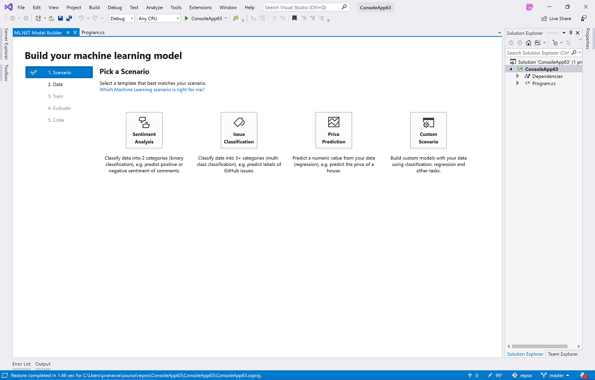

# Announcing ML.NET 1.1 and Model Builder updates (Machine Learning for .NET)

[ML.NET](https://dot.net/ml) is an open-source and cross-platform machine learning framework (Windows, Linux, macOS) for .NET developers.

[ML.NET](https://dot.net/ml) offers Model Builder [Model Builder](https://aka.ms/modelbuilder) (a simple UI tool) and [CLI](https://docs.microsoft.com/en-us/dotnet/machine-learning/how-to-guides/install-ml-net-cli) to make it super easy to build custom ML Models using AutoML.

 Using [ML.NET](https://dot.net/ml), developers can leverage their existing tools and skillsets to develop and infuse custom AI into their applications by creating custom machine learning models for common scenarios like Sentiment Analysis, Recommendation, Image Classification and more!.

Today we’re announcing **[ML.NET](https://dot.net/ml) 1.1** which includes updates for [ML.NET](https://dot.net/ml) ([v1.0 was released on May 2019](https://devblogs.microsoft.com/dotnet/announcing-ml-net-1-0/)) and **Model Builder** for Visual Studio. 

Following are the key highlights:

# ML.NET 1.1 timeframe updates

- **Added support for in-memory 'image type' in IDataview:** In previous versions of ML.NET whenever you used images in a model (such as when scoring a TensorFlow or ONNX model using images) you needed to load the images from files placed on a drive by specifying file paths. In ML.NET 1.1 you can now load in-memory images and process them directly.  

   - For further learning read this 'end-to-end scenario' [blog post describing a sample ASP.NET Core web app](https://devblogs.microsoft.com/cesardelatorre/run-with-ml-net-c-code-a-tensorflow-model-exported-from-azure-cognitive-services-custom-vision/) where the images are used in-memory. Images used in the sample app are directly received through Http requests, then processed by a *TensorFlow* model with ML.NET API code.
   - Additional samples using in-memory images:

      - [Sample to convert gray scale image in-Memory](https://github.com/dotnet/machinelearning/blob/02a857a7646188fec2d1cba5e187a6c9d0838e23/docs/samples/Microsoft.ML.Samples/Dynamic/Transforms/ImageAnalytics/ConvertToGrayScaleInMemory.cs) |  [Sample for custom mapping with in-memory using custom type](https://github.com/dotnet/machinelearning/blob/02a857a7646188fec2d1cba5e187a6c9d0838e23/docs/samples/Microsoft.ML.Samples/Dynamic/Transforms/CustomMappingWithInMemoryCustomType.cs)

- **New Anomaly Detection algorithm** (*in preview*): Added a new Anomaly Detection algorithm named `SrCnnAnomalyDetection` to the [Time Series NuGet package](https://www.nuget.org/packages/Microsoft.ML.TimeSeries/). This algorithm based on a *Super-Resolution Deep Convolutional Network*. One of the advantages of this algorithm is that it does not require any prior training. This contribution comes from the [Azure Anomaly Detector](https://azure.microsoft.com/en-us/services/cognitive-services/anomaly-detector/) team.

   For further learning see this [sample code for anomaly detection](https://github.com/dotnet/machinelearning/blob/master/docs/samples/Microsoft.ML.Samples/Dynamic/Transforms/TimeSeries/DetectAnomalyBySrCnn.cs)

- **New Time Series Forecasting components** (*in preview*): This new feature added to the [Time Series NuGet package](https://www.nuget.org/packages/Microsoft.ML.TimeSeries/) allows you to implement a time series forecasting model based on `Singular Spectrum Analysis(SSA)`. It is named in ML.NET as `AdaptiveSingularSpectrumSequenceModeler`. This type of time series forecasting prediction is very useful when your data has some kind of periodic component where events have a causal relationship and they happen (or miss to happen) in some point of time. For example, sales forecasts impacted by different seassons (Holiday-season, sales timeframe, weekends, etc.) or any other type of data where the time component is important.

   For further learning see this [sample code for forecasting](https://github.com/dotnet/machinelearning/tree/master/docs/samples/Microsoft.ML.Samples/Dynamic/Transforms/TimeSeries/Forecasting.cs)

- **Additional enhancements and remarks**:
   - Upgrade internal TensorFlow version from 1.12.0 to 1.13.1
   - Microsoft.ML.TensorFlow has been upgraded from 0.12 (preview) to 1.0 (release).

- **Bug fixing**: For further learning on bug fixes released on v1.1 go to the [ML.NET v1.1 Release Notes](https://github.com/dotnet/machinelearning/blob/master/docs/release-notes/1.1.0/release-1.1.0.md#bug-fixes)

# Model Builder updates

This release of Model Builder adds support for a new scenario and address many customer reported issues. 

- **New Issue Classification Template**:
This scenario enables a user to add support for classifying tabular data into many classes. This template uses multi-class classification which can be used for classifying data into 3+ categories. E.g You can use this template for predicting GitHub issues, customer support ticket routing, classifying emails into different categories and many more scenarios. 

- **Improve Evaluate step**:
Evaluate step now shows more correct information about the top models explored. This was the most commonly requested fix reported by customers.

- **Improve code generation step**:
Improve instructions for easily consuming generated code by referring to the project names.

- **Address customer feedback**:
This release also address many customer reported issues around installation errors, usability feedback and stability improvements and more.

# Planning to go to production?

If you are using [ML.NET](https://dot.net/ml) in your app and looking to go into production, you can talk to an engineer on the [ML.NET](https://dot.net/ml) team to:

- Get help implementing [ML.NET](https://dot.net/ml) successfully in your application.
- Provide feedback about [ML.NET](https://dot.net/ml).
- Demo your app and potentially [have it featured on the ML.NET homepage](https://dotnet.microsoft.com/apps/machinelearning-ai/ml-dotnet/customers), .NET Blog, or other Microsoft channel.

Fill out [this form](http://survey.usabilla.com/live/s/5c87fbc101634d1357359f7b) and leave your contact information at the end if you’d like someone from the [ML.NET](https://dot.net/ml) team to contact you.

# Get started with ML.NET and Model Builder!

Get started with <a href="https://www.microsoft.com/net/learn/apps/machine-learning-and-ai/ml-dotnet/get-started">ML.NET here</a>.

Get started with <a href="https://aka.ms/modelbuilder">Model Builder here</a>.

 
Next, going further explore some other resources:

  * Tutorials and resources at the [Microsoft Docs ML.NET Guide](https://docs.microsoft.com/dotnet/machine-learning/)
  * Sample apps using ML.NET at the [machinelearning-samples GitHub repo](https://github.com/dotnet/machinelearning-samples)
  * [Model Builder feedback](https://aka.ms/modelbuilder)

Thanks and happy coding with [ML.NET](https://dot.net/ml)!

The [ML.NET](https://dot.net/ml) Team.

*This blog was authored by Cesar de la Torre, Pranav Rastogi plus additional contributions of the [ML.NET](https://dot.net/ml) team*
