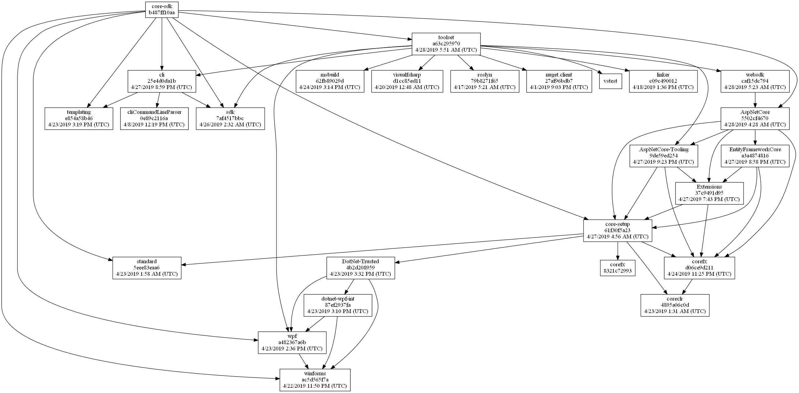
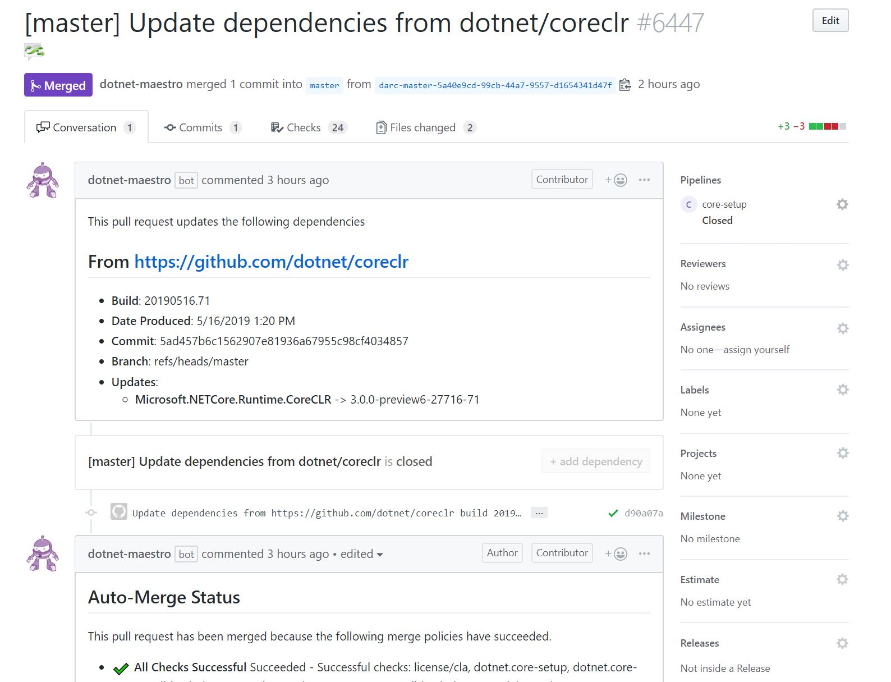
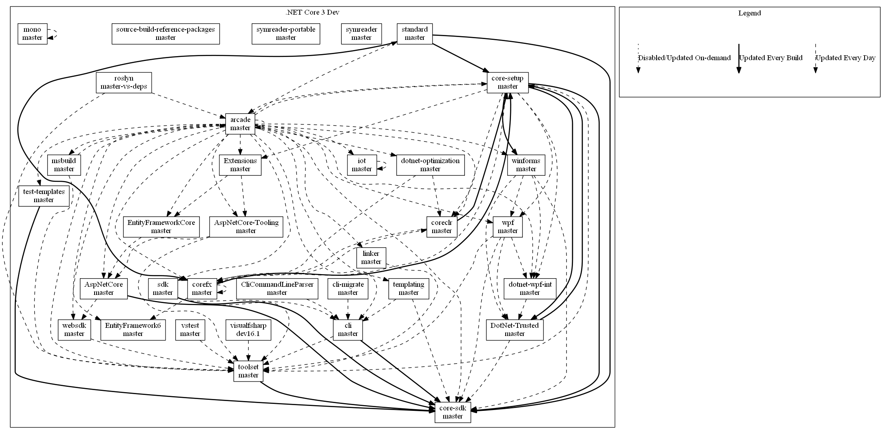

# The Evolving Infrastructure of .NET Core

With [.NET Core 3.0 Preview
6](https://devblogs.microsoft.com/dotnet/announcing-net-core-3-0-preview-6/) out the door, we
thought it would be useful to take a brief look at the history of our infrastructure systems and
the significant improvements that have been made in the last year or so.

This post will be interesting if you are interested in build infrastructure or want a
behind-the-scenes look at how we build a product as big as .NET Core. It doesn't describe new
features or sample code that you should use in your next application. Please tell us if you like
these types of posts. We have a few more like this planned, but would appreciate knowing if you
find this type of information helpful.

## A little history

Begun over 3 years ago now, the .NET Core project was a significant departure from traditional
Microsoft projects. 
- Developed publicly on GitHub
- Composed of isolated git repositories that integrate together vs. a monolithic repository.
- Targets many platforms
- Its components may ship in more than one 'vehicle' (e.g. Roslyn ships as a component of Visual
  Studio as well as the SDK)

Our early infrastructure decisions were made around necessity and expediency. We used Jenkins for
GitHub PR and CI validation because it supported cross-platform OSS development. Our official
builds lived in Azure DevOps (called VSTS at the time) and TeamCity (used by ASP.NET Core), where
signing and other critical shipping infrastructure exists. We integrated repositories together
using a combination of manually updating package dependency versions and somewhat automated GitHub
PRs. Teams independently built what tooling they needed to do packaging, layout, localization and
all the rest of the usual tasks that show up in big development projects. While not ideal, on some
level this worked well enough in the early days. As the project grew from .NET Core 1.0 and 1.1
into 2.0 and beyond we wanted to invest in a more integrated stack, faster shipping cadences and
easier servicing. We wanted to produce a new SDK with the latest runtime multiple times per day.
And we wanted all of this without reducing the development velocity of the isolated repositories.

Many of the infrastructure challenges .NET Core faces stem from the isolated, distributed nature of
the repository structure. Although it's varied quite a bit over the years, the product is made up
of anywhere from 20-30 independent git repositories (ASP.NET Core had many more until recently). On
one hand, having many independent development silos tends to make development in those silos very
efficient; a developer can iterate very quickly in the libraries without much worry about the rest
of the stack. On the other hand, it makes innovation and integration of the overall project much
less efficient. Some examples:
- If we need to roll out new signing or packaging features, doing so across so many independent
  repos that use different tools is very costly.
- Moving changes across the stack is slow and costly. Fixes and features in repositories 'low' in
  the stack (e.g. corefx libraries) may not be seen in the SDK (the 'top' of the stack) for several
  days. If we make a fix in dotnet/corefx, that change must be built and the new version flowed
  into any up-stack components that reference it (e.g. dotnet/core-setup and ASP.NET Core), where
  it will be tested, committed and built. Those new components will then need to flow those new
  outputs further up the stack, and so on and so forth until the head is reached.

In all of these cases, there is chance for failure at many levels, further slowing down the
process. As .NET Core 3.0 planning began in earnest, it became clear that we could we could not
create a release of the scope that we wanted without significant changes in our infrastructure.

## A three-pronged approach

We developed a three-pronged approach to ease our pain:

- **Shared Tooling (aka [Arcade][arcade-repo])** - Invest in shared tooling across our
  repositories.
- **System Consolidation (Azure DevOps)** - Move off of Jenkins and into Azure DevOps for our
  GitHub CI. Move our official builds from classic VSTS-era processes onto modern config-as-code.
- **Automated Dependency Flow and Discovery (Maestro)** - Explicitly track inter-repo dependencies
  and automatically update them on a fast cadence.

### Arcade

Prior to .NET Core 3.0, there were 3-5 different tooling implementations scattered throughout
various repositories, depending on how you counted.
- The core runtime repositories ([dotnet/coreclr](https://github.com/dotnet/coreclr),
  [dotnet/corefx](https://github.com/dotnet/corefx) and
  [dotnet/core-setup](https://github.com/dotnet/core-setup)) had
  [dotnet/buildtools](https://github.com/dotnet/buildtools).
- ASP.NET Core's repositories had [aspnet/KoreBuild](https://github.com/aspnet/KoreBuild)
- Various repositories like [dotnet/symreader](https://github.com/dotnet/symreader) used [Repo
  Toolset](https://github.com/dotnet/roslyn-tools)
- A few other isolated repositories had independent implementations.

While in this world each team gets to customize their tooling and only build exactly what they
need, it does have some significant downsides:
- **Developers move between repositories less efficiently**

  *Example:* When a developer moves from dotnet/corefx into dotnet/core-sdk, the 'language' of the
  repository is different. What does she type to build and test? Where do the logs get placed? If
  she needs to add a new project to the repo, how is this done?
- **Each required feature gets built N times**

  *Example:* .NET Core produces tons of NuGet packages. While there is some variation (e.g. shared
  runtime packages like Microsoft.NETCore.App produced out of dotnet/core-setup are built
  differently than 'normal' packages like Microsoft.AspNet.WebApi.Client), the steps to produce
  them are fairly similar. Unfortunately, as repositories diverge their layout, project structure,
  etc. it generates differences in how these packaging tasks need to be implemented. How does a
  repository define what packages should be generated, what goes in those packages, their metadata,
  and so on. Without shared tooling, it is often easier for a team to just implement another
  packaging task rather than reuse another. This is of course a strain on resources.

With [Arcade](https://github.com/dotnet/arcade), we endeavored to bring all our repos under a
common layout, repository 'language', and set of tasks where possible. This is not without its
pitfalls. Any kind of shared tooling ends up solving a bit of a 'Goldilocks' problem. If the shared
tooling is too prescriptive, then the kind of customization required within a project of any
significant size becomes difficult, and updating that tooling becomes tough. It's easy to break a
repository with new updates.  BuildTools suffered from this.  The repositories that used it became
so tightly coupled to it that it was not only unusable for other repositories, but making any
changes in buildtools often broke consumers in unexpected ways. If shared tooling is not
prescriptive enough, then repositories tend to diverge in their usage of the tooling, and rolling
out updates often requires lots of work in each individual repository. At that point, why have
shared tooling in the first place?

Arcade actually tries to go with both approaches at the same time. It defines a common repository
'language' as set of scripts (see
[eng/common](https://github.com/dotnet/arcade/tree/master/eng/common)), a common repository layout,
and common set of build targets rolled out as an MSBuild SDK. Repositories that choose to fully
adopt Arcade have predictable behavior, making changes easy to roll out across repositories.
Repositories that do not wish to do so can pick and choose from a variety of MSBuild task packages
that provide basic functionality, like signing and packaging, that tend to look the same across all
repositories. As we roll out changes to these tasks, we try our best to avoid breaking changes.

Let's take a look at the primary features that Arcade provides and how they integrate into our
larger infrastructure.

- **Common build task packages** - These are a basic layer of MSBuild tasks which can either be
  utilized independently or as part of the Arcade SDK. They are "pay for play" (hence the name
  'Arcade'). They provide a common set of functionality that is needed in most .NET Core
  repositories:
    - Signing:
      [Microsoft.DotNet.SignTool](https://github.com/dotnet/arcade/tree/master/src/Microsoft.DotNet.SignTool)
    - Output publishing (to inter-repo feeds):
      [Microsoft.DotNet.Build.Tasks.Feed](https://github.com/dotnet/arcade/tree/master/src/Microsoft.DotNet.Build.Tasks.Feed)
    - Packaging
      [Microsoft.DotNet.Build.Tasks.Packaging](https://github.com/dotnet/arcade/tree/master/src/Microsoft.DotNet.Build.Tasks.Packaging)
- **Common repo targets and behaviors** - These are provided as part of an MSBuild SDK called the
  "Arcade SDK". By utilizing it, repositories opt-in to the default Arcade build behaviors, project
  and artifact layout, etc.
- **Common repository 'language'** - A set of common [script
  files](https://github.com/dotnet/arcade/tree/master/eng/common) that are synchronized between all
  the Arcade repositories using dependency flow (more on that later).  These script files introduce
  a common 'language' for repositories that have adopted Arcade. Moving between these repositories
  becomes more seamless for developers. Moreover, because these scripts are synced between
  repositories, rolling out new changes to the original copies located in the Arcade repo can
  quickly introduce new features or behavior into repositories that have fully adopted the shared
  tooling.
- **Shared Azure DevOps job and step templates** - While the scripts that define the common
  repository 'language' are primarily targeted towards interfacing with humans, Arcade also has a
  set of Azure DevOps [job and step
  templates](https://docs.microsoft.com/en-us/azure/devops/pipelines/process/templates?view=azure-devops)
  that allow for Arcade repositories to interface with the Azure DevOps CI systems. Like the common
  build task packages, the step templates form a base layer that can be utilized by almost every
  repository (e.g. to send build telemetry). The job templates form more complete units, allowing
  repositories to worry less about the details of their CI process.

### Moving to Azure DevOps

As noted above, the larger team used a combination of CI systems through the 2.2 release:
- AppVeyor and Travis for ASP.NET Core's GitHub PRs
- TeamCity for ASP.NET's official builds
- Jenkins for the rest of .NET Core's GitHub PRs and rolling validation.
- Classic (non-YAML) Azure DevOps workflows for all non-ASP.NET Core official builds.

A lot of differentiation was simply from necessity. Azure DevOps did not support public GitHub
PR/CI validation, so ASP.NET Core turned to AppVeyor and Travis to fill the gap while .NET Core
invested in Jenkins. Classic Azure DevOps did not have a lot of support for build orchestration, so
the ASP.NET Core team turned to TeamCity while the .NET Core team built a tool called PipeBuild on
top of Azure DevOps to help out. All of this divergence was very expensive, even in some
non-obvious ways:
- While Jenkins is flexible, maintaining a large (~6000-8000 jobs), stable installation is a
  serious undertaking.
- Building our own orchestration on top of classic Azure DevOps required a lot of compromises. The
  checked in pipeline job descriptions were not really human-readable (they were just exported json
  descriptions of manually created build definitions), secrets management was ugly, and they
  quickly became over-parameterized as we attempted to deal with the wide variance in build
  requirements.
- When official build vs. nightly validation vs. PR validation processes are defined in different
  systems, sharing logic becomes difficult. Developers must take additional care when making
  process changes because and breaks are common. We defined Jenkins PR jobs in a special script
  file, TeamCity had lots of manually configured jobs, AppVeyor and Travis used their own yaml
  formats, and Azure DevOps had the obscure custom system we built on top of it. It was easy to
  make a change to build logic in a PR and break the official CI build. To mitigate this, we did
  work to keep as much logic in scripting common to official CI and PR builds, but invariably
  differences creep in over time. Some variance, like in build environments, is basically
  impossible to entirely remove.
- Practices for making changes to workflows varied wildly and were often difficult to understand.
  What a developer learned about Jenkins's netci.groovy files for updating PR logic did not
  translate over to the PipeBuild json files for official CI builds. As a result, knowledge of the
  systems was typically isolated to a few team members, which is less than ideal in large
  organizations.

When Azure DevOps began to roll out YAML based build pipelines and support for public GitHub
projects as .NET Core 3.0 began to get underway, we recognized we had a unique opportunity. With
this new support, we could move all our existing workflows out of the separate systems and into
modern Azure DevOps and also make some changes to how we deal with official CI vs. PR workflows. We
started with the following rough outline of the effort:
- Keep all our logic in code, in GitHub. Use the YAML pipelines everywhere.
- Have a public and private project.
    - The public project will run all the public CI via GitHub repos and PRs as we always have
    - The private project will run official CI be the home of any private changes we need to make,
      in repositories matching the public GitHub repositories
    - Only the private project will have access to restricted resources.
- Share the same YAML between official CI and PR builds.  Use [template
  expressions](https://docs.microsoft.com/en-us/azure/devops/pipelines/process/templates?view=azure-devops#template-expressions)
  to differentiate between the public and private project where behavior must diverge, or resources
  only available in the private project would be accessed. While this often makes the overall YAML
  definition a little messier, it means that:
    - The likelihood of a build break when making a process change is lower. 
    - A developer only really needs to change one set of places to change official CI and PR
      process.
- Build up Azure DevOps templates for common tasks to keep duplication of boilerplate YAML to a
  minimum, and enable rollout of updates (e.g. telemetry) easy using dependency flow.

As of now, all of the primary .NET Core 3.0 repositories are on Azure DevOps for their public PRs
and official CI. A good example pipeline is the official build/PR pipeline for
[dotnet/arcade](https://github.com/dotnet/arcade/blob/master/azure-pipelines.yml) itself.

### Maestro and Dependency Flow

The final piece of the .NET Core 3.0 infrastructure puzzle is what we call dependency flow. This is
not a unique concept to .NET Core. Unless they are entirely self-contained, most software projects
contain some kind of versioned reference to other software. In .NET Core, these are commonly
represented as NuGet packages. When we want new features or fixes that libraries have shipped, we
pull those new updates by updating the referenced version numbers in our projects. Of course, these
packages may also have versioned references to other packages, those other packages may have more
references, so on and so forth. This creates a graph. Changes flow through the graph as each
repository pulls new versions of their input dependencies.

#### A Complex Graph

The primary development life-cycle (what developers regularly work on) of most software projects
typically involves a small number of inter-related repositories. Input dependencies are typically
stable and updates are sparse. When they do need to change, it's usually a manual operation. A
developer evaluates the available versions of the input package, chooses an appropriate one, and
commits the update. This is not the case in .NET Core. The need for components to be independent,
ship on different cadences and have efficient inner-loops development experiences has led to a
fairly large number of repositories with a large amount of inter-dependency. The inter-dependencies
also form a fairly deep graph:

 *The dotnet/core-sdk repository
serves as the aggregation point for all sub-components. We ship a build of dotnet/core-sdk, which
describes all other referenced components.*

We also expect that new outputs will flow quickly through this graph so that the end product can be
validated as often as possible. For instance, we expect the latest bits of ASP.NET Core or the .NET
Core Runtime to express themselves in the SDK as often as possible. This essentially means updating
dependencies in each repository on a regular, fast cadence. In a graph of sufficient size, like
.NET Core has, this quickly becomes an impossible task to do manually. A software project of this
size might go about solving this is a number of ways:
- **Auto-floating input versions** - In this model, dotnet/core-sdk might reference the
  Microsoft.NETCore.App produced out of dotnet/core-setup by allowing NuGet to float to the latest
  prerelease version. While this works, it suffers from major drawbacks.  Builds become
  non-deterministic. Checking out an older git SHA and building will not necessarily use the same
  inputs or produce the same outputs. Reproducing bugs becomes difficult. A bad commit in
  dotnet/core-setup can break any repository pulling in its outputs, outside of PR and CI checks.
  Orchestration of builds becomes a major undertaking, because separate machines in a build may
  restore packages at different times, yielding different inputs. All of these problems are
  'solvable', but require huge investment and unnecessary complication of the infrastructure.
- **'Composed' build** - In this model, the entire graph is built all at once in isolation, in
  dependency order, using the latest git SHAs from each of the input repositories. The outputs from
  each stage of the build are fed into the next stage. A repository effectively has its input
  dependency version numbers overwritten by its input stages. At the end of a successful build, the
  outputs are published and all the repositories update their input dependencies to match what was
  just built. This is a bit of an improvement over auto-floating version numbers in that individual
  repository builds aren't automatically broken by bad check-ins in other repos, but it still has
  major drawbacks. Breaking changes are almost impossible to flow efficiently between repositories,
  and reproducing failures is still problematic because the source in a repository often doesn't
  match what was actually built (since input versions were overwritten outside of source control).
- **Automated dependency flow** - In this model, external infrastructure is used to automatically
  update dependencies in a deterministic, validated fashion between repositories. Repositories
  explicitly declare their input dependencies and associated versions in source, and 'subscribe' to
  updates from other repositories. When new builds are produced, the system finds matching
  subscriptions, updates any of the declared input dependencies, and opens a PR with the changes.
  This method improves reproducibility, the ability to flow breaking changes, and allows a
  repository owner to have control over how updates are done. On the downside, it can be
  significantly slower than either of the other two methods. A change can only flow from the bottom
  of the stack to the top as fast as the total sum of the PR and Official CI times in each
  repository along the flow path.

.NET Core has tried all 3 methods. We floated versions early on in the 1.x cycle, had some level of
automated dependency flow in 2.0 and went to a composed build for 2.1 and 2.2.  With 3.0 we decided
to invest heavily in automated dependency flow and abandon the other methods. We wanted to improve
over our former 2.0 infrastructure in some significant ways:
- **Ease traceability of what is actually in the product** - At any given repository, it's
  generally possible to determine what versions of what components are being used as inputs, but
  almost always hard to find out where those components were built, what git SHAs they came from,
  what their input dependencies were, etc.
- **Reduce required human interaction** - Most dependency updates are mundane. Auto-merge the
  update PRs as they pass validation to speed up flow.
- **Keep dependency flow information separate from repository state** - Repositories should only
  contain information about the current state of their node in the dependency graph. They should
  not contain information regarding transformation, like when updates should be taken, what sources
  they pull from, etc.
- **Flow dependencies based on 'intent', not branch** - Because .NET Core is made up of quite a few
  semi-autonomous teams with different branching philosophies, different component ship cadences,
  etc. do not use branch as a proxy for intent. Teams should define what new dependencies they pull
  into their repositories based on the purpose of those inputs, not where they came from.
  Furthermore, the purpose of those inputs should be declared by those teams producing those
  inputs.
- **'Intent' should be deferred from the time of build** - To improve flexibility, avoid assigning
  the intent of a build until after the build is done, allowing for multiple intentions to be
  declared. At the time of build, the outputs are just a bucket of bits built at some git SHA. Just
  like running a release pipeline on the outputs of an Azure DevOps build essentially assigns a
  purpose for the outputs, assigning an intent to a build in the dependency flow system begins the
  process of flowing dependencies based on intent.

With these goals in mind, we created a service called Maestro++ and a tool called 'darc' to handle
our dependency flow. Maestro++ handles the data and automated movement of dependencies, while darc
provides a human interface for Maestro++ as well as a window into the overall product dependency
state. Dependency flow is based around 4 primary concepts: dependency information, builds, channels
and subscriptions.

#### Builds, Channels, and Subscriptions

- **Dependency information** - In each repository, there is a declaration of the input dependencies
  of the repository along with source information about those input dependencies in the
  [eng/Version.Details](https://github.com/dotnet/core-sdk/blob/master/eng/Version.Details.xml).
  Reading this file, then transitively following the repository+sha combinations for each input
  dependency yields the product dependency graph.
- **Builds** - A build is just the Maestro++ view on an Azure DevOps build. A build identifies the
  repository+sha, overall version number and the full set of assets and their locations that were
  produced from the build (e.g. NuGet packages, zip files, installers, etc.).
- **Channels** - A channel represents intent. It may be useful to think of a channel as a cross
  repository branch. Builds can be assigned to one or more channels to assign intent to the
  outputs. Channels can be associated with one or more release pipelines. Assignment of a build to
  a channel activates the release pipeline and causes publishing to happen. The asset locations of
  the build are updated based on release publishing activities.
- **Subscriptions** - A subscription represents transform. It maps the outputs of a build placed on
  a specific channel onto another repository's branch, with additional information about when those
  transforms should take place.

These concepts are designed so that repository owners do not need global knowledge of the stack or
other teams' processes in order to participate in dependency flow. They basically just need to know
three things:
- The intent (if any) of the builds that they do, so that channels may be assigned.
- Their input dependencies and what repositories they are produced from.
- What channels they wish to update those dependencies from.

As an example, let's say I own the dotnet/core-setup repository. I know that my master branch
produces bits for day to day .NET Core 3.0 development. I want to assign new builds to the
pre-declared '.NET Core 3.0 Dev' channel. I also know that I have several dotnet/coreclr and
dotnet/corefx package inputs. I don't need to know how they were produced, or from what branch. All
I need to know is that I want the newest dotnet/coreclr inputs from the '.NET Core 3.0 Dev' channel
on a daily basis, and the newest dotnet/corefx inputs from the '.NET Core 3.0 Dev' channel every
time they appear.

First, I onboard by adding an
[eng/Version.Details](https://github.com/dotnet/core-setup/blob/master/eng/Version.Details.xml)
file. I then use the 'darc' tool to ensure that every new build of my repository on the master
branch is assigned by default to the '.NET Core 3.0 Dev' channel. Next, I set up subscriptions to
pull inputs from .NET Core 3.0 Dev for builds of dotnet/corefx, dotnet/coreclr, dotnet/standard,
etc. These subscriptions have a cadence and auto-merge policy (e.g. weekly or every build).

As the trigger for each subscription is activated, Maestro++ updates files
(eng/Version.Details.xml, eng/Versions.props, and a few others) in the core-setup repo based on the
declared dependencies intersected with the newly produced outputs. It opens a PR, and once the
configured checks are satisfied, will automatically merge the PR.

This in turn generates a new build of core-setup on the master branch. Upon completion, automatic
assignment of the build to the '.NET Core 3.0 Dev' channel is started. The '.NET Core 3.0 Dev'
channel has an associated release pipeline which pushes the build's output artifacts (e.g. packages
and symbol files) to a set of target locations. Since this channel is intended for day to day
public dev builds, packages and symbols are pushed to various public locations. Upon release
pipeline completion, channel assignment is finalized and any subscriptions that activate on this
event are fired. As more components are added, we build up a full flow graph representing all of
the automatic flow between repositories.

 *Flow graph for the .NET Core 3.0 Dev channel,
including other channels that (e.g. Arcade's '.NET Tools Latest') that contribute to the .NET Core
3.0 Dev flow.*

#### Coherency and Incoherency

The increased visibility into the state of .NET Core's dependency graph highlighted an existing
question: **What happens when multiple versions of the same component are referenced at various
nodes in the graph?** Each node in .NET Core's dependency graph may flow dependencies to more than
one other node. For instance, the Microsoft.NETCore.App dependency, produced out of
dotnet/core-setup, flows to dotnet/toolset, dotnet/core-sdk, aspnet/extensions and a number of
other places. Updates of this dependency will be committed at different rates in each of those
places, due to variations in pull request validation time, need for reaction to breaking changes,
and desired subscription update frequencies. As those repositories then flow elsewhere and
eventually coalesce under dotnet/core-sdk, there may be a number of different versions of
Microsoft.NETCore.App that have been transitively referenced throughout the graph. This is called
**incoherency**. When only a single version of each product dependency is referenced throughout the
dependency graph, the graph is **coherent**. We always strive to ship a coherent product if
possible.

***What kinds of problems of does incoherency cause?*** Incoherency represents a *possible* error
state. For an example let's take a look at Microsoft.NETCore.App. This package represents a
specific API surface area. While multiple versions of Microsoft.NETCore.App may be referenced in
the repository dependency graph, the SDK ships with just one. This runtime must satisfy all of the
demands of the transitively referenced components (e.g. WinForms and WPF) that may execute on that
runtime. If the runtime does not satisfy those demands (e.g. breaking API change), failures may
occur. In an incoherent graph, because all repositories have not ingested the same version of
Microsoft.NETCore.App, there is a possibility that a breaking change has been missed.

***Does this mean that incoherency is always an error state?*** No. For example, let's say that the
the incoherency of Microsoft.NETCore.App in the graph only represents a single change in coreclr, a
single non-breaking JIT bug fix. There would technically be no need to ingest the new
Microsoft.NETCore.App at each point in the graph. Simply shipping the same components against the
new runtime will suffice.

***If incoherency only matters occasionally, why do we strive to ship a coherent product?***
Because determining when incoherency does not matter is hard. It is easier to simply ship with
coherency as the desired state than attempt to understand any semantic effects differences between
incoherent components will have on the completed product. It can be done, but on a build to build
basis it is time intensive and prone to error. Enforcing coherency as the default state is safer.

#### Dependency Flow Goodies

All this automation and tracking has a ton of advantages that become apparent as the repository
graph gets bigger. It opens up a lot of possibility to solve real problems we have on a day to day
basis. While we have just begun to explore this area, the system can begin to answer interesting
questions and handling scenarios like:
- What 'real' changes happened between git SHA A and SHA B of dotnet/core-sdk? - By building up a
  full dependency graph by walking the Version.Details.xml files, I can identify the non-dependency
  changes change happened in the graph.
- How long will it take for a fix to appear in the product? - By combining the repository flow
  graph and per-repository telemetry, we can estimate how long it will take to move a fix from repo
  A to repo B in the graph. This is especially valuable late in a release, as it helps us make a
  more accurate cost/benefit estimation when looking at whether to take specific changes. For
  example: Do we have enough time to flow this fix and complete our scenario testing?
- What are the locations of all assets produced by a build of core-sdk and all of its input builds?
- In servicing releases, we want to take specific fixes but hold off on others. Channels could be
  placed into modes where a specific fix is allowed to flow automatically through the graph, but
  others are blocked or require approval.

## What's next?

As .NET Core 3.0 winds down, we're looking for new areas to improve. While planning is still in the
(very) early stages, we expect investments in a some key areas:
- Reduce the time to turn a fix into a shippable, coherent product - The number of hops in our
  dependency graph is significant. This allows repositories a lot of autonomy in their processes,
  but increases our end to end 'build' time as each hop requires a commit and official build. We'd
  like to significantly reduce that end-to-end time.
- Improving our infrastructure telemetry - If we can better track where we fail, what our resource
  usage looks like, what our dependency state looks like, etc. we can better determine where our
  investments need to be to ship a better product. In .NET Core 3.0 we took some steps in this
  direction but we have a ways to go.

We've evolved our infrastructure quite a bit over the years. From Jenkins to Azure DevOps, from
manual dependency flow to Maestro++, and from many tooling implementations to one, the changes
we've made to ship .NET Core 3.0 are a huge step forward. We've set ourselves up to develop and
ship a more exciting product more reliably than ever before.

[arcade-repo]: https://github.com/dotnet/arcade
