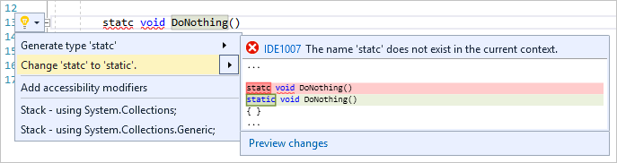
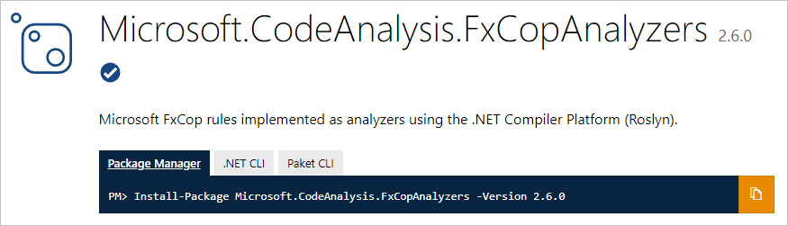
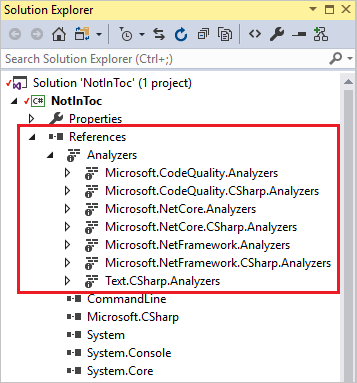
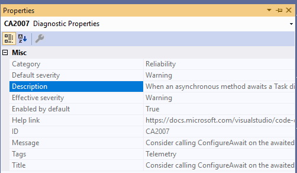
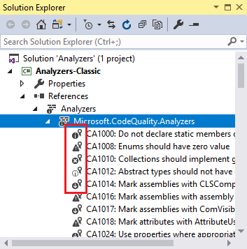
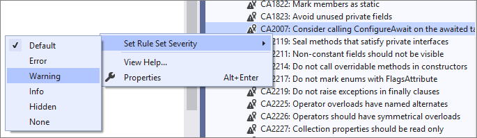
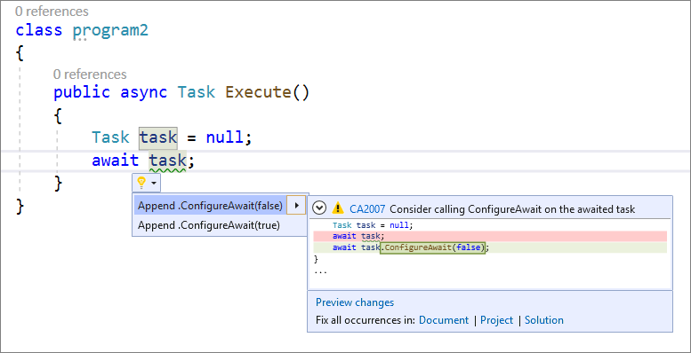

# Write Better Code Faster with Roslyn Analyzers

Roslyn, the .NET compiler platform, helps you catch bugs even before you run your code. One example is Roslyn’s spellcheck analyzer that is built into Visual Studio. Let’s say you are creating a static method and misspelled the word static as statc. You will be able to see this spelling error before you run your code because Roslyn can produce warnings in your code as you type even before you’ve finished the line. In other words, you don’t have to build your code to find out that you made a mistake.

Roslyn analyzers can also surface an automatic code fix through the Visual Studio light bulb icon that allows you to fix your code immediately.

## But what if you could catch even more bugs?

Let me introduce you to Roslyn analyzer packages. These collections of analyzers provide a more verbose analysis, but don't ship with the default Visual Studio tools. To learn more about our favorite Roslyn analyzers visit our [Roslyn analyzers GitHub repository](https://github.com/dotnet/roslyn-analyzers). This repository includes the FxCop rules that are still applicable to modern software development, but now target our modern code analysis platform based on Roslyn. Let's go ahead and install this package to be more productive and write better code faster!

To Install FxCop analyzers as a NuGet package:
1. Assuming you’re using Visual Studio 15.8 or newer, choose the most recent version of [Microsoft.CodeAnalysis.FxCopAnalyzers](https://www.nuget.org/packages/Microsoft.CodeAnalysis.FxCopAnalyzers).

2. Install the package in Visual Studio, using the [Package Manager UI](https://docs.microsoft.com/en-us/nuget/quickstart/install-and-use-a-package-in-visual-studio).

Once you have the package installed you can simply customize the analyzer diagnostics from the Solution Explorer. An analyzer node will appear under the References or Dependencies node in the Solution Explorer. If you expand the analyzers, and then expand one of the analyzer assemblies, you can see all the diagnostics in the assembly.

You can view the properties of a diagnostic, including its description and default severity, in the properties window. To view the properties, right-click on the rule and select Properties, or select the rule and then press Alt+Enter.

The icons next to each diagnostic in Solution Explorer correspond to the icons you see in the rule set when you open it in the editor:
* the "i" in a circle indicates a severity of Info
* the "!" in a triangle indicates a severity of Warning
* the "x" in a circle indicates a severity of Error
* the "i" in a circle on a light-colored background indicates a severity of Hidden
* the "↓" in a circle indicates that the diagnostic is suppressed

You can then set the rule set severity from the Solution Explorer. In the Solution Explorer, expand Dependencies > Analyzers. Expand the assembly that contains the rule you want to set the severity for. Right-click on the rule and select Set Rule Set Severity and in the fly-out menu, select one of the severity options.

If you set the rule severity to a warning you will then receive a warning in your code for that specific rule set.

Now that you understand how analyzers work you can be more productive and write better code faster!

## FAQ

`Q:` This warning appears in Visual Studio: “Run Code Analysis has been deprecated in favor of FxCop analyzers, which run during build. Refer to https://aka.ms/fxcopanalyzers to migrate to FxCop analyzers”. What does this mean?

`A:` FxCop is the Code Analysis engine that predates Roslyn by almost a decade. Just like we moved our compiler forward (e.g. introduced Roslyn), we are also moving our code analysis technology forward to the Roslyn platform. Since it is powered by the .NET Compiler Platform it can produce warnings in your code as you type. In other words, you don’t have to build your code to find out that you made a mistake.

`Q:` What's the difference between FxCop analyzers and legacy FxCop?

`A:` FxCop analyzers analyze source code in real time and during compilation, whereas legacy FxCop is a static code analysis and analyzes binary files after build has completed. For more information, see [Roslyn analyzers vs. static code analysis](https://docs.microsoft.com/visualstudio/code-quality/roslyn-analyzers-overview?view=vs-2019#roslyn-analyzers-vs-static-code-analysis) and [FxCop analyzers FAQ](https://docs.microsoft.com/visualstudio/code-quality/fxcop-analyzers-faq?view=vs-2019).

`Q:` Can I write custom analyzers?

`A:` Absolutely! Documentation on how to write an analyzer is found [here](https://docs.microsoft.com/dotnet/csharp/roslyn-sdk/tutorials/how-to-write-csharp-analyzer-code-fix).

`Q:` Should I use Roslyn analyzers or .editorconfig for code style?

`A:` Roslyn analyzers and .editorconfig files work hand-in-hand. When you define code styles [in an .editorconfig file](https://docs.microsoft.com/visualstudio/ide/editorconfig-code-style-settings-reference?view=vs-2019) or on the [text editor Options](https://docs.microsoft.com/visualstudio/ide/code-styles-and-code-cleanup?view=vs-2019) page, you're actually configuring the Roslyn analyzers that are built into Visual Studio.

`Q:` Do analyzers work in continuous integration (CI) builds?

`A:` Yes, analyzers installed as NuGet packages can be enforced in CI builds.

`Q:` Where can I request more analyzers or report bugs?

`A:` You can request more analyzer and report bugs on the [Roslyn repository](https://github.com/dotnet/roslyn/issues) on GitHub.
