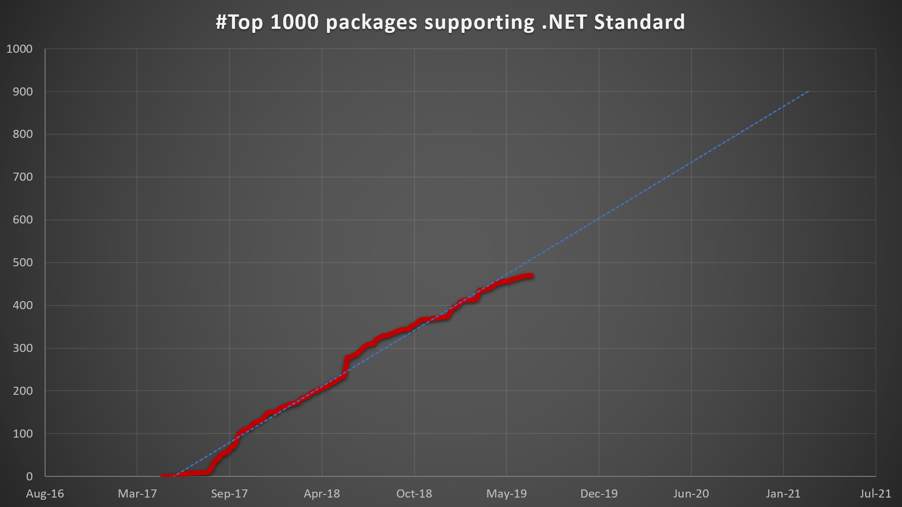
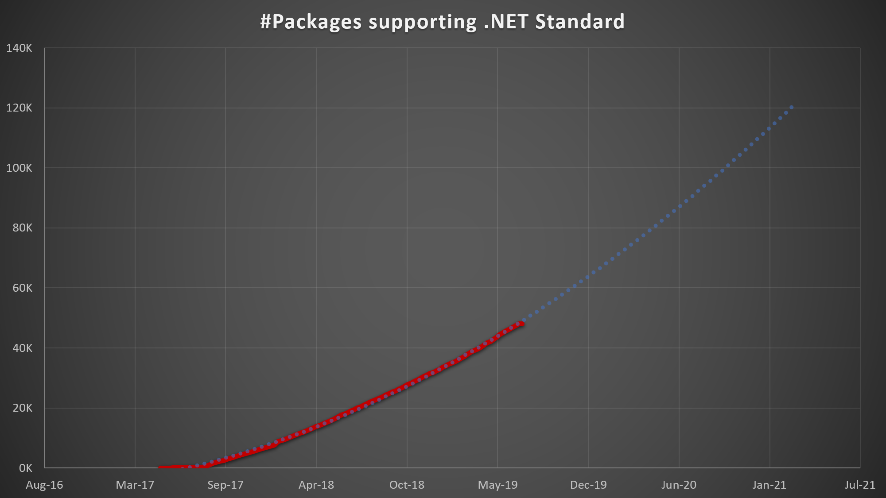

# Update on .NET Standard adoption

It's about two years ago that [I announced .NET Standard 2.0][post-ns20]. Since
then we've been working hard to increase the set of .NET Standard-based
libraries for .NET. This includes many of the BCL components, such as the
[Windows Compatibility Pack][post-compat-pack], but also other popular libraries,
such as the JSON.NET, the Azure SDK, or the AWS SDK. In this blog post, I'll
share some thoughts and numbers about the .NET ecosystem and .NET Standard.

## Adoption by the numbers

In order to track adoption, we're looking at [nuget.org]. On a regular interval,
we check whether new package versions add support for .NET Standard. Once a
package ID does, we stopped looking at future versions. This allows us to track
when a package first adopted .NET Standard.

For the purposes of measuring adoption in the ecosystem, we've excluded all
packages that represent the .NET platform (e.g. `System.*`) or were built by
Microsoft, e.g. `Microsoft.Azure.*`. Of course, we track that too, but as part
of pushing first parties to adopt .NET Standard.

This is what the adoption looks like:

* On [nuget.org]
    - **47% of the top one thousand packages** support .NET Standard
    - **30% of all packages** support .NET Standard (about 48k out of 160k
      packages)
* Generously adding trendlines, we could expect ~100% by around 2022
  - Trendlines border on using a magic 8 ball, so take these figures with a big
    jar of salt.
  - We'll likely never get to a 100% but it seems to suggest that we can expect
    maximum reach within the next two to three years, which seems realistic and
    is in line with our expectations.

## What should I do?

With few exceptions, all libraries should be targeting .NET Standard. Exceptions
include UI-only libraries (e.g. a WinForms control) or libraries that are just
as building blocks inside of a single application.

In order to decide the version number, you can use the [interactive version
picker][ns-version-picker]. But when in doubt, just start with .NET Standard
2.0. Even when .NET Standard 2.1 will be released later this year, most
libraries should still be on .NET Standard 2.0. That's because most libraries
won't need the API additions and [.NET Framework will never be updated to
support .NET Standard 2.1 or higher][post-ns21].

This recommendation is also reflected in the [.NET library
guidance][library-guidance] we published earlier (taken from the [cross-platform
targeting][xplat-guidance] section):

> **✔️ DO** start with including a `netstandard2.0` target.
>
> Most general-purpose libraries should not need APIs outside of .NET Standard
> 2.0. .NET Standard 2.0 is supported by all modern platforms and is the
> recommended way to support multiple platforms with one target.

## Summary

.NET Standard adoption is already quite high, but it's still growing. Please continue to
update the packages you haven't updated yet. And when creating new packages,
continue to start with .NET Standard 2.0, even after .NET Standard 2.1 has
shipped.

Happy coding!

[nuget.org]: https://nuget.org
[post-ns20]: https://devblogs.microsoft.com/dotnet/announcing-net-standard-2-0/
[post-ns21]: https://devblogs.microsoft.com/dotnet/announcing-net-standard-2-1/
[ns-version-picker]: https://dotnet.microsoft.com/platform/dotnet-standard#versions
[post-compat-pack]: https://devblogs.microsoft.com/dotnet/announcing-the-windows-compatibility-pack-for-net-core/
[library-guidance]: https://devblogs.microsoft.com/dotnet/guidance-for-library-authors/
[xplat-guidance]: [library-guidance]
