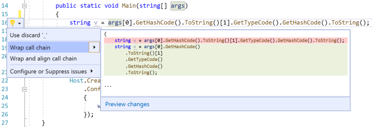
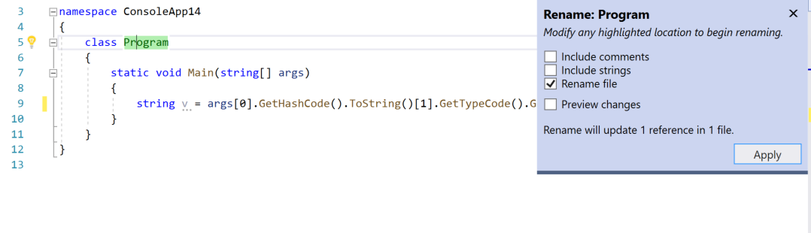
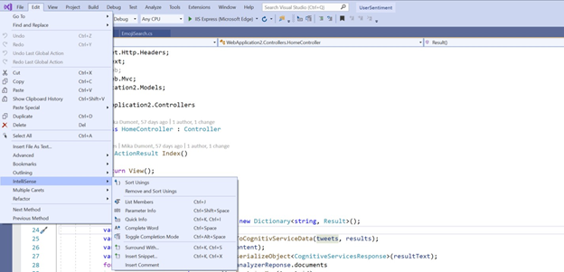
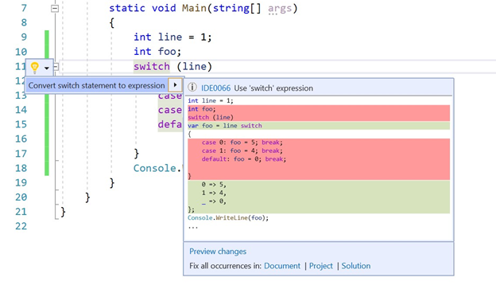
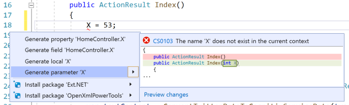
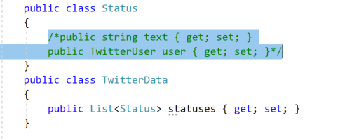
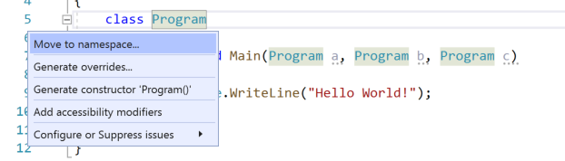
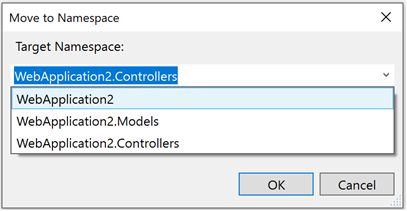
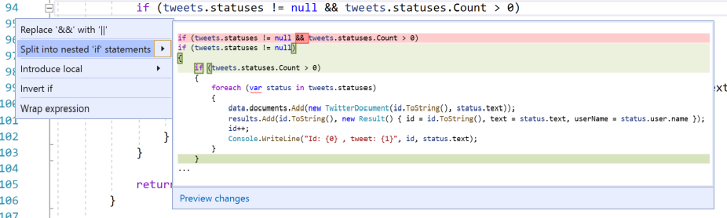
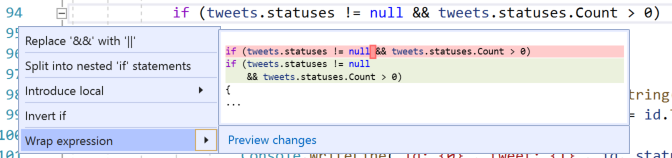

# Increase your productivity in .NET

The .NET productivity team is constantly thinking of new ways to make developers more productive. In this post I’ll cover some of the latest productivity features available in Visual Studio 2019 Preview.

## Code Fixes and Refactorings

Codefixes and refactorings are the code suggestions the compiler provides through the lightbulb and screwdriver icons. You can access these code suggestions using (Ctrl + .) or (Alt + Enter). The list below are new in Visual Studio 2019 Preview. We'd like to give a big thanks to the community for all the feedback we've received on them!

### Wrap call chain

You can now wrap chains of method calls with a refactoring.

## Rename a file when renaming a class

You can now rename a file when renaming an interface, enum or class.

## Sort usings is back!

We brought back the [sort usings](https://docs.microsoft.com/visualstudio/ide/reference/sort-usings) command separate from the Remove and Sort Usings command. You can now find the Sort Usings command in Edit > IntelliSense.

## Convert a switch statement to a switch expression

You can now [convert a switch statement to a switch expression](https://docs.microsoft.com/visualstudio/ide/reference/convert-switch-statement-to-switch-expression). In your project file make sure the language version is set to preview since [switch expressions](https://docs.microsoft.com/dotnet/csharp/whats-new/csharp-8#switch-expressions) are a new C# 8.0 feature.

## Generate a parameter

You can now [generate a parameter](https://docs.microsoft.com/visualstudio/ide/reference/generate-parameter) as a code fix.

## Toggle single line comment/uncomment

[Toggle single line comment/uncomment](https://docs.microsoft.com/visualstudio/ide/csharp-developer-productivity) is now available through the keyboard shortcut (Ctr l + K,/). This command will add or remove a single line comment depending on whether your selection is already commented.

## Toggle block comment/uncomment

[Toggle block comment/uncomment](https://docs.microsoft.com/visualstudio/ide/csharp-developer-productivity) is now available through the keyboard shortcut (Ctrl + Shift + /). This command will add or remove block comments depending on what you have selected.

## Move type to namespace

You can now use a refactoring dialog to [move type to namespace](https://docs.microsoft.com/visualstudio/ide/reference/move-type-to-namespace) or folder.

## Split or merge if statements
We now have a code fix for [split/merge if statements](https://docs.microsoft.com/visualstudio/ide/reference/split-or-merge-if-statement).

## Wrap binary expressions

We now have a code fix for wrap binary expressions.

This was just a sneak peak of what’s new in Visual Studio 2019 Preview, for a complete list see the [release notes](https://docs.microsoft.com/visualstudio/releases/2019/release-notes) and feel free to provide feedback on Developer Community, and using the [Report a Problem](https://docs.microsoft.com/visualstudio/ide/how-to-report-a-problem-with-visual-studio) tool in Visual Studio.
