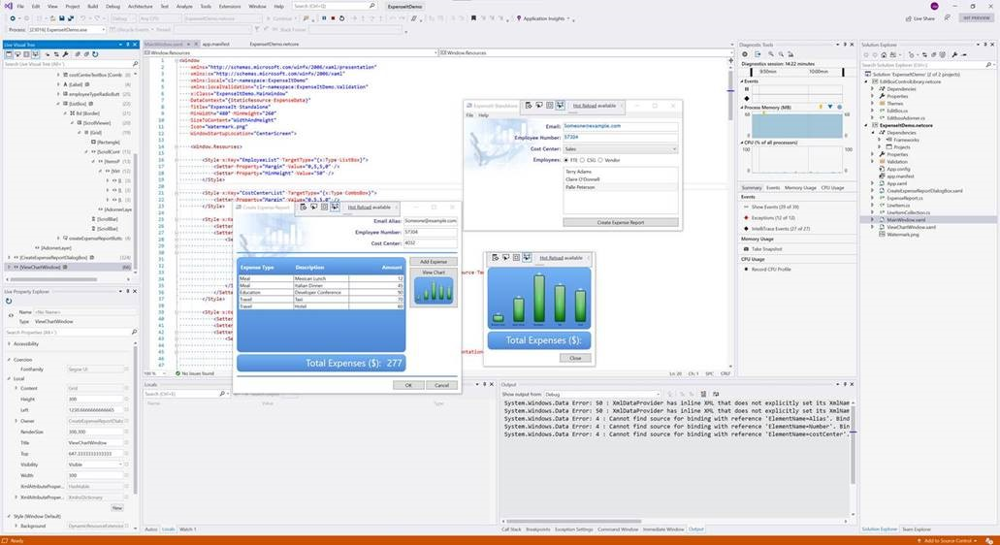

# Announcing .NET Core 3.0

We’re excited to announce the release of .NET Core 3.0. It includes many improvements, including adding Windows Forms and WPF, adding new JSON APIs, support for ARM64 and improving performance across the board. C# 8 is also part of this release, which includes nullable, async streams, and more patterns. F# 4.7 is included, and focused on relaxing syntax and targeting .NET Standard 2.0.  You can start updating existing projects to target .NET Core 3.0 today. The release is compatible with previous versions, making updating easy.

You can [download .NET Core 3.0](https://dotnet.microsoft.com/download/dotnet-core/3.0), for Windows, macOS, and Linux:

* [.NET Core 3.0 SDK and Runtime](https://dotnet.microsoft.com/download/dotnet-core/3.0)
* [Snap installer](https://snapcraft.io/dotnet-sdk)
* [Docker images](https://hub.docker.com/_/microsoft-dotnet-core)

Visual Studio 2019 16.3 was also released today and is a required update to use .NET Core 3.0 with Visual Studio.

Release notes:

* .NET Core 3.0 release notes
* .NET Core 2.2 -> 3.0 API diff
* .NET Core 3.0 contributor list
* GitHub release
* GitHub issue for .NET Core 3.0 issues

## What you should know about 3.0

There are some key improvements and guidance that are important to draw attention to before we go into a deep dive on all the new features in .NET Core 3.0. Here's the quick punch list.

* **.NET Core 3.0 is already battle-tested** by being hosted for months at [dot.net](https://dotnet.microsoft.com/) and on [Bing.com](https://bing.com). Many other Microsoft teams will soon be deploying large workloads on .NET Core 3.0 in production.
* **Performance is greatly improved** across many components and is described in detail at [Performance Improvements in .NET Core 3.0](https://devblogs.microsoft.com/dotnet/performance-improvements-in-net-core-3-0/).
* **C# 8** add async streams, range/index, more patterns, and nullable reference types. Nullable enables you to directly target the flaws in code that lead to `NullReferenceException`. The lowest layer of the framework libraries has been annotated, so that you know when to expect `null`.
* **F# 4.7** focuses on making some thing easier with implicit `yield` expressions and some syntax relaxations. It also includes support for `LangVersion`, and ships with `nameof` and opening of static classes in preview. The F# Core Library now also targets .NET Standard 2.0. You can read more at [Announcing F# 4.7](https://devblogs.microsoft.com/dotnet/announcing-f-4-7/).
* **.NET Standard 2.1** increases the set of types you can use in code that can be used woth both .NET Core and Xamarin.  [.NET Standard 2.1](https://devblogs.microsoft.com/dotnet/announcing-net-standard-2-1/) includes types since .NET Core 2.1.
* **Windows Desktop** apps are now supported with .NET Core, for both [Windows Forms](https://github.com/dotnet/winforms) and [WPF](https://github.com/dotnet/wpf) (and open source). The WPF designer is part of Visual Studio 2019 16.3. The Windows Forms designer is still in preview and available as a [VSIX download](https://aka.ms/winforms-designer).
* **.NET Core apps now have executables** by default. In past releases, apps needed to be launched via the `dotnet` command, like `dotnet myapp.dll`. Apps can now be launched with an app-specific executable, like `myapp` or `./myapp`, depending on the operating system.
* **High performance JSON APIs** have been added, for reader/writer, object model and serialization scenarios. These APIs were built from scratch on top of `Span<T>` and use UTF8 under the covers instead of UTF16 (like `string`). These APIs minimize allocations, resulting in faster performance, and much less work for the garbage collector. See [The future of JSON in .NET Core 3.0](https://github.com/dotnet/corefx/issues/33115).
* **The garbage collector uses less memory** by default, often a lot less. This improvement is very beneficial for scenarios where many applications are hosted on the same server. The garbage collector has also been updated to make better use of large numbers of cores, on machines with >64 cores.
* **.NET Core has been hardened for Docker** to enable .NET applications to work predictably and efficiently in containers. The garbage collector and thread pool have been updated to work much better when a container has been configured for limited memory or CPU. .NET Core docker images are smaller, particularly the SDK image.
* **Raspberry Pi and ARM chips** are now supported to enable IoT development, including with the remote Visual Studio debugger. You can deploy apps that listen to sensors, and print messages or images on a display, all using the new GPIO APIs. ASP.NET can be used to expose data as an API or as a site that enables configuring an IoT device.
* **.NET Core 3.0 is a 'current' release** and will be superseded by **.NET Core 3.1**, targeted for November 2019. .NET Core 3.1 will be a [long-term supported (LTS) release](https://dotnet.microsoft.com/platform/support/policy/dotnet-core) (supported for at least 3 years). We recommend that you adopt .NET Core 3.0 and then adopt 3.1. It'll be very easy to upgrade.
* **.NET Core 3.0 will be available with RHEL 8** in the Red Hat Application Streams, after several years of collaboration with Red Hat.
* **Visual Studio 2019 16.3** is a required update for Visual Studio users on Windows that want to use .NET Core 3.0.
* **Visual Studio for Mac 8.3** is a required update for Visual Studio for Mac users that want to use .NET Core 3.0.
* **Visual Studio Code** users should just always use the latest version of the C# extension to ensure that the newest scenarios work, including targeting .NET Core 3.0.

## Platform support

.NET Core 3.0 is supported on the following operating systems:

* Alpine: 3.9+
* Debian: 9+
* openSUSE: 42.3+
* Fedora: 26+
* Ubuntu: 16.04+
* RHEL: 6+
* SLES: 12+
* macOS: 10.13+
* Windows Client: 7, 8.1, 10 (1607+)
* Windows Server: 2012 R2 SP1+

Note: Windows Forms and WPF apps only work on Windows.

Chip support follows:

* x64 on Windows, macOS, and Linux
* x86 on Windows
* ARM32 on Windows and Linux
* ARM64 on Linux (kernel 4.14+)

Note: Please ensure that .NET Core 3.0 ARM64 deployments use Linux kernel 4.14 version or later. For example, Ubuntu 18.04 satisfies this requirement, but 16.04 does not.

## WPF and Windows Forms

You can build WPF and Windows Forms apps with .NET Core 3, on Windows. We've had a strong compatibility goal from the start of the project, to make it easy to migrate desktop applications from .NET Framework to .NET Core. We've heard feedback from many developers that have already successfully ported their app to .NET Core 3.0 that the process is straightforward. To a large degree, we took WPF and Windows Forms as-is, and got them working on .NET Core. The engineering project was very different than that, but that's a good way to think about the project.

The following image shows a .NET Core Windows Forms app:


Visual Studio 2019 16.3 has support for creating WPF apps that target .NET Core. This includes new templates and an updated XAML designer. The designer is similar to the existing XAML designer (that targets .NET Framework), however, you may notice some differences in experience. The big technical difference is that the new designer is hosted in its own process, because we didn't want two versions of .NET (.NET Framework and .NET Core) in the Visual Studio process. This means that some aspects of the designer, like designer extensions, cannot work in the same way.

The following image shows a WPF app being displayed in the new designer:



The Windows Forms designer is still in preview, and available as a [separate download]((https://aka.ms/winforms-designer)). It will be added to Visual Studio as part of a later release. The designer currently includes support for the most commonly used controls and low-level functionality. We’ll keep improving the designer with monthly updates. We don't recommend porting your Windows Forms applications to .NET Core just yet, particularly if you rely on the designer. Please do experiment with the designer preview, and give us feedback.

You can also create and build desktop applications from the command line using the .NET CLI.

For example, you can quickly create a new Windows Forms app:

```console
dotnet new winforms -o myapp
cd myapp
dotnet run
```

You can try WPF using the same flow:

```console
dotnet new wpf -o mywpfapp
cd mywpfapp
dotnet run
```

We made [Windows Forms](https://github.com/dotnet/winforms) and [WPF](https://github.com/dotnet/wpf) open source, back in December 2018. It's been great to see the community and the Windows Forms and WPF teams working together to improve those UI frameworks. In the case of WPF, we started out with a very small amount of code in the GitHub repo. At this point, almost all of WPF has been published to GitHub, and a few more components will straggle in over time. Like other .NET Core projects, these new repos are part of the .NET Foundation and licensed with the MIT license.

The [System.Windows.Forms.DataVisualization](https://www.nuget.org/packages/System.Windows.Forms.DataVisualization/) package (which includes the chart control) is also available for .NET Core. You can now include this control in your .NET Core WinForms applications. The source for the chart control is available at [dotnet/winforms-datavisualization](https://github.com/dotnet/winforms-datavisualization), on GitHub. The control was migrated to ease porting to .NET Core 3, but isn't a component we expect to update significantly.

## Windows Native Interop

Windows offers a rich native API, in the form of flat C APIs, COM and WinRT. We've had support for P/Invoke since .NET Core 1.0, and have been adding the ability to CoCreate COM APIs, activate WinRT APIs, and exposed managed code as COM components as part of the .NET Core 3.0 release. We have had many requests for these capabilities, so we know that they will get a lot of use.

Late last year, we announced that we had managed to [automate Excel from .NET Core](https://twitter.com/runfaster2000/status/1053704090671185920). That was a fun moment. Under the covers, this demo is using COM interop features like NOPIA, object equivalence and custom marshallers. You can now try this and other demos yourself at [extension samples](https://github.com/dotnet/samples/tree/master/core/extensions).

Managed C++ and WinRT interop have partial support with .NET Core 3.0 and will be included with .NET Core 3.1.

### Nullable reference types

C# 8.0 introduces *nullable reference types* and *non-nullable reference types* that enable you to make important statements about the properties for reference type variables:

* **A reference is not supposed to be null**. When variables aren't supposed to be null, the compiler enforces rules that ensure it is safe to dereference these variables without first checking that it isn't null.
* **A reference may be null**. When variables may be null, the compiler enforces different rules to ensure that you've correctly checked for a null reference.

This new feature provides significant benefits over the handling of reference variables in earlier versions of C# where the design intent couldn't be determined from the variable declaration. With the addition of nullable reference types, you can declare your intent more clearly, and the compiler both helps you do that correctly and discover bugs in your code.

See [This is how you get rid of null reference exceptions forever](https://channel9.msdn.com/Shows/On-NET/This-is-how-you-get-rid-of-null-reference-exceptions-forever), [Try out Nullable Reference Types](https://devblogs.microsoft.com/dotnet/try-out-nullable-reference-types/) and [Nullable reference types](https://docs.microsoft.com/en-us/dotnet/csharp/nullable-references) to learn more.

## Default implementations of interface members

Today, once you publish an interface, it’s game over for changing it: you can’t add members to it without breaking all the existing implementers of it.

With C# 8.0, you can provide a body for an interface member. As a result, if a class that implements the interface doesn’t implement that member (perhaps because it wasn’t there yet when they wrote the code), then the calling code will just get the default implementation instead.

```csharp
interface ILogger
{
    void Log(LogLevel level, string message);
    void Log(Exception ex) => Log(LogLevel.Error, ex.ToString()); // New overload
}
class ConsoleLogger : ILogger
{
    public void Log(LogLevel level, string message) { ... }
    // Log(Exception) gets default implementation
}
```

```xml
<script src="https://gist.github.com/richlander/df2ad8001622135d3b71f9ce24ae081e.js"></script>
```

In this example, the `ConsoleLogger` class doesn’t have to implement the `Log(Exception)` overload of ILogger, because it is declared with a default implementation. Now you can add new members to existing public interfaces as long as you provide a default implementation for existing implementors to use.

## Async streams

You can now `foreach` over an async stream of data using `IAsyncEnumerable<T>`. This new interface is exactly what you’d expect; an asynchronous version of `IEnumerable<T>`. The language lets you `await foreach` over tasks to consume their elements. On the production side, you `yield return` items to produce an async stream. It might sound a bit complicated, but it is incredibly easy in practice.

The following example demonstrates both production and consumption of async streams. The foreach statement is async and itself uses yield return to produce an async stream for callers. This pattern – using `yield return` — is the recommended model for producing async streams.

```csharp
async IAsyncEnumerable<int> GetBigResultsAsync()
{
    await foreach (var result in GetResultsAsync())
    {
        if (result > 20) yield return result;
    }
}
```

```xml
<script src="https://gist.github.com/richlander/224803ce366bb653b6a1801e2b67f241.js"></script>
```

In addition to being able to `await foreach`, you can also create async iterators, e.g. an iterator that returns an `IAsyncEnumerable`/`IAsyncEnumerator` that you can both `await` and `yield return` in. For objects that need to be disposed, you can use `IAsyncDisposable`, which various framework types implement, such as `Stream` and `Timer`.

## Index and Range

We've created new syntax and types that you can use to describe indexers, for array element access or for any other type that exposes direct data access. This includes support for both a single value -- the usual definition of an index -- or two values, which  describing a range.

`Index` is a new type that describes an array index. You can create an `Index` from an int that counts from the beginning, or with a prefix `^` operator that counts from the end. You can see both cases in the following example:

```csharp
Index i1 = 3;  // number 3 from beginning
Index i2 = ^4; // number 4 from end
int[] a = { 0, 1, 2, 3, 4, 5, 6, 7, 8, 9 };
Console.WriteLine($"{a[i1]}, {a[i2]}"); // "3, 6"
```

```xml
<script src="https://gist.github.com/richlander/d2ed10abc144a53ba31989e75c77bc12.js"></script>
```

`Range` is similar, consisting of two `Index` values, one for the start and one for the end, and can be written with a x..y range expression. You can then index with a `Range` in order to produce a slice of the underlying data, as demonstrated in the following example:

```csharp
var slice = a[i1..i2]; // { 3, 4, 5 }
```

```xml
<script src="https://gist.github.com/richlander/e303027e4f2f9c3139286c2cc40e9add.js"></script>
```

## Using Declarations

Are you tired of using statements that require indenting your code? No more! You can now write the following code, which attaches a using declaration to the scope of the current statement block and then disposes the object at the end of it.

```csharp

using System;
using System.Linq;
using System.Collections.Generic;
using static System.Console;
using System.IO;

namespace usingapp
{
    class Program
    {
        static void Main()
        {
            var filename = "Program.cs";
            var line = string.Empty;
            var magicString = "magicString";

            var file = new FileInfo(filename);
            using var reader = file.OpenText();
            while ((line = reader.ReadLine())!= null)
            {
                if (line.Contains(magicString))  
                { 
                    WriteLine("Found string"); 
                    return;
                }
            }

            WriteLine("String not found");
        } // reader disposed here
    }
}
```

```xml
<script src="https://gist.github.com/richlander/7213b5dcaf011ad0cbe3d2582697b228.js"></script>
```

## Switch Expressions

Anyone who uses C# probably loves the idea of a switch statement, but not the syntax. C# 8 introduces switch expressions, which enable the following:

* terser syntax
* returns a value since it is an expression
* fully integrated with pattern matching

The switch keyword is “infix”, meaning the keyword sits between the tested value (that’s `o` in the first example) and the list of cases, much like expression lambdas.

The first examples uses the lambda syntax for methods, which integrates well with the switch expressions but isn’t required.

```csharp
static string Display(object o) => o switch
{
    Point { X: 0, Y: 0 }         => "origin",
    Point { X: var x, Y: var y } => $"({x}, {y})",
    _                            => "unknown"
};
```

```xml
<script src="https://gist.github.com/richlander/ddd9bfbcc26256376ed8bb1e2a9929b2.js"></script>
```

There are two patterns at play in this example. o first matches with the Point type pattern and then with the property pattern inside the {curly braces}. The _ describes the discard pattern, which is the same as default for switch statements.

You can go one step further, and rely on tuple deconstruction and parameter position, as you can see in the following example:

```csharp
static State ChangeState(State current, Transition transition, bool hasKey) =>
    (current, transition) switch
    {
        (Opened, Close)              => Closed,
        (Closed, Open)               => Opened,
        (Closed, Lock)   when hasKey => Locked,
        (Locked, Unlock) when hasKey => Closed,
        _ => throw new InvalidOperationException($"Invalid transition")
    };
```

```xml
<script src="https://gist.github.com/richlander/0a2d3276a449a487421ebdd27dd5d763.js"></script>
```

In this example, you can see you do not need to define a variable or explicit type for each of the cases. Instead, the compiler can match the tuple being testing with the tuples defined for each of the cases.

All of these patterns enable you to write declarative code that captures your intent instead of procedural code that implements tests for it. The compiler becomes responsible for implementing that boring procedural code and is guaranteed to always do it correctly.

There will still be cases where switch statements will be a better choice than switch expressions and patterns can be used with both syntax styles.

## Introducing a fast JSON API

.NET Core 3.0 includes a new family of JSON APIs that enable reader/writer scenarios, random access with a document object model (DOM) and a serializer. You are likely familiar with using [Json.NET](https://www.newtonsoft.com/json). The new APIs are intended to satisfy many of the same scenarios, but with less memory and faster execution.

You can see the initial motivation and description of the plan in [The future of JSON in .NET Core 3.0](https://github.com/dotnet/corefx/issues/33115). This includes [James Netwon-King](https://github.com/jamesnk), the author of Json.Net, explaining why a new API was created, as opposed to extending Json.NET. In short, we wanted to build a new JSON API that took advantage of all the new performance capabilities in .NET Core, and delivered performance inline with that. It wasn't possible to do that in an existing code-base like Json.NET while maintaining compatibility.

Let's take a quick look at the new API, layer by layer.

### Utf8JsonReader

`System.Text.Json.Utf8JsonReader` is a high-performance, low allocation, forward-only reader for UTF-8 encoded JSON text, read from a `ReadOnlySpan<byte>`. The `Utf8JsonReader` is a foundational, low-level type, that can be leveraged to build custom parsers and deserializers. Reading through a JSON payload using the new Utf8JsonReader is 2x faster than using the reader from Json.NET. It does not allocate until you need to actualize JSON tokens as (UTF16) strings.

### Utf8JsonWriter

`System.Text.Json.Utf8JsonWriter` provides a high-performance, non-cached, forward-only way to write UTF-8 encoded JSON text from common .NET types like `String`, `Int32`, and `DateTime`. Like the reader, the writer is a foundational, low-level type, that can be leveraged to build custom serializers. Writing a JSON payload using the new `Utf8JsonWriter` is 30-80% faster than using the writer from `Json.NET` and does not allocate.

### JsonDocument

`System.Text.Json.JsonDocument` provides the ability to parse JSON data and build a read-only Document Object Model (DOM) that can be queried to support random access and enumeration. It is built on top of the `Utf8JsonReader`. The JSON elements that compose the data can be accessed via the `JsonElement` type which is exposed by the `JsonDocument` as a property called `RootElement`. The `JsonElement` contains the JSON array and object enumerators along with APIs to convert JSON text to common .NET types. Parsing a typical JSON payload and accessing all its members using the `JsonDocument` is 2-3x faster than `Json.NET` with very little allocations for data that is reasonably sized (i.e. < 1 MB).

### JSON Serializer

`System.Text.Json.Serialization.JsonSerializer` layers on top of the high-performance `Utf8JsonReader` and `Utf8JsonWriter`. It deserializes objects from JSON and serializes objects to JSON. Memory allocations are kept minimal and includes support for reading and writing JSON with `Stream` asynchronously.

See the [documentation](https://github.com/dotnet/corefx/blob/master/src/System.Text.Json/docs/SerializerProgrammingModel.md) for information and samples.

## Introducing the new SqlClient

SqlClient is the data provider you use to access Microsoft SQL Server and Azure SQL Database, either through one of the popular .NET O/RMs, like EF Core or Dapper, or directly using the ADO.NET APIs. It will now be released and updated as the [Microsoft.Data.SqlClient]( https://www.nuget.org/packages/Microsoft.Data.SqlClient/) NuGet package, and supported for both .NET Framework and .NET Core applications. By using NuGet, it will be easier for the SQL team to provide updates to both .NET Framework and .NET Core users.

## ARM and IoT Support

We added support for Linux ARM64 this release, after having added support for ARM32 for Linux and Windows in the .NET Core 2.1 and 2.2, respectively. While some IoT workloads take advantage of our existing x64 capabilities, many users had been asking for ARM support. That is now in place, and we are working with customers who are planning large deployments.

Many IoT deployments using .NET are edge devices, and entirely network-oriented. Other scenarios require direct access to hardware. In this release, we added the capability to use serial ports on Linux and take advantage of digital pins on devices like the Raspberry Pi. The pins use a variety of protocols. We added support for GPIO, PWM, I2C, and SPI, to enable reading sensor data, interacting with radios and writing text and images to displays, and many other scenarios.

This functionality is available as part of the following packages:

* [System.Device.Gpio](https://www.nuget.org/packages/System.Device.Gpio)
* [Iot.Device.Bindings](https://www.nuget.org/packages/Iot.Device.Bindings)

As part of providing support for GPIO (and friends), we took a look at what was already available. We found APIs for C# and also Python. In both cases, the APIs were wrappers over native libraries, which were often licensed as GPL. We didn't see a path forward with that approach. Instead, we built a 100% C# solution to implement these protocols. This means that our APIs will work anywhere .NET Core is supported, can be debugged with a C# debugger (via sourcelink), and supports multiple underlying Linux drivers (sysfs, libgpiod, and board-specific). All of the code is licensed as MIT. We see this approach as a major improvement for .NET developers compared to what has existed.

See [dotnet/iot](https://github.com/dotnet/iot) to learn more. The best places to start are [samples](https://github.com/dotnet/iot/blob/master/samples/README.md) or [devices](https://github.com/dotnet/iot/blob/master/src/devices/README.md). We have built a few experiments while adding support for GPIO. One of them was validating that we could [control an Arduino from a Pi](https://www.youtube.com/watch?v=TW4K64hfa5U) through a serial port connection. That was suprisingly easy. We also spent a lot of time playing with [LED matrices](https://learn.adafruit.com/32x16-32x32-rgb-led-matrix/), as you can see in this [RGB LED Matrix sample](https://github.com/dotnet/iot/blob/master/src/devices/RGBLedMatrix/README.md). We expect to share more of these experiments over time.

## .NET Core runtime roll-forward policy update

The .NET Core runtime, actually the runtime binder, now enables major-version roll-forward as an opt-in policy. The runtime binder already enables roll-forward on patch and minor versions as a default policy. We decided to expose a broader set of policies, which we expected would be important for various scenarios, but did not change the default roll-forward behavior.

There is a new property called `RollForward`, which accepts the following values:

* `LatestPatch` -- Rolls forward to the highest patch version. This disables the `Minor` policy.
* `Minor` -- Rolls forward to the lowest higher minor version, if the requested minor version is missing. If the requested minor version is present, then the `LatestPatch` policy is used. This is the default policy.
* `Major` -- Rolls forward to lowest higher major version, and lowest minor version, if the requested major version is missing. If the requested major version is present, then the `Minor` policy is used.
* `LatestMinor` -- Rolls forward to highest minor version, even if the requested minor version is present.
* `LatestMajor` -- Rolls forward to highest major and highest minor version, even if requested major is present.
* `Disable` -- Do not roll forward. Only bind to specified version. This policy is not recommended for general use since it disable the ability to roll-forward to the latest patches. It is only recommended for testing.

See [Runtime Binding Behavior](https://github.com/dotnet/designs/blob/master/accepted/runtime-binding.md) and [dotnet/core-setup #5691](https://github.com/dotnet/core-setup/pull/5691) for more information.

## Docker and cgroup Limits

Many developers are [packaging and running their application with containers](https://devblogs.microsoft.com/dotnet/using-net-and-docker-together-dockercon-2019-update/). A key scenario is [limiting a container's resources](https://docs.docker.com/config/containers/resource_constraints/) such as CPU or memory. We implemented [support for memory limits](https://github.com/dotnet/coreclr/pull/10064) back in 2017. Unfortunately, we found that the implementation wasn't aggressive enough to reliably stay under the configured limits and applications were still being OOM killed when memory limits are set (particular &lt;500MB). We have fixed that in .NET Core 3.0. We strongly recommend that .NET Core Docker users upgrade to .NET Core 3.0 due to this improvement.

The Docker resource limits feature is built on top of [cgroups](https://en.wikipedia.org/wiki/Cgroups), which a Linux kernel feature. From a runtime perspective, we need to target cgroup primitives.

You can limit the available memory for a container with the `docker run -m` argument, as shown in the following example that creates an Alpine-based container with a 4MB memory limit (and then [prints the memory limit](https://stackoverflow.com/questions/42187085/check-mem-limit-within-a-docker-container)):

```console
C:\>docker run -m 4mb --rm alpine cat /sys/fs/cgroup/memory/memory.limit_in_bytes
4194304
```

We also added made changes to [better support CPU limits](https://github.com/dotnet/coreclr/commit/aea3b1a80d6c114e3e67bc9521bf39a8a17371d1) (`--cpus`). This includes changing the way that the runtime rounds up or down for decimal CPU values. In the case where `--cpus` is set to a value close (enough) to a smaller integer (for example, 1.499999999), the runtime would previously round that value down (in this case, to 1). As a result, the runtime would take advantage of less CPUs than requested, leading to CPU underutilization. By rounding up the value, the runtime augments the pressure on the OS threads scheduler, but even in the worst case scenario (`--cpus=1.000000001` -- previously rounded down to 1, now rounded to 2), we have not observed any overutilization of the CPU leading to performance degradation.

The next step was ensuring that the thread pool honors CPU limits. Part of the algorithm of the thread pool is computing CPU busy time, which is, in part, a function of available CPUs. By taking CPU limits into account when computing CPU busy time, we avoid various heuristics of the threadpool competing with each other: one trying to allocate more threads to increase the CPU busy time, and the other one trying to allocate less threads because adding more threads doesn't improve the throughput.

## Making GC Heap Sizes Smaller by default

While working on [improving support for docker memory limits](https://devblogs.microsoft.com/dotnet/announcing-net-core-3-preview-3/), we were inspired to make more general GC policy updates to improve memory usage for a broader set of applications (even when not running in a container). The changes better align the generation 0 allocation budget with modern processor cache sizes and cache hierarchy.

[Damian Edwards](https://twitter.com/DamianEdwards) on our team noticed that the [memory usage of the ASP.NET benchmarks were cut in half](https://twitter.com/DamianEdwards/status/1093981272362254336) with no negative effect on other performance metrics. That's a staggering improvement! As he says, these are the new defaults, with no change required to his (or your) code (other than adopting .NET Core 3.0).

The memory savings that we saw with the ASP.NET benchmarks may or may not be representative of what you'll see with your application. We'd like to hear how these changes reduce memory usage for your application.

## Better support for many proc machines

Based on .NET's Windows heritage, the GC needed to implement the [Windows concept of processor groups](https://docs.microsoft.com/en-us/windows/desktop/ProcThread/processor-groups) to support  machines with 64+ processors. This implementation was made in .NET Framework, 5-10 years ago. With .NET Core, we made the choice initially for the Linux PAL to emulate that same concept, even though it doesn't exist in Linux. We have since abandoned this concept in the GC and transitioned it exclusively to the Windows PAL.

The GC now exposes a configuration switch, GCHeapAffinitizeRanges, to specify affinity masks on machines with 64+ processors. [Maoni Stephens](https://twitter.com/maoni0) wrote about this change in [Making CPU configuration better for GC on machines with > 64 CPUs](https://devblogs.microsoft.com/dotnet/making-cpu-configuration-better-for-gc-on-machines-with-64-cpus/).

## GC Large page support

[Large Pages](https://docs.microsoft.com/en-us/windows/desktop/Memory/large-page-support) or [Huge Pages](https://wiki.debian.org/Hugepages) is a feature where the operating system is able to establish memory regions larger than the native page size (often 4K) to improve performance of the application requesting these large pages.

When a virtual-to-physical address translation occurs, a cache called the [Translation lookaside buffer (TLB)](https://en.wikipedia.org/wiki/Translation_lookaside_buffer) is first consulted (often in parallel) to check if a physical translation for the virtual address being accessed is available, to avoid doing a potentially expensive page-table walk. Each large-page translation uses a single translation buffer inside the CPU. The size of this buffer is typically three orders of magnitude larger than the native page size; this increases the efficiency of the translation buffer, which can increase performance for frequently accessed memory. This win can be even more significant in a virtual machine, which has a two-layer TLB.

The GC can now be configured with the [GCLargePages](https://github.com/dotnet/coreclr/blob/master/src/inc/clrconfigvalues.h#L326) opt-in feature to choose to [allocate large pages on Windows](https://github.com/dotnet/coreclr/pull/23251). Using large pages reduces TLB misses therefore can potentially increase application perf in general, however, the feature has its own set of [limitations](https://docs.microsoft.com/en-us/windows/desktop/Memory/large-page-support) that should be considered. Bing has experimented with this feature and seen performance improvements.

## .NET Core Version APIs

We have [improved the .NET Core version APIs](https://github.com/dotnet/coreclr/issues/22844) in .NET Core 3.0. They now return the version information you would expect. These changes while they are objectively better are technically breaking and may break applications that rely on existing version APIs for various information.

You can now [get access to the following version information](https://github.com/richlander/testapps/blob/master/versioninfo/Program.cs):

```console
C:\git\testapps\versioninfo>dotnet run
**.NET Core info**
Environment.Version: 3.0.0
RuntimeInformation.FrameworkDescription: .NET Core 3.0.0
CoreCLR Build: 3.0.0
CoreCLR Hash: ac25be694a5385a6a1496db40de932df0689b742
CoreFX Build: 3.0.0
CoreFX Hash: 1bb52e6a3db7f3673a3825f3677b9f27b9af99aa

**Environment info**
Environment.OSVersion: Microsoft Windows NT 6.2.9200.0
RuntimeInformation.OSDescription: Microsoft Windows 10.0.18970
RuntimeInformation.OSArchitecture: X64
Environment.ProcessorCount: 8
```

## Event Pipe improvements

Event Pipe now supports multiple sessions. This means that you can consume events with EventListener in-proc and simultaneously have out-of-process event pipe clients.

New Perf Counters added:

* % Time in GC
* Gen 0 Heap Size
* Gen 1 Heap Size
* Gen 2 Heap Size
* LOH Heap Size
* Allocation Rate
* Number of assemblies loaded
* Number of ThreadPool Threads
* Monitor Lock Contention Rate
* ThreadPool Work Items Queue
* ThreadPool Completed Work Items Rate

Profiler attach is now implemented using the same Event Pipe infrastructure.

See [Playing with counters](https://twitter.com/davidfowl/status/1135355693634949121) from David Fowler to get an idea of what you can do with event pipe to perform your own performance investigations or just monitor application status.

See [dotnet-counters](https://github.com/dotnet/diagnostics/blob/master/documentation/dotnet-counters-instructions.md) to install the dotnet-counters tool.

## HTTP/2 Support

We now have support for [HTTP/2](https://en.wikipedia.org/wiki/HTTP/2) in HttpClient. The new protocol is a requirement for some APIs, like [gRPC](https://github.com/grpc/) and [Apple Push Notification Service](https://developer.apple.com/library/archive/documentation/NetworkingInternet/Conceptual/RemoteNotificationsPG/APNSOverview.html#//apple_ref/doc/uid/TP40008194-CH8-SW1). We expect more services to require HTTP/2 in the future. ASP.NET also has support for HTTP/2.

Note: the preferred HTTP protocol version will be negotiated via TLS/ALPN and HTTP/2 will only be used if the server selects to use it.

## Tiered Compilation

[Tiered compilation](https://blogs.msdn.microsoft.com/dotnet/2018/08/02/tiered-compilation-preview-in-net-core-2-1/) was added as an opt-in feature in .NET Core 2.1. It’s a feature that enables the runtime to more adaptively use the Just-In-Time (JIT) compiler to get better performance, both at startup and to maximize throughput. It is enabled by default with .NET Core 3.0. We made a lot of improvements to the feature over the last year, including testing it with a variety of workloads, including websites, PowerShell Core and Windows desktop apps. The performance is a lot better, which is what enabled us to enable it by default.

## IEEE Floating-point improvements

Floating point APIs have been updated to comply with [IEEE 754-2008 revision](https://en.wikipedia.org/wiki/IEEE_754-2008_revision). The goal of the [.NET Core floating point project](https://github.com/dotnet/corefx/issues/31901) is to expose all "required" operations and ensure that they are behaviorally compliant with the IEEE spec.

Parsing and formatting fixes:

* Correctly parse and round inputs of any length.
* Correctly parse and format negative zero.
* Correctly parse Infinity and NaN by performing a case-insensitive check and allowing an optional preceding `+` where applicable.

New [Math APIs](https://github.com/dotnet/corefx/issues/31903):

* `BitIncrement/BitDecrement` -- corresponds to the `nextUp` and `nextDown` IEEE operations. They return the smallest floating-point number that compares greater or lesser than the input (respectively). For example, `Math.BitIncrement(0.0)` would return `double.Epsilon`.
* `MaxMagnitude/MinMagnitude` -- corresponds to the `maxNumMag` and `minNumMag` IEEE operations, they return the value that is greater or lesser in magnitude of the two inputs (respectively). For example, `Math.MaxMagnitude(2.0, -3.0)` would return `-3.0`.
* `ILogB` -- corresponds to the `logB` IEEE operation which returns an integral value, it returns the integral base-2 log of the input parameter. This is effectively the same as `floor(log2(x))`, but done with minimal rounding error.
* `ScaleB` -- corresponds to the `scaleB` IEEE operation which takes an integral value, it returns effectively `x * pow(2, n)`, but is done with minimal rounding error.
* `Log2` -- corresponds to the `log2` IEEE operation, it returns the base-2 logarithm. It minimizes rounding error.
* `FusedMultiplyAdd` -- corresponds to the `fma` IEEE operation, it performs a fused multiply add. That is, it does `(x * y) + z` as a single operation, there-by minimizing the rounding error. An example would be `FusedMultiplyAdd(1e308, 2.0, -1e308)` which returns `1e308`. The regular `(1e308 * 2.0) - 1e308` returns `double.PositiveInfinity`.
* `CopySign` -- corresponds to the `copySign` IEEE operation, it returns the value of `x`, but with the sign of `y`.

## .NET Platform Dependent Intrinsics

We've added [APIs that allow access to certain performance-oriented CPU instructions](https://devblogs.microsoft.com/dotnet/hardware-intrinsics-in-net-core/), such as the SIMD or Bit Manipulation instruction sets. These instructions can help achieve big performance improvements in certain scenarios, such as processing data efficiently in parallel. In addition to exposing the APIs for your programs to use, we have begun using these instructions to accelerate the .NET libraries too.

The following CoreCLR PRs demonstrate a few of the intrinsics, either via implementation or use:

* [Implement simple SSE2 hardware intrinsics](https://github.com/dotnet/coreclr/pull/15585)
* [Implement the SSE hardware intrinsics](https://github.com/dotnet/coreclr/pull/15538)
* [Arm64 Base HW Intrinsics](https://github.com/dotnet/coreclr/pull/16822)
* [Use TZCNT and LZCNT for Locate{First|Last}Found{Byte|Char}](https://github.com/dotnet/coreclr/pull/21073)

For more information, take a look at [.NET Platform Dependent Intrinsics](https://github.com/dotnet/designs/blob/master/accepted/platform-intrinsics.md), which defines an approach for defining this hardware infrastructure, allowing Microsoft, chip vendors or any other company or individual to define hardware/chip APIs that should be exposed to .NET code.

## Supporting TLS 1.3 and OpenSSL 1.1.1 now Supported on Linux

NET Core can now take advantage of [TLS 1.3 support in OpenSSL 1.1.1](https://www.openssl.org/blog/blog/2018/09/11/release111/). There are multiple benefits of TLS 1.3, per the OpenSSL team:

* Improved connection times due to a reduction in the number of round trips required between the client and server
* Improved security due to the removal of various obsolete and insecure cryptographic algorithms and encryption of more of the connection handshake

.NET Core 3.0 is capable of utilizing OpenSSL 1.1.1, OpenSSL 1.1.0, or OpenSSL 1.0.2 (whatever the best version found is, on a Linux system). When OpenSSL 1.1.1 is available, the SslStream and HttpClient types will use TLS 1.3 when using SslProtocols.None (system default protocols), assuming both the client and server support TLS 1.3.

.NET Core will support TLS 1.3 on Windows and macOS — we expect automatically — when support becomes available.

## Cryptography

We added support for `AES-GCM` and `AES-CCM` ciphers, implemented via `System.Security.Cryptography.AesGcm` and `System.Security.Cryptography.AesCcm`. These algorithms are both Authenticated Encryption with Association Data (AEAD) algorithms, and the first Authenticated Encryption (AE) algorithms added to .NET Core.

NET Core 3.0 now supports the import and export of asymmetric public and private keys from standard formats, without needing to use an X.509 certificate.

All key types (RSA, DSA, ECDsa, ECDiffieHellman) support the X.509 SubjectPublicKeyInfo format for public keys, and the PKCS#8 PrivateKeyInfo and PKCS#8 EncryptedPrivateKeyInfo formats for private keys. RSA additionally supports PKCS#1 RSAPublicKey and PKCS#1 RSAPrivateKey. The export methods all produce DER-encoded binary data, and the import methods expect the same; if a key is stored in the text-friendly PEM format the caller will need to base64-decode the content before calling an import method.

PKCS#8 files can be inspected with the `System.Security.Cryptography.Pkcs.Pkcs8PrivateKeyInfo` class.

PFX/PKCS#12 files can be inspected and manipulated with `System.Security.Cryptography.Pkcs.Pkcs12Info` and `System.Security.Cryptography.Pkcs.Pkcs12Builder`, respectively.

## New Japanese Era (Reiwa)

On May 1st, 2019, Japan started a new era called [Reiwa](https://en.wikipedia.org/wiki/Reiwa). Software that has support for Japanese calendars, like .NET Core, must be updated to accommodate Reiwa. .NET Core and .NET Framework have been updated and correctly handle Japanese date formatting and parsing with the new era.

.NET relies on operating system or other updates to correctly process Reiwa dates. If you or your customers are using Windows, download the latest updates for your Windows version. If running macOS or Linux, download and install [ICU version 64.2]( http://site.icu-project.org/download/64), which has support the new Japanese era.

[Handling a new era in the Japanese calendar in .NET blog](https://devblogs.microsoft.com/dotnet/handling-a-new-era-in-the-japanese-calendar-in-net/) has more information about .NET support for the new Japanese era.

## Assembly Load Context Improvements

Enhancements to AssemblyLoadContext:

* Enable naming contexts
* Added the ability to enumerate ALCs
* Added the ability to enumerate assemblies within an ALC
* Made the type concrete – so instantiation is easier (no requirement for custom types for simple scenarios)

See [dotnet/corefx #34791](https://github.com/dotnet/corefx/issues/34791) for more details. The [appwithalc](https://github.com/richlander/testapps/blob/master/appwithalc/appwithalc/Program.cs) sample demonstrates these new capabilities.

By using `AssemblyDependencyResolver` along with a custom `AssemblyLoadContext`, an application can load plugins so that each plugin's dependencies are loaded from the correct location, and one plugin's dependencies will not conflict with another. The [AppWithPlugin sample](https://github.com/dotnet/samples/tree/master/core/extensions/AppWithPlugin) includes plugins that have conflicting dependencies and plugins that rely on satellite assemblies or native libraries.

## Assembly Unloadability

Assembly unloadability is a new capability of AssemblyLoadContext. This new feature is largely transparent from an API perspective, exposed with just a few new APIs. It enables a loader context to be unloaded, releasing all memory for instantiated types, static fields and for the assembly itself. An application should be able to load and unload assemblies via this mechanism forever without experiencing a memory leak.

We expect this new capability to be used for the following scenarios:

* Plugin scenarios where dynamic plugin loading and unloading is required.
* Dynamically compiling, running and then flushing code. Useful for web sites, scripting engines, etc.
* Loading assemblies for introspection (like ReflectionOnlyLoad), although MetadataLoadContext will be a better choice in many cases.

## Assembly Metadata Reading with MetadataLoadContext

We added `MetadataLoadContext`, which enables reading assembly metadata without affecting the caller’s application domain. Assemblies are read as data, including assemblies built for different architectures and platforms than the current runtime environment. MetadataLoadContext overlaps with the ReflectionOnlyLoad type, which is only available in the .NET Framework.

`MetdataLoadContext` is available in the [System.Reflection.MetadataLoadContext](https://www.nuget.org/packages/System.Reflection.MetadataLoadContext) package. It is a .NET Standard 2.0 package.

Scenarios for MetadataLoadContext include design-time features, build-time tooling, and runtime light-up features that need to inspect a set of assemblies as data and have all file locks and memory freed after inspection is performed.

## Native Hosting sample

The team posted a [Native Hosting sample](https://github.com/dotnet/samples/tree/master/core/hosting/HostWithHostFxr). It demonstrates a best practice approach for hosting .NET Core in a native application.

As part of .NET Core 3.0, we now expose general functionality to .NET Core native hosts that was previously only available to .NET Core managed applications through the officially provided .NET Core hosts. The functionality is primarily related to assembly loading. This functionality should make it easier to produce native hosts that can take advantage of the full feature set of .NET Core.

## Other Improvements

We optimized `Span<T>`, `Memory<T>` and related types that were introduced in .NET Core 2.1. Common operations such as span construction, slicing, parsing, and formatting now perform better. Additionally, types like String have seen under-the-cover improvements to make them more efficient when used as keys with `Dictionary<TKey, TValue>` and other collections. No code changes are required to enjoy these improvements.

The following improvements are also new:

* Brotli support built-in to HttpClient
* ThreadPool.UnsafeQueueWorkItem(IThreadPoolWorkItem)
* Unsafe.Unbox
* CancellationToken.Unregister
* Complex arithmetic operators
* Socket APIs for TCP keep alive
* StringBuilder.GetChunks
* IPEndPoint parsing
* RandomNumberGenerator.GetInt32
* System.Buffers.SequenceReader

## Applications now have native executables by default

.NET Core applications are now built with native executables. This is new for [framework-dependent application](https://docs.microsoft.com/dotnet/core/deploying/). Until now, only [self-contained applications](https://docs.microsoft.com/dotnet/core/deploying/) had executables.

You can expect the same things with these executables as you would other native executables, such as:

* You can double click on the executable to start the application.
* You can launch the application from a command prompt, using `myapp.exe`, on Windows, and `./myapp`, on Linux and macOS.

The executable that is generated as part of the build will match your operating system and CPU. For example, if you are on a Linux x64 machine, the executable will only work on that kind of machine, not on a Windows machine and not on a Linux ARM machine. That's because the executables are native code (just like C++). If you want to target another machine type, you need to publish with a [runtime argument](https://docs.microsoft.com/en-us/dotnet/core/tools/dotnet-publish). You can continue to launch applications with the `dotnet` command, and not use native executables, if you prefer.

## Optimize your .NET Core apps with ReadyToRun images

You can improve the startup time of your .NET Core application by compiling your application assemblies as ReadyToRun (R2R) format. R2R is a form of ahead-of-time (AOT) compilation. It is a publish-time, opt-in feature in .NET Core 3.0.

R2R binaries improve startup performance by reducing the amount of work the JIT needs to do as your application is loading. The binaries contain similar native code as what the JIT would produce, giving the JIT a bit of a vacation when performance matters most (at startup). R2R binaries are larger because they contain both intermediate language (IL) code, which is still needed for some scenarios, and the native version of the same code, to improve startup.

To enable the ReadyToRun compilation:

* Set the `PublishReadyToRun` property to `true`.
* Publish using an explicit `RuntimeIdentifier`.

Note: When the application assemblies get compiled, the native code produced is platform and architecture specific (which is why you have to specify a valid RuntimeIdentifier when publishing).

Here’s an example:

```xml
<Project Sdk="Microsoft.NET.Sdk">
  <PropertyGroup>
    <OutputType>Exe</OutputType>
    <TargetFramework>netcoreapp3.0</TargetFramework>
    <PublishReadyToRun>true</PublishReadyToRun>
  </PropertyGroup>
</Project>
```

And publish using the following command:

```console
dotnet publish -r win-x64 -c Release
```

Note: The `RuntimeIdentifier` can be set to another operating system or chip. It  can also be set in the project file.

## Assembly linking

The .NET core 3.0 SDK comes with a tool that can reduce the size of apps by analyzing IL and trimming unused assemblies. It is another publish-time opt-in feature in .NET Core 3.0.

With .NET Core, it has always been possible to publish self-contained apps that include everything needed to run your code, without requiring .NET to be installed on the deployment target. In some cases, the app only requires a small subset of the framework to function and could potentially be made much smaller by including only the used libraries.

We use the [IL linker](https://github.com/mono/linker) to scan the IL of your application to detect which code is actually required, and then trim unused framework libraries. This can significantly reduce the size of some apps. Typically, small tool-like console apps benefit the most as they tend to use fairly small subsets of the framework and are usually more amenable to trimming.

To use the linker:

* Set the `PublishTrimmed` property to `true`.
* Publish using an explicit `RuntimeIdentifier`.

Here’s an example:

```xml
<Project Sdk="Microsoft.NET.Sdk">
  <PropertyGroup>
    <OutputType>Exe</OutputType>
    <TargetFramework>netcoreapp3.0</TargetFramework>
    <PublishTrimmed>true</PublishTrimmed>
  </PropertyGroup>
</Project>
```

And publish using the following command:

```console
dotnet publish -r win-x64 -c Release
```

Note: The `RuntimeIdentifier` can be set to another operating system or chip. It  can also be set in the project file.

The publish output will include a subset of the framework libraries, depending on what the application code calls. For a helloworld app, the linker reduces the size from ~68MB to ~28MB.

Applications or frameworks (including ASP.NET Core and WPF) that use reflection or related dynamic features will often break when trimmed, because the linker doesn't know about this dynamic behavior and usually can't determine which framework types will be required for reflection at run time. To trim such apps, you need to tell the linker about any types needed by reflection in your code, and in any packages or frameworks that you depend on. Be sure to test your apps after trimming. We are working on improving this experience for .NET 5.

For more information about the IL Linker, see the [documentation](https://aka.ms/dotnet-illink), or visit the [mono/linker]( https://github.com/mono/linker) repo.

Note: In previous versions of .NET Core, [ILLink.Tasks](https://dotnet.myget.org/feed/dotnet-core/package/nuget/Illink.Tasks) was shipped as an external NuGet package and provided much of the same functionality. It is no longer supported - please update to the .NET Core 3.0 SDK and try the new experience!

The linker and ReadyToRun compiler can be used for the same application. In general, the linker makes your application smaller, and then the ready-to-run compiler will make it a bit larger again, but with a significant performance win. It is worth testing in various configurations to understand the impact of each option.

## Publishing single-file executables

You can now publish a single-file executable with `dotnet publish`. This form of single EXE is effectively a self-extracting executable. It contains all dependencies, including native dependencies, as resources. At startup, it copies all dependencies to a temp directory, and loads them for there. It only needs to unpack dependencies once. After that, startup is fast, without any penalty.

You can enable this publishing option by adding the `PublishSingleFile` property to your project file or by adding a new switch on the commandline.

To produce a self-contained single EXE application, in this case for 64-bit Windows:

```console
dotnet publish -r win10-x64 /p:PublishSingleFile=true
```

Note: The `RuntimeIdentifier` can be set to another operating system or chip. It  can also be set in the project file.

See [Single file bundler](https://github.com/dotnet/core-setup/pull/5286) for more information.

Assembly trimmer, ahead-of-time compilation (via crossgen) and single file bundling are all new features in .NET Core 3.0 that can be used together or separately.

We expect that some of you will prefer single exe provided by an ahead-of-time compiler, as opposed to the self-extracting-executable approach that we are providing in .NET Core 3.0. The ahead-of-time compiler approach will be provided as part of the .NET 5 release.

## dotnet build now copies dependencies

dotnet build now copies NuGet dependencies for your application from the NuGet cache to your build output folder during the build operation. Until this release,those dependencies were only copied as part of dotnet publish. This change allows you to xcopy your build output to different machines.

There are some operations, like linking and razor page publishing that require publishing.

## .NET Core Tools -- local installation

.NET Core tools has been updated to allow local installation. They have advantages over [global tools](https://blogs.msdn.microsoft.com/dotnet/2018/05/30/announcing-net-core-2-1/), which were added in .NET Core 2.1.

Local installation enables the following:

* Limit the scope by which a tool can be used.
* Always use a specific version of the tool, which might differ from a globally-installed tool or another local installation. This is based on the version in the local tools manifest file.
* Launched with `dotnet`, like in `dotnet mytool`.

Note: See [Local Tools Early Preview Documentation](https://github.com/dotnet/cli/issues/10288) for more information.

## .NET Core SDK installers will now Upgrade in Place

The .NET Core SDK MSI installers for Windows will start upgrading patch versions in place. This will reduce the number of SDKs that are installed on both developer and production machines.

The upgrade policy will specifically target .NET Core SDK feature bands. Feature bands are defined in hundreds groups in the patch section of the version number. For example, `3.0.101` and `3.0.201` are versions in two different feature bands while `3.0.101` and `3.0.199` are in the same feature band.

This means when .NET Core SDK 3.0.101 becomes available and is installed, .NET Core SDK 3.0.100 will be removed from the machine if it exists. When .NET Core SDK 3.0.200 becomes available and is installed on the same machine, .NET Core SDK 3.0.101 will not be removed. In that situation, .NET Core SDK 3.0.200 will still be used by default, but .NET Core SDK 3.0.101 (or higher .1xx versions) will still be usable if it is configured for use via [global.json](https://docs.microsoft.com/en-us/dotnet/core/tools/global-json).

This approach aligns with the behavior of `global.json`, which allows roll forward across patch versions, but not feature bands of the SDK. Thus, upgrading via the SDK installer will not result in errors due to a missing SDK. Feature bands also align with side by side Visual Studio installations for those users that install SDKs for Visual Studio use.

For more information, please check out:

* [.NET Core versioning](https://docs.microsoft.com/dotnet/core/versions/#versioning-details)
* [Remove .NET Core SDK versions](https://docs.microsoft.com/dotnet/core/versions/remove-runtime-sdk-versions)

## .NET Core SDK Size Improvements

The .NET Core SDK is significantly smaller with .NET Core 3.0. The primary reason is that we changed the way we construct the SDK, by moving to purpose-built “packs” of various kinds (reference assemblies, frameworks, templates). In previous versions (including .NET Core 2.2), we constructed the SDK from NuGet packages, which included many artifacts that were not required and wasted a lot of space.

.NET Core 3.0 SDK Size (size change in brackets)

| Operating System | Installer Size (change) | On-disk Size (change)   |
| ---------------- | ----------------------- | ----------------------- |
| Windows          | 164MB (-440KB; 0%)      | 441MB (-968MB; -68.7%)  |
| Linux            | 115MB (-55MB; -32%)     | 332MB (-1068MB; -76.2%) |
| macOS            | 118MB (-51MB; -30%)     | 337MB (-1063MB; -75.9%) |

The size improvements for Linux and macOS are dramatic. The improvement for Windows is smaller because we have added WPF and Windows Forms as part of .NET Core 3.0. It’s amazing that we added WPF and Windows Forms in 3.0 and the installer is still (a little bit) smaller.

You can see the same benefit with [.NET Core SDK Docker images](https://hub.docker.com/_/microsoft-dotnet-core-sdk) (here, limited to x64 Debian and Alpine).

| Distro | 2.2 Size | 3.0 Size |
| ------ | -------- | -------- |
| Debian | 1.74GB   | 706MB    |
| Alpine | 1.48GB   | 422MB    |

You can see how we calculated these file sizes in [.NET Core 3.0 SDK Size Improvements](https://gist.github.com/richlander/9dbb7cf0a9a53bfd161903ba4f20a1f6). Detailed instructions are provided so that you can run the same tests in your own environment.

## Docker Publishing Update

Microsoft teams are now publishing container images to the [Microsoft Container Registry (MCR)](https://azure.microsoft.com/en-us/blog/microsoft-syndicates-container-catalog/). There are two primary reasons for this change:

* Syndicate Microsoft-provided container images to multiple registries, like Docker Hub and Red Hat.
* Use Microsoft Azure as a global CDN for delivering Microsoft-provided container images.

On the .NET team, we are now publishing all [.NET Core images](https://hub.docker.com/_/microsoft-dotnet-core) to MCR. As you can see from the links (if you click on it), we continue to have "home pages" on Docker Hub. We intend for that to continue indefinitely. MCR does not offer such pages, but relies of public registries, like Docker Hub, to provide users with image-related information.

The links to our old repos, such as  [microsoft/dotnet](https://hub.docker.com/r/microsoft/dotnet) and [microsoft/dotnet-nightly](https://hub.docker.com/r/microsoft/dotnet-nightly) now forward to the new locations. The images that existed at those locations still exists and will not be deleted.

We will continue servicing the floating tags in the old repos for the supported life of the various .NET Core versions. For example, `2.1-sdk`, `2.2-runtime`, and `latest` are examples of floating tags that will be serviced. A three-part version tag like `2.1.2-sdk` will not be serviced, which was already the case. We will only be supporting .NET Core 3.0 images in MCR.

For example, the correct tag string to pull the 3.0 SDK image now looks like the following:

```console
mcr.microsoft.com/dotnet/core/sdk:3.0
```

The new MCR string will be used with both `docker pull` and in Dockerfile `FROM` statements.

See [.NET Core Images now available via Microsoft Container Registry](https://devblogs.microsoft.com/dotnet/using-net-and-docker-together-dockercon-2019-update/) for more information.

## SDK Docker Images Contain PowerShell Core

[PowerShell Core](https://github.com/powershell/powershell) has been added to the .NET Core SDK Docker container images, per [requests from the community](https://github.com/dotnet/dotnet-docker/issues/360). PowerShell Core is a cross-platform (Windows, Linux, and macOS) automation and configuration tool/framework that works well with your existing tools and is optimized for dealing with structured data (e.g. JSON, CSV, XML, etc.), REST APIs, and object models. It includes a command-line shell, an associated scripting language and a framework for processing cmdlets.

You can try out PowerShell Core, as part of the .NET Core SDK container image, by running the following Docker command:

```console
docker run --rm mcr.microsoft.com/dotnet/core/sdk:3.0 pwsh -c Write-Host "Hello Powershell"
```

There are two main scenarios that having PowerShell inside the .NET Core SDK container image enables, which were not otherwise possible:

* Write .NET Core application [Dockerfiles with PowerShell syntax](https://github.com/dotnet/dotnet-docker/blob/master/3.0/sdk/nanoserver-1809/amd64/Dockerfile) for any OS.
* Write .NET Core application/library build logic that can be easily containerized.

Example syntax for launching PowerShell for a (volume-mounted) containerized build:

* `docker run -it -v c:\myrepo:/myrepo -w /myrepo mcr.microsoft.com/dotnet/core/sdk:3.0 pwsh build.ps1`
* `docker run -it -v c:\myrepo:/myrepo -w /myrepo mcr.microsoft.com/dotnet/core/sdk:3.0 ./build.ps1`

For the second example to work, on Linux, the `.ps1` file needs to have the following pattern, and needs to be formatted with Unix (LF) not Windows (CRLF) line endings:

```powershell
#!/usr/bin/env pwsh
Write-Host "test"
```

If you are new to PowerShell and would like to learn more, we recommend reviewing the [getting started](https://github.com/PowerShell/PowerShell/tree/master/docs/learning-powershell) documentation.

Note: PowerShell Core is now available as part of [.NET Core 3.0 SDK container images](https://hub.docker.com/_/microsoft-dotnet-core-sdk/). It is not part of the [.NET Core 3.0 SDK](https://dotnet.microsoft.com/download/dotnet-core/3.0).

## Reducing the size of the .NET Core Runtime Docker Images

We reduced the size of the runtime by about 10 MB by using a feature we call "partial crossgen".

By default, when we ahead-of-time compile an assembly, we compile all methods. These native compiled methods increase the size of an assembly, sometimes by a lot (the cost is quite variable). In many cases, a subset, sometimes a small subset, of methods are used at startup. That means that cost and benefit and can be asymmetric. Partial crossgen enables us to pre-compile only the methods that matter.

We will likely expand the use of partial crossgen in future releases.

### Red Hat Support

In April 2015, we announced that .NET Core would be coming to Red Hat Enterprise Linux. Through an excellent engineering partnership with Red Hat, .NET Core 1.0 appeared as a component available in the Red Hat Software Collections, June 2016.  Working with Red Hat engineers, we have learned (and continue to learn!) much about the releasing software to the Linux community.

Over the last four years, Red Hat has shipped many .NET Core updates and significant releases, such as 2.1 and 2.2, on the same day as the Microsoft. With  .NET Core 2.2, Red Hat expanded their .NET Core offerings to include OpenShift platforms. With the release of RHEL 8, we are excited to have .NET Core 2.1 and soon, 3.0, available in the Red Hat Application Streams.

## Closing

.NET Core 3.0 is a major new release of .NET Core, and includes a vast set of improvements. We recommend that you start adopting .NET Core 3.0 as soon as you can. It greatly improves .NET Core in many ways, like the massive reduction in size of the SDK, and by greatly improving support for key scenarios like containers and Windows desktop applications. There are also many small improvements that were not included in this post, that you are sure to benefit from over time.

Please share your feedback with us, either in the coming days, weeks or months. We hope you enjoy it. We had a lot of fun making it for you.

If you still want to read more, the following recent posts are recommended reading:

* [The Evolving Infrastructure of .NET Core](https://devblogs.microsoft.com/dotnet/the-evolving-infrastructure-of-net-core/)
* [How the .NET Team uses Azure Pipelines to produce Docker Images](https://devblogs.microsoft.com/dotnet/how-the-net-team-uses-azure-pipelines-to-produce-docker-images/)
* [.NET Core Workers as Windows Services](https://devblogs.microsoft.com/aspnet/net-core-workers-as-windows-services/)
* [.NET Core and systemd](https://devblogs.microsoft.com/dotnet/net-core-and-systemd/)
* [Messaging Practices](https://devblogs.microsoft.com/dotnet/messaging-practices/)
* [Visual Studio Tips and Tricks: Increasing your Productivity for .NET](https://devblogs.microsoft.com/dotnet/visual-studio-tips-and-tricks-increasing-your-productivity-for-net/)
