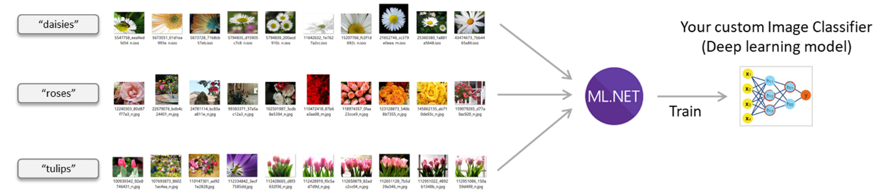
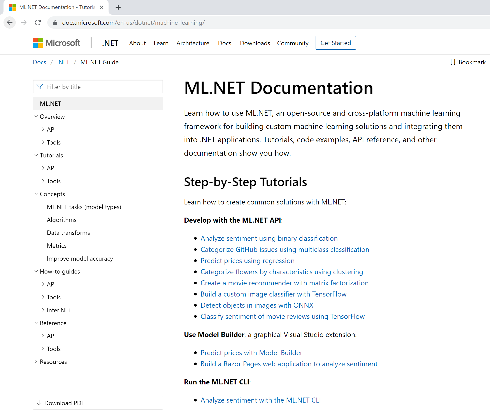
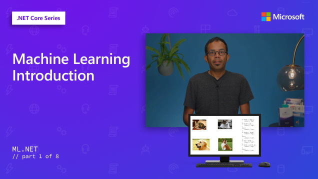

# [ML.NET](https://dot.net/ml) and Model Builder at .NET Conf (Machine Learning for .NET)

We are excited today to announce updates to [Model Builder](https://aka.ms/modelbuilder) and improvements in [ML.NET](https://dot.net/ml). You can learn more in the “What’s new in [ML.NET](https://dot.net/ml)?.” session at [.NET Conf](https://www.dotnetconf.net/).

[ML.NET](https://dot.net/ml) is an open-source and cross-platform machine learning framework (Windows, Linux, macOS) for .NET developers.

[ML.NET](https://dot.net/ml) offers Model Builder [Model Builder](https://aka.ms/modelbuilder) (a simple UI tool) and [CLI](https://docs.microsoft.com/en-us/dotnet/machine-learning/how-to-guides/install-ml-net-cli) to make it super easy to build custom ML Models using AutoML.

 Using [ML.NET](https://dot.net/ml), developers can leverage their existing tools and skillsets to develop and infuse custom AI into their applications by creating custom machine learning models for common scenarios like Sentiment Analysis, Recommendation, Image Classification and more!.

Following are the key highlights:
# Model Builder updates

This release of Model Builder adds support for a new scenario and address many customer reported issues. 

**Feature engineering**:
In previous versions of Model Builder, after selecting your dataset, either from a file or from SQL Server, you only had the option to choose the column to predict (the Label). Any other columns in the dataset were automatically used to make the prediction (Features). Any columns that you did not want to include, you had to manipulate your dataset outside of Model Builder and then upload the modified dataset. 

**Model consumption made easy!**:
In previous versions of Model Builder, there were numerous steps that you had to take after Model Builder’s code and model generation in order to consume the trained model in your app, including adding a reference to the generated library project, setting the model Copy to Output property to “Copy If Newer,” and adding the Microsoft.ML NuGet package to your app.

This has all been simplified and automated, so now all you have to do is copy + paste the code from the Next Steps in Model Builder, and then you can run your app and start making predictions!

**Address customer feedback**:
This release also address many customer reported issues around installation errors, usability feedback and stability improvements and more. Learn more [here](https://github.com/dotnet/machinelearning-modelbuilder/releases).

# [ML.NET](https://dot.net/ml) updates
This is a short summary of the features and enhancements added to ML.NET over the last few months.
  * Support for .NET Core 3
  * [Support for new scenarios such as Sales Forecasting, Anomaly Detection](https://devblogs.microsoft.com/dotnet/announcing-ml-net-1-2-and-model-builder-updates-machine-learning-for-net/)
  * [Preview: Native database loader that enables training directly against relational databases](https://devblogs.microsoft.com/dotnet/announcing-ml-net-1-4-preview-and-model-builder-updates-machine-learning-for-net/)
  * [Preview: Build custom deep learning models for Image classification using TensorFlow.](https://devblogs.microsoft.com/dotnet/announcing-ml-net-1-4-preview-and-model-builder-updates-machine-learning-for-net/)

# Documentation updates
We have been working hard to add more documentation across tutorials, how-to guides, and more for Model Builder, CLI, and ML.NET Framework. We have also simplified the table of contents for the [ML.NET Docs](https://docs.microsoft.com/en-us/dotnet/machine-learning/) so that you can easily discover the content.

# New learn series for ML.NET
To help users get started with the basics of Machine Learning and ML.NET, we have created a set of learning videos. Please watch the series [here](https://aka.ms/dotnet3-mlnet).

# Broad range of samples to learn from
We have added many scenarios for a variety of use cases with Machine Learning. You can learn and customize these samples for your scenario. Please find more samples on the [ML.NET Samples GitHub repo](https://github.com/dotnet/machinelearning-samples/blob/master/README.md).

# Try [ML.NET](https://dot.net/ml) and Model Builder today!

  * Get started with <a href="https://www.microsoft.com/net/learn/apps/machine-learning-and-ai/ml-dotnet/get-started">ML.NET here</a>.

  * Get started with <a href="https://aka.ms/modelbuilder">Model Builder here</a>.

  * Tutorials and resources at the [ML.NET Docs](https://docs.microsoft.com/dotnet/machine-learning/)
  * Sample apps using ML.NET at the [ML.NET Samples GitHub repo](https://github.com/dotnet/machinelearning-samples)

We are excited to release these updates for you, and we look forward to seeing what you will build with ML.NET. If you have any questions or feedback, you can ask them here for [ML.NET](https://dot.net/ml) and [Model Builder](https://aka.ms/modelbuilder). 

Thanks and happy coding with [ML.NET](https://dot.net/ml)!

The [ML.NET](https://dot.net/ml) Team.