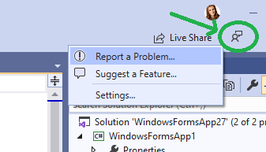
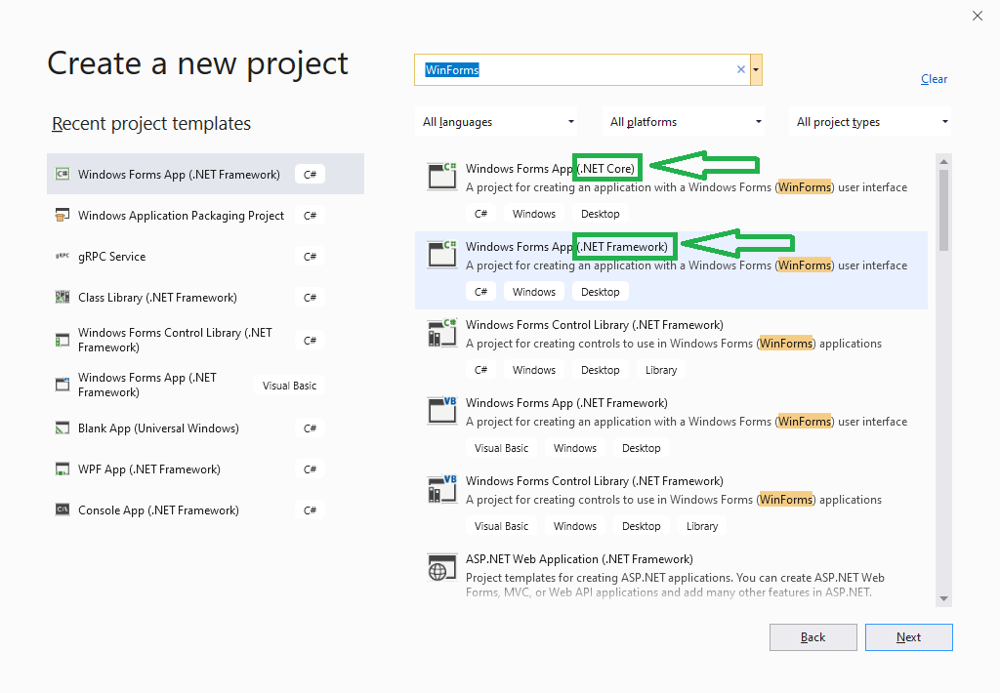

# Introducing WinForms Designer Preview 1

We just released a GA version of .NET Core 3.0 that includes support for Windows Forms and WPF. And along with that release, we're happy to announce the first preview version of the Windows Forms Designer for .NET Core projects!

For developers the .NET Core Designer (when we will release the full version of it) will look and feel the same as the old .NET Framework Designer. But for us it is a huge technical challenge to bring the designer to .NET Core because it requires the design surface that hosts the live .NET Core form to run outside the Visual Studio process. That means we need to re-architect the way the designer surface “communicates” with Visual Studio. You can watch these communications in the Output Window, where we track each request sent when the Visual Studio components are accessing properties or executing methods on the live controls in the design surface. The engineering team is still working on this technical challenge, and we will be releasing the Preview versions on regular basis to give you the early glance at the .NET Core Designer. Stay tuned! The next Preview will be coming out in early November.

Because this is the very first preview of the designer, it isn't yet bundled with Visual Studio and instead is available as a Visual Studio extension ("VSIX") ([download][1]). That means that if you open a Windows Forms project targeting .NET Core in Visual Studio, **it won't have the designer support by default - you need to install the .NET Core Designer first!**

## Enabling the designer

To enable the designer, download and install the [Windows Forms .NET Core Designer VSIX package][1]. You will be able to remove it from Visual Studio at any time. Once you install the .NET Core Designer, every time you work with a project Visual Studio will automatically pick the right designer (.NET Core or .NET Framework) depending on the target framework of the project.

*   [Download][1]
*   [Release Notes][2]
*   [Known Issues][3]

## It is early days for the designer, here is what to expect…

Please keep in mind, that this is the first preview, so the experience is limited. We supported the most commonly used controls and base operations, and will be adding more in each new Preview version. Eventually, we will bring the .NET Core Designer at parity with the Windows Forms Designer for .NET Framework, so you will have a seamless transition to .NET Core.

Because many controls are not yet supported in Preview 1 of the designer, **we don’t recommend porting your Windows Forms applications to .NET Core just yet** if you need to use the designer on a regular basis. This Preview 1 is good for “Hello World” scenarios of creating new projects with common controls.

Controls included in Preview 1:

*   Pointer
*   Button
*   Checkbox
*   CheckedListBox
*   ComboBox
*   DateTimePicker
*   Label
*   LinkLabel
*   ListBox
*   ListView
*   MaskedTextBox
*   MonthCalendar
*   NumericUpDown
*   PictureBox
*   ProgressBar
*   RadioButton
*   RichTextBox
*   TextBox
*   TreeView

What is not supported in Preview 1:

*   Container
*   Resources
*   ComponentTray
*   In-Place/Editing
*   SmartTag support
*   Databinding
*   UserControls/Inherited Controls

## Give us your feedback!

We are putting out our first bits so early to support the culture of developing the product with our users’ early feedback in mind. Please do reach out with your suggestions, issues and feature requests via Visual Studio Feedback channel. To do so, click on **Send Feedback** icon in Visual Studio top right corner as it is shown on the picture below.

We appreciate your engagement!

## Addressing Questions

### If Windows Forms Designer doesn’t work

We heard some question related to the Windows Forms Designer not working. Here’s what could have happened:

1.  You might have created a .NET Core Windows Forms project instead of the traditional .NET Framework one without realizing it. If you type “WinForms” or “Windows Forms” in the New Project Dialog, the first option would be a .NET Core Windows Forms project. If your intention is to create a .NET Framework project (with the mature designer support), just find and select **Windows Forms App (.NET Framework)**.

2.  If you want to work with .NET Core project, don’t forget to install the .NET Core Windows Forms Designer, since it isn't yet shipped inside Visual Studio by default. See the previous “Enabling the designer” section.

### If WPF Designer doesn’t work

We also received some questions related to the WPF Designer not working and if it requires a separate installation or the Windows Forms Designer installation? No, the WPF Designer is completely independent of the Windows Forms Designer. We released its GA version at the same time as .NET Core 3.0 and it comes with Visual Studio. In Visual Studio version 16.3.0 we had an issue with the **Enable XAML Designer** property set to false by default. That means when you click on .xaml files, the designer does not open automatically. Upgrade to the latest Visual Studio version 16.3.1 where this issue is fixed. Another option to fix it is to go to **Tools** -> **Options** -> **XAML Designer** and check **Enable XAML Designer**.

 [1]: https://aka.ms/winforms-designer
 [2]: https://github.com/dotnet/winforms/tree/master/Documentation/designer-releases
 [3]: https://github.com/dotnet/winforms/blob/master/Documentation/designer-releases/0.1/knownissues.md
