Working with large amounts of data has become critical these days. To extract useful information from their data, .NET developers need to be able to inspect and transform their data. To this end, we're adding a new library to enable effective data analysis in .NET: [Microsoft.Data.Analysis](https://www.nuget.org/packages/Microsoft.Data.Analysis/). In combination with running [.NET code in Jupyter Notebooks](https://devblogs.microsoft.com/dotnet/net-core-with-juypter-notebooks-is-here-preview-1/), the `0.1.0` preview lets users explore datasets that fit in memory with ease. 

## How does Microsoft.Data.Analysis enable data exploration?

For the `0.1.0` release, the `DataFrame` type is central to our data exploration story. `DataFrame` provides easy-to-use APIs to read and manipulate tabular data, where the data is stored as a collection of columns. Let's populate a `DataFrame` with some sample data and go over the major features. The full sample can be found on [Github](https://github.com/dotnet/try/tree/master/NotebookExamples/csharp/Samples) and is available to try in your browser right now [here](https://mybinder.org/v2/gh/dotnet/try/master?urlpath=lab). To get started, let's first import the [Microsoft.Data.Analysis](https://www.nuget.org/packages/Microsoft.Data.Analysis/) package and namespace into our .NET Jupyter Notebook(make sure you're using a .NET (C#) kernel):

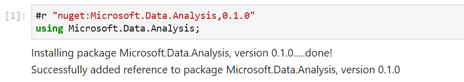

Let's make 3 columns to holds values of types `DateTime`, `int` and `string`. 

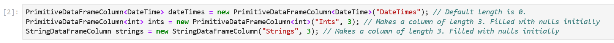

`PrimitiveDataFrameColumn` is a templated type that has an `unmanaged` constraint on it. As a result, it can act as a container for primitive data types such as `int`, `float`, `decimal`, user defined `structs` etc. A `StringDataFrameColumn` is a specialized column that can hold `string` values. Both the column types have an optional `length` parameter in their contructors that defaults to `0` when not specified. The `ints` and `strings` columns here have been initialized explicitly with length `3`. The constructors fill the columns with `null` values initially. Before we can add these columns to our `DataFrame` though, we need to append 3 values to our `dateTimes` column. This is because the `DataFrame` constructor expects all its columns to have the same length. 


Now we're ready to create a `DataFrame` with 3 columns.


One of the benefits of using a notebook for data exploration is the interactive REPL. We can enter `df` into a new cell to see what data it contains.

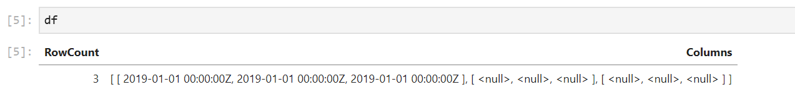

We can immediately see that the formatting of the output can be improved. Each column is printed as an array of values and we don't see the names of the columns. If `df` had more rows and columns, the output would be hard to read. Fortunately, we can write a custom formatter for our `DataFrame`. 

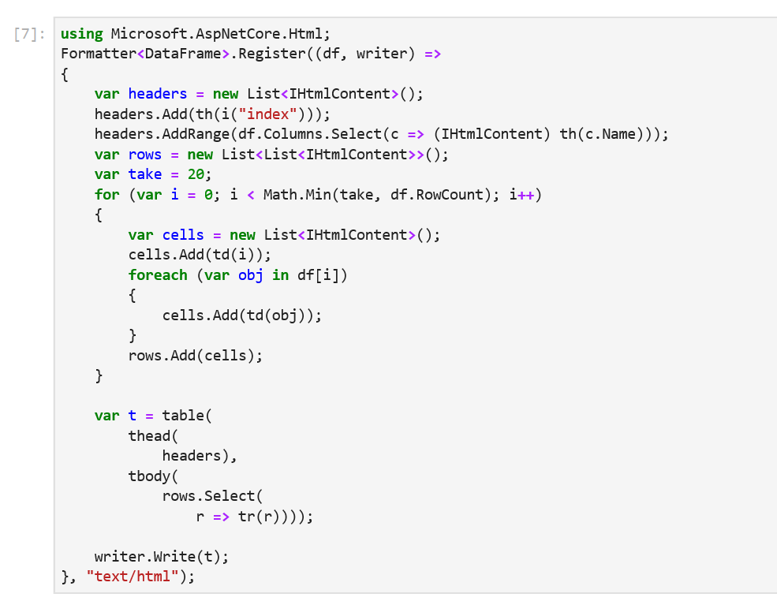

This snippet of code register a new `DataFrame` formatter. All subsequent evaluations of `df` will now output the first 20 rows of a `DataFrame` along with the column names.

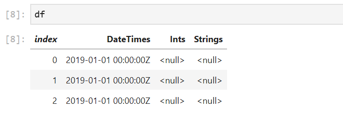

Sure enough, when we re-evaluate `df`, we see that it contains the 3 columns we created previously. The formatting makes it much easier to inspect our values. There's also a helpful `index` column in the output to quickly see which row we're looking at. Let's modify our data by indexing into `df`:

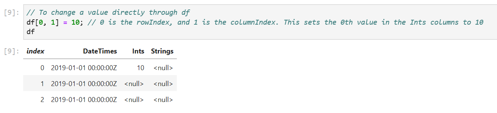

We can also modify the values in the columns through indexers defined on `PrimitiveDataFrameColumn` and `StringColumn`:

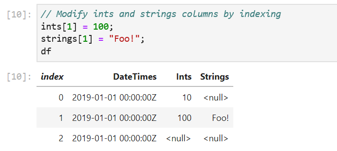

One caveat to keep in mind here is the data type of the value passed in to the indexers. We passed in the right data types to the column indexers in our sample: an integer value of `100` to `ints[1]` and a string `"Foo!"` to `string[1]`. If the data types don't match, an exception will be thrown. For cases where the type of data in the columns is not obvious, there is a handy `DataType` property defined on each column. 

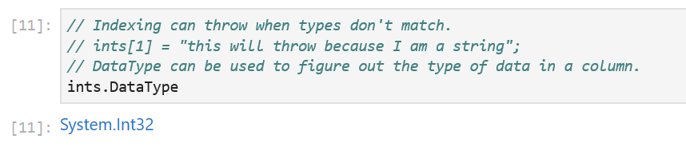

The `DataFrame` and the base `DataFrameColumn` class that all columns derive from expose a number of useful APIs: binary operations, computations, joins, merges, handling missing values and more. Let's look at some of them:

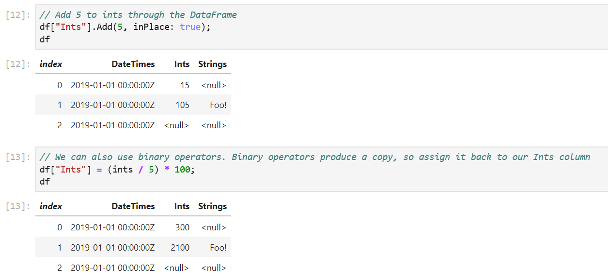

All binary operators are backed by functions that produces a copy by default. The `+` operator, for example, calls the `Add` method and passes in `false` for the `inPlace` parameter. This lets us elegantly perform data manipulation using operators without worrying about modifying our existing values. For when in place semantics are desired, we can set the `inPlace` parameter to `true` in the binary functions.  

Often, we read in data from an existing dataset that may contain `null` values. `DataFrame` has the `LoadCsv` method to read in csv files. In our sample, `df` has `null` values in its columns. `DataFrame` and `DataFrameColumn` offer an API to fill `nulls` with values.

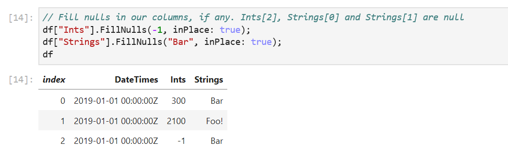

One of the design decisions we made early on was to use a column major backing store for `PrimitiveDataFrameColumn`. The column is held in memory as a collection of `Memory<byte>`. One consequence of this decision is that columns can have a length greater than `int.MaxValue`. The more important consequence is the ability to perform SIMD operations on our columns(we won't go through it in this sample, but the [unit tests](https://github.com/dotnet/corefxlab/blob/master/tests/Microsoft.Data.Analysis.Tests/BufferTests.cs#L200) show how to access the `Memory<byte>`). Indexing into our columns is therefore cheap, however, accessing our data row-wise is not.


`DataFrame` exposes a `Columns` property that we can enumerate over to access our columns. The `0.1.0` release does not expose a `Rows` property yet. Instead, we can directly index into our `DataFrame` to access our rows. Here's an example that accesses the first row:

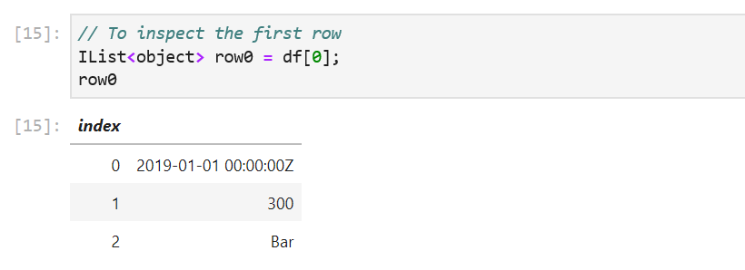

To enumerate over all the rows in a `DataFrame`, we can write a simple for loop. `DataFrame.RowCount` returns the length of a `DataFrame` and we can use the loop index to access each row. Note that each row is returned as an `IList<object>`. Modifying the returned row does not modify the values in the `DataFrame` (use indexers for this instead). We also lose type information on the returned row object. This is a consequence of `DataFrame` being a loosely typed data structure. In the future, based on the community's feedback, there is potential to make a derived class that looks like the following:

``` csharp
public class DataFrame<T>: DataFrame
```

where `T` could be a schema that would let us expose more strongly typed APIs, including a `Rows` property. 

 Finally, let's wrap up by looking at the `Filter`, `Sort` and `GroupBy` methods:

 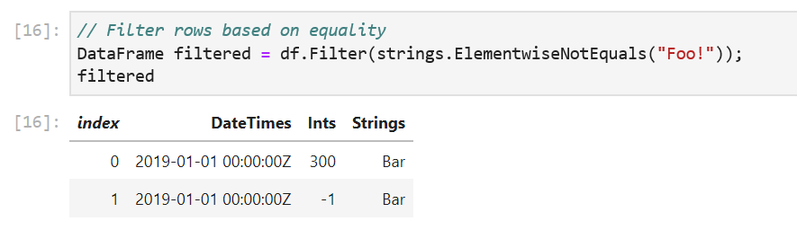

 The `Filter` method is defined on `DataFrame` like this:

 ```csharp
        /// <summary>
        /// Returns a new DataFrame using the boolean values in <paramref name="filter"/>
        /// </summary>
        /// <param name="filter">A column of booleans</param>
        public DataFrame Filter(PrimitiveDataFrameColumn<bool> filter)
 ```
`ElementwiseNotEquals` returns a `PrimitiveDataFrameColumn<bool>` where each value in `strings` that does not equal `"Foo!"` is set to `true` which then act as a filter to select rows on `df`. 

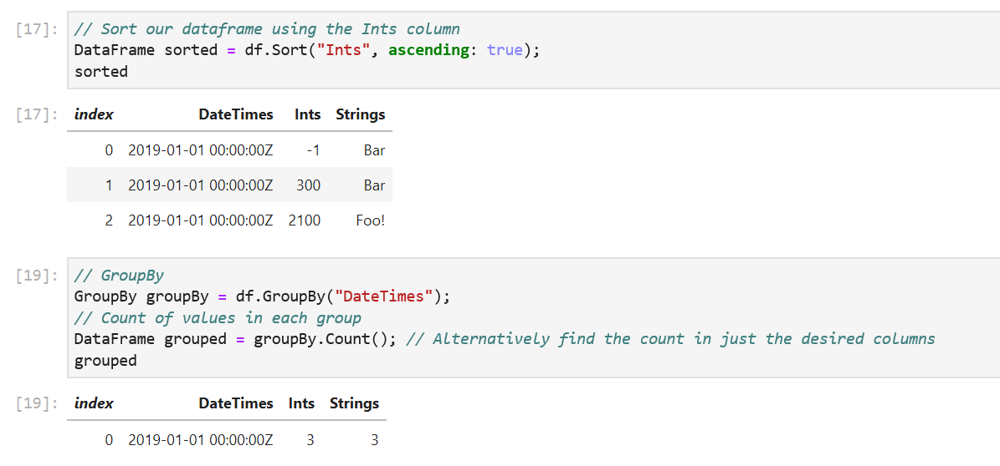

The `GroupBy` method takes in the name of a column and creates groups based on unique values in the column. In our sample, the `DateTimes` column has the same value, so we expect only 1 group to be created with the value `2019-01-01 00:00:00Z` that contains 3 rows. The `GroupBy` object exposes a set of methods that can called on each group. Some examples are `Max()`, `Min()`, `Count()` etc. The `Count()` method counts the number of values in each group and return them in a new `DataFrame`.

## Parting Thoughts

We've only explored a subset of the features that `DataFrame` exposes. `Joins`, `Merges`, and `Aggregations` are supported. Each column also implements `IEnumerable<T>`, so users can write LINQ queries on columns. The custom `DataFrame` formatting code we wrote has a simple example. `ApplyElementwise` is a method that is defined on `PrimitiveDataFrameColumn` that can take in a lambda to apply to each value. The complete source code(and documentation) for `Microsoft.Data.Analysis` lives [here](https://github.com/dotnet/corefxlab/tree/master/src/Microsoft.Data.Analysis). In a follow up post, I'll go over how to use `DataFrame` with AutoML and .NET for Spark. The decision to use column major backing stores (the Arrow format in particular) allows for zero-copy in .NET for Spark User Defined Functions (UDFs)!

We always welcome the community's feedback! In fact, please feel free to contribute to the [source code](https://github.com/dotnet/corefxlab/tree/master/src/Microsoft.Data.Analysis). We've made it easy for users to create new column types that derive from `DataFrameColumn` to add new functionality. Support for structs such as `DateTime` and user defined structs is also not as complete as primitive types such as `int`, `float` etc. We believe this preview package allows the community to do data analysis in .NET. Give it a [try](https://github.com/dotnet/try/tree/master/NotebookExamples/csharp/Samples) and let us know your thoughts!

