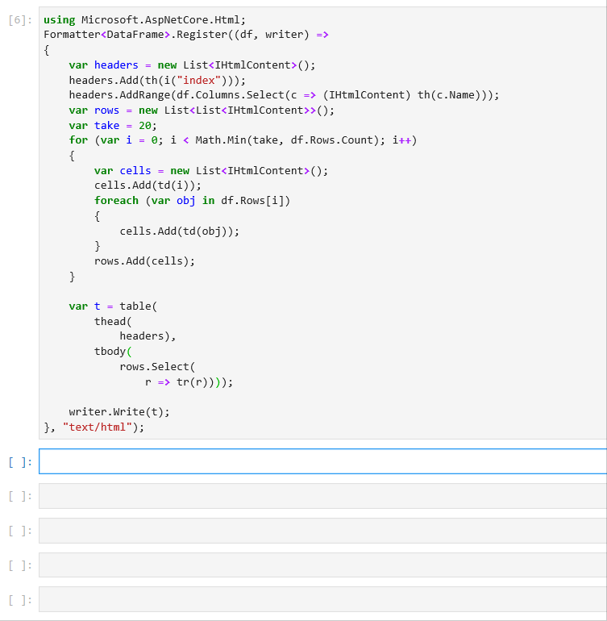
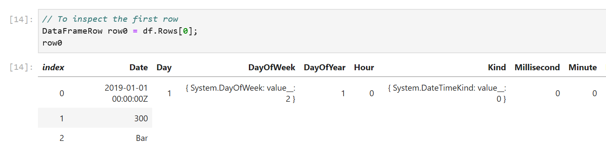
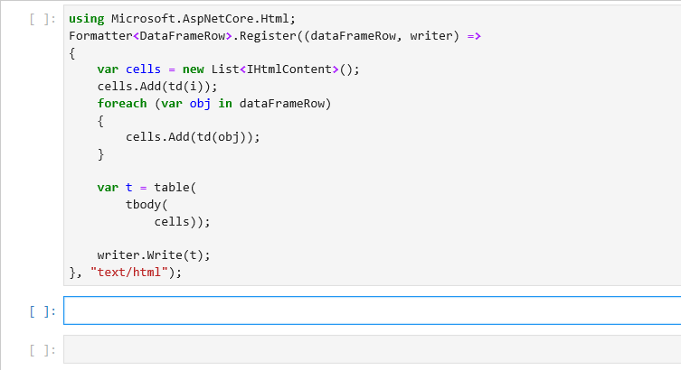
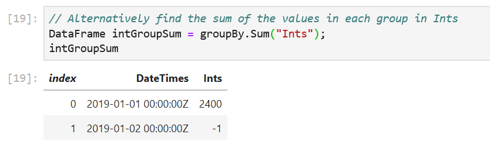
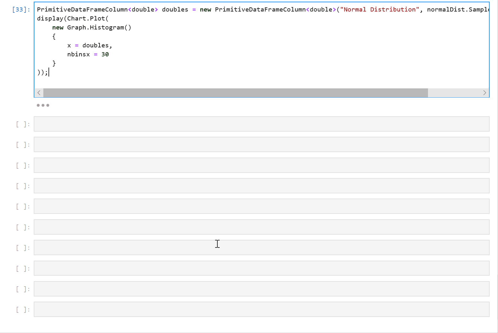

Last month, we announced .NET support for Jupyter notebooks, and showed how to use them to work with .NET for Apache Spark and ML.NET. Today, we're announcing the preview of a [DataFrame](https://www.nuget.org/packages/Microsoft.Data.Analysis/) type for .NET to make data exploration easy. If you've used Python to manipulate data in notebooks, you'll already be familiar with the concept of a DataFrame. At a high level, it is an in-memory representation of structured data. In this blog post, I'm going to give an overview of this new type and how you can use it from Jupyter notebooks. To play along, fire up a .NET Jupyter Notebook in a [browser](https://mybinder.org/v2/gh/dotnet/try/master?urlpath=lab).

## How to use DataFrame?

`DataFrame` stores data as a collection of columns. Let's populate a `DataFrame` with some sample data and go over the major features. The full sample can be found on Github([C#](https://github.com/dotnet/try/blob/master/NotebookExamples/csharp/Samples/DataFrame-Getting%20Started.ipynb) and [F#](https://github.com/dotnet/try/blob/master/NotebookExamples/fsharp/Samples/DataFrame-Getting%20Started.ipynb)). To follow along in your browser, click [here](https://mybinder.org/v2/gh/dotnet/try/master?urlpath=lab) and navigate to _csharp/Samples/DataFrame-Getting Started.ipynb_(or _fsharp/Samples/DataFrame-Getting Started.ipynb_). To get started, let's import the [Microsoft.Data.Analysis](https://www.nuget.org/packages/Microsoft.Data.Analysis/) package and namespace into our .NET Jupyter Notebook(make sure you're using the C# or F# kernel):


Let's make three columns to hold values of types `DateTime`, `int` and `string`. 
``` csharp
PrimitiveDataFrameColumn<DateTime> dateTimes = new PrimitiveDataFrameColumn<DateTime>("DateTimes"); // Default length is 0.
PrimitiveDataFrameColumn<int> ints = new PrimitiveDataFrameColumn<int>("Ints", 3); // Makes a column of length 3. Filled with nulls initially
StringDataFrameColumn strings = new StringDataFrameColumn("Strings", 3); // Makes a column of length 3. Filled with nulls initially
```

`PrimitiveDataFrameColumn` is a generic column that can hold primitive types such as `int`, `float`, `decimal` etc. A `StringDataFrameColumn` is a specialized column that holds `string` values. Both the column types can take a `length` parameter in their contructors and are filled with `null` values initially. Before we can add these columns to a `DataFrame` though, we need to append three values to our `dateTimes` column. This is because the `DataFrame` constructor expects all its columns to have the same length. 

``` csharp
// Append 3 values to dateTimes
dateTimes.Append(DateTime.Parse("2019/01/01"));
dateTimes.Append(DateTime.Parse("2019/01/01"));
dateTimes.Append(DateTime.Parse("2019/01/02"));
```

Now we're ready to create a `DataFrame` with three columns.

``` csharp
DataFrame df = new DataFrame(dateTimes, ints, strings); // This will throw if the columns are of different lengths
```

One of the benefits of using a notebook for data exploration is the interactive REPL. We can enter `df` into a new cell and run it to see what data it contains. For the rest of this post, we'll work in a .NET Jupyter environment. All the sample code will work in a regular console app as well though.


We immediately see that the formatting of the output can be improved. Each column is printed as an array of values and we don't see the names of the columns. If `df` had more rows and columns, the output would be hard to read. Fortunately, in a Jupyter environment, we can write custom formatters for types. Let's write a formatter for `DataFrame`. 

```csharp
using Microsoft.AspNetCore.Html;
Formatter<DataFrame>.Register((df, writer) =>
{
    var headers = new List<IHtmlContent>();
    headers.Add(th(i("index")));
    headers.AddRange(df.Columns.Select(c => (IHtmlContent) th(c.Name)));
    var rows = new List<List<IHtmlContent>>();
    var take = 20;
    for (var i = 0; i < Math.Min(take, df.RowCount); i++)
    {
        var cells = new List<IHtmlContent>();
        cells.Add(td(i));
        foreach (var obj in df[i])
        {
            cells.Add(td(obj));
        }
        rows.Add(cells);
    }
    
    var t = table(
        thead(
            headers),
        tbody(
            rows.Select(
                r => tr(r))));
    
    writer.Write(t);
}, "text/html");
```

This snippet of code register a new `DataFrame` formatter. All subsequent evaluations of `df` in a notebook will now output the first 20 rows of a `DataFrame` along with the column names. In the future, the `DataFrame` type and other libraries that target Jupyter as one of their environments will be able to ship with their formatters. 



Sure enough, when we re-evaluate `df`, we see that it contains the three columns we created previously. The formatting makes it much easier to inspect our values. There's also a helpful `index` column in the output to quickly see which row we're looking at. Let's modify our data by indexing into `df`:

``` csharp
df[0, 1] = 10; // 0 is the rowIndex, and 1 is the columnIndex. This sets the 0th value in the Ints columns to 10
```


We can also modify the values in the columns through indexers defined on `PrimitiveDataFrameColumn` and `StringDataFrameColumn`:

``` csharp
// Modify ints and strings columns by indexing
ints[1] = 100;
strings[1] = "Foo!";
```


One caveat to keep in mind here is the data type of the value passed in to the indexers. We passed in the right data types to the column indexers in our sample: an integer value of `100` to `ints[1]` and a string `"Foo!"` to `string[1]`. If the data types don't match, an exception will be thrown. For cases where the type of data in the columns is not obvious, there is a handy `DataType` property defined on each column. 


The `DataFrame` and `DataFrameColumn` classes expose a number of useful APIs: binary operations, computations, joins, merges, handling missing values and more. Let's look at some of them:
``` csharp
// Add 5 to Ints through the DataFrame
df["Ints"].Add(5, inPlace: true);
```
``` csharp
// We can also use binary operators. Binary operators produce a copy, so assign it back to our Ints column 
df["Ints"] = (ints / 5) * 100;
```


All binary operators are backed by functions that produces a copy by default. The `+` operator, for example, calls the `Add` method and passes in `false` for the `inPlace` parameter. This lets us elegantly manipulate data using operators without worrying about modifying our existing values. For when in place semantics are desired, we can set the `inPlace` parameter to `true` in the binary functions.  

Often, we read in data from an existing dataset that may contain `null` values. `DataFrame` has the `LoadCsv` method to read in csv files. 
``` csharp
DataFrame csvDataFrame = DataFrame.LoadCsv("path/to/file.csv");
```

In our sample, `df` has `null` values in its columns. `DataFrame` and `DataFrameColumn` offer an API to fill `nulls` with values.

``` csharp
df["Ints"].FillNulls(-1, inPlace: true);
df["Strings"].FillNulls("Bar", inPlace: true);
```


`DataFrame` exposes a `Columns` property that we can enumerate over to access our columns and a `Rows` property to acess our rows. We can index `Rows` to access each row. Here's an example that accesses the first row:
```csharp
DataFrameRow row0 = df.Rows[0];
```


To inspect our values better, let's write a formatter for `DataFrameRow` that displays values in a single line.
``` csharp
using Microsoft.AspNetCore.Html;
Formatter<DataFrameRow>.Register((dataFrameRow, writer) =>
{
    var cells = new List<IHtmlContent>();
    cells.Add(td(i));
    foreach (var obj in dataFrameRow)
    {
        cells.Add(td(obj));
    }
    
    var t = table(
        tbody(
            cells));
    
    writer.Write(t);
}, "text/html");
```



To enumerate over all the rows in a `DataFrame`, we can write a simple for loop. `DataFrame.Rows.Count` returns the number of rows in a `DataFrame` and we can use the loop index to access each row. 
```csharp
for (long i = 0; i < df.RowCount; i++)
{
       DataFrameRow row = df[i];
}
```
Note that each row is a view of the values in the `DataFrame`. Modifying the values in the `row` object modifies the values in the `DataFrame`. We do however lose type information on the returned `row` object. This is a consequence of `DataFrame` being a loosely typed data structure. 

Finally, let's wrap up our `DataFrame` API tour by looking at the `Filter`, `Sort` and `GroupBy` methods:

``` csharp
// Filter rows based on equality
PrimitiveDataFrameColumn<bool> boolFilter = df["Strings"].ElementwiseEquals("Bar");
DataFrame filtered = df.Filter(boolFilter);
```
 

`ElementwiseEquals` returns a `PrimitiveDataFrameColumn<bool>` where each value in `Strings` that equals `"Bar"` is set to `true`. In the `df.Filter` call, each row corresponding to a `true` value in `boolFilter` selects a row out of `df`. The resulting `DataFrame` contains only these rows.

```csharp
// Sort our dataframe using the Ints column
DataFrame sorted = df.Sort("Ints");
// GroupBy 
GroupBy groupBy = df.GroupBy("DateTimes");
```


The `GroupBy` method takes in the name of a column and creates groups based on unique values in the column. In our sample, the `DateTimes` column has two unique values, so we expect one group to be created for `2019-01-01 00:00:00Z` and one for `2019-01-02 00:00:00Z`. 

``` csharp
// Count of values in each group
DataFrame groupCounts = groupBy.Count();
// Alternatively find the sum of the values in each group in Ints
DataFrame intGroupSum = groupBy.Sum("Ints");
```


The `GroupBy` object exposes a set of methods that can called on each group. Some examples are `Max()`, `Min()`, `Count()` etc. The `Count()` method counts the number of values in each group and return them in a new `DataFrame`. The `Sum("Ints")` method sums up the values in each group. 

## Charting
Another cool feature of using a `DataFrame` in a .NET Jupyter environment is charting. Charts are rendered using [Xplot.Plotly](https://fslab.org/XPlot/). We can import the `XPlot.Plotly` namespace into our notebook and create interactive visualizations of the data in our `DataFrame`. Let's populate a `PrimitiveDataFrameColumn<int>` with a normal distribution and plot a histogram of the samples:

``` csharp
#r "nuget:MathNet.Numerics,4.9.0"
using XPlot.Plotly;
using System.Linq;
using MathNet.Numerics.Distributions;

double mean = 0;
double stdDev = 0.1;
MathNet.Numerics.Distributions.Normal normalDist = new Normal(mean, stdDev);

PrimitiveDataFrameColumn<double> doubles = new PrimitiveDataFrameColumn<double>("Normal Distribution", normalDist.Samples().Take(1000));
display(Chart.Plot(
    new Graph.Histogram()
    {
        x = doubles,
        nbinsx = 30
    }
));
```



We first create a `PrimitiveDataFrameColumn<double>` by drawing 1000 samples from a normal distribution and then plot a histogram with 30 bins. The resulting chart is interactive! Hovering over the chart reveals the underlying data and lets us inspect each value precisely.

## Summary

We've only explored a subset of the features that `DataFrame` exposes. `Append`, `Joins`, `Merges`, and `Aggregations` are supported. Each column also implements `IEnumerable<T?>`, so users can write LINQ queries on columns. The custom `DataFrame` formatting code we wrote has a simple example. The complete source code(and documentation) for `Microsoft.Data.Analysis` [lives on GitHub](https://github.com/dotnet/corefxlab/tree/master/src/Microsoft.Data.Analysis). In a follow up post, I'll go over how to use `DataFrame` with ML.NET and .NET for Spark. The decision to use column major backing stores (the Arrow format in particular) allows for zero-copy in .NET for Spark User Defined Functions (UDFs)!


We always welcome the community's feedback! In fact, please feel free to contribute to the [source code](https://github.com/dotnet/corefxlab/tree/master/src/Microsoft.Data.Analysis). We've made it easy for users to create new column types that derive from `DataFrameColumn` to add new functionality. Support for structs such as `DateTime` and user defined structs is also not as complete as primitive types such as `int`, `float` etc. We believe this preview package allows the community to do data analysis in .NET. Try out DataFrame in a [.NET Jupyter Notebook](
https://mybinder.org/v2/gh/dotnet/try/master?urlpath=lab) and let us know what you think!

