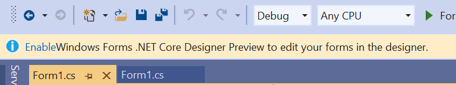
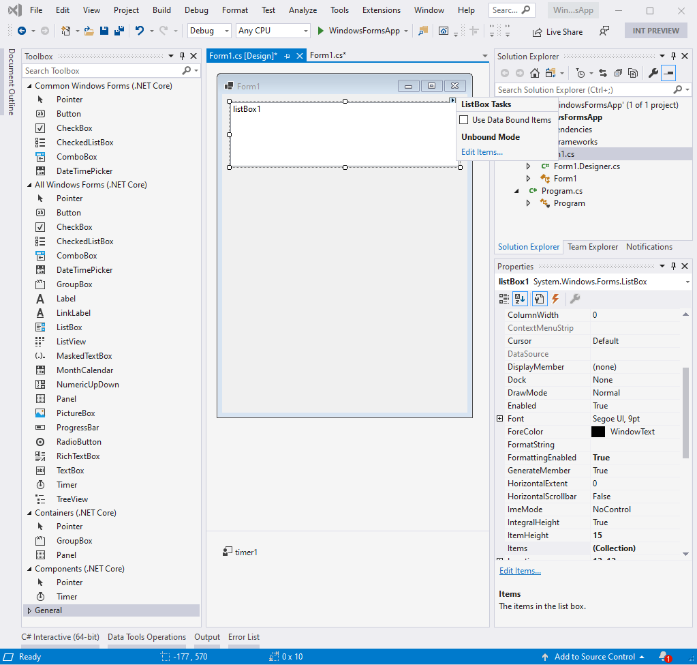

# Updates to .NET Core Windows Forms Designer in Visual Studio 16.5 Preview 1

We are happy to announce the new preview version of the .NET Core Windows Forms Designer that is available with the  Visual Studio 16.5 Preview 1! To use the designer you need to be on a ***preview*** version of [Visual Studio](https://visualstudio.microsoft.com/vs/preview/ "Visual Studio Preview download") and don't forget to enable the designer in Visual Studio **Tools -> Options -> Environment -> Preview Features** and check **Use the preview Windows Forms designer for .NET Core apps**. You might notice a gold bar in the upper part of your Visual Studio Preview suggesting you to enable the Windows Forms designer.

//ToDo: add new picture

Clicking on **Enable** link will take you to the same place in  **Tools -> Options -> Environment -> Preview Features** where you can enable the designer.

## What's new

In this preview version of the designer we've added following features:

* Timer control support.
* Added more features in the Component Tray. Now it responds to user actions.
* Added Designer Actions to the available controls, like for example making a `TextBox` multiline or adding items to a `CheckedListBox`.
* Improved Undo/Redo actions.
* Scrollbars support. If a form is bigger than the document window, scrollbars are shown.
* Some container controls (`GroupBox` and `Panel`) and more are coming.
//ToDo: Merrie to add more

## Klaus chapter - Some info about the intrinsic of the designer implementations

## Known issues
