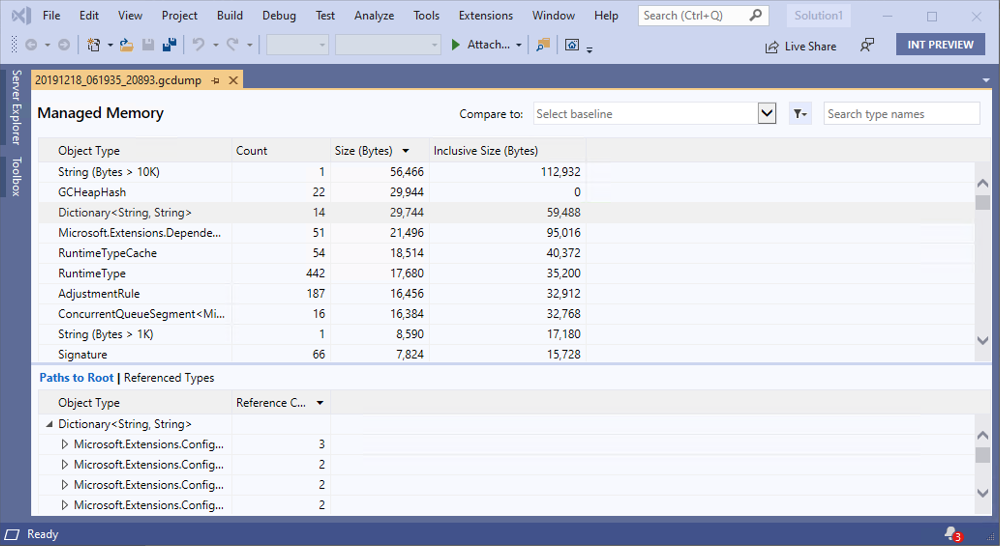
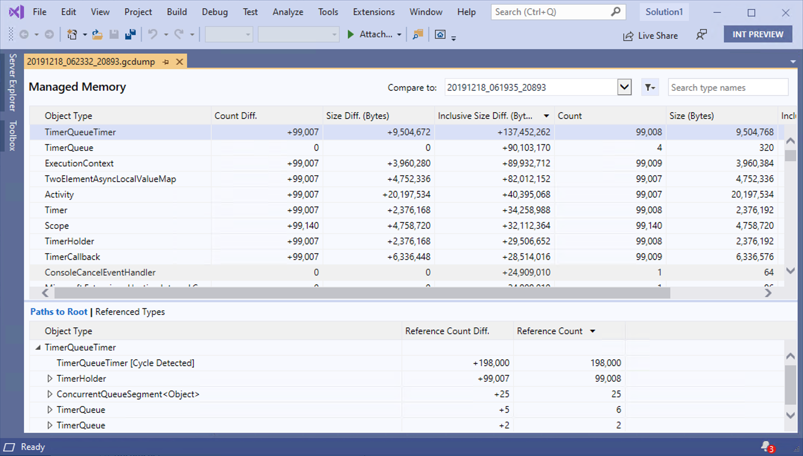

# Collecting and analyzing memory dumps

Building upon the diagnostics improvements introduced in .NET Core 3.1, we've introduced a new tool for collecting heap dumps from a running .NET Core process.

In a previous [blog post](https://devblogs.microsoft.com/dotnet/introducing-diagnostics-improvements-in-net-core-3-0/) we introduced, `dotnet-dump`, a tool to allow you to capture and analyze process dumps. Since then, we've been hard at work to improve the experience when working with dumps.

Two of the key improvements we've made to `dotnet-dump` are:
- We no longer require `sudo` for collecting dumps on Linux
- `dotnet dump analyze` is now a supported on Windows

## GC dumps

However, one of the key limitations that remains is process dumps are not portable. It is not possible to diagnose dumps collected on Linux with Windows and vice-versa.

Many common scenarios don't require a full process dump inspection. To enable these scenarios, we've introduced a new lightweight mechanism for collecting a dump that is **portable**. We have instrumented the garbage collector in the .NET runtime to emit special events during a garbage collection. By triggering a garbage collection in the target process, we are able to stream these events via the Existing EventPipe mechanism to regenerate a graph of object roots.

These GC dumps are useful for several scenarios including:

- Comparing number of objects by type on the heap
- Analyzing object roots
- Finding what objects have a reference to what type
- Other statistical analysis about objects on the heap

### `dotnet-gcdump`

In .NET Core 3.1, we're introducing a new tool that allows you to capture the aformentioned process dumps for analysis in [perfview](https://github.com/microsoft/perfview) and Visual Studio.

You can install this .NET global tool by running the following command:

```sh
dotnet tool install --global dotnet-gcdump --version 3.1.57502
```

Once you’ve installed `dotnet gcdump`, you can capture a GC dump by running the following command:

```sh
dotnet gcdump collect -p <target-process-PID>
```

The resulting `.gcdump` file can be analyzed in Visual Studio and [Perfview](https://github.com/microsoft/perfview) on Windows.

### Analyzing GC dumps in Visual Studio

The collected GC dumps can be analyzed by opening the `.gcdump` files in Visual Studio. Upon opening in Visual Studio, you are greeted with the Memory Analysis Report page.



The top pane shows the count and size of the types in the snapshot, including the size of all objects that are referenced by the type (Inclusive Size).

In the bottom pane, the Paths to Root tree displays the objects that reference the type selected in the upper pane. The Referenced Types tree displays the references that are held by the type selected in the upper pane.

In addition to the memory analysis report of just a single GC dump, Visual Studio also allows you to compare two gc dumps. To view details of the difference between the current snapshot and the previous snapshot, navigate to the `Compare To` section of the report and select another GC dump to serve as the baseline.



## Closing

Thanks for trying out the new diagnostics tools in .NET Core 3.0. Please continue to give us feedback, either in the comments or on [GitHub](https://github.com/dotnet/diagnostics). We are listening carefully and will continue to make changes based on your feedback.
