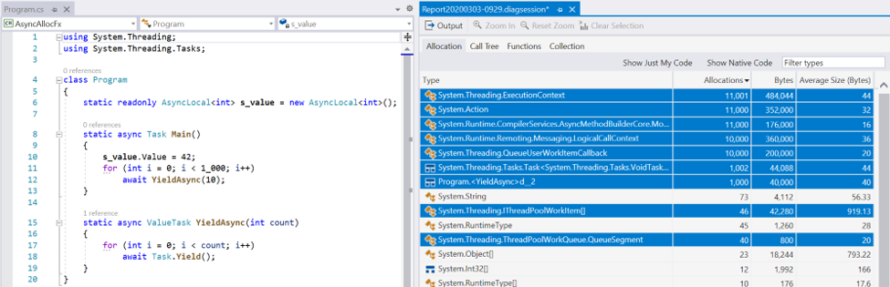
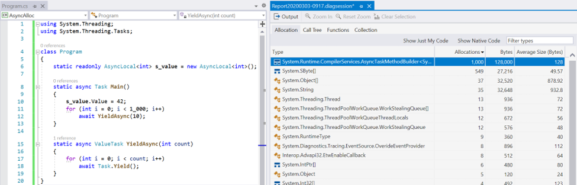
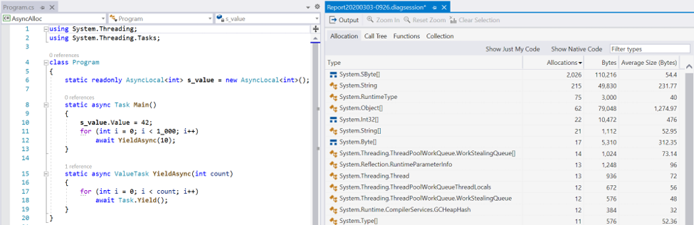

# Async ValueTask Pooling in .NET 5 Preview 1

The async/await feature in C# has revolutionized how developers targeting .NET write asynchronous code.  Sprinkle some "async" and "await" around, change some return types to be tasks, and badda bing badda boom, you've got an asynchronous implementation.  In theory.

In practice, obviously I've exaggerated the ease with which a codebase can be made fully asynchronous, and as with many a software development task, the devil is often in the details.  One such "devil" that performance-minded .NET developers are likely familiar with are the state machines objects the enable async methods to perform their magic.

### State Machines and Allocations

When you write an async method in C#, the compiler rewrites that method into a state machine, where the bulk of your code in your async method is moved into a `MoveNext` method on a compiler-generated type (a struct in Release builds), and with that `MoveNext` method littered with jumps and labels that enable the method to suspend and resume at `await` points.  An `await`'d incomplete tasks has a continuation (a callback) hooked up to it that, upon the task's eventual completion, calls back to the `MoveNext` method and jumps to the location where the function was suspended.  In order for local variables to maintain their state across these method exits and re-entrances, relevant "locals" are rewritten by the compiler to be fields on the state machine type.  And in order for that state machine as a struct to persist across those same suspensions, it needs to be moved to the heap. The C# compiler and the .NET runtime try hard to avoid putting that state machine on the heap.  Many async method invocations actually complete synchronously, and the compiler and runtime are tuned to that use case.  As noted, in Release builds the state machine generated by the compiler is a struct, and when an async method is invoked, the state machine starts its life on the stack.  If the async method completes without ever suspending, the state machine will happily complete having never caused an allocation.  However, if the async method ever needs to suspend, the state machine needs to somehow be promoted to the heap.

In .NET Framework, the moment a `Task`- or `ValueTask`-returning async method (both generic and non-generic) suspends for the first time, several allocations occur:
- The state machine struct is copied to the heap via standard runtime boxing; every state machine implements the `IAsyncStateMachine` interface, and the runtime literally casts the struct to this interface, resulting in an allocation.
- The runtime captures the current `ExecutionContext`, and then allocates an object (it calls this a "runner") that it uses to store both the boxed state machine and the `ExecutionContext` (note, too, that in the .NET Framework, capturing `ExecutionContext` when it's not the default also results in one or more allocations).
- The runtime allocates an `Action` delegate that points to a method on that runner object, because the awaiter pattern requires an `Action` that can be passed to the awaiter's `{Unsafe}OnCompleted` method; when invoked, the `Action` will use the captured `ExecutionContext` to invoke the `MoveNext` method on the state machine.
- The runtime allocates a `Task` object that will be completed when the async method completes and that's returned from the async method to its synchronous caller (if the async method is typed to return a `ValueTask`, the `ValueTask` struct is just wrapped around the `Task` object).

That's at least four allocations when an async method suspends for the first time.  On top of that, every subsequent time the async method suspends, if we find ourselves with a non-default `ExecutionContext` (e.g. it's carrying state for an `AsyncLocal<T>`), the runtime re-allocates that runner object and then re-allocates the `Action` that points to it (because delegates are immutable), for at least two additional allocations each time the async method suspends after the first time.

This has been improved significantly for .NET Core, in particular as of .NET Core 2.1.  When an async method suspends, a `Task` is allocated.  But it's not of the base `Task` or `Task<TResult>` type.  Instead, it's of an internal `AsyncStateMachineBox<TStateMachine>` type that derives from `Task`.  The state machine struct is stored in a strongly-typed field on this derived type, eliminating the need for a separate boxing allocation.  This type also has a field for the captured `ExecutionContext` (which is immutable in .NET Core, which means capturing one never allocates), which means we don't need a separate runner object.  And the runtime now has special code paths that support passing this `AsyncStateMachineBox<TStateMachine>` type directly through to all awaiters the runtime knows about, which means that as long as an async method only ever awaits `Task`, `Task<TResult>`, `ValueTask`, or `ValueTask<TResult>` (either directly or via their `ConfigureAwait` counterparts), it needn't allocate an `Action` delegate at all.  Then, since we have direct access to the `ExecutionContext` field, subsequent suspensions don't require allocating a new runner (runners are gone entirely), which also means even if we did need to allocate an `Action`, we don't need to re-allocate it.  That means, whereas in .NET Framework we have at least four allocations for the first suspension and often at least two allocations for each subsequent suspension, in .NET Core we have one allocation for the first suspension (worst case two, if custom awaiters are used), and that's it.  Other changes, such as a rewrite to the `ThreadPool`'s queueing infrastructure, also significantly decreased allocations.
 
 

That change has had a very measurable impact on performance (and, as it happens, on more than just performance; it's also very beneficial for debugging), and we can all rejoice in seeing unnecessary allocations removed.  However, as noted, one allocation still remains when an async method completes asynchronously.
But… what if we could get rid of that one, too?  What if we could make it so that invoking an async method had (amortized) zero-allocation overhead, regardless of whether it completed synchronously or asynchronously?
 
 ### ValueTask

`ValueTask<TResult>` was introduced in the .NET Core 1.0 timeframe to help developers avoid allocations when async methods complete synchronously.  It was a relatively simple struct representing a discriminated union between a `TResult` and a `Task<TResult>`.  When used as the result type of an async method, if an invocation of the async method returns synchronously, regardless of the value of the `TResult` result, the method incurs zero allocations of overhead: the state machine doesn't need to be moved to the heap, and no `Task<TResult>` need be allocated for the result; the result value is simply stored into the `TResult` field of the returned `ValueTask<TResult>`.  However, if the async method completes asynchronously, the runtime falls back to behaving just as it would with `Task<TResult>`: it produces the single `AsyncStateMachineBox<TStateMachine>` task, which is then wrapped in the returned `ValueTask<TResult>` struct.

In .NET Core 2.1, we introduced the `IValueTaskSource<TResult>` interface, along with non-generic counterparts `ValueTask` and `IValueTaskSource`.  We also made `ValueTask<TResult>` capable of storing not just a `TResult` and a `Task<TResult>`, but also an `IValueTaskSource<TResult>` (same for the non-generic `ValueTask`, which could store a `Task` or an `IValueTaskSource`).  This advanced interface allows an enterprising developer to write their own backing store for the value task, and they can do so in a way that allows them to reuse that backing store object for multiple non-concurrent operations (much more information on this is available in [this blog post](https://devblogs.microsoft.com/dotnet/understanding-the-whys-whats-and-whens-of-valuetask/).  For example, an individual `Socket` is generally used for no more than one receive operation and one send operation at a time.  `Socket` was modified to store a reusable/resettable `IValueTaskSource<int>` for each direction, and each consecutive read or write operation that completes asynchronously hands out a `ValueTask<int>` backed by the appropriate shared instance.  This means that in the vast majority of cases, the `ValueTask<int>`-based `ReceiveAsync`/`SendAsync` methods on `Socket` end up being non-allocating, regardless of whether they complete synchronously or asynchronously.  A handful of types got this treatment, but only where:
- we knew it would be impactful because the types were often used on high-throughput code paths,
- we knew we could do it in a way where it would pretty much always be a win (often performance optimizations come with trade-offs), and
- we knew it would be worth the painstaking effort it would take to effectively implement these interfaces.

As such, a handful of implementations were added in .NET Core 2.1 in key areas, like `System.Net.Sockets`, `System.Threading.Channels`, and `System.IO.Pipelines`, but not much beyond that.  We subsequently introduced the `ManualResetValueTaskSource<TResult>` type to make such implementations easier, and as a result more implementations of these interfaces were added in .NET Core 3.0 and also in .NET 5, though mostly as internal implementation details within various components, like `System.Net.Http`.

### .NET 5 Improvements

In .NET 5, we're experimenting with taking this optimization much further.  If prior to your process running you set the `DOTNET_SYSTEM_THREADING_POOLASYNCVALUETASKS` environment variable to either `true` or `1`, the runtime will use state machine box objects that implement the `IValueTaskSource` and `IValueTaskSource<TResult>` interfaces, and it will pool the objects it creates to back the instances returned from `async ValueTask` or `async ValueTask<TResult>` methods.  So, if as in the earlier example you repeatedly invoke the same method and await its result, each time you'll end up getting back a `ValueTask` that, under the covers, is wrapping the exact same object, simply reset each time to enable it to track another execution.  Magic.

Why isn't it just on by default right now?  Two main reasons:
- **Pooling isn't free.**  There are a variety of ways allocations can be eliminated by a developer looking to optimize their code.  One is to simply improve the code to no longer need the allocation; from a performance perspective, this is generally very low risk.  Another is to reuse an existing object already readily available, such as by adding an additional field to some existing object with a similar lifespan; this likely requires more performance analysis, but is still often a clear win.  Then comes pooling.  Pooling can be very beneficial when it's really expensive to construct the thing being pooled; a good example of this is with HTTPS connection pooling, where the cost of establishing a new secure connection is generally orders of magnitude more expensive than accessing one in even the most naïve of pooling data structures.  The more controversial form of pooling is when the pool is for cheaply constructed objects, with the goal of avoiding garbage collection costs.  In employing such a pool, the developer is betting that they can implement a custom allocator (which is really what a pool is) that's better than the general-purpose GC allocator.  Beating the GC is not trivial.  But, a developer might be able to, given knowledge they have of their specific scenario.  For example, the .NET GC is very good at efficiently collecting short-lived objects, those that become collectible in generation 0, and attempting to pool such objects can easily make a program more expensive (even if doing so looks good on a microbenchmark focused on measuring allocation).  But if you know that your objects are likely to survive gen0, such as if they're used to represent potentially long-latency asynchronous operations, it's possible a custom pool could shave off some overhead.  We haven't made this 'async ValueTask' pooling the default yet because, while it looks good on microbenchmarks, we're not sure it's actually a meaningful improvement on real-world workloads.
- **ValueTasks have constraints.**  The `Task` and `Task<TResult>` types were designed to be very robust.  You can cache them.  You can await them any number of times. They support multiple continuations.  They're thread-safe, with any number of threads able to concurrently register continuations.  And in addition to being awaitable and supporting asynchronous completion notifications, they also support a blocking model, with synchronous callers able to wait for a result to be available.  None of that holds for `ValueTask` and `ValueTask<TResult>`.  Because they might be backed by resettable IValueTaskSource instances, you mustn't cache them (the thing they wrap might get reused) nor await them multiple times.  You mustn't try to register multiple continuations (after the first completes the object might try to reset itself for another operation), whether concurrently or not.  And you mustn't try to block waiting for them to complete (`IValueTaskSource` implementations need not provide such semantics). As long as callers directly await the result of calling a method that returns a `ValueTask` or `ValueTask<TResult>`, everything should work well, but the moment someone steps off that golden path, things can go awry quickly; that could mean getting exceptions, or it could mean corruption in the process.  Further, these complications generally only present themselves when the `ValueTask` or `ValueTask<TResult>` wraps an `IValueTaskSource` implementation; when they wrap a `Task`, things typically "just work", as the `ValueTask` inherits `Task`'s robustness, and when they wrap a raw result value, the constraints technically don't apply at all.  And that means that by switching `async ValueTask` methods from being backed by `Task`s as they are today to instead being backed by these pooled `IValueTaskSource` implementations, we could be exposing latent bugs in a developer's app, either directly or via libraries they consume.  An upcoming release of the [Roslyn Analyzers](https://github.com/dotnet/roslyn-analyzers) will include [an analyzer](https://github.com/dotnet/roslyn-analyzers/pull/3001) that should help find most misuse.

### Call to Action

This is where you come in.  If you have an application you think would benefit from this pooling, we'd love to hear from you.  Download .NET 5 Preview 1.  Try turning on the feature.  Does anything break, and if so, in your code, or in another library, or in .NET itself?  And do you see measurable performance wins, whether measured as throughput or latency or working set or anything else of interest?  Note that the change only affects `async ValueTask` and `async ValueTask<TResult>` methods, so if you have `async Task` or `async Task<TResult>` methods, you might also need to experiment with first changing those to use their `ValueTask` equivalents.

The issue https://github.com/dotnet/runtime/issues/13633 is tracking our figuring out what we should do with this feature for .NET 5, and we'd love to hear from you; we'd welcome you posting any thoughts or results there. Thanks in advance for any feedback, and happy pooling!