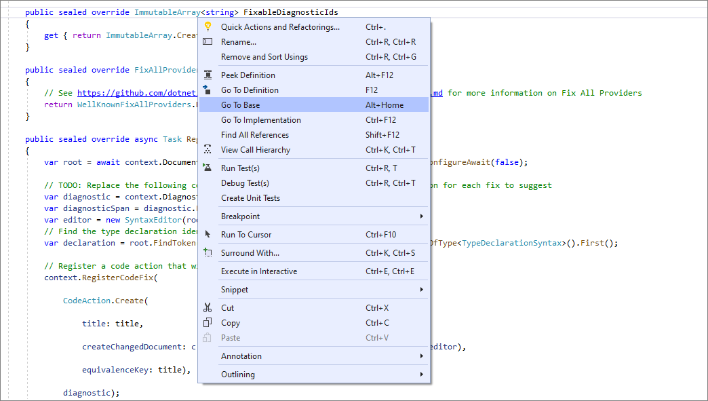
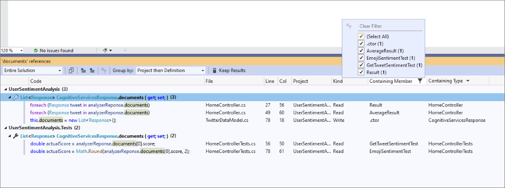
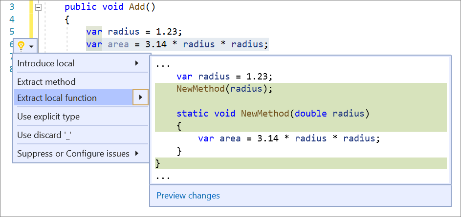
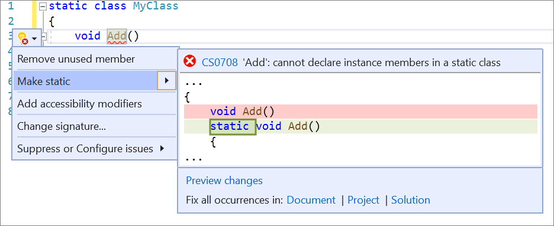
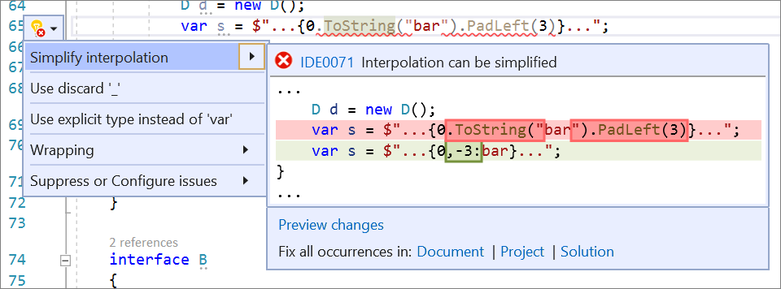
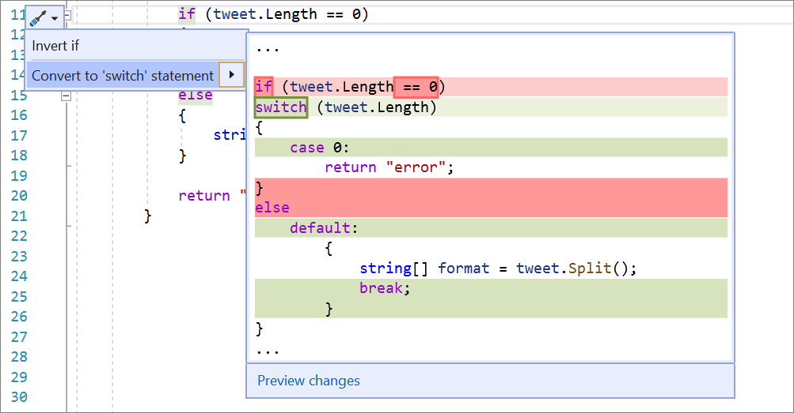
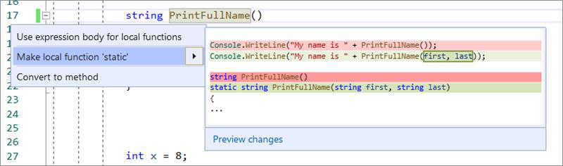
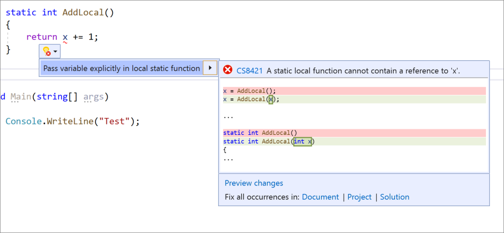
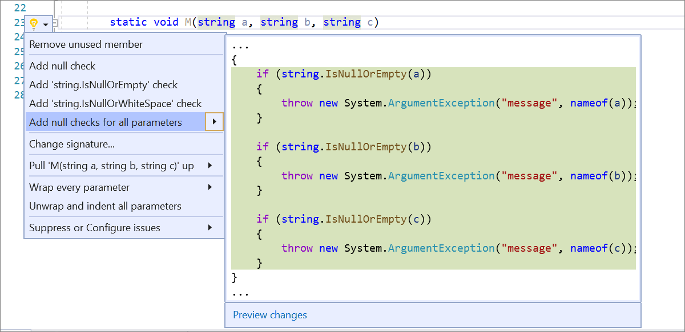
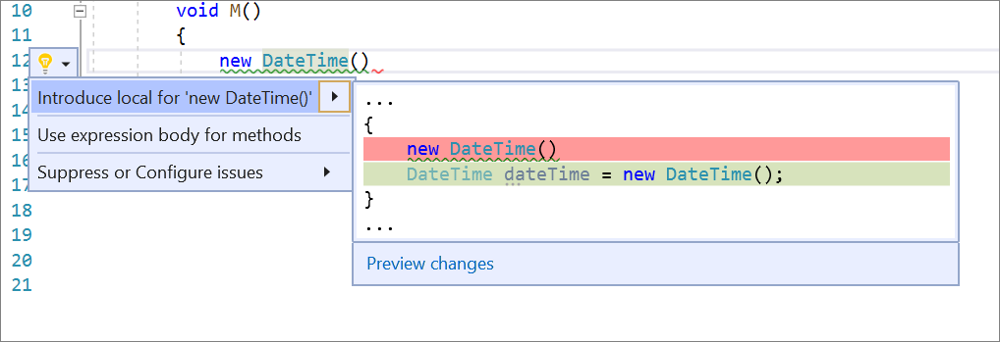

# Catch up on the latest .NET Productivity features

The Roslyn team continuously works to provide tooling that deeply understands the code you are writing in-order to help you be more productive. In this post, I'll cover some of the latest .NET Productivity features available in [Visual Studio 2019](https://visualstudio.microsoft.com/downloads/).

## Tooling improvements

The feature that I'm most excited about is the new [Go To Base](https://docs.microsoft.com/visualstudio/ide/navigating-code#go-to-base) command. Go To Base allows you to easily navigate up the inheritance chain. The command is available on the context (right-click) menu of the element that you want to navigate the inheritance hierarchy. Or you can press **Alt+Home**.

**Find All References** now categorizes the results by type and member. You can group by type and member in the **Find All References** window.

## Code fixes and refactorings

Code fixes and refactorings are the code suggestions the compiler provides through the light bulb and screwdriver icons. To trigger the **Quick Actions and Refactorings** menu, press (**Ctrl**+**.**) or (**Alt**+**Enter**). The following list shows the code fixes and refactorings that are new in Visual Studio 2019:

* The [extract local function](https://docs.microsoft.com/visualstudio/ide/reference/extract-local-function) refactoring allows you to turn a fragment of code from an existing method into a local function. Highlight the code that you want extracted. Press **Ctrl**+**.** to trigger the **Quick Actions and Refactorings** menu and select **Extract local function**

    

* The [make members static](https://docs.microsoft.com/visualstudio/ide/reference/make-member-static) code fix helps improve readability by making a non-static member static. Place your cursor on the member name. Press **Ctrl**+**.** to trigger the **Quick Actions and Refactorings** menu and select **Make static**.

    

* The [simplify string interpolation](https://docs.microsoft.com/visualstudio/ide/reference/simplify-string-interpolation) refactoring simplifies [string interpolations](https://docs.microsoft.com/dotnet/csharp/tutorials/string-interpolation) to be more legible and concise. Place your cursor on the string interpolation. Press **Ctrl**+**.** to trigger the **Quick Actions and Refactorings** menu and select **Simplify interpolation**.

    

* [The Convert if statements to switch statements or switch expressions](https://docs.microsoft.com/visualstudio/ide/reference/convert-if-statement-to-switch-statement-or-switch-expression) refactoring enables an easy transition between if statements and switch statements or expressions. Press **Ctrl**+**.** to trigger the **Quick Actions and Refactorings** menu and select **Convert to switch statement** or **Convert to switch expression**.

    

* The [make local function static](https://docs.microsoft.com/visualstudio/ide/reference/static-local-function-refactor-options#make-local-function-static) refactoring allows you to make a local function static and pass in variables defined outside the function to the function's declaration and calls. Place your cursor on the function name. Press **Ctrl**+**.** to trigger the **Quick Actions and Refactorings** menu and select **Make local function static**.

    

* The [pass variable explicitly in a local static function](https://docs.microsoft.com/visualstudio/ide/reference/static-local-function-refactor-options#pass-variable-explicitly-in-a-static-local-function) refactoring gives you flexibility to define variables outside a context, but still be able to pass them in as arguments to the static local function. Place your cursor on the variable within the static local function. Press **Ctrl** +**.** to trigger the **Quick Actions and Refactorings** menu and select **Pass variable explicitly in local static function**.

    

* The [add null checks for all parameters](https://docs.microsoft.com/visualstudio/ide/reference/add-null-checks-for-parameters) refactoring saves you time by automatically adding if statements that check the nullity of all the nullable, non-checked parameters. Place your cursor on any parameter within the method. Press **Ctrl**+**.** to trigger the **Quick Actions and Refactorings** menu and select **Add null checks for all parameters++.

    

* The [Introduce a local variable](https://docs.microsoft.com/visualstudio/ide/reference/introduce-local-variable) refactoring allows you to immediately generate a local variable to replace an existing expression. Highlight the expression that you want to assign to a new local variable. Press **Ctrl**+**.** to trigger the **Quick Actions and Refactorings** menu and select **Introduce local for**.

    

## Get involved

This was just a sneak peak of what's new in [Visual Studio 2019](https://visualstudio.microsoft.com/downloads/). For a complete list of what's new, see the [release notes](https://docs.microsoft.com/visualstudio/releases/2019/release-notes). And feel free to provide feedback on the [Developer Community](https://developercommunity.visualstudio.com/spaces/8/index.html) website, or using the [Report a Problem](https://docs.microsoft.com/visualstudio/ide/how-to-report-a-problem-with-visual-studio) tool in Visual Studio.
