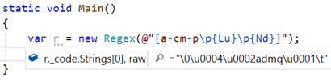
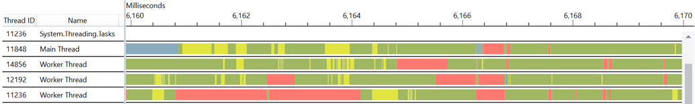
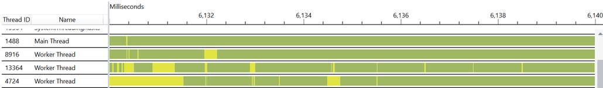
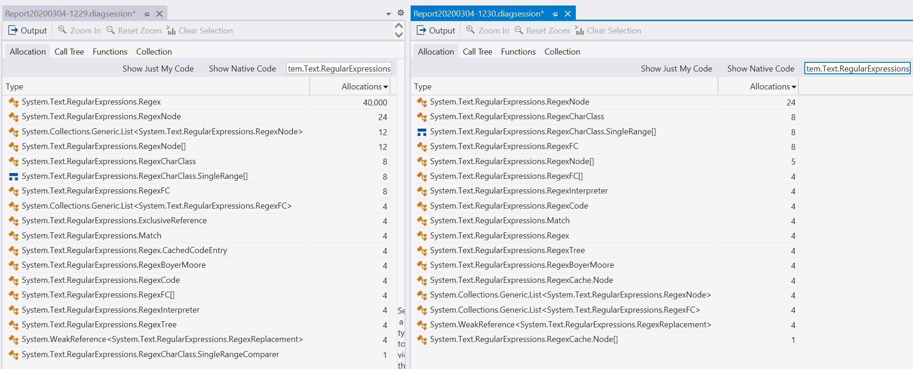

# Significant Regex Performance Improvements in .NET 5

The `System.Text.RegularExpressions` namespace has been in .NET for years, all the way back to .NET Framework 1.1.  It's used in hundreds of places within the .NET implementation itself, and directly by thousands upon thousands of applications.  It represents a significant source of CPU consumption.

However, from a performance perspective, `Regex` hasn't received a lot of love in the intervening years.  Its caching strategy was changed in .NET Framework 2.0 in the 2006 timeframe.  .NET Core 2.0 saw the return of the implementation behind `RegexOptions.Compiled` (in .NET Core 1.x the `RegexOptions.Compiled` option was a nop). .NET Core 3.0 benefited from some of `Regex`'s internals being updated to utilize `Span<T>` to improve memory utilization in certain scenarios.  And along the way, a few very welcome community contributions have improved targeted areas, such as with https://github.com/dotnet/corefx/pull/32899, which reduced accesses to `CultureInfo.CurrentCulture` when executing a `RegexOptions.Compiled | RegexOptions.IgnoreCase` expression.  But beyond that, the implementation has largely been what it was 15 years ago.

For .NET 5 (Preview 2 of which was released this week), we've invested in some significant improvements to the `Regex` engine.  On many of the expressions we've tried, these improvements routinely result in throughput improvements of 3-6x, and in some cases, much more. In this post, I'll walk through some of the myriad of changes that have gone into `System.Text.RegularExpressions` in .NET 5.  The changes have had measurable impact on our own uses, and we hope these improvements will result in measurable wins in your libraries and apps, as well.

## Regex Internals

To understand some of the changes made, it's helpful to understand some `Regex` internals.

The `Regex` constructor does all the work to take the regular expression pattern and prepare to match inputs against it:
- **`RegexParser`**. The pattern is fed into the internal `RegexParser` type, which understands the regular expression syntax and parses it into a node tree.  For example, the expression `a|bcd` gets translated into an alternation `RegexNode` with two child nodes, one that represents the single character `a` and one that represents the "multi" `bcd`.  The parser also does optimizations on the tree, translating one tree into another equivalent one that provides for a more efficient representation and/or that can be executed more efficiently.
- **`RegexWriter`**. The node tree isn't an ideal representation for performing a match, so the output of the parser is fed to the internal `RegexWriter` class, which writes out a compact series of opcodes that represent the instructions for performing a match.  The name of this type is "writer" because it "writes" out the opcodes; other engines often refer to this as "compilation", but the .NET engine uses different terminology because it reserves the "compilation" term for optional compilation to MSIL.
- **`RegexCompiler`** _(optional)_. If the `RegexOptions.Compiled` option isn't specified, then the opcodes output by `RegexWriter` are used by the internal `RegexInterpreter` class later at match time to interpret/execute the instructions to perform the match, and nothing further is required during `Regex` construction.  If, however, `RegexOptions.Compiled` is specified, then the constructor takes the previously output assets and feeds them into the internal `RegexCompiler` class.  `RegexCompiler` then uses reflection emit to generate MSIL that represents the work the interpreter would do, but specialized for this specific expression.  For example, when doing a comparison of a single character, the interpreter needs to check at match time whether `RegexOptions.IgnoreCase` was specified and thus whether to do a case-insensitive match; in contrast, `RegexCompiler` can do that check at compile time, and generate code specific to whether the option was or was not specified, so that the check doesn't need to continually be performed at execution time.  Reflection emit has multiple ways it can be employed, and `Regex` uses `DynamicMethod`, which enables emitting individual methods that can be garbage collected when no longer used.

Once the `Regex` has been constructed, it can be used for matching, via instance methods like `IsMatch`, `Match`, `Matches`, `Replace`, and `Split` (`Match` returns a `Match` object which then exposes a `NextMatch` method that enables iterating through the matches, lazily evaluated).  Those operations end up in a "scan" loop (some other engines refer to it as a "transmission" loop) that at its core essentially does the following:
```C#
while (FindFirstChar())
{
    Go();
    if (_match != null) return _match;
    _pos++;
}

return null;
```
Here, `_pos` is the current position we're at in the input.  The virtual `FindFirstChar` starts at `_pos` and looks for the first place in the input text that the regular expression could possibly match; this is not executing the full engine, but rather doing as efficient as possible a search to find the location at which it would be worthwhile running the full engine.  The better a job `FindFirstChar` can do at minimizing false positives and the faster it can find valid locations, the faster the expression will be processed.  If it doesn't find a good starting point, nothing will possibly match, so we're done.  If it does find a good starting point, it updates `_pos` and then it executes the engine at that found position, by invoking the virtual `Go`.  If `Go` doesn't find a match, we bump the current position and start over, but if `Go` does, it stores the match information and that data is returned. Obviously, the faster we can execute `Go`, the better.

All of this logic is in the public `RegexRunner` base class.  `RegexInterpreter` derives from `RegexRunner` and overrides both `FindFirstChar` and `Go` with implementations that interpret the regular expression, as represented by the opcodes generated by `RegexWriter`.  `RegexCompiler` uses `DynamicMethod`s to generate two methods, one for `FindFirstChar` and one for `Go`; delegates are created from these and are invoked from another type derived from `RegexRunner`.

## .NET 5 Improvements

For the rest of this post, we'll walk through various optimizations that have been made for `Regex` in .NET 5.  This is not an exhaustive list, but it highlights some of the most impactful changes.

### CharInClass

Regular expressions support "character classes", which define the set of characters that an input character should or should not match in order for that position to be considered a match.  Character classes are delineated with square brackets.  Here are some examples:
- `[abc]`. Matches `'a'`, `'b'`, or `'c'`.
- `[^\n]`. Matches anything _other_ than a line feed character.  (Unless `RegexOptions.Singleline` is specified, this is the exact character class you get from using `.` in an expression.)
- `[a-cx-z]`. Matches `'a'`, `'b'`, `'c'`, `'x'`, `'y'`, or `'z'`.
- `[\d\s\p{IsGreek}]`.  Matches any Unicode digit or white-space or Greek character. (This is an interesting difference from most other regular expression engines.  For example, in other engines, often `\d` by default maps to `[0-9]` and you can opt-in to it instead mapping to all Unicode digits, which is `[\p{Nd}]`, whereas in .NET you get the latter by default and using `RegexOptions.ECMAScript` opts-out to the former.)

When a pattern containing a character class is passed to the `Regex` constructor, part of the `RegexParser`'s job is to translate that character class into something it can more easily query at run-time.  The parser uses the internal `RegexCharClass` type to parse the character class and extract essentially three things (there's a bit more, but this is sufficient for this discussion):
1. Whether the pattern is negated
2. The sorted set of ranges of matching characters
3. The sorted set of Unicode categories of matching characters

This is all implementation detail, but that information is then persisted in a string which can be passed to the protected [`RegexRunner.CharInClass`](https://docs.microsoft.com/dotnet/api/system.text.regularexpressions.regexrunner.charinclass?view=netcore-3.1) method in order to determine whether a given `Char` is contained in the character class.



Prior to .NET 5, every single time a character needed to be matched against a character class, it would call that `CharInClass` method. `CharInClass` then does a binary search of the ranges to determine whether the specified character is stored in one, and if it's not, it gets the Unicode category of the target character and does a linear search of the Unicode categories to see if it's a match.  So, for an expression like `^\d*$` (which asserts that it's at the start of the line, then matches any number of Unicode digits, and then asserts it's at the end of the line), given an input of 1000 digits, this will make 1000 calls to `CharInClass`.  That adds up.

In .NET 5, we're now much smarter about how we do this, in particular when `RegexOptions.Compiled` is used, which in general is used any time a developer cares a lot about the throughput of a `Regex`.  One solution would be, for every character class, to maintain a lookup table that maps an input character to a yes/no decision about whether it's in the class or not.  While we could do that, a System.Char is a 16-bit value, which means, at one bit per character, we'd need an 8K lookup table for every character class, and that also adds up.  Instead, we first try to handle some common cases using existing functionality in the platform or otherwise simple math that makes matching fast.  For example, for `\d`, instead of generating a call to `RegexRunner.CharInClass(ch, charClassString)`, we now simply generate a call to `char.IsDigit(ch)`; `IsDigit` is already optimized with lookup tables, gets inlined, and performs very well.  Similarly for `\s`, we now generate a call to `char.IsWhitespace(ch)`.  For simple character classes that contain just a few characters, we'll just generate the direct comparisons, e.g. for `[az]` we'll generate the equivalent of `(ch == 'a') | (ch == 'z')`.  And for simple character classes that contain just a single range, we'll generate the check with a single subtraction and comparison, e.g. `[a-z]` results in `(uint)ch - 'a' <= 26`, and `[^0-9]` results in `!((uint)c - '0' <= 10)`.  We'll also special-case other common specifications; for example, if the entire character class is a single Unicode category, we'll just generate a call to `char.GetUnicodeInfo` (which also has a fast lookup table) and do the comparison, e.g. `[\p{Lu}]` becomes `char.GetUnicodeInfo(c) == UnicodeCategory.UppercaseLetter`.

Of course, while that covers a large number of common cases, it certainly doesn't cover them all.  And just because we don't want to generate an 8K lookup table for every character class doesn't mean we can't generate a lookup table at all.  Instead, if we don't hit one of these common cases, we do generate a lookup table, but just for ASCII, which only requires 16 bytes (128 bits), and which tends to be a very good compromise given typical inputs in regex-based scenarios.  Since we're generating methods using `DynamicMethod`, we don't easily have the ability to store additional data in the static data portion of the assembly, but what we can do is utilize constant strings as a data store; MSIL has opcodes for loading constant strings, and reflection emit has good support for generating such instructions.  So, for each lookup table, we can simply create the 8-character string we need, fill it with the opaque bitmap data, and spit that out with `ldstr` in the IL.  We can then treat it as we would any other bitmap, e.g. to determine whether a given char `ch` matches, we generate the equivalent of this:
```C#
bool result = ch < 128 ? (lookup[c >> 4] & (1 << (c & 0xF))) != 0 : NonAsciiFallback;
```
In words, we use the top three bits of the character to select the 0th through 7th char in the lookup table string, and then use the bottom four bits as an index into the 16-bit value at that location; if it's a 1, we matched, if it's not, we didn't.  For characters then `>= 128`, we need a fallback, and that fallback can be a variety of things based on some analysis performed on the character class.  Worst case, the fallback is just the call to `RegexRunner.CharInClass` we would have otherwise made, but we can often do better.  For example, it's common that we can tell from the input pattern that all possible matches will be `< 128`, in which case we don't need a fallback at all, e.g. for the character class `[0-9a-fA-F]` (aka hexadecimal), we'll instead generate the equivalent of:
```C#
bool result = ch < 128 && (lookup[c >> 4] & (1 << (c & 0xF))) != 0;
```
Conversely, we may be able to determine that every character above 127 is going to match.  For example, the character class `[^aeiou]` (everything other than ASCII lowercase vowels) will instead result in code equivalent to:
```C#
bool result = ch >= 128 || (lookup[c >> 4] & (1 << (c & 0xF))) != 0;
```
And so on.

All of the above is for `RegexOptions.Compiled`, but interpreted expressions aren't left out in the cold. For interpreted expressions, we currently generate a similar lookup table, but we do so lazily, populating the table for a given input character the first time we see it, and then storing that answer for all future evaluations of that character against that character class.  (We might revisit how we do this, but this is how things exist as of .NET 5 Preview 2.)

The net result of this can be significant throughput gains on expressions that evaluate character classes frequently.  For example, here's a microbenchmark that's matching ASCII letters and digits against an input with 62 such values:
```C#
using BenchmarkDotNet.Attributes;
using BenchmarkDotNet.Running;
using System.Text.RegularExpressions;

public class Program
{
    static void Main(string[] args) => BenchmarkSwitcher.FromAssemblies(new[] { typeof(Program).Assembly }).Run(args);

    private Regex _regex = new Regex("[a-zA-Z0-9]*", RegexOptions.Compiled);

    [Benchmark] public bool IsMatch() => _regex.IsMatch("abcdefghijklmnopqrstuvwxyz123456789ABCDEFGHIJKLMNOPQRSTUVWXYZ");
}
```
And here's my project file:
```xml
<Project Sdk="Microsoft.NET.Sdk">

  <PropertyGroup>
    <LangVersion>preview</LangVersion>
    <OutputType>Exe</OutputType>
    <TargetFrameworks>netcoreapp5.0;netcoreapp3.1</TargetFrameworks>
  </PropertyGroup>

  <ItemGroup>
    <PackageReference Include="benchmarkdotnet" Version="0.12.0.1229" />
  </ItemGroup>

</Project>
```
On my machine, I have two directories, one containing .NET Core 3.1 and one containing a build of .NET 5 (what's labeled here as `master`, since it's a build of the `master` branch from `dotnet/runtime`).  When I execute the above with:
```
dotnet run -c Release -f netcoreapp3.1 --filter ** --corerun d:\coreclrtest\netcore31\corerun.exe d:\coreclrtest\master\corerun.exe
```
to run the benchmark against both builds, I get these results:

|  Method |              Toolchain |     Mean |   Error |  StdDev | Ratio |
|-------- |----------------------- |---------:|--------:|--------:|------:|
| IsMatch |    \master\corerun.exe | 102.3 ns | 1.33 ns | 1.24 ns |  0.17 |
| IsMatch | \netcore31\corerun.exe | 585.7 ns | 2.80 ns | 2.49 ns |  1.00 |

### Codegen Like a Dev Might Write

As mentioned, when `RegexOptions.Compiled` is used with a `Regex`, we use reflection emit to generate two methods for it, one to implement `FindFirstChar` and one to implement `Go`.  To support the possibility of backtracking, `Go` ends up containing a lot of code that often isn't necessary.  The code is also generated in a way that often includes unnecessary field reads and writes, that incurs bounds checking the JIT is unable to eliminate, and so on.  In .NET 5, we've improved the code generated for many expressions.

Consider the expression `@"a\sb"`, which matches an `'a'`, any Unicode whitespace, and a `'b'`.  Previously, decompiling the IL emitted for `Go` would look something like this:
```C#
public override void Go()
{
    string runtext = base.runtext;
    int runtextstart = base.runtextstart;
    int runtextbeg = base.runtextbeg;
    int runtextend = base.runtextend;
    int num = runtextpos;
    int[] runtrack = base.runtrack;
    int runtrackpos = base.runtrackpos;
    int[] runstack = base.runstack;
    int runstackpos = base.runstackpos;
    CheckTimeout();
    runtrack[--runtrackpos] = num;
    runtrack[--runtrackpos] = 0;
    CheckTimeout();
    runstack[--runstackpos] = num;
    runtrack[--runtrackpos] = 1;
    CheckTimeout();
    if (num < runtextend && runtext[num++] == 'a')
    {
        CheckTimeout();
        if (num < runtextend && RegexRunner.CharInClass(runtext[num++], "\0\0\u0001d"))
        {
            CheckTimeout();
            if (num < runtextend && runtext[num++] == 'b')
            {
                CheckTimeout();
                int num2 = runstack[runstackpos++];
                Capture(0, num2, num);
                runtrack[--runtrackpos] = num2;
                runtrack[--runtrackpos] = 2;
                goto IL_0131;
            }
        }
    }
    while (true)
    {
        base.runtrackpos = runtrackpos;
        base.runstackpos = runstackpos;
        EnsureStorage();
        runtrackpos = base.runtrackpos;
        runstackpos = base.runstackpos;
        runtrack = base.runtrack;
        runstack = base.runstack;
        switch (runtrack[runtrackpos++])
        {
        case 1:
            CheckTimeout();
            runstackpos++;
            continue;
        case 2:
            CheckTimeout();
            runstack[--runstackpos] = runtrack[runtrackpos++];
            Uncapture();
            continue;
        }
        break;
    }
    CheckTimeout();
    num = runtrack[runtrackpos++];
    goto IL_0131;
    IL_0131:
    CheckTimeout();
    runtextpos = num;
}
```
There's a whole lot of stuff there, and it requires some squinting and searching to see the core of the implementation as just a few lines in the middle of the method.  Now in .NET 5, that same expression results in this code being generated:
```C#
protected override void Go()
{
    string runtext = base.runtext;
    int runtextend = base.runtextend;
    int runtextpos;
    int start = runtextpos = base.runtextpos;
    ReadOnlySpan<char> readOnlySpan = runtext.AsSpan(runtextpos, runtextend - runtextpos);
    if (0u < (uint)readOnlySpan.Length && readOnlySpan[0] == 'a' &&
        1u < (uint)readOnlySpan.Length && char.IsWhiteSpace(readOnlySpan[1]) &&
        2u < (uint)readOnlySpan.Length && readOnlySpan[2] == 'b')
    {
        Capture(0, start, base.runtextpos = runtextpos + 3);
    }
}
```
If you're anything like me, you look at the first version and your eyes glaze over, but if you look at the second, you can actually read and understand what it's doing.  Beyond being understandable and more easily debugged, it's also less code to be executed, does better with bounds check eliminations, reads and writes fields and arrays less, and so on.  The net result of this is it also executes much faster. (There's some further possibility for improvements here, such as removing two length checks, potentially reordering some of the checks, but overall it's a vast improvement over what was there before.)

### Span-based Searching with Vectorized Methods

Regular expressions are all about searching for stuff.  As a result, we often find ourselves running loops looking for various things.  For example, consider the expression `hello.*world`.  Previously if you were to decompile the code we generate in the `Go` method for matching the `.*`, it would look something like this:
```C#
while (--num3 > 0)
{
    if (runtext[num++] == '\n')
    {
        num--;
        break;
    }
}
```
In other words, we're manually iterating through the input text string looking character by character for `\n` (remember that by default a `.` means "anything other than `\n`", so `.*` means "match everything until you find `\n`").  But, .NET has long had methods that do exactly such searches, like `IndexOf`, and as of recent releases, `IndexOf` is vectorized such that it can compare multiple characters at the same time rather than just looking at each individually.  Now in .NET 5, instead of generating code like the above, we end up with code like this:
```C#
num2 = runtext.AsSpan(runtextpos, num).IndexOf('\n');
```
Using `IndexOf` rather than generating our own loop then means that such searches in `Regex` are implicitly vectorized, and any improvements to such implementations also accrue here.  It also means the generated code is simpler.

The impact of this can be seen with a benchmark like this:
```C#
using BenchmarkDotNet.Attributes;
using BenchmarkDotNet.Running;
using System.Text.RegularExpressions;

public class Program
{
    static void Main(string[] args) => BenchmarkSwitcher.FromAssemblies(new[] { typeof(Program).Assembly }).Run(args);

    private Regex _regex = new Regex("hello.*world", RegexOptions.Compiled);

    [Benchmark] public bool IsMatch() => _regex.IsMatch("hello.  this is a test to see if it's able to find something more quickly in the world.");
}
```
Even for an input string that's not particularly large, this has a measurable impact:

|  Method |              Toolchain |      Mean |    Error |   StdDev | Ratio |
|-------- |----------------------- |----------:|---------:|---------:|------:|
| IsMatch |    \master\corerun.exe |  71.03 ns | 0.308 ns | 0.257 ns |  0.47 |
| IsMatch | \netcore31\corerun.exe | 149.80 ns | 0.913 ns | 0.809 ns |  1.00 |

`IndexOfAny` also ends up being a significant work-horse in .NET 5's implementation, especially for `FindFirstChar` implementations.  One of the existing optimizations the .NET `Regex` implementation employs is an analysis for what are all of the possible characters that could start an expression; that produces a character class, which `FindFirstChar` then uses to generate a search for the next location that could start a match.  This can be seen by looking at a decompiled version of the generated code for the expression `([ab]cd|ef[g-i])jklm`.  A valid match to this expression can begin with only `'a'`, `'b'`, or `'e'`, and so the optimizer generates a character class `[abe]` which `FindFirstChar` then uses:
```C#
public override bool FindFirstChar()
{
    int num = runtextpos;
    string runtext = base.runtext;
    int num2 = runtextend - num;
    if (num2 > 0)
    {
        int result;
        while (true)
        {
            num2--;
            if (!RegexRunner.CharInClass(runtext[num++], "\0\u0004\0acef"))
            {
                if (num2 <= 0)
                {
                    result = 0;
                    break;
                }
                continue;
            }
            num--;
            result = 1;
            break;
        }
        runtextpos = num;
        return (byte)result != 0;
    }
    return false;
}
```
A few things to note here:
- We can see each character is evaluated via `CharInClass`, as discussed earlier.  And we can see the string passed to `CharInClass` is the generated internal and searchable representation of that class (the first character says there's no negation, the second character says there are four characters used to represent ranges, the third characters says there are no Unicode categories, and then the next four characters represent two ranges, with an inclusive lower-bound and an exclusive upper-bound).
- We can see that we evaluate each character individually, rather than being able to evaluate multiple characters together.
- We only look at the first character, and if it's a match, we exit out to allow the engine to execute in full for `Go`.

In .NET 5 Preview 2, we instead now generate this:
```C#
protected override bool FindFirstChar()
{
    int runtextpos = base.runtextpos;
    int runtextend = base.runtextend;
    if (runtextpos <= runtextend - 7)
    {
        ReadOnlySpan<char> readOnlySpan = runtext.AsSpan(runtextpos, runtextend - runtextpos);
        for (int num = 0; num < readOnlySpan.Length - 2; num++)
        {
            int num2 = readOnlySpan.Slice(num).IndexOfAny('a', 'b', 'e');
            num = num2 + num;
            if (num2 < 0 || readOnlySpan.Length - 2 <= num)
            {
                break;
            }
            int num3 = readOnlySpan[num + 1];
            if ((num3 == 'c') | (num3 == 'f'))
            {
                num3 = readOnlySpan[num + 2];
                if (num3 < 128 && ("\0\0\0\0\0\0ΐ\0"[num3 >> 4] & (1 << (num3 & 0xF))) != 0)
                {
                    base.runtextpos = runtextpos + num;
                    return true;
                }
            }
        }
    }
    base.runtextpos = runtextend;
    return false;
}
```
Some interesting things to note here:
- We now use `IndexOfAny` to do the search for the three target characters.  `IndexOfAny` is vectorized, so it can take advantage of SIMD instructions to compare multiple characters at once, and any future improvements we make to further optimize `IndexOfAny` will accrue to such `FindFirstChar` implementations implicitly.
- If `IndexOfAny` finds a match, we don't just immediately return in order to give `Go` a chance to execute.  We instead do some fast checks on the next few characters to increase the likelihood that this is actually a match.  In the original expression, you can see that the only possible values that could match the second character are `'c'` and `'f'`, so the implementation does a fast comparison check for those.  And you can see that the third character has to match either `'d'` or `[g-i]`, so the implementation combines those into a single character class `[dg-i]`, which is then evaluate using a bitmap.  Both of those latter character checks highlight the improved codegen that we now emit for character classes.

We can see the potential impact of this in a test like this:
```C#
using BenchmarkDotNet.Attributes;
using BenchmarkDotNet.Running;
using System;
using System.Linq;
using System.Text.RegularExpressions;

public class Program
{
    static void Main(string[] args) => BenchmarkSwitcher.FromAssemblies(new[] { typeof(Program).Assembly }).Run(args);

    private static Random s_rand = new Random(42);

    private Regex _regex = new Regex("([ab]cd|ef[g-i])jklm", RegexOptions.Compiled);
    private string _input = string.Concat(Enumerable.Range(0, 1000).Select(_ => (char)('a' + s_rand.Next(26))));

    [Benchmark] public bool IsMatch() => _regex.IsMatch(_input);
}
```
which on my machine yields the results:

|  Method |              Toolchain |      Mean |     Error |    StdDev | Ratio |
|-------- |----------------------- |----------:|----------:|----------:|------:|
| IsMatch |    \master\corerun.exe |  1.084 us | 0.0068 us | 0.0061 us |  0.08 |
| IsMatch | \netcore31\corerun.exe | 14.235 us | 0.0620 us | 0.0550 us |  1.00 |

The previous code difference also highlights another interesting improvement, specifically the difference between the old code's `int num2 = runtextend - num; if (num2 > 0)` and the new code's `if (runtextpos <= runtextend - 7)`. As mentioned earlier, the `RegexParser` parses the input pattern into a node tree, over which analysis and optimizations are performed.  .NET 5 includes a variety of new analyses, some simple, some more complex.  One of the more simpler examples is the parser will now do a quick scan of the expression to determine if there's a minimum length that any input would have to be in order to match.  Consider the expression `[0-9]{3}-[0-9]{2}-[0-9]{4}`, which might be used to match a United States social security number (three ASCII digits, a dash, two ASCII digits, a dash, four ASCII digits).  We can easily see that any valid match for this pattern would require at least 11 characters; if we were provided with an input that was 10 or fewer, or if we got to within 10 characters of the end of the input without having found a match, we could immediately fail the match without proceeding further, because there's no possible way it would match.
```C#
using BenchmarkDotNet.Attributes;
using BenchmarkDotNet.Diagnosers;
using BenchmarkDotNet.Running;
using System.Text.RegularExpressions;

public class Program
{
    static void Main(string[] args) => BenchmarkSwitcher.FromAssemblies(new[] { typeof(Program).Assembly }).Run(args);

    private readonly Regex _regex = new Regex("[0-9]{3}-[0-9]{2}-[0-9]{4}", RegexOptions.Compiled);

    [Benchmark] public bool IsMatch() => _regex.IsMatch("123-45-678");
}
```

|  Method |              Toolchain |      Mean |    Error |   StdDev | Ratio |
|-------- |----------------------- |----------:|---------:|---------:|------:|
| IsMatch |    \master\corerun.exe |  19.39 ns | 0.148 ns | 0.139 ns |  0.04 |
| IsMatch | \netcore31\corerun.exe | 459.86 ns | 1.893 ns | 1.771 ns |  1.00 |


### Backtracking Elimination

The .NET `Regex` implementation currently employs a backtracking engine.  Such an implementation can support a variety of features that can't easily or efficiently be supported by [DFA-based engines](https://docs.microsoft.com/dotnet/standard/base-types/details-of-regular-expression-behavior#benefits-of-the-nfa-engine), such as backreferences, and it can be very efficient in terms of memory utilization as well as in throughput for common cases.  However, backtracking has a significant downside that it can lead to degenerate cases where matching takes exponential time in the length of the input.  This is why the .NET `Regex` class exposes the ability to set a [timeout](https://docs.microsoft.com/dotnet/api/system.text.regularexpressions.regex.-ctor?view=netcore-3.1#System_Text_RegularExpressions_Regex__ctor_System_String_System_Text_RegularExpressions_RegexOptions_System_TimeSpan_), so that runaway matching can be interrupted by an exception.

The [.NET documentation](https://docs.microsoft.com/dotnet/standard/base-types/backtracking-in-regular-expressions) has more details, but suffice it to say, it's up to the developer to write regular expressions in a way that are not subject to excessive backtracking.  One of the ways to do this is to employ "atomic groups", which tell the engine that once the group has matched, the implementation must not backtrack into it, and it's generally used when such backtracking won't be beneficial.  Consider an example expression `a+b` matched against the input `aaaa`:
- The `Go` engine starts matching `a+`.  This operation is greedy, so it matches the first `a`, then the `aa`, then the `aaa`, and then the `aaaa`.  It then sees it's at the end of the input.
- There's no `b` to match, so the engine backtracks 1, with the `a+` now matching `aaa`.
- There's still no `b` to match, so the engine backtracks 1, with the `a+` now matching `aa`.
- There's still no `b` to match, so the engine backtracks 1, with the `a+` now matching `a`.
- There's still no `b` to match, and `a+` requires at least 1 a, so the match fails.

But, all of that backtracking was provably unnecessary.  There's nothing the `a+` could match that the `b` could have also matched, so no amount of backtracking here would be fruitful.  Seeing that, the developer could instead use the expression `(?>a+)b`.  That `(?>` and `)` are the start and end of an atomic group, which says that once that group has matched and the engine moves past the group, it must not backtrack back into it.  With our previous example of matching against `aaaa` then, this would happen instead:
- The `Go` engine starts matching `a+`.  This operation is greedy, so it matches the first `a`, then the `aa`, then the `aaa`, and then the `aaaa`.  It then sees it's at the end of the input.
- There's no `b` to match, so the match fails.

Much shorter, and this is just a simple example.  So, a developer can do this analysis themselves and find places to manually insert atomic groups, but really, how many developers know or think to do that?

Instead, .NET 5 now analyzes regular expressions as part of the node tree optimization phase, adding atomic groups where it sees that they won't make a semantic difference but could help to avoid backtracking.  For example:
- `a+b` will become `(?>a+)b`, as there's nothing `a+` can "give back" that'll match `b`
- `\d+\s*` will become `(?>\d+)(?>\s*)`, as there's nothing that could match `\d` that could also match `\s`, and `\s` is at the end of the expression.
- `a*([xyz]|hello)` will become `(?>a*)([xyz]|hello)`, as in a successful match `a` could be followed by `x`, by `y`, by `z`, or by `h`, and there's no overlap with any of those.

This is just one example of tree rewriting that .NET 5 will now perform.  It'll do other rewrites, in part with a goal of eliminating backtracking.  For example, it'll now coalesce various forms of loops that are adjacent to each other.  Consider the degenerate example `a*a*a*a*a*a*a*b`.  In .NET 5, this will now be rewritten to just be the functionally equivalent `a*b`, which per the previous discussion will then further be rewritten as `(?>a*)b`.  That turns a potentially very expensive execution into one with linear execution time.  It's almost pointless showing an example benchmark, as we're dealing with different algorithmic complexities, but I'll do it any way, just for fun:
```C#
using BenchmarkDotNet.Attributes;
using BenchmarkDotNet.Running;
using System.Text.RegularExpressions;

public class Program
{
    static void Main(string[] args) => BenchmarkSwitcher.FromAssemblies(new[] { typeof(Program).Assembly }).Run(args);

    private Regex _regex = new Regex("a*a*a*a*a*a*a*b", RegexOptions.Compiled);

    [Benchmark] public bool IsMatch() => _regex.IsMatch("aaaaaaaaaaaaaaaaaaaaa");
}
```

|  Method |              Toolchain |            Mean |         Error |        StdDev | Ratio |
|-------- |----------------------- |----------------:|--------------:|--------------:|------:|
| IsMatch |    \master\corerun.exe |        379.2 ns |       2.52 ns |       2.36 ns | 0.000 |
| IsMatch | \netcore31\corerun.exe | 22,367,426.9 ns | 123,981.09 ns | 115,971.99 ns | 1.000 |

Backtracking reduction isn't limited just to loops.  Alternations represent another source of backtracking, as the implementation will match in a manner similar to how you might if you were matching by hand: try one alternation branch and proceed as far as you can, and then if the match fails, go back and try the next branch, and so on.  Thus, reduction of backtracking from alternations is also useful.

One such rewrite now performed has to do with alternation prefix factoring.  Consider the expression `what is (?:this|that)` evaluated against the text `what is it`.  The engine will match the `what is `, and will then try to match `it` against `this`; it won't match, so it'll backtrack and try to match `it` against `that`.  But both branches of the alternation begin with `th`.  If we instead factor that out, and rewrite the expression to be `what is th(?:is|at)`, we can now avoid the backtracking.  The engine will match the `what is `, will try to match the `th` against the `it`, will fail, and that's it.

This optimization also ends up exposing more text to an existing optimization used by `FindFirstChar`.  If there are multiple fixed characters at the beginning of the pattern, `FindFirstChar` will use a Boyer-Moore implementation to find that text in the input string.  The larger the pattern exposed to the Boyer-Moore algorithm, the better it can do at quickly finding a match and minimizing false positives that would cause `FindFirstChar` to exit to the `Go` engine.  By pulling text out of such an alternation, we increase the amount of text available in this case to Boyer-Moore.

As another related example, .NET 5 now finds cases where the expression can be implicitly anchored even if the developer didn't specify to do so, which can also help with backtracking elimination.  Consider the example `.*hello` with the input `abcdefghijk`.  The implementation will start at position 0 and evaluate the expression at that point.  Doing so will match the whole string `abcdefghijk` against the `.*`, and will then backtrack from there to try to match the `hello`, which it will fail to do.  The engine will fail the match, and we'll then bump to the next position.  The engine will then match the rest of the string `bcdefghijk` against the `.*`, and will then backtrack from there to try to match the `hello`, which it will again fail to do.  And so on.  The observation to make here is that such retries by bumping to the next position are generally not going to be successful, and the expression can be implicitly anchored to only match at the beginning of lines.  That then enables `FindFirstChar` to skip positions that can't possibly match and avoid the attempted engine match at those locations.
```C#
using BenchmarkDotNet.Attributes;
using BenchmarkDotNet.Diagnosers;
using BenchmarkDotNet.Running;
using System.Text.RegularExpressions;

public class Program
{
    static void Main(string[] args) => BenchmarkSwitcher.FromAssemblies(new[] { typeof(Program).Assembly }).Run(args);

    private readonly Regex _regex = new Regex(@".*text", RegexOptions.Compiled);

    [Benchmark] public bool IsMatch() => _regex.IsMatch("This is a test.\nDoes it match this?\nWhat about this text?");
}
```

|  Method |              Toolchain |       Mean |    Error |   StdDev | Ratio |
|-------- |----------------------- |-----------:|---------:|---------:|------:|
| IsMatch |    \master\corerun.exe |   644.1 ns |  3.63 ns |  3.39 ns |  0.21 |
| IsMatch | \netcore31\corerun.exe | 3,024.9 ns | 22.66 ns | 20.09 ns |  1.00 |

### Regex.* static methods and concurrency

The `Regex` class exposes both instance and static methods.  The static methods are primarily intended as a convenience, as under the covers they still need to use and operate on a `Regex` instance.  The implementation could instantiate a new `Regex` and go through the full parsing/optimization/codegen routine each time one of these static methods was used, but in some scenarios that would be an egregious waste of time and space.  Instead, `Regex` maintains a cache of the last few `Regex` objects used, indexed by everything that makes them unique, e.g. the pattern, the `RegexOptions`, even the current culture (since that can impact `IgnoreCase` matching).  This cache is limited in size, capped at `Regex.CacheSize`, and thus the implementation employs a least recently used (LRU) cache: when the cache is full and another `Regex` needs to be added, the implementation throws away the least recently used item in the cache.

One simple way to implement such an LRU cache is with a linked list: every time an item is accessed, it's removed from the list and added back to the front.  Such an approach, however, has a big downside, in particular in a concurrent world: synchronization.  If every read is actually a mutation, we need to ensure that concurrent reads, and thus concurrent mutations, don't corrupt the list.  Such a list is exactly what previous releases of .NET employed, and a global lock was used to protect it.  In .NET Core 2.1, a nice change submitted by a community member improved this for some scenarios by making it possible to access the most recently used item lock-free, which improved throughput and scalability for workloads where the same `Regex` was used via the static methods repeatedly.  For other cases, however, the implementation still locked on every usage.

It's possible to see the impact of this locking by looking at a tool like the Concurrency Visualizer, which is an extension to Visual Studio available in its extensions gallery.  By running a sample app like this under the profiler:
```C#
using System.Text.RegularExpressions;
using System.Threading.Tasks;

class Program
{
    static void Main()
    {
        Parallel.Invoke(
            () => { while (true) Regex.IsMatch("abc", "^abc$"); },
            () => { while (true) Regex.IsMatch("def", "^def$"); },
            () => { while (true) Regex.IsMatch("ghi", "^ghi$"); },
            () => { while (true) Regex.IsMatch("jkl", "^jkl$"); });
    }
}
```
we can see images like this:



Each row is a thread doing work as part of this `Parallel.Invoke`.  Areas in green are when the thread is actually executing code.  Areas in yellow are when the thread has been pre-empted by the operating system because it needed the core to run another thread.  Areas in red are when the thread is blocked waiting for something.  In this case, all that red is because threads are waiting on that shared global lock in the `Regex` cache.

With .NET 5, the picture instead looks like this:



Notice, no more red.  This is because the cache has been re-written to be entirely lock-free for reads; the only time a lock is taken is when a new `Regex` is added to the cache, but even while that's happening, other threads can proceed to read instances from the cache and use them.  This means that as long as `Regex.CacheSize` is properly sized for an app and its typical usage of the `Regex` static methods, such accesses will no longer incur the kinds of delays they did in the past. As of today, the value defaults to 15, but the property has a setter so that it can be changed to better suit an app's needs.

Allocation for the static methods has also been improved, by changing exactly what is cached so as to avoid allocating unnecessary wrapper objects.  We can see this with a modified version of the previous example:
```C#
using System.Text.RegularExpressions;
using System.Threading.Tasks;

class Program
{
    static void Main()
    {
        Parallel.Invoke(
            () => { for (int i = 0; i < 10_000; i++) Regex.IsMatch("abc", "^abc$"); },
            () => { for (int i = 0; i < 10_000; i++) Regex.IsMatch("def", "^def$"); },
            () => { for (int i = 0; i < 10_000; i++) Regex.IsMatch("ghi", "^ghi$"); },
            () => { for (int i = 0; i < 10_000; i++) Regex.IsMatch("jkl", "^jkl$"); });
    }
}
```
and running it with the [.NET Object Allocation Tracking](https://docs.microsoft.com/visualstudio/profiling/dotnet-alloc-tool) tool in Visual Studio.  On the left is .NET Core 3.1, and on the right is .NET 5 Preview 2:

In particular, note the line containing 40,000 allocations on the left that's instead only 4 on the right.

### Other Overhead Reduction

We've walked through some of the key improvements that have gone into regular expressions in .NET 5, but the list is by no means complete.  There is a laundry list of smaller optimizations that have been made all over the place, and while we can't enumerate them all here, we can walk through a few more.

In some places, we've utilized forms of vectorization beyond what was discussed previously.  For example, when `RegexOptions.Compiled` is used and the pattern contains a string of characters, the compiler emits a check for each character individually.  You can see this if you look at the decompiled code for an expression like `abcd`, which would previously result in code something like this:
```C#  
if (4 <= runtextend - runtextpos &&
    runtext[runtextpos] == 'a' &&
    runtext[runtextpos + 1] == 'b' &&
    runtext[runtextpos + 2] == 'c' &&
    runtext[runtextpos + 3] == 'd')
```
In .NET 5, when using `DynamicMethod` to create the compiled code, we now instead try to compare `Int64` values (on a 64-bit system, or `Int32`s on a 32-bit system), rather than comparing individually `Char`s.  That means for the previous example we'll instead now generate code akin to this:
```C#
if (3u < (uint)readOnlySpan.Length &&
    *(long*)readOnlySpan._pointer == 28147922879250529L)
```
(I say "akin to", because we can't represent in C# the exact IL that's generated, which is more aligned with using members of the `Unsafe` type.).  We don't need to worry about endianness issues here, because the code generating the `Int64`/`Int32` values used for comparison is happening on the same machine (and even in the same process) as the one loading the input values for comparison.

Another example is something that was actually shown earlier in a previous generated code sample, but glossed over.  You may have noticed earlier on when comparing the outputs for the `@"a\sb"` expression that the previous code contained calls to `CheckTimeout()` but the new code did not.  This `CheckTimeout()` function is used to check whether our execution time has exceeded what's allowed by the timeout value provided to the `Regex` when it was constructed.  But the default timeout used when no timeout is provided is "infinite", and thus "infinite" is a very common value.  Since we will never exceed an infinite timeout, when we compile the code for a `RegexOptions.Compiled` regular expression, we check the timeout, and if it's infinite, we skip generating these `CheckTimeout()` calls.

Similar optimizations exist in other places.  For example, by default `Regex` does case-sensitive comparisons.  Only if `RegexOptions.IgnoreCase` is specified (or if the expression itself contains instructions to perform case-insensitive matches) are case-insensitive comparisons used, and only if case-insensitive comparisons are used do we need to access `CultureInfo.CurrentCulture` in order to determine how to perform that comparison.  Further, if `RegexOptions.InvariantCulture` is specified, we also don't need to access `CultureInfo.CurrentCulture`, because it'll never be used.  All of this means we can avoid generating the code that accesses `CultureInfo.CurrentCulture` if we prove that it'll never be needed.  On top of that, we can make `RegexOptions.InvariantCulture` faster by emitting calls to `char.ToLowerInvariant` rather than `char.ToLower(CultureInfo.InvariantCulture)`, especially since `ToLowerInvariant` has also been improved in .NET 5 (yet another example where by changing `Regex` to use other framework functionality, it implicitly benefits any time we improve those utilized functions).

Another interesting change was to `Regex.Replace` and `Regex.Split`.  These methods were implemented as wrappers around `Regex.Match`, layering their functionality on top of it.  That, however, meant that every time a match was found, we would exit the scan loop, work our way back up through the various layers of abstraction, perform the work on the match, and then call back into the engine, work our way back down to the scan loop, and so on.  On top of that, each match would require a new `Match` object be created.  Now in .NET 5, there's a dedicated callback-based loop used internally by these methods, which lets us stay in the tight scan loop and reuse the same `Match` object over and over (something that wouldn't be safe if exposed publicly but which can be done as an internal implementation detail).  The memory management used in implementing `Replace` has also been tuned to focus on tracking regions of the input to be replaced or not, rather than tracking each individual character.  The net effect of this can be fairly impactful on both throughput and memory allocation, in particular for very long inputs with relatively few replacements.
```C#
using BenchmarkDotNet.Attributes;
using BenchmarkDotNet.Running;
using System.Linq;
using System.Text.RegularExpressions;

[MemoryDiagnoser]
public class Program
{
    static void Main(string[] args) => BenchmarkSwitcher.FromAssemblies(new[] { typeof(Program).Assembly }).Run(args);

    private Regex _regex = new Regex("a", RegexOptions.Compiled);
    private string _input = string.Concat(Enumerable.Repeat("abcdefghijklmnopqrstuvwxyz", 1_000_000));

    [Benchmark] public string Replace() => _regex.Replace(_input, "A");
}
```

|  Method |              Toolchain |      Mean |    Error |   StdDev | Ratio |      Gen 0 |    Gen 1 |    Gen 2 | Allocated |
|-------- |----------------------- |----------:|---------:|---------:|------:|-----------:|---------:|---------:|----------:|
| Replace |    \master\corerun.exe |  93.79 ms | 1.120 ms | 0.935 ms |  0.45 |          - |        - |        - |  81.59 MB |
| Replace | \netcore31\corerun.exe | 209.59 ms | 3.654 ms | 3.418 ms |  1.00 | 33666.6667 | 666.6667 | 666.6667 | 371.96 MB |

## "Show Me The Money"

All of this comes together to produce significantly better performance on a wide array of benchmarks. To exemplify that, I searched around the web for regex benchmarks and ran several.

The benchmarks at [mariomka/regex-benchmark](https://github.com/mariomka/regex-benchmark/blob/969eca41b4302c8c58d0bd547c36b5964f0b18fb/csharp/Benchmark.cs) already had a C# version, so that was an easy thing to simply compile and run:
```C#
using System;
using System.IO;
using System.Text.RegularExpressions;
using System.Diagnostics;

class Benchmark
{
    static void Main(string[] args)
    {
        if (args.Length != 1)
        {
            Console.WriteLine("Usage: benchmark <filename>");
            Environment.Exit(1);
        }

        StreamReader reader = new System.IO.StreamReader(args[0]);
        string data = reader.ReadToEnd();

        // Email
        Benchmark.Measure(data, @"[\w\.+-]+@[\w\.-]+\.[\w\.-]+");

        // URI
        Benchmark.Measure(data, @"[\w]+://[^/\s?#]+[^\s?#]+(?:\?[^\s#]*)?(?:#[^\s]*)?");

        // IP
        Benchmark.Measure(data, @"(?:(?:25[0-5]|2[0-4][0-9]|[01]?[0-9][0-9])\.){3}(?:25[0-5]|2[0-4][0-9]|[01]?[0-9][0-9])");
    }

    static void Measure(string data, string pattern)
    {
        Stopwatch stopwatch = Stopwatch.StartNew();

        MatchCollection matches = Regex.Matches(data, pattern, RegexOptions.Compiled);
        int count = matches.Count;

        stopwatch.Stop();

        Console.WriteLine(stopwatch.Elapsed.TotalMilliseconds.ToString("G", System.Globalization.CultureInfo.InvariantCulture) + " - " + count);
    }
}
```
On my machine, here's the console output using .NET Core 3.1:
```
966.9274 - 92
746.3963 - 5301
65.6778 - 5
```
and the console output using .NET 5:
```
274.3515 - 92
159.3629 - 5301
15.6075 - 5
```
The numbers before the dashes are the execution times, and the numbers after the dashes are the answers (so it's a good thing that the second numbers remain the same).  The execution times drop precipitously: that's a 3.5x, 4.6x, and 4.2x improvement, respectively!

I also found https://zherczeg.github.io/sljit/regex_perf.html, which has a variety of benchmarks but no C# version.  I translated it into a Benchmark.NET test:
```C#
using BenchmarkDotNet.Attributes;
using BenchmarkDotNet.Running;
using System.IO;
using System.Text.RegularExpressions;

[MemoryDiagnoser]
public class Program
{
    static void Main(string[] args) => BenchmarkSwitcher.FromAssemblies(new[] { typeof(Program).Assembly }).Run(args);

    private static string s_input = File.ReadAllText(@"d:\mtent12.txt");
    private Regex _regex;

    [GlobalSetup]
    public void Setup() => _regex = new Regex(Pattern, RegexOptions.Compiled);

    [Params(
        @"Twain",
        @"(?i)Twain",
        @"[a-z]shing",
        @"Huck[a-zA-Z]+|Saw[a-zA-Z]+",
        @"\b\w+nn\b",
        @"[a-q][^u-z]{13}x",
        @"Tom|Sawyer|Huckleberry|Finn",
        @"(?i)Tom|Sawyer|Huckleberry|Finn",
        @".{0,2}(Tom|Sawyer|Huckleberry|Finn)",
        @".{2,4}(Tom|Sawyer|Huckleberry|Finn)",
        @"Tom.{10,25}river|river.{10,25}Tom",
        @"[a-zA-Z]+ing",
        @"\s[a-zA-Z]{0,12}ing\s",
        @"([A-Za-z]awyer|[A-Za-z]inn)\s"
    )]
    public string Pattern { get; set; }

    [Benchmark] public bool IsMatch() => _regex.IsMatch(s_input);
}
```
and ran it against the ~20MB text file input provided from that page, getting the following results:
```
|  Method |              Toolchain |              Pattern |              Mean | Ratio |
|-------- |----------------------- |--------------------- |------------------:|------:|
| IsMatch |    \master\corerun.exe | (?i)T(...)|Finn [31] |      12,703.08 ns |  0.32 |
| IsMatch | \netcore31\corerun.exe | (?i)T(...)|Finn [31] |      40,207.12 ns |  1.00 |
|         |                        |                      |                   |       |
| IsMatch |    \master\corerun.exe |            (?i)Twain |         159.81 ns |  0.84 |
| IsMatch | \netcore31\corerun.exe |            (?i)Twain |         189.49 ns |  1.00 |
|         |                        |                      |                   |       |
| IsMatch |    \master\corerun.exe | ([A-Z(...)nn)\s [29] |   6,903,345.70 ns |  0.10 |
| IsMatch | \netcore31\corerun.exe | ([A-Z(...)nn)\s [29] |  67,388,775.83 ns |  1.00 |
|         |                        |                      |                   |       |
| IsMatch |    \master\corerun.exe | .{0,2(...)Finn) [35] |   1,311,160.79 ns |  0.68 |
| IsMatch | \netcore31\corerun.exe | .{0,2(...)Finn) [35] |   1,942,021.93 ns |  1.00 |
|         |                        |                      |                   |       |
| IsMatch |    \master\corerun.exe | .{2,4(...)Finn) [35] |   1,202,730.97 ns |  0.67 |
| IsMatch | \netcore31\corerun.exe | .{2,4(...)Finn) [35] |   1,790,485.74 ns |  1.00 |
|         |                        |                      |                   |       |
| IsMatch |    \master\corerun.exe | Huck[(...)A-Z]+ [26] |     282,030.24 ns |  0.01 |
| IsMatch | \netcore31\corerun.exe | Huck[(...)A-Z]+ [26] |  19,908,290.62 ns |  1.00 |
|         |                        |                      |                   |       |
| IsMatch |    \master\corerun.exe | Tom.{(...)5}Tom [33] |   8,817,983.04 ns |  0.09 |
| IsMatch | \netcore31\corerun.exe | Tom.{(...)5}Tom [33] |  94,075,640.48 ns |  1.00 |
|         |                        |                      |                   |       |
| IsMatch |    \master\corerun.exe | Tom|S(...)|Finn [27] |      39,214.62 ns |  0.14 |
| IsMatch | \netcore31\corerun.exe | Tom|S(...)|Finn [27] |     281,452.38 ns |  1.00 |
|         |                        |                      |                   |       |
| IsMatch |    \master\corerun.exe |                Twain |          64.44 ns |  0.77 |
| IsMatch | \netcore31\corerun.exe |                Twain |          83.61 ns |  1.00 |
|         |                        |                      |                   |       |
| IsMatch |    \master\corerun.exe |     [a-q][^u-z]{13}x |       1,695.15 ns |  0.09 |
| IsMatch | \netcore31\corerun.exe |     [a-q][^u-z]{13}x |      19,412.31 ns |  1.00 |
|         |                        |                      |                   |       |
| IsMatch |    \master\corerun.exe |         [a-zA-Z]+ing |       3,042.12 ns |  0.31 |
| IsMatch | \netcore31\corerun.exe |         [a-zA-Z]+ing |       9,896.25 ns |  1.00 |
|         |                        |                      |                   |       |
| IsMatch |    \master\corerun.exe |           [a-z]shing |      28,212.30 ns |  0.24 |
| IsMatch | \netcore31\corerun.exe |           [a-z]shing |     117,954.06 ns |  1.00 |
|         |                        |                      |                   |       |
| IsMatch |    \master\corerun.exe |            \b\w+nn\b |  32,278,974.55 ns |  0.21 |
| IsMatch | \netcore31\corerun.exe |            \b\w+nn\b | 152,395,335.00 ns |  1.00 |
|         |                        |                      |                   |       |
| IsMatch |    \master\corerun.exe | \s[a-(...)ing\s [21] |       1,181.86 ns |  0.23 |
| IsMatch | \netcore31\corerun.exe | \s[a-(...)ing\s [21] |       5,161.79 ns |  1.00 |
```
Some of those ratios are quite lovely.

Another is the ["regex-redux"](https://github.com/dotnet/performance/blob/5034fb017953fdecdf3a3a115202d2a71c831941/src/benchmarks/micro/runtime/BenchmarksGame/regex-redux-5.cs) benchmark from the "The Computer Language Benchmarks Game".  There's an implementation of this harnessed in the dotnet/performance repo, so I ran that:

|       Method |              Toolchain |  options |      Mean |     Error |    StdDev |    Median |       Min |       Max | Ratio | RatioSD |     Gen 0 | Gen 1 | Gen 2 | Allocated |
|------------- |----------------------- |--------- |----------:|----------:|----------:|----------:|----------:|----------:|------:|--------:|----------:|------:|------:|----------:|
| RegexRedux_5 |    \master\corerun.exe | Compiled |  7.941 ms | 0.0661 ms | 0.0619 ms |  7.965 ms |  7.782 ms |  8.009 ms |  0.30 |    0.01 |         - |     - |     - |   2.67 MB |
| RegexRedux_5 | \netcore31\corerun.exe | Compiled | 26.311 ms | 0.5058 ms | 0.4731 ms | 26.368 ms | 25.310 ms | 27.198 ms |  1.00 |    0.00 | 1571.4286 |     - |     - |  12.19 MB |

Thus on this benchmark, .NET 5 is 3.3x the throughput of .NET Core 3.1.

## Call to Action

We'd love your feedback and contributions in multiple ways.

Download .NET 5 Preview 2 and try it out with your regular expressions.  Do you see measurable gains?  If so, tell us about it.  If not, tell us about that, too, so that we can work together to find ways to improve things for your most valuable expressions.

Are there specific regular expressions that are important to you?  If so, please share them with us; we'd love to augment our test suite with real-world regular expressions from you, your input data, and the corresponding expected results, so as to help ensure that we don't regress things important to you as we make further improvements to the code base.  In fact, we'd welcome PRs to dotnet/runtime to augment the test suite in just that way.  You can see that in addition to thousands of synthetic test cases, the `Regex` test suite contains [a bunch of examples sourced](https://github.com/dotnet/runtime/blob/820cc140f145dd669378fe5252f34f3c4a3cb8b4/src/libraries/System.Text.RegularExpressions/tests/Regex.KnownPattern.Tests.cs) from documentation, tutorials, and real applications; if you have expressions you think should be added here, please submit PRs.  We've changed a lot of code as part of these performance improvements, and while we've been diligent about validation, surely some bugs have crept in.  Feedback from you with your important expressions will help to shore this up!

As much work as has been done in .NET 5 already, we also have a laundry list of additional known work that can be explored, catalogued at [dotnet/runtime#1349](https://github.com/dotnet/runtime/issues/1349).  We would welcome additional suggestions here, and more so actual prototyping or productizing of some of the ideas outlined there (with appropriate performance vetting, testing, etc.)  Some examples:
- **Improve the automatic addition of atomic groups for loops.**  As noted in this post, we now automatically insert atomic groups in a bunch of places where we can detect they may help reduce backtracking while keeping semantics identical.  We know, however, there are some gaps in our analysis, and it'd be great to fill those.  For example, the implementation will now change `a*b+c` to be `(?>a*)(?>b+)c`, as it will see that `b+` won't give anything back that can match `c`, and `a*` won't give anything back that can match `b` (and the `b+` means there must be at least one `b`).  However, the expression `a*b*c` will be transformed into `a*(?>b*)c` rather than `(?>a*)(?>b*)c`, even though the latter is appropriate.  The issue here is we only currently look at the next node in the sequence, and here the `b*` may match zero items which means the next node after the `a*` could be the `c`, and we don't currently look that far ahead.
- **Improve the automatic addition of atomic groups for alternations**.  We can do more to automatically upgrade alternations to be atomic based on an analysis of the alternation.  For example, given an expression like `(Bonjour|Hello), .*`, we know that if `Bonjour` matched, there's no possible way `Hello` will also match, so this alternation could be made atomic.
- **Improve the vectorization of `IndexOfAny`**.  As noted in this post, we now use built-in functions wherever possible, such that improvements to those implicitly benefit `Regex` as well (in addition to every other workload using them).  Our reliance on `IndexOfAny` is now so high in some regular expressions that it can represent a huge portion of the processing, e.g. on the "regex redux" benchmark shown earlier, ~30% of the overall time is spent in `IndexOfAny`.  There is opportunity here to improve this function, and thereby improve `Regex` as well.  This is covered separately by [dotnet/runtime#25023](https://github.com/dotnet/runtime/issues/25023).
- **Prototype a DFA implementation**.  Certain aspects of the .NET regular expression support are difficult to do with a DFA-based regex engine, but some operations should be doable with minimal concern.  For example, `Regex.IsMatch` doesn't need to be concerned with capture semantics (.NET has some extra features around captures that make it even more challenging than in other implementations), so if the expression is seen to not contain problematic constructs like backreferences or lookarounds, for `IsMatch` we could explore employing a DFA-based engine, and possibly that could grow to more widespread use in time.
- **Improve testing**.  If you're interested in tests more than in implementation, there are some valuable things to be done here, too.  Our code coverage is already very high, but there are still gaps; plugging those (and potentially finding dead code in the process) would be helpful.  Finding and incorporating other appropriately licensed test suites to provide more coverage of varying expressions is valuable.

Thanks for reading. And enjoy!
