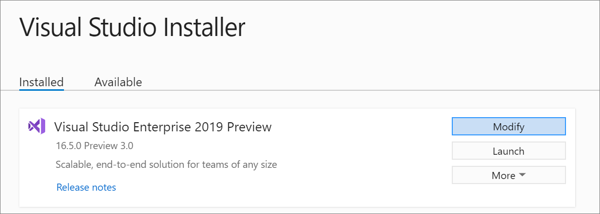
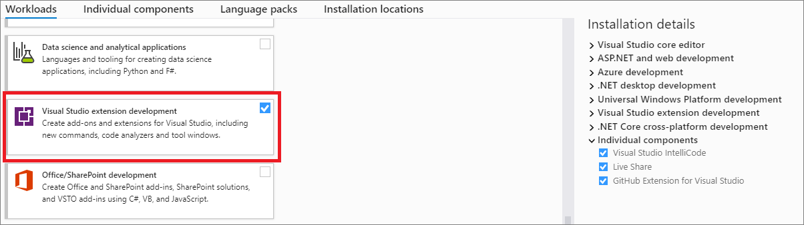
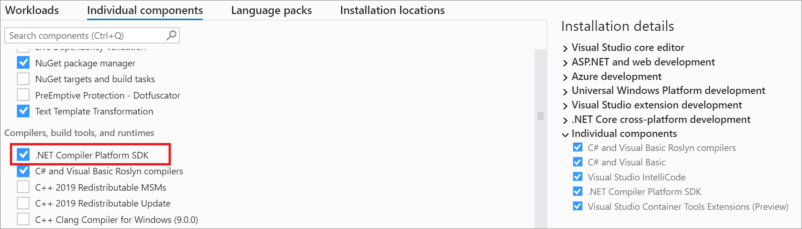
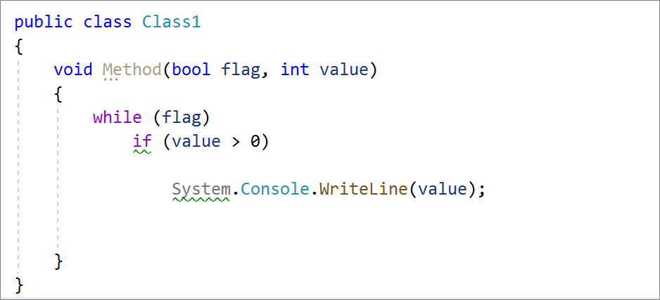
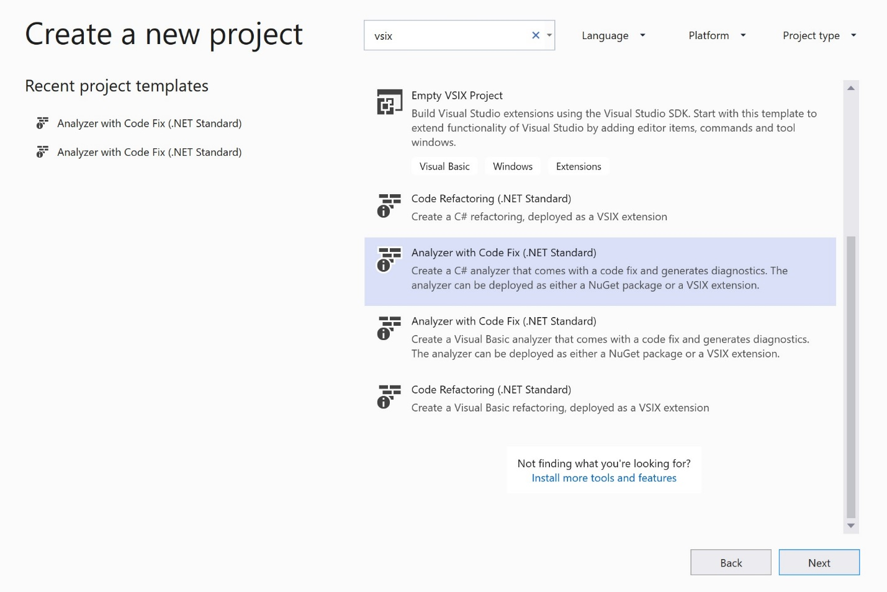
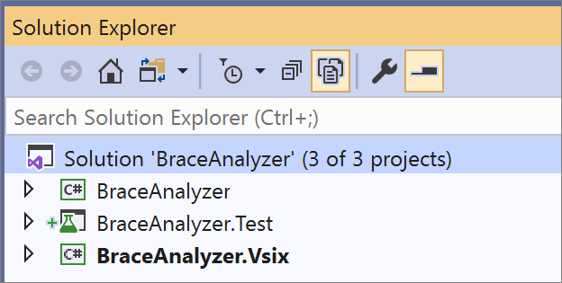
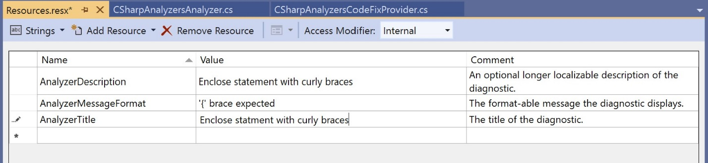
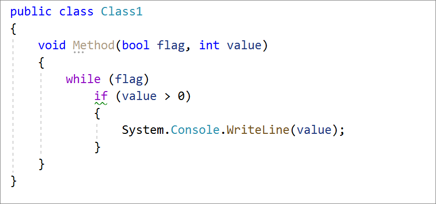
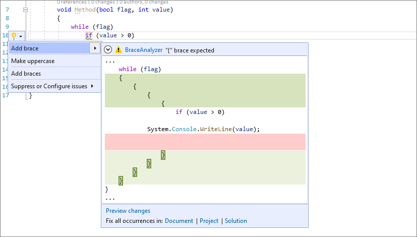

# How to write a Roslyn Analyzer

Roslyn analyzers inspect your code for style, quality, maintainability, design and other issues. Because they are powered by the .NET Compiler Platform, they can produce warnings in your code as you type even before you’ve finished the line. In other words, you don’t have to build your code to find out that you made a mistake. Analyzers can also surface an automatic code fix through the Visual Studio light bulb prompt that allows you to clean up your code immediately. With live, project-based code analyzers in Visual Studio, API authors can ship domain-specific code analysis as part of their NuGet packages.

You don’t have to be a professional API author to write an analyzer. In this post, I'll show you how to write your very first analyzer.

## Getting started

In order to create a Roslyn Analyzer project, you need to install the . NET Compiler Platform SDK via the Visual Studio Installer.
There are two different ways to find the .NET Compiler Platform SDK in the Visual Studio Installer:

Install using the Visual Studio Installer – Workloads view:

1. Run the Visual Studio Installer and select Modify.

    

2. Check the Visual Studio extension development workload.

    

Install using the Visual Studio Installer - Individual components tab:

1. Run the Visual Studio Installer and select Modify.
2. Select the Individual components tab.
3. Check the box for .NET Compiler Platform SDK.

    

## Writing an analyzer

Let’s begin by creating a syntax tree analyzer. This analyzer generates a syntax warning for any statement that is not enclosed in a block that has curly braces `{` and `}`. For example, the following code generates a warning for both the `if`-statement and the ```System.Console.WriteLine``` invocation statement, but the `while` statement is not flagged:



1. Open Visual Studio.
2. On the **Create a new project** dialog search VSIX and select **Analyzer with Code Fix (.NET Standard)** in C# and click **Next**.

    

3. Name your project **BraceAnalyzer** and click OK. The solution should contain 3 projects: BraceAnalyzer, BraceAnalyzer.Test, BraceAnalyzer.Vsix.

    

    * BraceAnalyzer: This is the core analyzer project that contains the default analyzer implementation that reports a diagnostic for all type names that contain any lowercase letter.
    * BraceAnalyzer.Test: This is a unit test project that lets you make sure your analyzer is producing the right diagnostics and fixes.
    * BraceAnalyzer. Vsix: The VSIX project bundles the analyzer into an extension package (.vsix file). This is the startup project in the solution.

4. In the Solution Explorer, open **Resources.resx** in the BraceAnalyzer project. This displays the resource editor.
5. Replace the existing resource string values for AnalyzerDescription, AnalyzerMessageFormat, and AnalyzerTitle with the following strings:

    * Change AnalyzerDescription to `Enclose statement with curly braces`.
    * Change AnalyzerMessageFormat to `"{" brace expected`.
    * Change AnalyzerTitle to `Enclose statement with curly braces`.

    

6. Within the BraceAnalyzerAnalyzer.cs file, replace the Initialize method implementation with the following code:

    ``` csharp
     public override void Initialize(AnalysisContext context)
        {
            context.RegisterSyntaxTreeAction(syntaxTreeContext =>
            {
                // Iterate through all statements in the tree
                var root = syntaxTreeContext.Tree.GetRoot(syntaxTreeContext.CancellationToken);
                foreach (var statement in root.DescendantNodes().OfType<StatementSyntax>())
                {
                    // Skip analyzing block statements 
                    if (statement is BlockSyntax)
                    {
                        continue;
                    }
                    // Report issues for all statements that are nested within a statement
                    // but not a block statement
                    if (statement.Parent is StatementSyntax && !(statement.Parent is BlockSyntax))
                    {
                        var diagnostic = Diagnostic.Create(Rule, statement.GetFirstToken().GetLocation());
                        syntaxTreeContext.ReportDiagnostic(diagnostic);
                    }
                }
            });
        }
    ```

7. Check your progress by pressing F5 to run your analyzer. Make sure that the BraceAnalyzer.Vsix project is the startup project before pressing F5. Running the VSIX project loads an experimental instance of Visual Studio, which lets Visual Studio keep track of a separate set of Visual Studio extensions.

8. In the Visual Studio instance, create a new C# class library with the following code to verify that the analyzer diagnostic is neither reported for the method block nor the `while` statement, but is reported for the `if` statement and `System.Console.WriteLine` invocation statement:

    

9. Now, add curly braces around the `System.Console.WriteLine` invocation statement and verify that the only single warning is now reported for the `if` statement:

    

## Writing a code fix

An analyzer can provide one or more code fixes. A code fix defines an edit that addresses the reported issue. For the analyzer that you created, you can provide a code fix that encloses a statement with a curly brace.

1. Open the BraceAnalyzerCodeFixProvider.cs file. This code fix is already wired up to the Diagnostic ID produced by your diagnostic analyzer, but it doesn't yet implement the right code transform.

2. Change the title string to “Add brace":

    ``` csharp
    private const string title = "Add brace";
    ```

3. In the RegisterCodeFixAsync method, add the following line:

    ``` csharp
    var editor = new SyntaxEditor(root, context.Document.Project.Solution.Workspace);
    ```

4. You’ll notice a red squiggle under `SyntaxEditor`. That’s because you’re missing a using directive for the `SyntaxEditor` type. Be sure to add the following using directive to the top of your file:

    ``` csharp
    using Microsoft.CodeAnalysis.Editing;
    ```

5. Change the following line to register a code fix. Your fix will create a new document that results from adding braces.

    ``` csharp
    context.RegisterCodeFix(
        CodeAction.Create(
            title: title,
            createChangedDocument: c => AddBracesAsync(context.Document, diagnostic, editor),
            equivalenceKey: title),
        diagnostic);
    ```

6. You'll notice red squiggles in the code you just added on the `AddBracesAsync` symbol. Add a declaration for `AddBracesAsync` by replacing the `MakeUpperCaseAsync` method with the following code:

    ``` csharp
    Task<Document> AddBracesAsync(Document document, Diagnostic diagnostic, SyntaxEditor editor)
            {
                // Compute brace indication.
                var root = editor.OriginalRoot;
                var statement = root.FindNode(diagnostic.Location.SourceSpan).FirstAncestorOrSelf<StatementSyntax>();
                editor.ReplaceNode(statement, (currentStatement, _)
                    => currentStatement.ReplaceNode(currentStatement, SyntaxFactory.Block(currentStatement as StatementSyntax))
                );
                var newRoot = editor.GetChangedRoot();
                return Task.FromResult(document.WithSyntaxRoot(newRoot));
            }
    ```

7. Press F5 to run the analyzer project in a second instance of Visual Studio. Place your cursor on the diagnostic and press (**Ctrl+.**) to trigger the **Quick Actions and Refactorings** menu. Notice your code fix to add a brace!

    

## Conclusion

Congratulations! You've created your first Roslyn analyzer that performs on-the-fly code analysis to detect an issue and provides a code fix to correct it. Along the way, you've learned many of the code APIs that are part of the [.NET Compiler Platform SDK]("https://docs.microsoft.com/dotnet/csharp/roslyn-sdk/") (Roslyn APIs). Next, you can learn how to publish your analyzer as a NuGet package, which will enable your analyzer for every developer on the team and can be enforced on build. For information on how to publish to NuGet, see [Code Analysis - Build and Deploy Libraries with Integrated Roslyn Code Analysis to NuGet](https://docs.microsoft.com/archive/msdn-magazine/2015/october/code-analysis-build-and-deploy-libraries-with-integrated-roslyn-code-analysis-to-nuget).
