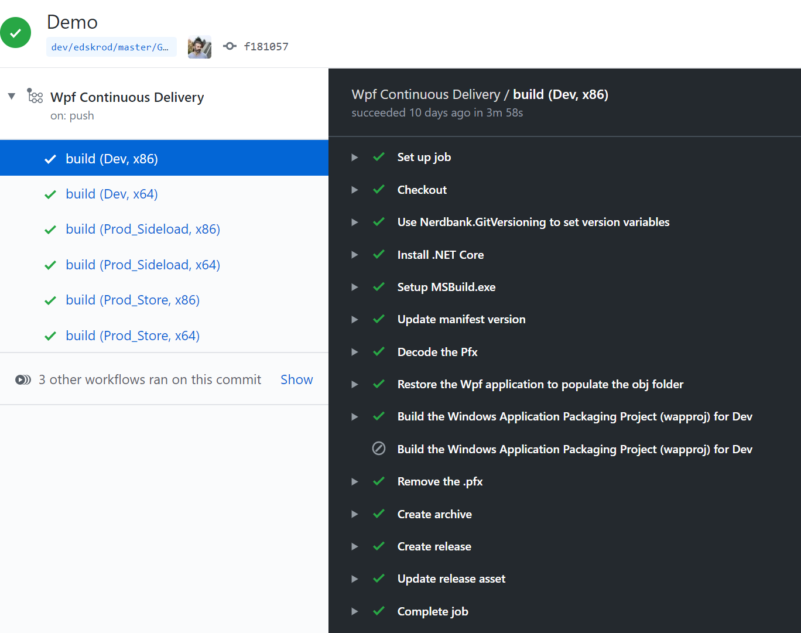

# Using DevOps in your desktop apps with GitHub Actions

From speaking to desktop developers, we’ve heard that you want to learn how to quickly set up a DevOps workflow for your WPF and Windows Forms applications in order to take advantage of the many benefits of continuous integration and continuous delivery pipelines, such as:
* Catch bugs early in the dev cycle
* Improve software quality and reliability
* Ensure consistent quality of builds
* Deploy new features quickly and safely, improving release cadence
* Fix issues quickly in production by rolling forward new deployments
 
That's why we created [a sample application in GitHub](https://github.com/microsoft/github-actions-for-desktop-apps) to showcase DevOps for your applications using the recently released [GitHub Actions](https://github.com/features/actions "GitHub Actions page").
With GitHub Actions, you can quickly and easily automate your software workflows with CI/CD.
* Integrate code changes directly into GitHub to speed up development cycles
* Trigger builds to quickly identify build breaks and create testable debug builds
* Continuously run tests to identify and eliminate bugs
* Automatically build, sign, package and deploy branches that pass CI 
 
The sample application demonstrates how to author the YAML files that comprise the DevOps workflow in GitHub.  In the step-by-step walkthrough you'll learn:

* How to author YAML files to take advantage of multiple channels, so that you can build different versions of your application for test, sideload deployment and the Microsoft Store.
* Best-practices for securely storing passwords and other secrets in GitHub, ensuring you protect your valuable assets.
* How to enable Publish Profiles in your WPF and Windows Forms applications, files that store information about your publish targets such as the deployment location, target framework, and target runtime. Publish Profiles are referenced by the Windows Application Packaging project and simplify the build and packaging steps of your DevOps pipeline making the authoring process much easier.

Please check out our [step-by-step guide](https://github.com/microsoft/github-actions-for-desktop-apps#workflows). And if you have any questions or feedback, please [file issues on GitHub](https://github.com/microsoft/github-actions-for-desktop-apps/issues/new).

