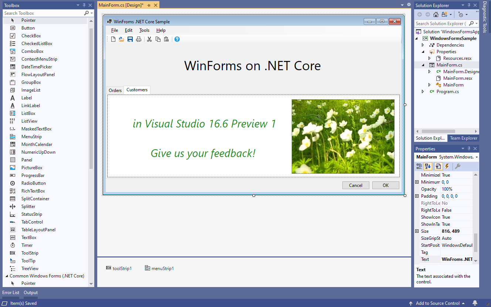

# Updates on .NET Core Windows Forms designer

Today we released a preview version of Visual Studio 16.6  -  [Visual Studio 2019 version 16.6 Preview 1](https://docs.microsoft.com/en-us/visualstudio/releases/2019/release-notes-preview#16.6.0-pre.1.0) and with it a new version of .NET Core Windows Forms designer.

## This release contains

* Support for the following controls:

    * `FlowLayoutPanel`,
    * `GroupBox`,
    * `ImageList`,
    * `MenuStrip` (via the `PropertyBrowser` and context menu),
    * `Panel`,
    * `SplitContainer`,
    * `Splitter`,
    * `TabControl`,
    * `TableLayoutPanel`,
    * `ToolTip`
    * `ToolStrip` (via the `PropertyBrowser`, context menu and designer actions).
* Enable local resources and localized forms in the designer.
* Support the `LayoutMode` and `ShowGrid/SnapToGrid` settings via **Tools**->**Options**.
* Necessary support for all dialog components
* Reliability and performance improvements.
* Other minor fixes and tweaks.

## Coming next

In the future releases we will be working on `User Controls` and third-party controls support, integration with popular controls vendors, support for Data Controls and related scenarios, performance improvements and other features.

## How to use the designer

* You must be using Visual Studio Preview channel
* You need to enable the designer in Visual Studio. Go to **Tools** > **Options** > **Environment** > **Preview Features** and select the **Use the preview Windows Forms designer for .NET Core apps** option.

## How to report issues

Your feedback is important to us! Please report issues and send feature requests via the Visual Studio Feedback channel. Use the "Send Feedback" icon in Visual Studio top-right corner as shown below and specify that it is related to the "WinForms .NET Core" area.

