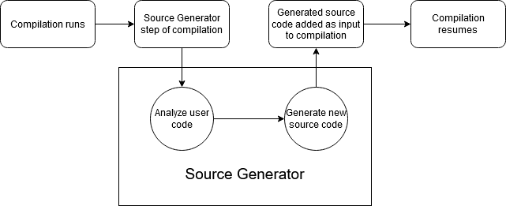

# Introducing C# Source Generators

We're pleased to introduce the first preview of Source Generators, a new C# compiler feature that lets C# developers inspect user code and generate new C# source files that can be added to a compilation. This is done via a new kind of component that we're calling a Source Generator.

## What is a Source Generator?

Unless you've been closely following every prototype and proposal related to the C# language and compiler, then there's a good chance you're asking, "What is a Source Generator" right now. A Source Generator is a piece of code that runs during compilation and can inspect your program to produce additional files that are compiled together with the rest of your code.

A Source Generator is a new kind of component that C# developers can write that lets you do two major things:

1. Retrieve a `Compilation` object that represents all user code that is being compiled. This object can be inspected and you can write code that works with the syntax and semantic models for the code being compiled, just like with analyzers today.
2. Generate C# source files that can be added to a `Compilation` object during the course of compilation. In other words, you can provide additional source code as input to a compilation _while the code is being compiled_.

When combined, these two things are what make Source Generators so useful. You can inspect user code with all of the rich metadata that the compiler builds up during compilation, then emit C# code back into the same compilation that is based on the data you've analyzed!

Source generators run as a phase of compilation visualized below:



A Source Generator is a .NET Standard 2.0 assembly that is loaded by the compiler along with any [analyzers](https://docs.microsoft.com/visualstudio/code-quality/roslyn-analyzers-overview). It is usable in environments where .NET Standard components can be loaded and run.

Now that you know what a Source Generator is, let's go through some of the scenarios they can improve.

## Example scenarios that can benefit from Source Generators

The most important aspect of a Source Generator isn't what it is, but what it can enable.

Today, there are three general approaches to inspecting user code and generating information or code based on that analysis used by technologies today: runtime reflection, IL weaving, and juggling MSBuild tasks. Source Generators can be an improvement over each approach.

Runtime reflection is a powerful technology that was added to .NET a long time ago. There are countless scenarios for using it. A very common scenario is to perform some analysis of user code when an app starts up and use that data to generate things.

For example, ASP.NET Core uses reflection when your web service first runs to discover constructs you've defined so that it can "wire up" things like controlelrs and razor pages. Although this enables you to write straightforward code with powerful abstractions, it comes with a performance penalty at runtime: when your web service or app first starts up, it cannot accept any requests until all the runtime reflection code that discovers information about your code is finished running! Although this performance penalty is not enormous, it is somewhat of a fixed cost that you cannot improve yourself in your own app.

With a Source Generator, the controller discovery phase of startup could instead happen at compile time by analyzing your source code and emitting the code it needs to "wire up" your app. This could result in some faster startup times, since an action happening at runtime today could get pushed into compile time.

Source Generators can improve performance in ways that aren't limited to reflection at runtime to discover types, either. Some scenarios involve calling the MSbuild C# task (called `CSC`) multiple so they can inspect data from a compilation. As you might imagine, calling the compiler more than once affects the total time it takes to build you app! We're investigating how Source Generators can be used to obviate the need for juggling MSBuild tasks like this, since this doesn't just offer some performance benefits, but also allows tools like this to operate at the right level of abstraction.

Another capability Source Generators can offer is obviating the use of some ["stringly-typed"](https://wiki.c2.com/?StringlyTyped) APIs, such as how ASP.NET Core routing between controllers and pages work. With a Source Generator, routing could be strongly typed with the necessary strings being generated as a compile-time detail. This could reduce the amount of times a mistyped string literal leads to a request not hitting the correct controller.

As we flesh out the API and experience writing Source Generators more, we anticipate more scenarios to become evident. We're also planning on working with partner teams to help them adopt Source Generators if it improves their core scenarios.

## Source Generators and Ahead of Time (AOT) Compilation

Another characteristic of Source Generators is that they can help remove major barriers to linker-based and AOT (ahead-of-time) compilation optimizations. Many frameworks and libraries make heavy use of reflection, such as `System.Text.Json`, `System.Text.RegularExpressions`, and frameworks like ASP.NET Core and WPF that discover types from user code at runtime.

We've also identified that many of the top [NuGet packages](https://www.nuget.org/) people make heavy use of reflection to discover types at runtime. Incorporating these packages is essential for most .NET apps, so the "linkability" and ability for your code to make use of AOT compiler optimizations is greatly affected. We're looking forward to working with our wonderful OSS community to see how these packages could use source generators and improve the overall .NET ecosystem.

## Hello World, Source Generator edition

All the previous examples of source generators mentioned earlier are pretty complex. Let's go through a very basic one to show some of the key pieces you'll need to write your own Source Generator.

The goal is to let users who have installed this Source Generator always have access to a friendly "Hello World" message and all syntax trees available during compilation. They could invoke it like this:

```csharp
public class SomeClassInMyCode
{
    public void SomeMethodIHave()
    {
        HelloWorldGenerator.HelloWorld.SayHello(); // calls Console.WriteLine("Hello World!") and then prints out syntax trees
    }
}
```

Over time, we'll make getting started a lot easier in tools with templates. For now, here's how to do it manually:

1. Create a .NET Standard library project that looks like this:

```xml
<Project Sdk="Microsoft.NET.Sdk">

  <PropertyGroup>
    <TargetFramework>netstandard2.0</TargetFramework>
    <IncludeBuildOutput>false</IncludeBuildOutput>
    <SuppressDependenciesWhenPacking>true</SuppressDependenciesWhenPacking>
    <GeneratePackageOnBuild>True</GeneratePackageOnBuild>
  </PropertyGroup>

  <PropertyGroup>
    <PackageId>MyPackageId</PackageId>
    <PackageVersion>0.1</PackageVersion>
    <Authors>Your name here</Authors>
    <!-- Other Package metadata goes here -->
    <NoPackageAnalysis>true</NoPackageAnalysis>
  </PropertyGroup>

  <PropertyGroup>
    <RestoreAdditionalProjectSources>https://dotnet.myget.org/F/roslyn/api/v3/index.json ;$(RestoreAdditionalProjectSources)</RestoreAdditionalProjectSources>
  </PropertyGroup>

  <ItemGroup>
    <PackageReference Include="Microsoft.CodeAnalysis.CSharp.Workspaces" Version="3.6.0-3.20207.2" PrivateAssets="all" />
  </ItemGroup>

</Project>
```

The key pieces of this is that the project can generate a NuGet package and it depends on the bits that enable Source Generators.

2. Modify or create an C# file that specifies your own Source Generator like so:

```cs
using Microsoft.CodeAnalysis;
using Microsoft.CodeAnalysis.Text;
using System;
using System.Collections.Generic;
using System.IO;
using System.Linq;
using System.Text;
using System.Xml;

namespace MyGenerator
{
    [Generator]
    public class MySourceGenerator : ISourceGenerator
    {
        public void Execute(SourceGeneratorContext context)
        {
            // TODO - actual source generator goes here!
        }

        public void Initialize(InitializationContext context)
        {
            // No initialization required for this one
        }
    }
}
```

You'll need to apply the `[Generator]` attribute and implement the `ISourceGenerator` interface.

3. Add generated source code to the compilation!

```cs
using System;
using System.Collections.Generic;
using System.Text;
using Microsoft.CodeAnalysis;
using Microsoft.CodeAnalysis.Text;

namespace SourceGeneratorSamples
{
    [Generator]
    public class HelloWorldGenerator : ISourceGenerator
    {
        public void Execute(SourceGeneratorContext context)
        {
            // begin creating the source we'll inject into the users compilation
            var sourceBuilder = new StringBuilder(@"
using System;
namespace HelloWorldGenerator
{
    public static class HelloWorld
    {
        public static void SayHello() 
        {
            Console.WriteLine(""Hello from generated code!"");
            Console.WriteLine(""The following syntax trees existed in the compilation that created this program:"");
");

            // using the context, get a list of syntax trees in the users compilation
            var syntaxTrees = context.Compilation.SyntaxTrees;

            // add the filepath of each tree to the class we're building
            foreach (SyntaxTree tree in syntaxTrees)
            {
                sourceBuilder.AppendLine($@"Console.WriteLine(@"" - {tree.FilePath}"");");
            }

            // finish creating the source to inject
            sourceBuilder.Append(@"
        }
    }
}");

            // inject the created source into the users compilation
            context.AddSource("helloWorldGenerator", SourceText.From(sourceBuilder.ToString(), Encoding.UTF8));
        }

        public void Initialize(InitializationContext context)
        {
            // No initialization required for this one
        }
    }
}
```

4. Add the source generator from a project as an analyzer and add `<LangVersion>preview</LangVersion>` to the project file like this:

```xml
<!-- This goes in the top-level property group -->
<PropertyGroup>
  <LangVersion>preview</LangVersion>
</PropertyGroup>

<!-- Add this as a new ItemGroup, replacing paths and names appropriately -->
<ItemGroup>
  <Analyzer Include="path-to-source-genertor/Debug/netstandard2.0/SourceGeneratorName.dll" />
</ItemGroup>

```

If you've written Roslyn Analyzers before, the local development experience should be similar.

When you write your code in Visual Studio, you'll see that the Source Generator runs and the generated source file is added to your project. You can now access it as if you had created it yourself:

```csharp
public class SomeClassInMyCode
{
    public void SomeMethodIHave()
    {
        HelloWorldGenerator.HelloWorld.SayHello(); // calls Console.WriteLine("Hello World!") and then prints syntax trees
    }
}
```

**Note: you will currently need to restart Visual Studio to see IntelliSense and get rid of errors with the early tooling experience**

There are many more things you can do with Source Generators than just something simple like this:

* Automatically implement interfaces for classes with an attribute attached to them, such as `INotifyPropertyChanged`
* Generate settings files based on data inspected from a `SourceGeneratorContext`
* Serialize values from classes into JSON strings
* etc.

The [Source Generators Cookbook](https://github.com/dotnet/roslyn/blob/master/docs/features/source-generators.cookbook.md) goes over some of these examples with some recommended approaches to solving them.

Additionally, we have a set of samples available on GitHub that you can try on your own: https://github.com/dotnet/roslyn-sdk/tree/source-generator-samples/samples/CSharp/SourceGenerators (TODO - wait for these to be reviewed and merged)

As mentioned earlier, we're working on making the experience authoring and using Source Generators better in tooling, such as adding templates, allowing for seamless IntelliSense and navigation, debugging, and improving responsiveness and performance in Visual Studio when generating source files.

## Source Generators are in preview

As mentioned earlier in this post, this is the first preview of Source Generators. The intention of releasing this first preview is to let library authors try out the feature and give us feedback on what's missing and what needs to change. From preview to preview, there may be changes in the API and characteristics of source generators. We intend on shipping Source Generators as GA with C# 9, and sometime later this year we intend on stabilizing the API and features it provides.

## Calling all C# library developers: try it out!

If you own a .NET library written in C#, now is a great time to evaluate Source Generators and see if they're a good fit. There's a good chance that if your library makes heavy use of reflection, you'll benefit in some way.

To help with that, we recommend reading the following docs:

* [Source Generators design document](https://github.com/dotnet/roslyn/blob/master/docs/features/source-generators.md), which explains the Source Generator API and current capabilities
* [Source Generators cookbook](https://github.com/dotnet/roslyn/blob/master/docs/features/source-generators.cookbook.md), which provides examples of different Source Generators that enable different scenarios

Give us your feedback and let us know what you need! We'd love to learn more about how you think Source Generators could improve your code, and what you feel is missing or needs changing.

## What's next for Source Generators

This first preview is is exactly that: a first preview. There is a basic editing experience in Visual Studio, but it is not what we would consider "1.0 quality" right now. In fact, we intend on exploring a few different designs over time before we commit to a particular one. One of the biggest areas of focus between now and the .NET 5 release will be improving the editing experience for Source Generators. Additionally, we expect to modify the API to accomodate feedback from partner teams and our OSS community.

Additionally, we'll work out how Source Generators are distributed. We're currently designing them to be very similar to Analyzers that can be shipped alongside a package. They currently use the Analyzer infrastructure to handle configuration in editor tooling.

## FAQ

Below is a list of questions we anticipate some people might have. We'll update this list with more questions as they come.

### How do Source Generators compare to other metaprogramming features like macros or compiler plugins?

Source Generators are a form of metaprogramming, so it's natural to compare them to similar features in other langauges like macros. The key difference is that Source Generators don't allow you _rewrite_ user code. We view this limitation as a significant benefit, since it keeps user code predicatible with respect to what it actually does at runtime. We recognize that rewriting user code is a very powerful feature, but we're unlikely to enable Source Generators to do that.

### How do Source Generators compare with Type Providers in F#?

If you're an F# programmer (or familiar with the language), then you might have heard of [Type Providers](https://docs.microsoft.com/dotnet/fsharp/tutorials/type-providers/). Source Generators were inspired in part by Type Providers, but there are several differences. The main difference is that Type Providers are a part of the F# language proper and emit types, properties, and methods in-memory; whereas Source Generators are a _compiler_ feature that emits C# source code.

### Should I delete all my reflection code?

No! Reflection is an incredibly useful tool. However, it does present some performance and "linkability" challenges that can be solvable with Source Generators in some scenarios. Carefully evaluate if your use of reflection could benefit if it were moved to compile-time.

### How are Source Generators this different from analyzers?

Source Generators are similar to analyzers, since both are compiler features that let you plug into a compilation. The key difference is that analyzers ultimately emit diagnostics that can be used to associate with a code fix. Source Generators ultimately emit C# source code that is added to a compilation. There are several other differences discussed in the [design document](https://github.com/dotnet/roslyn/blob/master/docs/features/source-generators.md#discussion--open-issues--todos).

### Can I modify/rewrite existing code with a Source Generator?

No. As mentioned earlier, Source Generators do not allow you to rewrite user source code. We do not intend on allowing them to this. They can only augment a compilation by adding C# source files.

### When will Source Generators be out of preview?

We intend on shipping Source Generators with C# 9. However, in the event that they aren't ready in time, we'll keep them in preview and ensure that users need to opt in to use them.

### Can I change the TFM in a Source Generator?

Source Generators are .NET Standard 2.0 components, and like any project you can change the TFM. However, they are only supported if you target .NET Standard 2.0 or .NET 5. Changing the TFM to a .NET Framework version is not guaranteed to work.

### Will Source Generators come to Visual Basic or F#?

Source Generators are currently a C# only feature. Because this is the first preview, there are many things that can change between now and the released version. We do not intend on adding Source Generators to Visual Basic. If you're an F# developer and want to see this feature added, please search the suggestions or file a new one in the [F# language suggestion repository](https://github.com/fsharp/fslang-suggestions/).

### Do Source Generators introduce compatibility concerns for libraries?

It depends on how libraries are being authored. Since VB and F# currently don't support Source Generators, library authors should avoid designing their features such that they *require* a Source Generator. Ideally, features have fallbacks to runtime reflection and/or reflection emit. This is something that library authors will need to careful consider before adopting Source Generators. We expect most library authors will use Source Generators to augment - rather than replace - current experiences for C# developers.

### Why do I not get IntelliSense for generated code? Why does Visual Studio say there's an error even though it builds?

Currently, Visual Studio integration is very early on. You will need to restart Visual Studio after building the source generator to make errors go away and IntelliSense appear. After you do that, things will work. This current behavior will change in the future so that you don't need to restart Visual Studio.

### Can I debug or navigate to generated source in Visual Studio?

Eventually, we'll support navigation and debugging of generated source in Visual Studio. It is not yet supported in this early preview stage. We consider features like these table stakes for the full release.

### How do I ship my own Source Generator?

Source Generators can be shipped as NuGet packages, just like Analyzers today. In fact, they use the same "plumbing" as Analyzers. If you've ever shipped an Analyzer, then you can easily ship a Source Generator.

### Will there be Microsoft-authored Source Generators?

Eventually, yes. But this is still the first preview of the technology, and a lot of things may need to change to accommodate various scenarios. There is currently no timeline for when Microsoft-authored Source Generators are available.

### Why do I need to use the Preview LangVersion to consume a Source Generator?


Cheers, and happy source generation!
