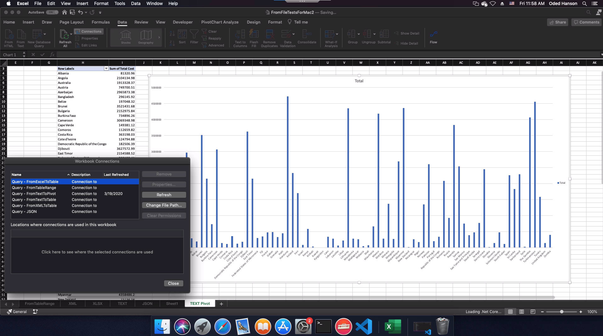
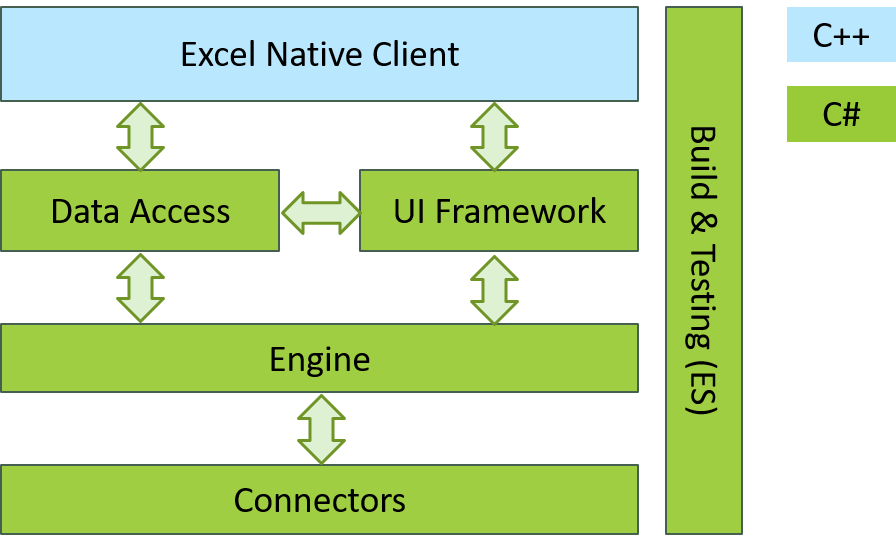
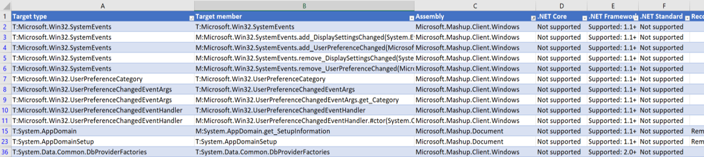
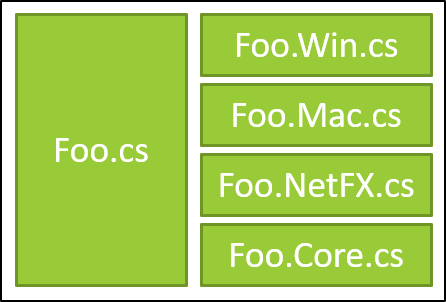
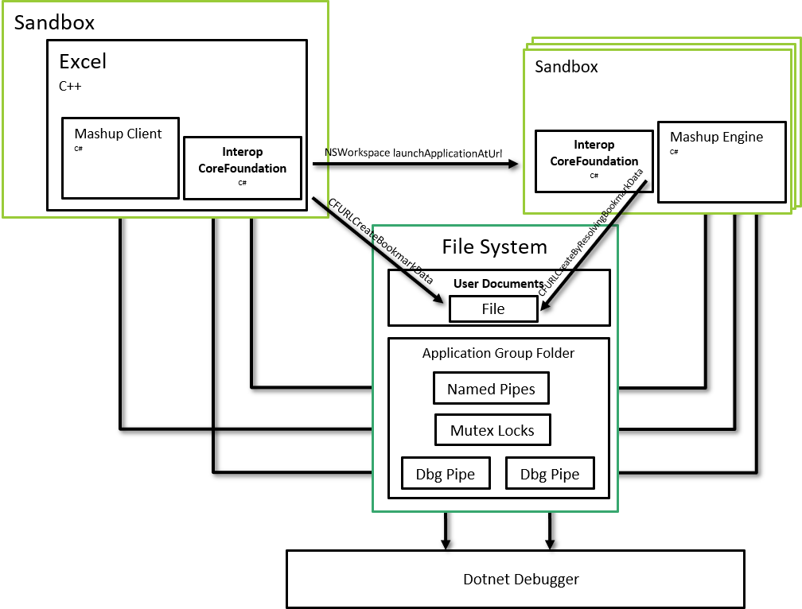

# Using .NET Core to provide Power Query for Excel on Mac

_Today's guest post is by Oded Hanson, Principal Software Engineer on the Excel team_

Power Query is a data connection technology that enables you to discover, connect, combine, and refine data sources to meet your analysis needs. Features in Power Query are available in Excel and Power BI Desktop. Power Query was developed for windows and is written in C# targeting .NET Framework. The Power Query product has been in development for many years, it has a considerably large codebase, and is being used by millions of existing customers.

Originally Power Query was distributed as an Excel 2013 Add-In, however as part of Excel 2016 it was natively integrated into Excel. Due to the dependency on .NET Framework, Power Query has been traditionally a Windows only feature of Excel and has been the source for frustration and numerous feature requests by our [Mac community](https://excel.uservoice.com/forums/304933-excel-for-mac/suggestions/8995483-add-support-for-get-transform-formerly-power-qu).

When .NET Core 2.1 was released it became a perfect opportunity for us to try accommodating our Mac customers.

In this article I will share with you our journey from a Windows only to a cross platform product.

## Requirements and constraints

The following depicts the different areas of work in this project and their relationships:

Making this cross platform came with a set of challenges:

1.	The Power Query codebase is written in C# and targets .NET Framework 3.5.
2.	The UI framework is based on WinForms, Internet Explorer, and COM interop.
3.	The Data Access layer uses COM based OLEDB as the means to move data between Power Query and Excel.
4.	Power Query provides a large set of connectors to external data sources. Many of these connectors use native Windows libraries (for example Microsoft Access connector) and may be extremely hard to make cross platform.
5.	The build and testing infrastructure were developed to run on Windows machines. For RPC it depends on Remoting, and some WCF features which are not natively supported by .NET Core. 

It is quite obvious this turned out to be quite an undertaking and would require multiple man years to get done. Thus, we made a project management decision to split the project into two major sub projects:

1. Refresh only: Use Windows to author Excel workbooks with Power Query queries inside them, and then allow our Mac users to refresh these workbooks using Excel for Mac. This covers a large use case, as it allows data analysts to create workbooks once, and have Mac users consume these workbooks and refresh the data as it updates.
2. Authoring: Port the authoring UI to Mac.

This blog will focus on the refresh scenario leaving the authoring (UI) parts for future posts.

## Power Query Refresh

The refresh project requires minimal user interface and would lay the groundwork needed for the rest of the project. We set for ourselves two major requirements:
1.	Whatever we do, do not break our existing Windows users :). This basically means we need to maintain the existing .NET Framework 3.5 build side by side to the .NET Core version.
2.	Keep the work cross platform. Our long term goal is to have a single cross platform codebase, running on the same .NET on all platforms, with minimal platform specific code.

## The .NET API Portability analyzer

Any effort to port to .NET Core needs to start with running the [API portability analyzer](https://github.com/microsoft/dotnet-apiport). Running this on the existing Power Query codebase, produced a long list of APIs being used which are not supported in .NET Core. A small subset is shown here: 

Based on this, we had to create a plan to refactor the codebase. We needed to identify where we might find .NET Core alternatives, third party alternatives (like Newtonsoft.Json), or where we needed to implement our own replacements.

One thing to note is that this tool is by no means bulletproof. The tool will not identify the following unsupported usage of APIs:
* Some APIs are missing the underlying implementations for non-Windows platforms.
* Some low-level marshalling types are not supported in .NET Core and/or in Mac specifically. For example marshalling arrays as SafeArrays.
* DllImport and ComImport are supported by .NET Core (ComImport in Windows only). But the native libraries imported are not cross platform. We had to manually identify all the native libraries being used in the product.

Based on all this, we needed to come up with a plan to fix all the non-portable APIs being used.

## Porting the code

For each and every component of work identified, the following questions needed to be answered:

* Is this platform specific code? If yes, we most probably will need to write our own alternative for Mac. Our hope was to minimize these cases. We also tried to move a lot of such code into a PAL assembly and hide these details from the rest of the application.
* Can we write shared code that will compile both with .NET 3.5 and .NET Core? Or should we split the implementations? There is always a trade-off between needing to rewrite stuff and between having two separate implementations which might get us faster to our goal but will harder to maintain. The answer is usually somewhere in the middle.

Eventually, we use partial classes following this pattern in most cases:

.

Following the pattern above, allows us to share code inside Foo.cs while still making platform or framework specific adjustments inside the separate partial classes. Special care needs to be made not to eagerly use this pattern. It can make the code quite messy.

Alternatively, another approach we took where we could, was to re-implement things completely using APIs available both for .NET 3.5 and .NET Core. One example was our native interop layer between Power Query and Excel. This was using SafeArrays and other Marshalling types not supported by .NET Core. Same was done to replace our OLEDB provider which was COM based. We replaced that with a p/invoke based implementation and C++ wrappers in the native code to hide the fact that we are not using COM.

In cases where we replaced the implementation completely, we usually use a different pattern - work against interfaces.

.

We abstracted the public API of the component with an interface. We then implemented both the old and new implementations and choose at runtime, based on a feature switch, which to use. This allows us to gradually release and test the new implementation with our existing Windows customers. A great additional value here is that it allowed us to test our ideas way before we released to Mac using our Windows audience.

## Porting large codebases

When porting a large legacy codebase, you need to understand that there is a lot of risk being taken. You cannot compile, run, and test your code until you finish doing all the porting. This makes these types of projects inherently waterfall like, by nature. It’s very hard to estimate how long it will take. Another issue is that you need to port your projects one at a time based on the project dependency tree - from leaf projects up to the root. This can make it sometimes harder to parallelize the work.

We all agree that having good test coverage is really important. However, in this project I learned how important it is to have good unit test coverage. Our project has a very extensive end to end test suite. This is really good, but the downside is that we could only run it once the entire porting effort is done - i.e. all projects have been converted to .NET Core. In addition, the end to end tests rely on the product UI which did not exist in the initial feature. Having an extensive suite of unit and integration tests in this case is essential to reduce project risk.

If possible, you should convert each project, together with its corresponding unit test project and make sure these tests are passing. This is important so you catch runtime issues sooner rather than later.

## Microsoft.DotNet.Analyzers.Compatibility

One thing the .NET API Portability analyzer does not tell you, is which APIs you are using that are not supported in platforms other than Windows. This is really important and not something which was obvious to our team from the start. Turns out that some of the APIs are only implemented for Windows and while they compile, when you try running your app on Mac or Linux, they will throw a runtime PlatformNotSupported Exception. We only found out about this once we completed the entire porting of the code and started to test on Mac.

Turns out there is another tool that can be used - [Microsoft.DotNet.Analyzers.Compatibility](https://www.nuget.org/packages/Microsoft.DotNet.Analyzers.Compatibility/). This is a Roslyn based analyzer that runs while compiling your code. It will flag APIs used that do not support the platform you are targeting. Once integrated into our build system, this helped us identify many cases that would have thrown exceptions at runtime.

Although this analyzer is super important, it does have some caveats. It runs as part of your compile phase. So, you need to get to a stage where your project is compiling (i.e. you ported all its dependencies) to benefit from it. This is still quite late in the game and would have definitely been more beneficial to have this information during the planning phase of the project. Second, it is not bullet proof. For instance, it cannot handle polymorphism well. If your code is calling an abstract method, then the analyzer would not be able to know that the concrete instance you are using would throw a PlatformNotSupported exception. For example, if you are calling WaitHandle.WaitAny (or WaitAll) and pass an instance of a Named Mutex, it will throw an exception in runtime. The compatibility analyzer cannot know this in advance.

## Cross platform IPC

The Power Query application relies heavily on Inter Process Communication (IPC) objects to synchronize between multiple engine containers that perform the data crunching and the Excel host. These include (the named variants for) Mutex, Event, Semaphore, Shared Memory, and pipes. Due to the need for a standard .NET API, the .NET team made the decision to keep the existing .NET APIs. The problem is that these APIs are truly designed around Windows. It was virtually impossible to create a robust implementation for all platforms around the .NET Standard 2.0 APIs, and eventually, the .NET team decided not to support these on platforms other than Windows.

Fortunately, although creating a general purpose robust implementation of these APIs is very hard, once you bring in application specific constraints, it was possible for us to come up with a cross platform API that allows us to implement all the required IPC constructs. This means that we had to create our own cross platform IPC library with implementations for Windows and Mac/Unix.

## Mac Sandbox and MHR

At the time we started this project, the .NET Core runtime was mainly being used for services and did not have any support for running from within a Sandbox in Mac. Office is released to the Apple App store and has the Mojave Hardening runtime enabled so it can be notarized by Apple. These posed additional requirements which needed to be addressed for our application to work properly. Most of the limitations and requirements were able to be addressed from within our codebase. However, some of the issues stemmed from the runtime itself, and required us to contribute changes back to the project in GitHub.

One of the main issues was debugging. The .NET debugger assumes that there will be semaphore files and a pipe inside the /tmp directory which will be used to communicate between the application and the debugger host. The problem is, that applications running inside the sandbox, don't have access to the /tmp folder. We needed to move these files into a shared (application group) folder which our application does have access. We also needed to be able to tell the Visual Studio debugger host where this folder is located and to use this instead.

A similar issue was with the implementation of named Mutex files. These would store files in the /tmp folder too, and we needed to make fixes to the runtime PAL layer for Mac to be configured to work inside an application group shared folder.

We also had to update our own application to take sandboxing into account. For example, the Process class in .NET uses fork/exec to spawn new processes. This way of launching applications works great for console apps but is not how macOS launches sandboxed applications. Instead we needed to use the [NSWorkspace launchAtApplicationUrl] objective C API. Obviously, this required adding a native interop layer. We also needed to deal with [security scoped bookmarks](https://developer.apple.com/library/archive/documentation/Security/Conceptual/AppSandboxDesignGuide/AppSandboxInDepth/AppSandboxInDepth.html#//apple_ref/doc/uid/TP40011183-CH3-SW16) so would could share file permissions between the main Excel process and the child engine processes.

.

Supporting the Mojave Hardening runtime also required additional changes to the .NET Core runtime. These are mainly on how memory pages are allocated. Since .NET uses JIT compiling, we need to marge these pages as such with MMAP_JIT when allocating them. Fortunately, .NET Core 3.1 was released with support for this and we can accommodate our Mac customers with the extra security MHR provides.

## Future plans and Conclusion

The introduction of .NET Core enabled us to have a path for making Power Query cross platform. While it was not a small project and the porting effort posed many challenges, the other alternatives would have been much more expensive.

With the introduction of .NET 5 and consolidation efforts of the different frameworks, porting to .NET core (now just .NET 5) is not a question of when - it is just a question of how. I hope this post shed some light on the things you need to consider when choosing to port your Windows desktop app and make them cross platform.

The initial refresh feature is now in production and can be used by installing the Office 365 version of Excel. We are now actively working on adding the UI layer for this so we can support authoring. This is a huge effort and definitely requires a separate blog post - so stay tuned.
