# Using ML.NET for deep learning on images in Azure

## Introduction

In March 2020, ML.NET added [support for training Image Classification models in Azure](https://devblogs.microsoft.com/dotnet/ml-net-model-builder-updates). Although the image classification scenario was released in late 2019, users were limited by the resources on their local compute environments. Training in Azure enables users to scale image classification scenarios by using GPU optimized Linux virtual machines.

This post will show how to train a custom image classification model in Azure to categorize flowers using ML.NET Model Builder. Then, you can leverage your existing .NET skills to consume the trained model inside a C# .NET Core console application. Best of all, little to no prior machine learning knowledge is required. Let's get started!

## ML.NET Model Builder

ML.NET is an [open source](https://github.com/dotnet/machinelearning) and cross-platform machine learning framework for .NET developers. Model Builder is a tool in Visual Studio that provides a graphical user interface that uses Automated Machine Learning (Auto ML) to train and consume custom ML.NET models for your .NET applications.

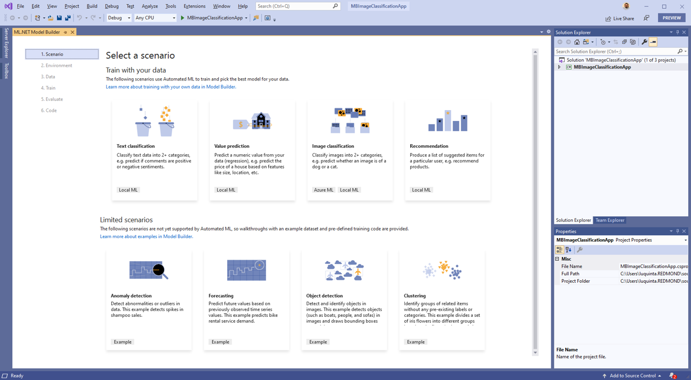

## Prerequisites

To follow along, you'll need the following prerequisites:

- [Visual Studio 2019 16.6 preview 2 or later](https://visualstudio.microsoft.com/vs/preview/).
- Azure Account. If you don't have one, you can [sign up for a free Azure Account](https://aka.ms/AMLFree).
- .NET Core cross-platform development workload.

## Model training workflow

The process of training models usually consists of the steps outlined below:

1. Get the data
1. Create a .NET Core application. This can be a console, desktop, or web application.
1. Choose a scenario
1. Configure your environment
1. Load the data
1. Train the model
1. Evaluate the model
1. Add the code to make predictions

## Get the data

> The dataset used in this guide is based on the [TensorFlow `flower_photos` dataset](https://storage.googleapis.com/download.tensorflow.org/example_images/flower_photos.tgz). All images in this archive are licensed under the Creative Commons By-Attribution License, available at: https://creativecommons.org/licenses/by/4.0/
>
> The full license information is provided in the LICENSE.txt file which is included as part of the same image set downloaded as a .zip file.

The dataset is divided into separate subfolders. One for each flower category:

- Daisy
- Dandelion
- Roses
- Sunflowers
- Tulips

Download the data anywhere on your PC and unzip it.

## Create a .NET Core application

The application that consumes the model is a C# .NET Core console application.

Open Visual Studio and create a new C# .NET Core console application. In this case, I've called my application *MBImageClassificationApp*.

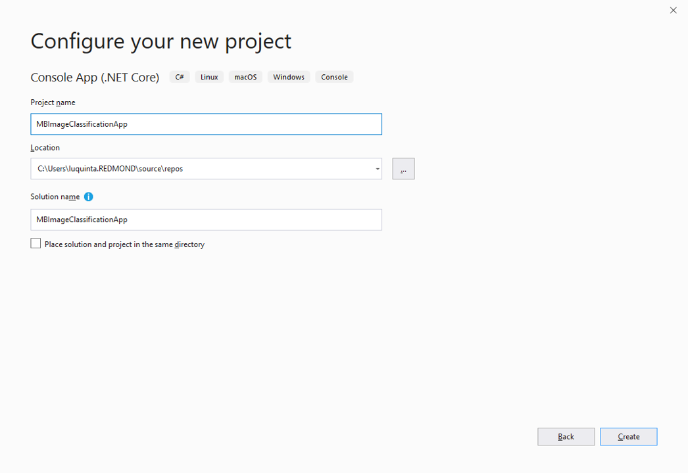

## Choose a scenario

In Solution Explorer, right-click your newly created console application project and select **Add > Machine Learning** to launch Model Builder.

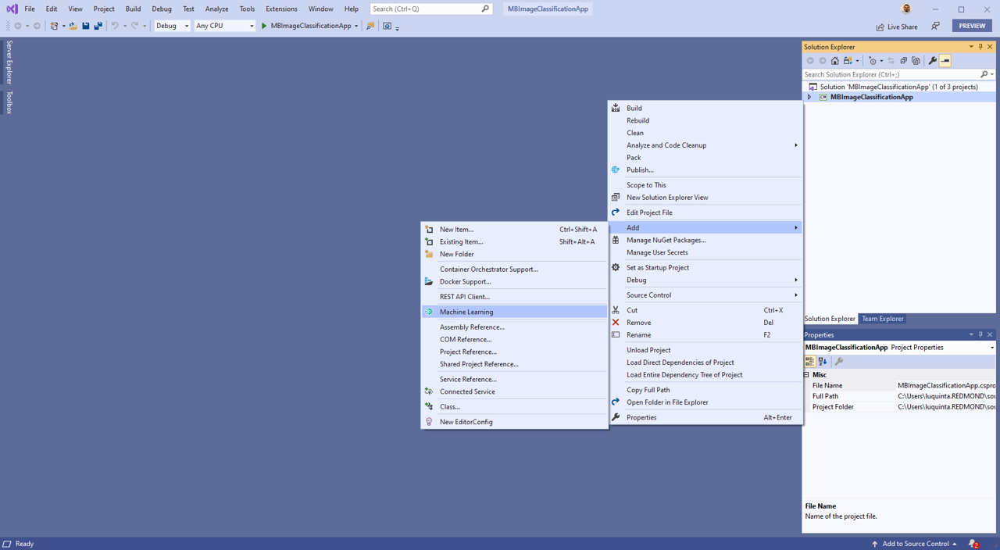

Once you're presented with the scenario screen, select **Image Classification** and proceed to the next step.


## Configure your environment

For image classification scenarios, you can choose between training locally or in the cloud. For this sample we'll train the model in Azure. For scenarios that train on thousands of images and require a large amount of resources, it is recommended to use Azure, which provides GPU optimized virtual machines for training.

### Create Azure Machine Learning experiment

Choose **Azure** from the list of training environments. Then, select the **Set up workspace** button to configure your environment.

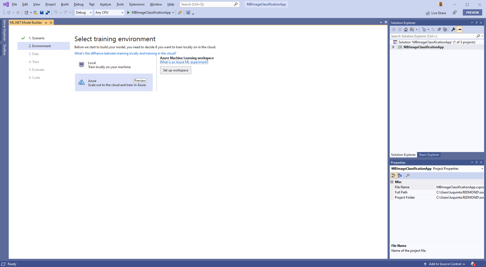

An Azure Machine Learning experiment is a resource that needs to be created before running Model Builder training on Azure. The experiment encapsulates the configuration and results for one or more machine learning training runs.

### Set up Azure environment

To create an Azure Machine Learning experiment, you first need to configure your environment on Azure. An experiment needs an Azure subscription, workspace, and compute to run on.

In the Create New Experiment dialog, choose your Azure subscription. Then, select or create a new Azure Machine Learning workspace. A workspace is an Azure Machine Learning resource that provides a central place for all Azure Machine Learning resources and artifacts created as part of a training run.

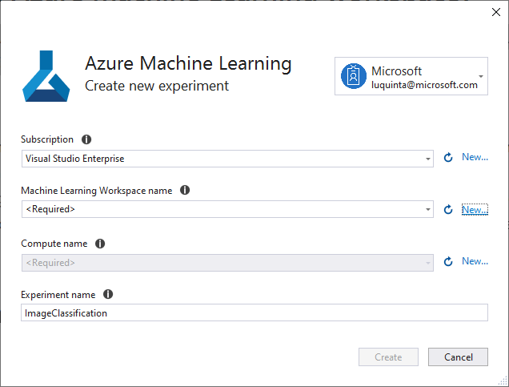

When you create a new workspace, the following resources are provisioned:

- Azure Machine Learning Enterprise workspace
- Azure storage
- Azure application insights
- Azure Container registry
- Azure Key Vault

As a result, this process may take a few minutes.

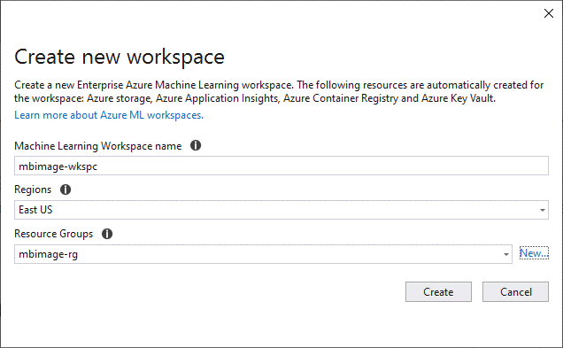

When you choose a region, it's recommended that you select a location close to where you or your customers are.

Once you've chosen or created your workspace, choose or create a new Azure Machine Learning compute. An Azure Machine Learning compute is a cloud-based Linux VM used for training. Learn more about [compute types supported by Model Builder](https://docs.microsoft.com/dotnet/machine-learning/resources/azure-training-concepts-model-builder#what-is-an-azure-machine-learning-compute). This process may take a few minutes.

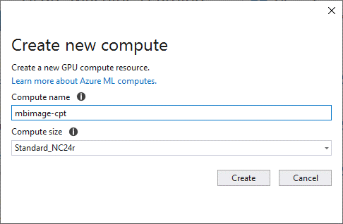

In the Create New Experiment dialog, leave the default experiment name and select **Create**.

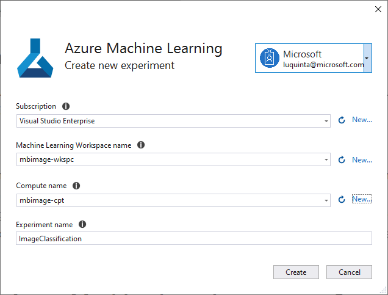

The first time an experiment is created, its name is registered in the workspace. Any subsequent runs - if the same experiment name is used - are logged as part of the same experiment. Otherwise, a new experiment is created.

If you're satisfied with your configuration, select the **Data** button to move to the next step.

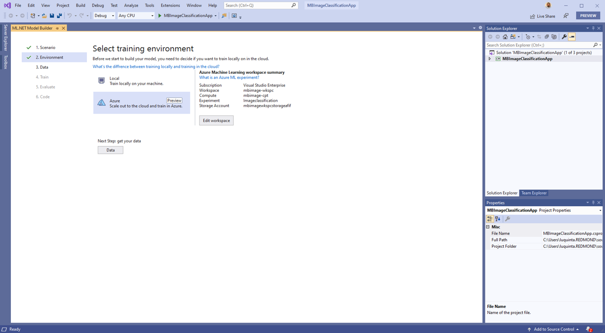

## Load the data

In the Add data screen, load your data by selecting the button next to the Select a folder textbox and use the file explorer to find the unzipped directory containing the subdirectories with images.

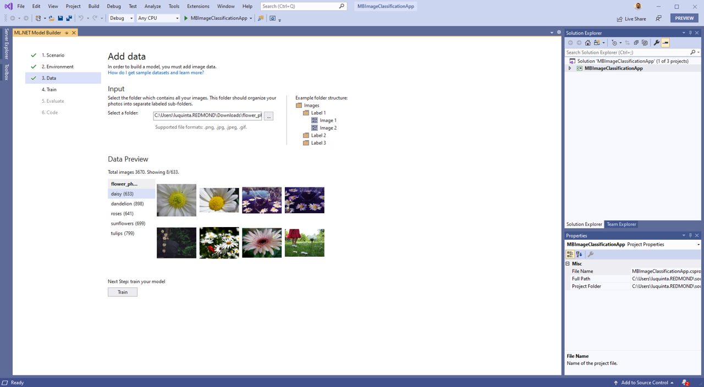

Once the data is loaded, select the **Train** button to train your model.

## Train the model

In the Model Builder train screen, select the **Start training** button to start training your model.

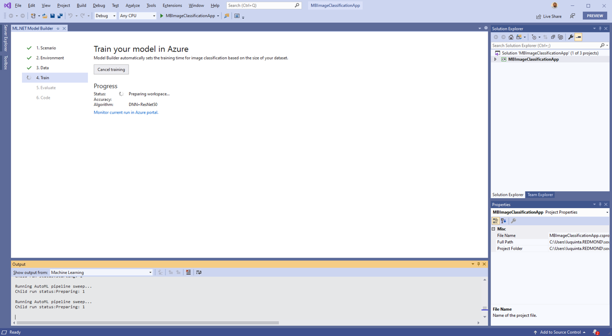

At this point, your data is uploaded to Azure Storage and the training process begins. The algorithm used to train these models is a [Deep Neural Network](https://wikipedia.org/wiki/Deep_learning#Deep_neural_networks) based on the [ResNet50 architecture](https://wikipedia.org/wiki/Residual_neural_network). The training process takes some time and the amount of time may vary depending on the size of compute selected as well as the amount of data. For this sample, training took about 30 minutes. The first time a model is trained, you can expect a slightly longer training time because resources have to be provisioned. You can track the progress of your runs in the Azure ML portal by selecting the "Monitor current run in Azure portal" link in Visual Studio.

Once the model is trained, select the **Evaluate** button to move to the next step.

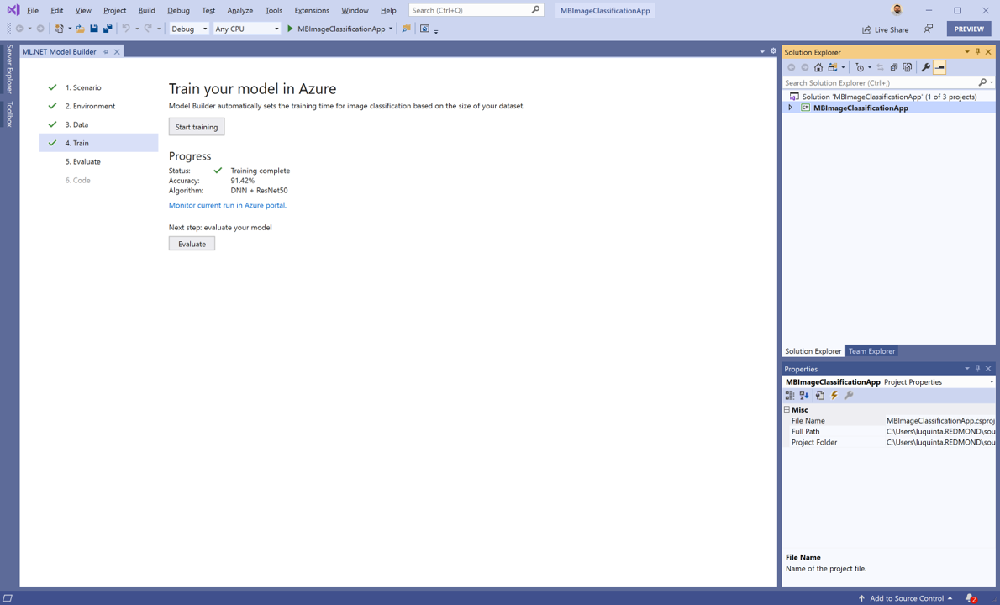

## Evaluate your model

In the evaluate screen,  you are able to get an overview of the results from the training process such as how long the model took to train as well as the accuracy. Additionally, you can use the "Try your model" experience to quickly check whether your model is performing as expected. All you need to do is provide an image, preferably one that the model did not use as part of training. The model classifies the image and provides the list of categories along with their probabilities with the predicted value at the top of the list.

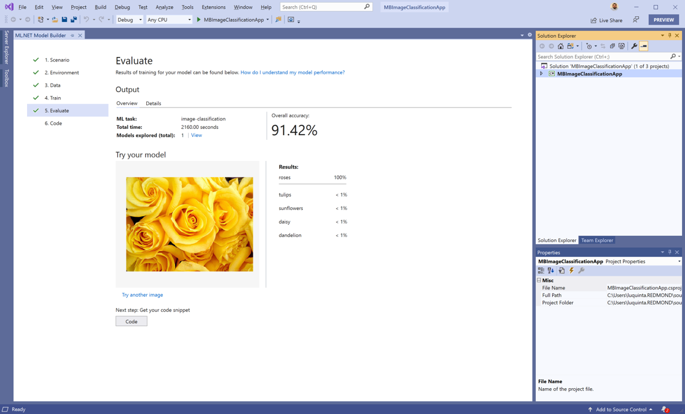

If you're satisfied with your model, select the **Code** button to add the code to make predictions.

## Add the code to make predictions

In the code screen, select the **Add Projects** button to add the auto-generated projects to your solution.

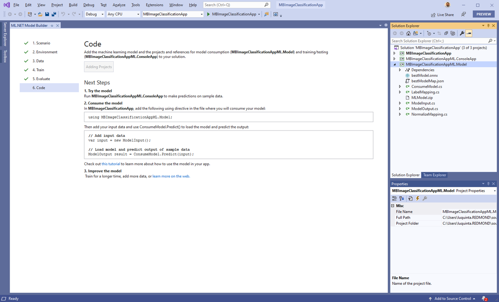

Two projects are added to your solution with the following suffixes:

- *ConsoleApp*: A C# .NET Core console application that provides starter code to build the prediction pipeline and make predictions.

- *Model*: A C# .NET Standard application that contains the data models that define the schema of input and output model data as well as the following assets:

  - *bestModel.onnx*: A serialized version of the model in [Open Neural Network Exchange (ONNX)](https://onnx.ai/) format. ONNX is an open source format for AI models that supports interoperability between frameworks like ML.NET, PyTorch, and TensorFlow.
  - *bestModelMap.json*: A list of categories used when making predictions to map the model output to a text category.
  - *MLModel.zip*: A serialized version of the ML.NET prediction pipeline that uses the serialized version of the model bestModel.onnx to make predictions and maps outputs using the bestModelMap.json file.

### Use the machine learning model

Open the *Program.cs* file from your console application. In this case, my console application is *MBIMageClassificationApp*.

Then, replace the code with the following:

```csharp
using System;
using MBImageClassificationAppML.Model;

namespace MBImageClassificationApp
{
    class Program
    {
        static void Main(string[] args)
        {
            ModelInput image = new ModelInput
            {
                ImageSource = "Pink_Tulips.jpg"
            };

            var prediction = ConsumeModel.Predict(image);

            Console.WriteLine($"Actual: tulips | Predicted: {prediction.Prediction}");
        }
    }
}
```

The first thing I've done is added a `using` statement to reference the *MBImageClassificationAppML.Model* project. To test my application, I've download an image of tulips called [Pink_Tulips](https://upload.wikimedia.org/wikipedia/commons/9/92/Pink_Tulips.JPG) from the internet and included it in my *MBImageClassificationApp* project. The model has not seen this image before. A new instance of `ModelInput` is created and the path of the image is used as the value for the `ImageSource` property. Then, `ConsumeModel.Predict`, a helper method that loads the *MLModel.zip* file and uses `PredictionEngine`, a convenience API to make predictions on a single instance of data, is called with the sample image as input. Finally, both the actual class the image belongs to, as well as the predicted flower category, are printed out to the console.

When you run the application, you should see output similar to the following in the console:

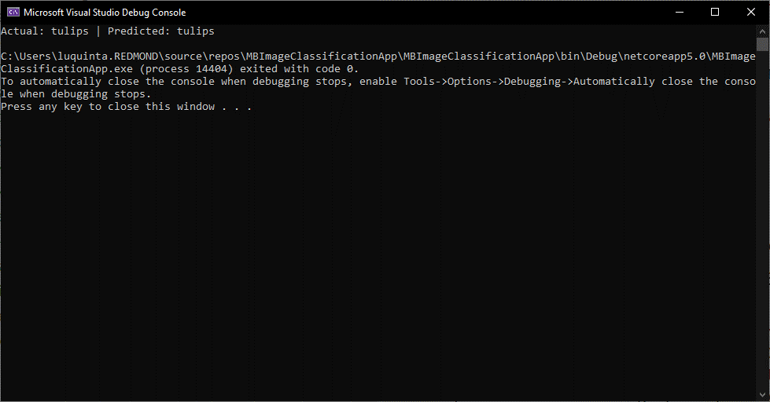

## Clean up resources

Azure Machine Learning Enterprise workspaces are currently in preview. Therefore there is no additional surcharge at the moment. Training this model cost less than $0.50. Depending on your scenario, your costs may vary depending on the amount of data and size of your compute. For more information on pricing, see the [Linux Virtual Machine Scale Sets Pricing page](https://azure.microsoft.com/pricing/details/virtual-machine-scale-sets/linux/).

If you no longer plan to use the Azure resources you created, delete them. This prevents you from being charged for unutilized resources that are still running.

1. Navigate to the [Azure portal](https://portal.azure.com) and select **Resource groups** in the portal menu.
1. From the list of resource groups, select the resource group you created.  
1. Select **Delete resource group** and follow the instructions in the prompt to delete your resource group.

## Share Your Feedback

Since Model Builder is still in Preview, your feedback is super important in driving the direction of this tool and ML.NET in general. We would love to [hear your feedback](https://www.research.net/r/mlnet-ai-april)!

If you run into any issues, please let us know by creating an issue in our [GitHub repo](https://github.com/dotnet/machinelearning-modelbuilder).

## Additional Resources

Watch this video to see how quick it is to [train and consume an image classification model to recognize clothing garments and accessories in a Blazor web application](https://www.youtube.com/watch?v=G_ZJZdKLNMc).

Check out this [end-to-end sample that uses satellite images to determine land use](https://docs.microsoft.com/samples/dotnet/machinelearning-samples/mlnet-image-classification-azure-model-builder/).

Learn more about Model Builder from [Microsoft Docs](https://aka.ms/modelbuilder-docs).

Not currently using Visual Studio? Try out the [ML.NET CLI](https://aka.ms/mlnet-cli).  
