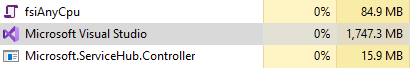
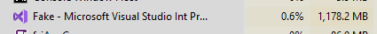

# F# 5 update

We're excited to announce some updates to F# 5 today! We shipped a lot of preview features since [F# 5 preview 1](https://devblogs.microsoft.com/dotnet/announcing-f-5-preview-1/), and they have all been stabilizing since that release. Today, we're happy to announce some minor additions to F# 5 and talk about some pretty cool performance work we've been doing.

Here's how you get the latest release:

* Install the latest [.NET 5 preview SDK](https://dotnet.microsoft.com/download/dotnet-core/5.0)
* Install [Jupyter Notebooks for .NET](https://github.com/dotnet/interactive/#how-to-install-net-interactive)

If you're using Visual Studio on Windows, you'll need both the .NET 5 preview SDK and [Visual Studio Preview installed](https://visualstudio.microsoft.com/vs/preview/).

## Using F# 5 preview

You can use F# 5 preview via the [.NET 5 preview SDK](https://dotnet.microsoft.com/download/dotnet-core/5.0), or through the [.NET and Jupyter Notebooks support](https://devblogs.microsoft.com/dotnet/net-interactive-is-here-net-notebooks-preview-2/).

If you’re using the .NET 5 preview SDK, check out a [sample repository](https://github.com/cartermp/fs5preview) showing off some of what you can do with F# 5. You can play with each of the features there instead of starting from scratch.

If you’d rather use F# 5 in your own project, you’ll need to add a `LangVersion` property with `preview` as the value. It should look something like this:

Alternatively, if you’re using Jupyter Notebooks and want a more interactive experience, check out a [sample notebook](https://gist.github.com/cartermp/6b91c3561c6a5efca4288dca37c15edc) that shows the same features, but has a more interactive output.

## F# 5 features and improvements

This release introduces only one new langauge feature. However, the other features we've shipped so far have been further stabilized. There are a few more features in the pipeline that we're considering before we call F# 5 feature complete, and we'll post updates when they're available.

### Default interface member interop

C# 8 introduced the ability to [define interfaces with default implementations](https://docs.microsoft.com/dotnet/csharp/whats-new/csharp-8#default-interface-methods) like this:

You can now consume these in F# through the standard means of implementing an interface:

This will let F# developers safely take advantage of packages or other components written in C# that use this feature and expect callers to support it.

We currently don't support _generating_ default implementations, though. If you'd like to do that, please search for or file a suggestion in the [F# language suggestions repository](https://github.com/fsharp/fslang-suggestions/issues).

### Compiler performance improvements

We've been focused on improving the performance of the F# compiler and tools for some time now, and with each release we see incremental progress. Although performance can always be improved, we're quite happy with our progress so far!

To demonstrate the difference, check out this [fork of the FSharpPlus repository](https://github.com/cartermp/fsharpplus), a codebase that stresses the F# compiler significantly with its use of certain advanced features. You can modify the `global.json` file to specify a .NET SDK on your machine. In this case, it has a .NET 5 preview and a released .NET Core 3.1 SDK from Visual Studio 2019 update 16.5 specified. If you have those SDKs on your machine, you can test this out yourself.

On my personal desktop, I get the following results when running `dotnet clean FSharpPlus.sln` followed by `dotnet build FSharpPlus.sln -c Release`:

**.NET Core 3.1:** 3:01.510
**.NET 5:** 2:16.23

That's quite an improvement! However, not all of the wall-clock time improvements are due to F#. Everything in the .NET toolchain improved too.

To dig into this a little more, I performed the same steps as before, but ran `dotnet msbuild FSharpPlus.sln /p:Congiguration=Release /clp:PerformanceSummary` to generate an MSBuild performance summary. With one run, I see the following differences in CPU time spent in the Fsc task (the F# compiler getting called):

**.NET Core 3.1:** 527522ms
**.NET 5:** 440873ms

(Note: because MSBuild is running things in parallel when it can, the CPU time is a lot longer than wall-clock time.)

This is a 16% improvement in time spent in the F# compiler to build the same codebase! When compiling the core project `FSharpPlus.fsproj`, I've personally seen up to a 35% improvement in compile times. The exact improvement can vary from machine to machine and build to build, especially if the build process doesn't have the highest priority on your machine at the time. Regardless of these caveats, build times are always improved when building this project. This has held true for a few other OSS projects that were tested.

I uploaded both logs into a [GitHub gist](https://gist.github.com/cartermp/5d45f77b68be935adf3acffabbdd8787) if you're curious about the full breakdown.

Download the .NET 5 preview and try it out yourself!

## Tooling improvements in Visual Studio 2019 Update 16.6

The compiler wasn't the only thing that got faster in this release. We've been focusing on improving the performance and reliability of the Visual Studio tools for F# throughout the Visual Studio 2019 lifecycle, and this release is no different! Starting with Visual Studio 2019 Update 16.6, features like Find All References and Rename should run considerably faster and show results much sooner when scanning a large codebase.

To demonstrate this, I've uploaded two videos showing the Find All References operation on the `string` type in FAKE, a large F# OSS codebase. This is an extreme case that isn't representative of "normal" usage for Find All References, but it helps demonstrate what might happen in the rare event that you do need to find references to an extremely common type in a large codebase.

The first video is with Visual Studio 2019 Update 16.5:

Video to embed via wordpress: https://www.youtube.com/watch?v=vGWxveh6NLI

Note that results take a lot longer to start filling in, and the entire process takes about 1 minute and 11 seconds to complete. After Find All References was finished, Visual Studio was up to ~1.75GB of memory usage:

The second is with the latest Visual Studio 2019 Update 16.6:

Video to embed via wordpress: https://youtu.be/JtjRLriCv1Q

As you can see, results start showing up much faster, and the entire process took about 43 seconds to complete! After Find All References is finished running, Visual Studio was up to ~1.2GB of memory usage:

Behind the scenes, two key components were rewritten:

* The core component that is responsible for finding symbols in user code and yielding them back to a caller who asks for symbols that match a given input
* The Visual Studio component that displays found symbols in the Find All References window and colorizes the text based on the source code being shown in the list

In addition to features like Find All References being faster, the amount of memory used to run it has also been significantly reduced, which is important when you're working in a big codebase.

## The continuing F# 5 journey

We've got even more awesome stuff planned for F# 5, and we can't wait to show you once they're finished. Until that time, we'll be focused on a few things:

* Continuing inclusion of language features when their design and implementations are stable
* Continuing to improve the tooling performance for larger F# codebases
* Making F# in Jupyter and Visual Studio Code Notebooks the best language for data science and analytical work (more on this in future updates!)

If you'd like to follow along on a much more detailed level, you can check out the [F# development repository](https://github.com/dotnet/fsharp). We're now tracking the work we're focused on with a GitHub issue every 3 weeks, and we encourage you all to provide input to the list of things and let us know what you think.

Cheers, and happy F# coding!
