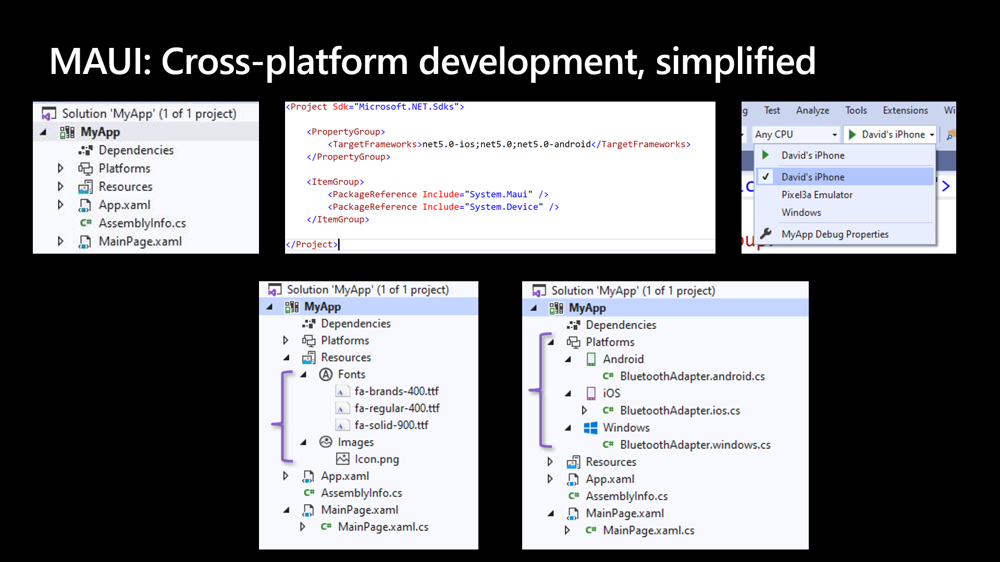
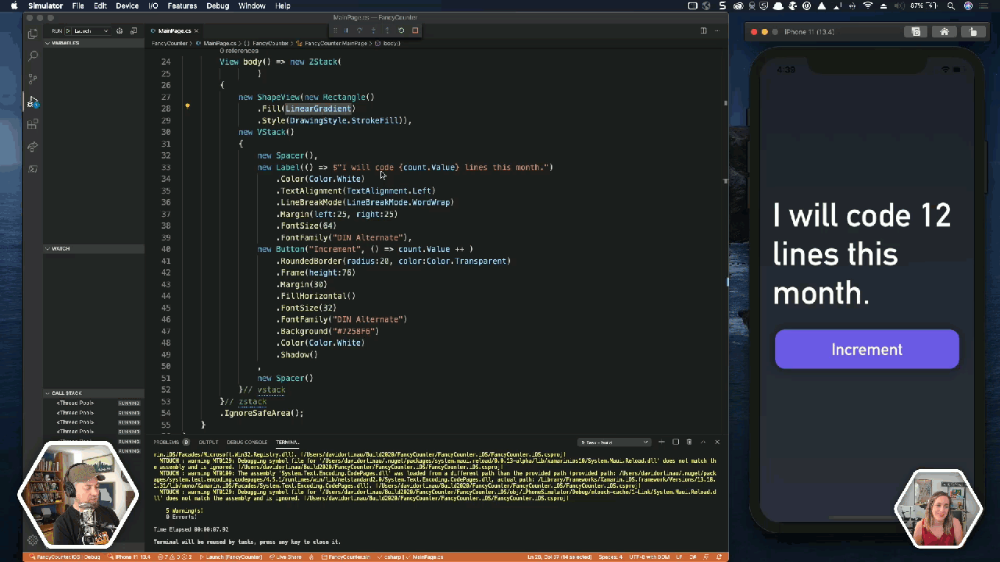

# Introducing .NET Multi-platform App UI (.NET MAUI)

You can build anything with .NET. It's one of the main reasons millions of developers choose .NET as the platform for their careers, and companies invest for their businesses. With .NET 5 we begin our journey of unifying the .NET platform, bringing .NET Core and Mono/Xamarin together in one base class library (BCL) and toolchain (SDK).

As we consider what building device applications will look like in a unified .NET, we see many devices across multiple platforms used, from Android and iOS to Windows and macOS. To address this need we are excited to announce a new first-class UI framework for doing just that: .NET Multi-platform App UI, affectionately call MAUI.

Let us introduce you to what .NET MAUI is, the MAUI single project developer experience, modern development patterns, and a look at the journey ahead.

## What is .NET MAUI

MAUI is an evolution of the increasingly popular Xamarin.Forms toolkit that turns 6 years old this month. For years [companies such as](https://dotnet.microsoft.com/apps/xamarin/customers) UPS, Ernst & Young, and Delta have been leveraging the mobile expertise of Xamarin atop .NET to power their businesses; some since the very beginning. It has also been very successful in helping small businesses maximize their development investment sharing upwards of 95% of their code, and beating their competitors to market. MAUI extends this success on mobile to embrace the desktop making it the best way to build multi-platform applications across both, especially our new devices such as the new Surface Duo.

MAUI simplifies the choices for .NET developers, providing a single stack that supports all modern workloads: Android, iOS, macOS, and Windows. The native features of each platform and UI control are within reach in a simple, cross-platform API for you to deliver no-compromise user experiences while sharing even more code than before.

## Single Project Developer Experience

MAUI is built with developer productivity in mind, including the project system and cross-platform tooling that developers need. MAUI simplifies the project structure into a single project to target multiple platforms. This means you can easily deploy to any target that you wish including your desktop, emulators, simulators, or physical devices with a single click. With built-in cross-platform resources you will be able to add any images, fonts, or translation files into the single project, and MAUI will automatically setup native hooks so you can just code. Finally, you will always have access the native underlying operating system APIs and it will be easier than ever with new platform specific integrations. Under platforms you can add source code files for a specific operating system and access the native APIs. With Maui everything is in one place where you need it to keep you productive.



This delivers:

* One project targeting multiple platforms and devices
* One location to manage resources such as fonts and images
* Multi-targeting to organize your platform-specific code

You master one way to build client apps, the MAUI way, and all platforms are within your reach. To see this in action, watch Scott Hunter's demo from Build, [The Journey to One .NET](https://aka.ms/Build2020AppDev-OneDotNet).


## Modern App Patterns

Part of the vision for one .NET is providing developer choice in the areas of personal preferences so you can be most productive using .NET. This manifests in which IDE you use whether Visual Studio 2019, Visual Studio for Mac, or even Visual Studio Code. MAUI will be available in all of those, and support both the existing MVVM and XAML patterns as well as future capabilities like Model-View-Update (MVU) with C#, or even Blazor.

### MVVM

Model-View-ViewModel (MVVM) and XAML, the predominant pattern and practice among .NET developers for decades now, are first-class features in MAUI. This will continue to grow and evolve to help make you productive building and maintaining production apps.

```xml
<StackLayout>
    <Label Text="Welcome to MAUI!" />
    <Button Text="{Binding Text}" 
            Command="{Binding ClickCommand}" />
</StackLayout>
```

```csharp
public Command ClickCommand { get; }

public string Text { get; set; } = "Click me";

int count = 0;

void ExecuteClickCommand ()
{
    count++;
    Text = $"You clicked {count} times.";
}
```

### MVU

In addition, we are enabling developers to write fluent C# UI and implement the increasingly popular Model-View-Update (MVU) pattern. MVU promotes a one-way flow of data and state management, as well as a code-first development experience that rapidly updates the UI by applying only the changes necessary. 

Below is a basic counter example in the MVU style.

```csharp
readonly State<int> count = 0;

[Body]
View body() => new StackLayout
{
    new Label("Welcome to MAUI!"),
    new Button(
        () => $"You clicked {count} times.",
        () => count.Value ++)
    )
};
```

This pattern is ideally suited for hot reload as you can see from the demo [in this session](https://aka.ms/Build2020AppDev-DotNet) at Microsoft Build 2020. Now adding styling, gradients, fonts, and some love we show MVU in action with instant hot reload from C#.



Both MVVM and MVU deliver the same native applications, performance, and platform fidelity. Developers will be able to choose which style best suits their preference and use case. 

## Transitioning from Xamarin.Forms to .NET MAUI

Xamarin.Forms developers will hit the ground running with new projects in .NET MAUI, using all the same controls and APIs they have grown to know and love. As we get closer to the MAUI launch, In order to help developers make a smooth transition of existing apps to .NET MAUI we intend to provide try-convert support and migration guides similar to what we have today for migrating to .NET Core.

### The .NET MAUI Timeline

We will begin shipping .NET MAUI previews later this year, and target a GA release with .NET 6 in November of 2021. MAUI will ship on the same 6 week cadence that Xamarin.Forms has been on.

### What's Next for Xamarin and Xamarin.Forms

As part of our .NET unification, Xamarin.iOS and Xamarin.Android will become part of .NET 6 as .NET for iOS and .NET for Android. Because these bindings are projections of the SDKs shipped from Apple and Google, nothing changes there, however build tooling, target framework monikers, and runtime framework monikers will be updated to match all other .NET 6 workloads. Our commitment to keeping .NET developers up-to-date with the latest mobile SDKs is foundational to .NET MAUI and remains firm. When .NET 6 ships, we expect to ship a final release of Xamarin SDKs in their current form that will be serviced for a year. All modern work will at that time shift to .NET 6.

Xamarin.Forms will ship a new major version later this year, and continue to ship minor and service releases every 6 weeks through .NET 6 GA in November 2021. The final release of Xamarin.Forms will be serviced for a year after shipping, and all modern work will shift to .NET MAUI.

## Get Involved Today

Join us on this journey to MAUI at our brand new repository [dotnet/maui](https://github.com/dotnet/maui). Be sure to star and watch to get notifications, then join in the discussion of proposal specs describing how we want to evolve the code base. This is the very beginning of a long journey welding Xamarin and Xamarin.Forms directly into the heart of .NET, and we are excited to do this all in the open with you.

