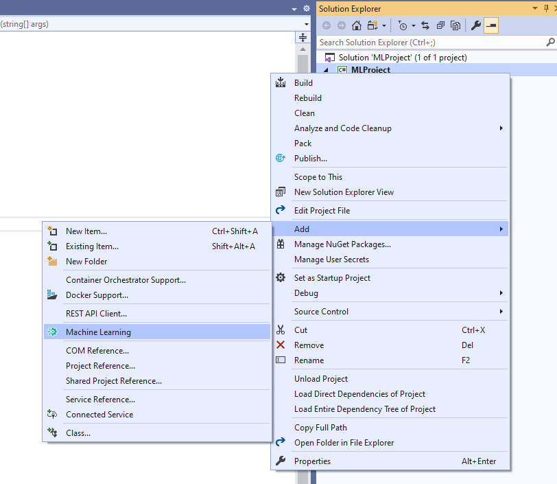
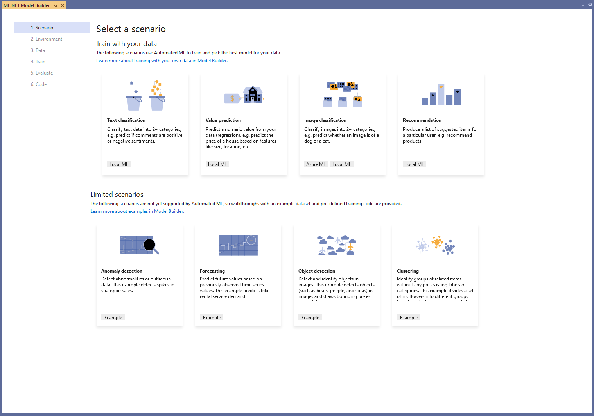
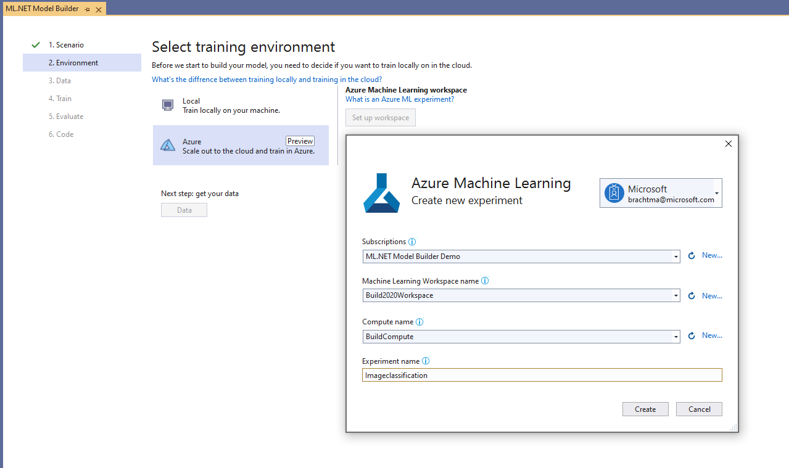

# ML.NET Model Builder is now a part of Visual Studio

[ML.NET](https://dot.net/ml) is a cross-platform, machine learning framework for .NET developers. Model Builder is the UI tooling in Visual Studio that uses Automated Machine Learning (AutoML) to train and consume custom ML.NET models in your .NET apps. You can use ML.NET and Model Builder to create custom machine learning models without having prior machine learning experience and without leaving the .NET ecosystem.

# Model Builder in Visual Studio
Previously, Model Builder was a Visual Studio extension that had to be installed from the VS Marketplace. Now, Model Builder ships with Visual Studio 16.6 as a preview feature! After enabling the Model Builder feature in VS, all you have to do is right-click on your project in Solution Explorer and add Machine Learning.

 
# New Model Builder Scenario screen
Model Builder’s Scenario screen got an update with a new, modern design and with updated scenario names to make it even easier to map your own business problems to the machine learning scenarios offered.

Additionally, anomaly detection, clustering, forecasting, and object detection have been added as example scenarios. These example scenarios are not yet supported by AutoML but are supported by ML.NET, so we’ve provided links to tutorials and sample code via the UI to help get you started.

 

# Azure training for image classification in Model Builder
For text-based classification, value prediction, image classification, and recommendation scenarios, Model Builder uses Automated Machine Learning (AutoML) locally to find and train the best model for your scenario and data. While local training is great for smaller datasets, when you train locally, you work within the constraints of your computer resources (CPU, memory, and disk).

For image classification, you can now take advantage of Azure training to scale up your resources to meet the demands of your scenario, especially for large datasets. You can set up a new Azure Machine Learning workspace and kick off an image classification training experiment right from Model Builder in Visual Studio.

Read this [blog post](/2020/04-Apr/train-image-classification-model-azure-mlnet-model-builder/train-image-classification-model-azure-mlnet-model-builder.md) to learn more about how to train deep learning models in Azure with ML.NET Model Builder.

# ML.NET Customer Showcase
## Asgard Systems
Asgard Systems is a software and consulting company in Romania that uses ML.NET for grocery demand forecasting. The company trains an ML.NET forecasting model for each product at the grocery store which predicts that product’s demand, and then each model is integrated into a .NET desktop application.

ML.NET has integrated well with Asgard’s existing solutions, leveraging SQL Server and Azure SQL, while also providing significant performance gains, both in training and inference, relative to Python implementations of the same models.

 
> "We have achieved greater than 24 million pounds of CO2 emissions in yearly savings already and by the end of 2020 /early 2021 we will have yearly savings of about 240 million pounds of CO2 emissions… We achieved impressive results without trying to influence the consumer to eat less meat or fruits or change their eating habits in any way." 
> -Mihai Mihaiescu, System Architect @ <b>Asgard Systems</b>

Read more about how Asgard Systems uses ML.NET in the [ML.NET Customer Showcase](https://dotnet.microsoft.com/apps/machinelearning-ai/ml-dotnet/customers/asgard-systems).

## Scancam
Scancam is a loss prevention company that uses ML.NET for object detection to prevent fuel theft in Australia. Fuel theft costs the Australian fuel retailing sector millions of dollars every year, so Scancam came up with a solution which uses ML.NET to detect cars and license plates at fuel station pumps and provides alerts for known offenders. These alerts are sent via SignalR to the end-user Xamarin application on iPad and TV displays inside the fuel station.

 
> "ML.NET allowed us to increase productivity by allowing us to code our ML components in the same language and tooling we use for everything else. ML.NET provided the easiest jumping point for our .NET developers to get started integrating machine learning to our applications." 
>  -June Tabadero, CTO @ <b>Scancam Industries</b>

Read more about how Scancam uses ML.NET in the [ML.NET Customer Showcase](https://dotnet.microsoft.com/apps/machinelearning-ai/ml-dotnet/customers/scancam).

# The Virtual ML.NET Community Conference
Join the community May 29-30 for a [free online ML.NET conference](https://virtualml.net/).

The conference will have a full-day hands-on workshop, followed by another day of community-led sessions.

Sign up [here](https://virtualmlnet.typeform.com/to/MT4ZDG) to attend.

See you there!

# Additional resources
Learn more about ML.NET and Model Builder from [Microsoft Docs](aka.ms/mlnet-docs).

Not currently using Visual Studio? Try out the [ML.NET CLI](https://aka.ms/mlnet-cli).

If you run into any issues, please let us know by creating an issue in our [GitHub repo](http://www.github.com/dotnet/machinelearning-modelbuilder).
