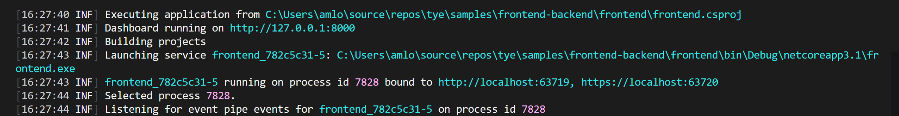
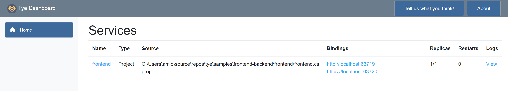
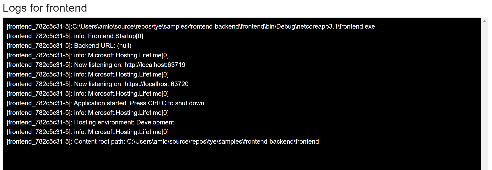
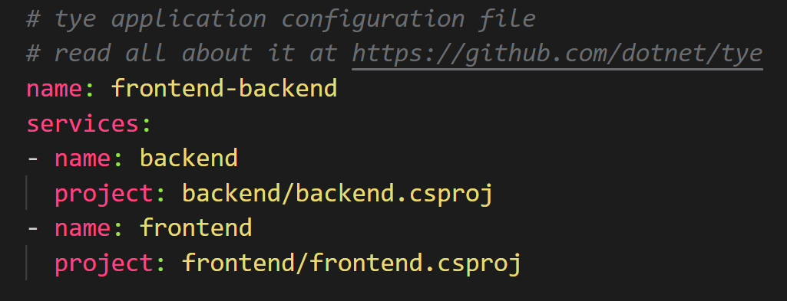
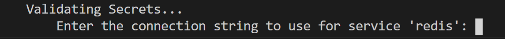
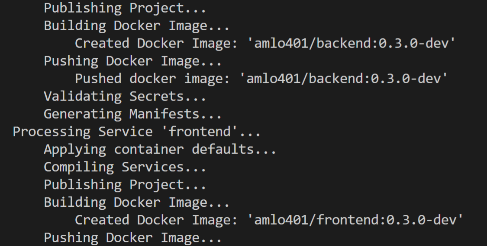
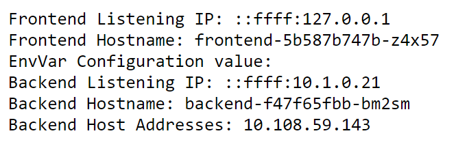

# Project Tye

[Project Tye](https://github.com/dotnet/tye) is an experimental developer tool that makes developing, testing, and deploying microservices and distributed applications easier.
 
When building an app made up of multiple projects, you often want to run more than one at a time, such as a website that communicates with a backend API or several services all communicating with each other. Today, this can be difficult to setup and not as smooth as it could be, and it's only the very first step in trying to get started with something like building out a distributed application. Once you have an inner-loop experience there is then a, sometimes steep, learning curve to get your distributed app onto a platform such as Kubernetes.
 
The project has two main goals:
 
1. Making development of microservices easier by:
    - Running many services with one command
    - Using dependencies in containers
    - Discovering addresses of other services using simple conventions
1. Automating deployment of .NET applications to Kubernetes by:
    - Automatically containerizing .NET applications
    - Generating Kubernetes manifests with minimal knowledge or configuration
    - Using a single configuration file
 
If you have an app that talks to a database, or an app that is made up of a couple of different processes that communicate with each other, then we think Tye will help ease some of the common pain points you've experienced.

We have recently demonstrated Tye in a few Build sessions that we encourage you to watch, [Cloud Native Apps with .NET and AKS](https://aka.ms/Build2020AppDev-CloudNativeApps) and [Journey to one .NET](https://aka.ms/dotnetjourney)

## Tour of Tye

### Installation

To get started with Tye, you will first need to have .[NET Core 3.1](https://dotnet.microsoft.com/download) installed on your machine. 

Tye can then be installed as a global tool using the following command:
```
dotnet tool install -g Microsoft.Tye --version "0.2.0-alpha.20258.3"
```
### Running a single service 
Tye makes it very easy to run single applications. To demonstrate this:

1. Make a new folder called microservices and navigate to it:

```
mkdir microservices
cd microservices
```

2. Then create a frontend project:

```
dotnet new razor -n frontend
```

3. Now run this project using `tye run`:

```
tye run frontend
```



The above displays how Tye is building, running, and monitoring the frontend application. 

One key feature from `tye run` is a dashboard to view the state of your application. Navigate to <http://localhost:8000> to see the dashboard running.



The dashboard is the UI for Tye that displays a list of all of your services. The `Bindings` column has links to the listening URLs of the service. The `Logs` column allows you to view the streaming logs for the service. 



Services written using ASP.NET Core will have their listening ports assigned randomly if not explicitly configured. This is useful to avoid common issues like port conflicts.

### Running multiple services 
Instead of just a single application, suppose we have a multi-application scenario where our frontend project now needs to communicate with a backend project. If you haven't already, stop the existing `tye run` command using `Ctrl + C`.

1. Create a backend API that the frontend will call inside of the `microservices/` folder.

```
dotnet new webapi -n backend
```

2. Then create a solution file and add both projects:

```
dotnet new sln
dotnet sln add frontend backend
```

You should now have a solution called `microservices.sln` that references the frontend and backend projects.

3. Run `tye` in the folder with the solution.

```
tye run
```
The dashboard should show both the frontend and backend services. You can navigate to both of them through either the dashboard of the url outputted by tye run.

> *The backend service in this example was created using the webapi project template and will return an HTTP 404 for its root URL.*

## Getting the frontend to communicate with the backend

Now that we have two applications running, let's make them communicate.

To get both of these applications communicating with each other, Tye utilizes service discovery. In general terms, service discovery describes the process by which one service figures out the address of another service. Tye uses environment variables for specifying connection strings and URIs of services.

The simplist way to use Tye's service discovery is through the `Microsoft.Extensions.Configuration` system - available by default in ASP.NET Core or .NET Core Worker projects. In addition to this, we provide the `Microsoft.Tye.Extensions.Configuration` package with some Tye-specific extensions layered on top of the configuration system.

If you want to learn more about Tye's philosophy on service discovery and see detailed usage examples, check out this [reference document](https://github.com/dotnet/tye/blob/master/docs/reference/service_discovery.md).

1. If you haven't already, stop the existing `tye run` command using `Ctrl + C`. Open the solution in your editor of choice.

2. Add a file `WeatherForecast.cs` to the `frontend` project.

    ```C#
    using System;

    namespace frontend
    {
        public class WeatherForecast
        {
            public DateTime Date { get; set; }

            public int TemperatureC { get; set; }

            public int TemperatureF => 32 + (int)(TemperatureC / 0.5556);

            public string Summary { get; set; }
        }
    }
    ```

    This will match the backend `WeatherForecast.cs`.

3. Add a file `WeatherClient.cs` to the `frontend` project with the following contents:

    ```C#
    using System.Net.Http;
    using System.Text.Json;
    using System.Threading.Tasks;

    namespace frontend
    {
        public class WeatherClient
        {
            private readonly JsonSerializerOptions options = new JsonSerializerOptions()
            {
                PropertyNameCaseInsensitive = true,
                PropertyNamingPolicy = JsonNamingPolicy.CamelCase,
            };
    
            private readonly HttpClient client;
    
            public WeatherClient(HttpClient client)
            {
                this.client = client;
            }
    
            public async Task<WeatherForecast[]> GetWeatherAsync()
            {
                var responseMessage = await this.client.GetAsync("/weatherforecast");
                var stream = await responseMessage.Content.ReadAsStreamAsync();
                return await JsonSerializer.DeserializeAsync<WeatherForecast[]>(stream, options);
            }
        }
    }
    ```

4. Add a reference to the `Microsoft.Tye.Extensions.Configuration` package to the frontend project

    ```txt
    dotnet add frontend/frontend.csproj package Microsoft.Tye.Extensions.Configuration  --version "0.2.0-*"
    ```

5. Now register this client in `frontend` by adding the following to the existing `ConfigureServices` method to the existing `Startup.cs` file:

   ```C#
   ...
   public void ConfigureServices(IServiceCollection services)
   {
       services.AddRazorPages();
        /** Add the following to wire the client to the backend **/
       services.AddHttpClient<WeatherClient>(client =>
       {
            client.BaseAddress = Configuration.GetServiceUri("backend");
       });
       /** End added code **/
   }
   ...
   ```

   This will wire up the `WeatherClient` to use the correct URL for the `backend` service.

6. Add a `Forecasts` property to the `Index` page model under `Pages\Index.cshtml.cs` in the `frontend` project.

    ```C#
    ...
    public WeatherForecast[] Forecasts { get; set; }
    ...
    ```

   Change the `OnGet` method to take the `WeatherClient` to call the `backend` service and store the result in the `Forecasts` property:

   ```C#
   ...
   public async Task OnGet([FromServices]WeatherClient client)
   {
        Forecasts = await client.GetWeatherAsync();
   }
   ...
   ```

7. Change the `Index.cshtml` razor view to render the `Forecasts` property in the razor page:

   ```cshtml
   @page
   @model IndexModel
   @{
        ViewData["Title"] = "Home page";
    }

   <div class="text-center">
       <h1 class="display-4">Welcome</h1>
       <p>Learn about <a href="https://docs.microsoft.com/aspnet/core">building Web apps with ASP.NET Core</a>.</p>
   </div>

   Weather Forecast:

    <table class="table">
        <thead>
            <tr>
                <th>Date</th>
                <th>Temp. (C)</th>
                <th>Temp. (F)</th>
                <th>Summary</th>
            </tr>
        </thead>
        <tbody>
            @foreach (var forecast in @Model.Forecasts)
            {
                <tr>
                    <td>@forecast.Date.ToShortDateString()</td>
                    <td>@forecast.TemperatureC</td>
                    <td>@forecast.TemperatureF</td>
                    <td>@forecast.Summary</td>
                </tr>
            }
        </tbody>
    </table>
   ```

8.  Run the project with [`tye run`](/docs/reference/commandline/tye-run.md) and the `frontend` service should be able to successfully call the `backend` service!

    When you visit the `frontend` service you should see a table of weather data. This data was produced randomly in the `backend` service. The fact that you're seeing it in a web UI in the `frontend` means that the services are able to communicate. Unfortunately, this doesn't work out of the box on Linux
    right now due to how self-signed certificates are handled, please see the workaround [here](https://github.com/dotnet/tye/blob/master/docs/tutorials/hello-tye/00_run_locally.md#troubleshooting)


### Tye's configuration schema

Tye has a optional configuration file (`tye.yaml`) to enable customizing settings. This file contains all of your projects and external dependencies. If you have an existing solution, Tye will automatically populate this with all of your current projects. 

To initalize this file, you will need to run the following command in the `microservices` directory to generate a default `tye.yaml` file:

```
tye init
```

The contents of the `tye.yaml` should look like this:



The top level scope (like the name node) is where global settings are applied.

`tye.yaml` lists all of the application's services under the services node. This is the place for per-service configuration.

To learn more about Tye's yaml specifications and schema, you can check it out [here](https://github.com/dotnet/tye/blob/master/docs/reference/schema.md) in Tye's repository on Github.

> *We provide a json-schema for tye.yaml and some editors support json-schema for completion and validation of yaml files. See [json-schema](https://github.com/dotnet/tye/blob/master/src/schema/README.md) for instructions.*

### Adding external dependencies (Redis)

Not only does Tye make it easy to run and deploy your applications to Kubernetes, it's also fairly simple to add external dependencies to your applications as well. We will now add redis to the frontend and backend application to store data.

Tye can use Docker to run images that run as part of your application. Make sure that [Docker](https://docs.docker.com/get-docker/) is installed on your machine.

1. Change the `WeatherForecastController.Get()` method in the `backend` project to cache the weather information in redis using an `IDistributedCache`.

   Add the following `using`'s to the top of the file:

   ```C#
   using Microsoft.Extensions.Caching.Distributed;
   using System.Text.Json;
   ```

   And update `Get()`:

   ```C#
   [HttpGet]
   public async Task<string> Get([FromServices]IDistributedCache cache)
   {
       var weather = await cache.GetStringAsync("weather");

       if (weather == null)
       {
           var rng = new Random();
           var forecasts = Enumerable.Range(1, 5).Select(index => new WeatherForecast
           {
               Date = DateTime.Now.AddDays(index),
               TemperatureC = rng.Next(-20, 55),
               Summary = Summaries[rng.Next(Summaries.Length)]
           })
           .ToArray();

           weather = JsonSerializer.Serialize(forecasts);

           await cache.SetStringAsync("weather", weather, new DistributedCacheEntryOptions
           {
               AbsoluteExpirationRelativeToNow = TimeSpan.FromSeconds(5)
           });
       }
       return weather;
   }
   ```

   This will store the weather data in Redis with an expiration time of 5 seconds.


2. Add a package reference to `Microsoft.Extensions.Caching.StackExchangeRedis` in the backend project:

   ```
   cd backend/
   dotnet add package Microsoft.Extensions.Caching.StackExchangeRedis
   cd ..
   ```

3. Modify `Startup.ConfigureServices` in the `backend` project to add the redis `IDistributedCache` implementation.
   ```C#
   public void ConfigureServices(IServiceCollection services)
   {
       services.AddControllers();

       services.AddStackExchangeRedisCache(o =>
       {
            o.Configuration = Configuration.GetConnectionString("redis");
        });
   }
   ```
   The above configures redis to the configuration string for the `redis` service injected by the `tye` host.

4. Modify `tye.yaml` to include redis as a dependency.

   > :bulb: You should have already created `tye.yaml` in a previous step near the end of the deployment tutorial.

   ```yaml
   name: microservice
   services:
   - name: backend
     project: backend\backend.csproj
   - name: frontend
     project: frontend\frontend.csproj
   - name: redis
     image: redis
     bindings:
     - port: 6379
       connectionString: "${host}:${port}"
   - name: redis-cli
     image: redis
     args: "redis-cli -h redis MONITOR"
   ```

    We've added 2 services to the `tye.yaml` file. The `redis` service itself and a `redis-cli` service that we will use to watch the data being sent to and retrieved from redis.

    > :bulb: The `"${host}:${port}"` format in the `connectionString` property will substitute the values of the host and port number to produce a connection string that can be used with StackExchange.Redis.

5. Run the `tye` command line in the solution root

   > :bulb: Make sure your command-line is in the `microservices/` directory. One of the previous steps had you change directories to edit a specific project.

   ```
   tye run
   ```

   Navigate to <http://localhost:8000> to see the dashboard running. Now you will see both `redis` and the `redis-cli` running listed in the dashboard.
   
   Navigate to the `frontend` application and verify that the data returned is the same after refreshing the page multiple times. New content will be loaded every 5 seconds, so if you wait that long and refresh again, you should see new data. You can also look at the `redis-cli` logs using the dashboard and see what data is being cached in redis.

> The `"${host}:${port}"` format in the `connectionString` property will substitute the values of the host and port number to produce a connection string that can be used with StackExchange.Redis.

### Deploying to Kubernetes

Tye makes the process of deploying your application to Kubernetes very simple with minimal knowlege or configuration required.

> *Tye will use your current credentials for pushing Docker images and accessing Kubernetes clusters. If you have configured kubectl with a context already, that's what [`tye deploy`](/docs/reference/commandline/tye-deploy.md) is going to use!*

Prior to deploying your application, make sure to have the following:

1. [Docker](https://www.docker.com/products/docker-desktop) installed based off on your operating system
1. A container registry. Docker by default will create a container registry on [DockerHub](https://hub.docker.com/). You could also use [Azure Container Registry](https://azure.microsoft.com/en-us/services/container-registry/) (ACR) or another container registry of your choice.
1. A Kubernetes Cluster. There are many different options here, including:
   - [Kubernetes in Docker Desktop](https://www.docker.com/blog/docker-windows-desktop-now-kubernetes/)
   - [Azure Kubernetes Service](https://docs.microsoft.com/en-us/azure/aks/tutorial-kubernetes-deploy-cluster)
   - [Minikube](https://kubernetes.io/docs/tasks/tools/install-minikube/)
   - [K3s](https://k3s.io) - *a lightweight single-binary certified Kubernetes distribution from Rancher*.
   - Another Kubernetes provider of your choice.

> *If you choose a container registry provided by a cloud provider (other than Dockerhub), you will likely have to take some steps to configure your kubernetes cluster to allow access. Follow the instructions provided by your cloud provider.*  

#### Deploying Redis
`tye deploy` will not deploy the redis configuration, so you need to deploy it first by running:

```
kubectl apply -f https://raw.githubusercontent.com/dotnet/tye/master/docs/tutorials/hello-tye/redis.yaml
```

This will create a deployment and service for redis.

#### Tye deploy

You can deploy your application by running the follow command:
```
tye deploy --interactive
```
> *Enter the Container Registry (ex: `example.azurecr.io` for Azure or `example` for dockerhub):*

You will be prompted to enter your container registry. This is needed to tag images, and to push them to a location accessible by kubernetes.


If you are using dockerhub, the registry name will be your dockerhub username. If you are using a standalone container registry (for instance from your cloud provider), the registry name will look like a hostname, eg: `example.azurecr.io`.


You'll also be prompted for the connection string for redis.



Enter the following to use the instance that you just deployed:

```
redis:6379
```
`tye deploy` will create Kubernetes secret to store the connection string.

> *--interactive is needed here to create the secret. This is a one-time configuration step. In a CI/CD scenario you would not want to have to specify connection strings over and over, deployment would rely on the existing configuration in the cluster.*

Tye uses Kubernetes secrets to store connection information about dependencies like redis that might live outside the cluster. Tye will automatically generate mappings between service names, binding names, and secret names.

`tye deploy` does many different things to deploy an application to Kubernetes. It will:

- Create a docker image for each project in your application.
- Push each docker image to your container registry.
- Generate a Kubernetes `Deployment` and `Service` for each project.
- Apply the generated `Deployment` and `Service` to your current Kubernetes context.




You should now see three pods running after deploying.

```
kubectl get pods
```

```
NAME                                             READY   STATUS    RESTARTS   AGE
backend-ccfcd756f-xk2q9                          1/1     Running   0          85m
frontend-84bbdf4f7d-6r5zp                        1/1     Running   0          85m
redis-5f554bd8bd-rv26p                           1/1     Running   0          98m
```

You can visit the frontend application, you will need to port-forward to access the frontend from outside the cluster.

```
kubectl port-forward svc/frontend 5000:80
```

Now navigate to http://localhost:5000 to view the frontend application working on Kubernetes.



> *Currently tye does not automatically enable TLS within the cluster, and so communication takes place over HTTP instead of HTTPS. This is typical way to deploy services in kubernetes - we may look to enable TLS as an option or by default in the future.*

### Adding a registry to tye.yaml

If you want to use `tye deploy` as part of a CI/CD system, it's expected that you'll have a `tye.yaml` file initialized. You will then need to add a container registry to `tye.yaml`. Based on what container registry you configured, add the following line in the `tye.yaml` file:

```
registry: <registry_name>
```

Now it's possible to use `tye deploy` without `--interactive` since the registry is stored as part of configuration.

> *This step may not make much sense if you're using tye.yaml to store a personal Dockerhub username. A more typical use case would storing the name of a private registry for use in a CI/CD system*.

For a conceptual overview of how Tye behaves when using `tye deploy` for deployment, check out this [document](https://github.com/dotnet/tye/blob/master/docs/reference/deployment.md).

### Undeploying your application

After deploying and playing around with the application, you may want to remove all resources associated from the Kubernetes cluster. You can remove resources by running:

```
tye undeploy
```

This will remove all deployed resources. If you'd like to see what resources would be deleted, you can run:

```
tye undeploy --what-if
```

### Follow up
If you want to experiment more with using Tye, we have a variety of different sample applications and tutorials that you can walk through, check them out down below:

* [Tye samples](https://github.com/dotnet/tye/tree/master/samples)
* [Recipes](https://github.com/dotnet/tye/tree/master/docs/recipes)

## Tye Roadmap

We have been diligently working on adding new capabilities and integrations to continuously improve Tye. Here are some integrations below that we have recently released. There is also information provided on how to get started for each of these:

* [Ingress](https://github.com/dotnet/tye/blob/master/docs/recipes/ingress.md) - *to expose pods/services created to the public internet*.
* [Redis](https://github.com/dotnet/tye/blob/master/docs/tutorials/hello-tye/02_add_redis.md) - *to store data, cache, or as a message broker*.
* [Dapr](https://github.com/dotnet/tye/blob/master/docs/recipes/dapr.md) - *for integrating a Dapr application with Tye*.
* [Zipkin](https://github.com/dotnet/tye/blob/master/docs/recipes/distributed_tracing.md) - *using Zipkin for distributed tracing*. 
* [Elastic Stack](https://github.com/dotnet/tye/blob/master/docs/recipes/logging.md) - *using Elastic Stack for logging*.

While we are excited about the promise Tye holds, it's an experimental project and not a committed product. During this experimental phase we expect to engage deeply with anyone trying out Tye to hear feedback and suggestions. The point of doing experiments in the open is to help us explore the space as much as we can and use what we learn to determine what we should be building and shipping in the future.

Project Tye is currently commited as an experiment until .NET 5 ships. At which point we will be evaluating what we have and all that we've learnt to decide what we should do in the future.

Our goal is to [ship every month](https://github.com/dotnet/tye/releases), and some new capabilities that we are looking into for Tye include:

- More deployment targets
- Sidecar support
- Connected development
- Database migrations

## Conclusion

We are excited by the potential Tye has to make developing distributed applications easier and we need your feedback to make sure it reaches that potential. We'd really love for you to try it out and tell us what you think, there is a link to a survey on the Tye dashboard that you can fill out or you can create issues and talk to us on [GitHub](https://github.com/dotnet/tye). Either way we'd love to hear what you think.
