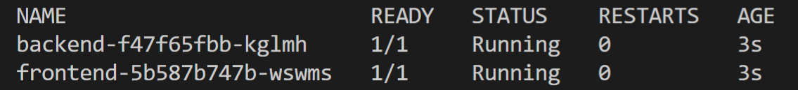
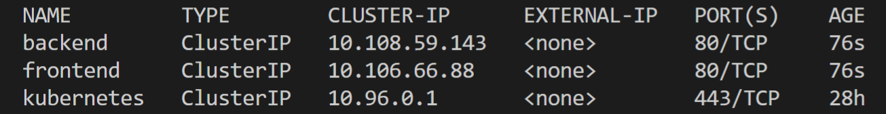
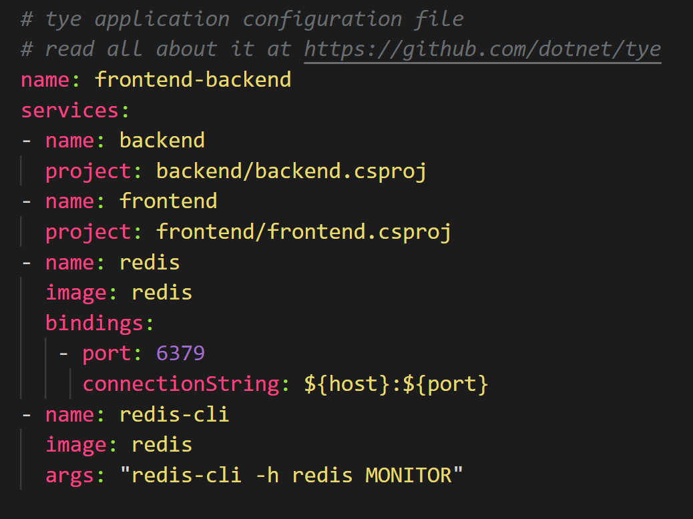
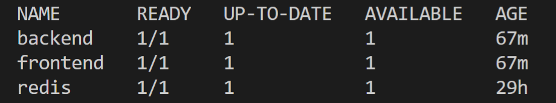
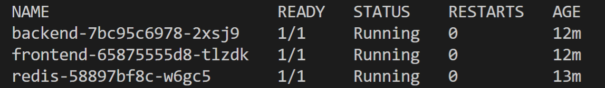

# Project Tye

[Project Tye](https://github.com/dotnet/tye) is an experimental developer tool that makes developing, testing, and deploying microservices and distributed applications easier.
 
When building an app made up of multiple projects, you often want to run more than one at a time, such as a website that communicates with a backend API or several services all communicating with each other. Today this can be difficult to setup and not as smooth as it could be, and it's only the very first step in trying to get started with something like building out a distributed application. Once you have an inner-loop experience there is then a, sometimes steep, learning curve to get your distributed app onto a platforms such as Kubernetes.
 
The project has two main goals:
 
1. Making development of microservices easier by:
    - Run many services with one command
    - Use dependencies in containers
    - Discover addresses of other services using simple conventions
1. Automating deployment of .NET applications to Kubernetes by:
    - Automatically containerizing .NET applications
    - Generating Kubernetes manifests with minimal knowledge or configuration
    - Using the same conventions as development to keep it consistent
 
If you have an app that talks to a database, or an app that is made up of a couple of different processes that communicate with each other, then we think Tye will help ease some of the common pain points you've experienced.

## Tour of Tye

### Installation

To get started with Tye, you will first need to have .[NET Core 3.1](https://dotnet.microsoft.com/download) installed on your machine. 

Tye can then be installed as a global tool using the following command:
```
dotnet tool install -g Microsoft.Tye --version "0.2.0-alpha.20258.3"
```
### Running a single application 
Tye makes it very easy to run single applications. To demonstrate this:

Make a new folder called microservice and navigate to it:

```
mkdir microservices
cd microservices
```

Then create a frontend project:

```
dotnet new razor -n frontend
```

Now run this project using `tye`:

```
tye run frontend
```


The above displays how Tye is processing, listening, and building the frontend application. 

One key feature from `tye run` is the dashboard that gets generated. Navigate to <http://localhost:8000> to see the dashboard running.


The dashboard is the UI for Tye that displays a list of all of your services. The `Bindings` column has links to the listening URLs of the service. The `Logs` column allows you to view the streaming logs for the service. 


Services written using ASP.NET Core will have their listening ports assigned randomly if not explicitly configured. This is useful to avoid common issues like port conflicts.

### Running multiple applications 
Instead of just a single application, suppose we have a multi-application scenario where our frontend project now needs to communicate with a backend project. Create a backend API that the frontend will call inside of the `microservices/` folder.

Then create a solution file and add both projects:

```
dotnet new sln
dotnet sln add frontend backend
```

Now you should have a solution called `microservices.sln` that references the frontend and backend projects.

You can now run `tye` in the folder with the solution.

```
tye run
```

You can download or clone the full solution that contain both the frontend and backend projects [here](https://github.com/dotnet/tye/tree/master/samples/frontend-backend) in Tye's Github repository. This sample application will be used in subsquent sections with some optional additions.

To help your services communicate with each other while running your application, Tye utilizes service discovery. In general terms, service discovery describes the process by which one service figures out the address of another service. Tye uses environment variables for specifying connection strings and URIs of services.

The simplist way to use Tye's service discovery is through the `Microsoft.Extensions.Configuration` system - available by default in ASP.NET Core or .NET Core Worker projects. In addition to this, we provide the `Microsoft.Tye.Extensions.Configuration` package with some Tye-specific extensions layered on top of the configuration system.

If you want to learn more about Tye's philosphy on service discovery and see detailed usage examples, check out this [reference doc](https://github.com/dotnet/tye/blob/master/docs/reference/service_discovery.md).

Now that you are able to run a single and multi-project application with `tye run`, the next section will cover how to deploy this application to Kubernetes.

### Deploying to Kubernetes

Tye makes the process of deploying your application to Kubernetes very simple with minimal knowlege or configuration required.

> *Tye will use your current credentials for pushing Docker images and accessing kubernetes clusters. If you have configured kubectl with a context already, that's what [`tye deploy`](/docs/reference/commandline/tye-deploy.md) is going to use!*

Prior to deploying your application, make sure to have the following:

1. [Docker](https://www.docker.com/products/docker-desktop) installed based off on your operating system
1. A container registry. Docker by default will create a container registry on [DockerHub](https://hub.docker.com/). You could also use [Azure Container Registry](https://azure.microsoft.com/en-us/services/container-registry/) (ACR) or another container registry of your choice.
1. A Kubernetes Cluster. There are many different options here, including:
   - [Azure Kubernetes Service](https://docs.microsoft.com/en-us/azure/aks/tutorial-kubernetes-deploy-cluster)
   - [Kubernetes in Docker Desktop](https://www.docker.com/blog/docker-windows-desktop-now-kubernetes/)
   - [Minikube](https://kubernetes.io/docs/tasks/tools/install-minikube/)
   - [K3s](https://k3s.io) - *a lightweight single-binary certified Kubernetes distribution from Rancher*.
   - Another Kubernetes provider of your choice.

> *If you choose a container registry provided by a cloud provider (other than Dockerhub), you will likely have to take some steps to configure your kubernetes cluster to allow access. Follow the instructions provided by your cloud provider.*  

Now that we have our sample application running locally, let's deploy the application. In this example, we will deploy to Kubernetes by using `tye deploy`.

You can deploy your application by running the follow command:
```
tye deploy --interactive
```
> *Enter the Container Registry (ex: `example.azurecr.io` for Azure or `example` for dockerhub):*


You will be prompted to enter your container registry. This is needed to tag images, and to push them to a location accessible by kubernetes.


If you are using dockerhub, the registry name will your dockerhub username. If you are a standalone container registry (for instance from your cloud provider), the registry name will look like a hostname, eg: `example.azurecr.io`.

`tye deploy` does many different things to deploy an application to Kubernetes. It will:

- Create a docker image for each project in your application.
- Push each docker image to your container registry.
- Generate a Kubernetes `Deployment` and `Service` for each project.
- Apply the generated `Deployment` and `Service` to your current Kubernetes context.


You should now see two pods running after deploying.

```
kubectl get pods
```



You'll have two services in addition to the built-in kubernetes service.

```
kubectl get service
```


You can visit the frontend application, you will need to port-forward to access the frontend from outside the cluster.

```
kubectl port-forward svc/frontend 5000:80
```

Now navigate to http://localhost:5000 to view the frontend application working on Kubernetes.


> *Currently tye does not automatically enable TLS within the cluster, and so communication takes place over HTTP instead of HTTPS. This is typical way to deploy services in kubernetes - we may look to enable TLS as an option or by default in the future.*

### Tye's configuration schema

Tye has a optional configuration file (`tye.yaml`) to allow customizing settings. This file contains all of your projects and external dependencies. If you have an existing solution, Tye will automatically populate this with all of your current projects. 

To initalize this file, you will need to run the following command in the microservices directory to generate a default `tye.yaml` file:

```
tye init
```

The contents of the `tye.yaml` should look like this:


The top level scope (like the name node) is where global settings are applied.

`tye.yaml` lists all of the application's services under the services node. This is the place for per-service configuration.

To learn more about Tye's yaml specifications and schema, you can check it out [here](https://github.com/dotnet/tye/blob/master/docs/reference/schema.md) in Tye's repository on Github.

> *We provide a json-schema for tye.yaml and some editors support json-schema for completion and validation of yaml files. See [json-schema](https://github.com/dotnet/tye/blob/master/src/schema/README.md) for instructions.*

If you want to use `tye deploy` as part of a CI/CD system, it's expected that you'll have a `tye.yaml` file initalized. You will then need to add a container registry to `tye.yaml`. Based on what container registry you configured, add the following line in the `tye.yaml` file:

```
registry: <registry_name>
```

Now it's possible to use `tye deploy` without `--interactive` since the registry is stored as part of configuration.

> *This step may not make much sense if you're using tye.yaml to store a personal Dockerhub username. A more typical use case would storing the name of a private registry for use in a CI/CD system*.


For a conceptual overview of how Tye behaves when using `tye deploy` for deployment, check out this [document](https://github.com/dotnet/tye/blob/master/docs/reference/deployment.md).


### Undeploying your application

After deploying and playing around with the application, you may want to remove all resources associated from the Kubernetes cluster. You can remove resources by running:

```
tye undeploy
```

This will remove all deployed resources. If you'd like to see what resources would be deleted, you can run:

```
tye undeploy --what-if
```

### Adding external dependencies (Redis)
Not only does Tye make it easy to run and deploy your applications to Kubernetes, it's also fairly simple to add external dependencies to your applications as well. In this example, Redis is added to the frontend and backend application to store data.

Tye can use docker to run images that run as part of your application. Make sure that [Docker](https://docs.docker.com/get-docker/) is installed on your machine.

You can download or clone the full solution that contains the redis, frontend, and backend projects [here](https://github.com/dotnet/tye/blob/master/samples/redis/tye.yaml) in Tye's Github repository.

To incorporate redis in this application, two additional services are added to the `tye.yaml` file - the `redis` service itself and a `redis-cli` service that is used watch the data being sent to and retrieved from redis.




> The `"${host}:${port}"` format in the `connectionString` property will substitute the values of the host and port number to produce a connection string that can be used with StackExchange.Redis.

You can then run `tye` in the solution root. 

```
tye run
```

### Deploying Redis 

`tye deploy` will not deploy the redis configuration, so you need to deploy it first by running:

```
kubectl apply -f https://raw.githubusercontent.com/dotnet/tye/master/docs/tutorials/hello-tye/redis.yaml

```

This will create a deployment and service for redis. You can see that by running:

```
kubectl get deployments
```



You can now deploy the rest of the application by running:

```
tye deploy --interactive
```

You'll be prompted for the connection string for redis.


Enter the following to use instance that you just deployed:

```
redis:6379
```
`tye deploy` will create kubernetes secret to store the connection string.

> *--interactive is needed here to create the secret. This is a one-time configuration step. In a CI/CD scenario you would not want to have to specify connection strings over and over, deployment would rely on the existing configuration in the cluster.*

Tye uses Kubernetes secrets to store connection information about dependencies like redis that might live outside the cluster. Tye will automatically generate mappings between service names, binding names, and secret names.

You should now see three pods running after deploying.

```
kubectl get pods
```



Just like the previous time, you can port-forward to access the frontend from outside the cluster.

```
kubectl port-forward svc/frontend 5000:80
```

You can now visit `http://localhost:5000` to see the frontend working in Kubernetes.

### Tutorials
If you want to experiment more with using Tye, we have a variety of different sample applications and tutorials that you can walk through, check them out down below:

* [Tye tutorials](https://github.com/dotnet/tye/blob/master/docs/tutorials/hello-tye/00_run_locally.md)
* [Tye samples](https://github.com/dotnet/tye/tree/master/samples)

## Tye Roadmap

We have been diligently working on adding new capabilities and integrations to continuously improve Tye. Here are some of the things below that we have recently released. There is also information provided on how to get started for each of these:

* [Ingress](https://github.com/dotnet/tye/blob/master/docs/recipes/ingress.md) - *to expose pods/services created to the public internet*.
* [Redis](https://github.com/dotnet/tye/blob/master/docs/tutorials/hello-tye/02_add_redis.md) - *to store data, cache, or as a message broker*.
* [Dapr](https://github.com/dotnet/tye/blob/master/docs/recipes/dapr.md) - *for integrating a Dapr application with Tye*.
* [Zipkin](https://github.com/dotnet/tye/blob/master/docs/recipes/distributed_tracing.md) - *using Zipkin for distributed tracing*. 
* [Elastic Stack](https://github.com/dotnet/tye/blob/master/docs/recipes/logging.md) - *using Elastic Stack for logging*.

While we are excited about the promise Tye holds, it's an experimental project and not a committed product. During this experimental phase we expect to engage deeply with anyone trying out Tye to hear feedback and suggestions. The point of doing experiments in the open is to help us explore the space as much sa we can and use what we learn to determine what we should be building and shipping in the Future.

Project Tye is currently commited as an experiment until .NET 5 ships. At which point we will be evaluating what we have and all that we've learnt to decide what we should do in the future.

Our goal is to [ship every month](https://github.com/dotnet/tye/releases), and some neew capabilities that we are looking into for Tye include:

- More deployment targets
- Sidecar support
- Connected development
- Database migrations

## Conclusion

We are excited by the potential Tye has to make developing distributed applications easier and we need your feedback to make sure it reaches that potential. We'd really love for you to try it out and tell us what you think, there is a link to a survey on the Tye dashboard that you can fill out or you can create issues and talk to us on GitHub. Either way we'd love to hear what you think.
