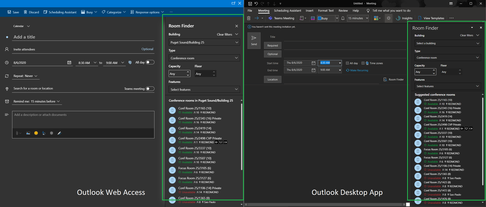

# Bring the best of the Web to your .NET desktop applications with WebView2

Last year at Build, we introduced [WebView2](aka.ms/webview), a browser control that renders web content (HTML/CSS/JavaScript) with the new Chromium-based Microsoft Edge. It was originally limited in scope to C/C++ applications. Today, we are happy to announce the release of the [WebView2](aka.ms/webview) preview for .NET applications!

`WebView2` is available for both .NET Core and .NET Framework. It can be used inside of [WPF](https://docs.microsoft.com/microsoft-edge/WebView2/gettingstarted/wpf), [Windows Forms](https://docs.microsoft.com/microsoft-edge/WebView2/gettingstarted/winforms) and [WinUI 3.0](https://docs.microsoft.com/en-us/microsoft-edge/webview2/gettingstarted/winui) applications all the way down to Windows 7.

> **Important**: When installing the NuGet package, make sure to select a version with the `-prerelease` suffix.  Otherwise you will not get .NET support. Also, make sure to check **Include prerelease**.

Going forward, we will be updating our SDK every six weeks according to the [Roadmap](https://docs.microsoft.com/microsoft-edge/webview2/roadmap), driven by your [feedback](aka.ms/WebViewFeedback). You can keep up with the latest updates in the [Release Notes](https://docs.microsoft.com/microsoft-edge/webview2/releasenotes).

## About the control 

With the help of the `WebView` family of controls you can host web content in your desktop .NET applications and enhance them with all the benefits that web has to offer, such as dynamic content, modern user interfaces, and tooling.

### A little history
Originally, we started with the `WebBrowser` control which is based on Internet Explorer and thus no longer suitable for modern web content. We then created an Edge-based control called `WebView`. This control is only available on Windows 10 and can't be included in your app. We've heard your feedback loud and clear that you want a modern and consistent control supported on all Windows versions starting from Windows 7. This is how `WebView2` came to life. It is based on the Microsoft Edge Chromium platform, consistent across all Windows versions starting from Windows 7. It receives updates every 6 weeks, enabling you to consume the latest features.

### Present
`WebView2` supports many features such as navigation, web messaging (communication between the application and the `WebView2` control), native object injection (accessing application objects directly from JavaScript) and so on. Check out our [documentation](aka.ms/webview2) for more details.

At Microsoft, we are using `WebView2` in many of our applications. One example is the Room Finder panel in the desktop version of Outlook. By using `WebView2`, we were able to reuse the code from Outlook's web UI and make it accessible directly to the desktop version.

### Future

Currently `WebView2` is in Preview and we are working on the GA version. As a part of that effort we will be providing designer support for Windows Forms and WPF so you can enjoy the familiarity of drag-and-drop and WYSIWYG experience. See our [Roadmap](https://docs.microsoft.com/microsoft-edge/webview2/roadmap) for more information. Today Windows Forms .NET Framework designer experience is already supported and the rest is comming.

## Supported platforms

A developer preview is available for the following programming platforms:

* Win32 C/C++
* .NET Framework 4.6.2 or later
* .NET Core 3.0 or later
* WinUI 3.0

and the following versions of Windows

* Windows 10
* Windows 8.1
* Windows 8
* Windows 7
* Windows Server 2016
* Windows Server 2012
* Windows Server 2012 R2
* Windows Server 2008 R2

## Getting started 

Check out our getting started guides:
* [Getting started guide for Windows Forms](https://docs.microsoft.com/microsoft-edge/WebView2/gettingstarted/winforms)
* [Getting started guide for WPF](https://docs.microsoft.com/microsoft-edge/WebView2/gettingstarted/wpf)
* [Getting started guide for WinUI 3.0](https://docs.microsoft.com/en-us/microsoft-edge/webview2/gettingstarted/winui)
* [Getting started guide for Win32](https://docs.microsoft.com/en-us/microsoft-edge/webview2/gettingstarted/win32)

## Give us your feedback 

Your feedback is our main factor in creating the [Roadmap](https://docs.microsoft.com/microsoft-edge/webview2/roadmap) and prioritizing work items. Please share your opinions, suggestions, and details on your scenarios in our [feedback repo](aka.ms/WebViewFeedback). We appreciate your help!

This blog post was written together with Palak Goel, Program Maneger on Edge Product Development team.