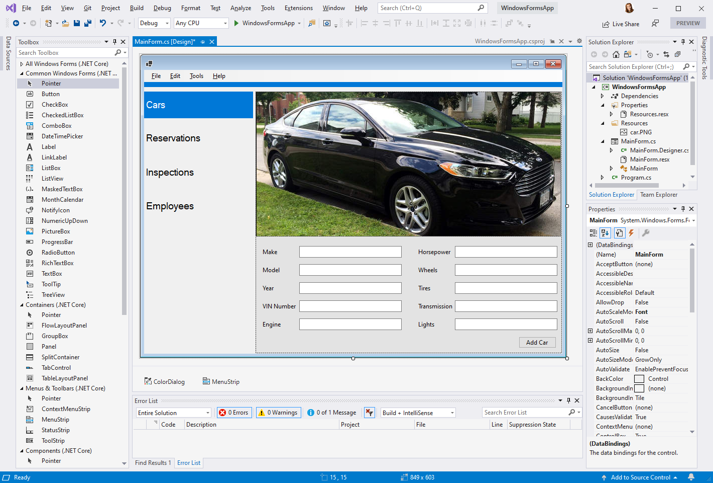
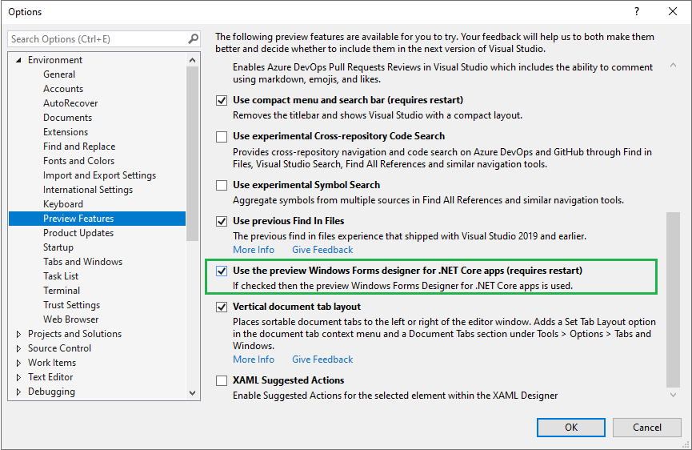

# Windows Forms Designer for .NET Core Released

Today we're happy to announce that the Windows Forms designer for .NET Core projects is now available in Visual Studio 2019 version 16.6! We also have a newer version of the designer available in [Visual Studio 16.7 Preview 1](https://docs.microsoft.com/en-us/visualstudio/releases/2019/release-notes-preview#16.7.0-pre.1.0)!

    Don't forget to enable the designer in **Tools** > **Options** > **Environment** > **Preview Features**.

Many of you may remember that we [open-sourced Windows Forms](https://blogs.windows.com/windowsdeveloper/2018/12/04/announcing-open-source-of-wpf-windows-forms-and-winui-at-microsoft-connect-2018/) and ported it to .NET Core with .NET Core 3.0. Since then, we've been [hard at work](https://devblogs.microsoft.com/dotnet/updates-to-net-core-windows-forms-designer-in-visual-studio-16-5-preview-1/) bringing the Windows Forms designer experience to .NET Core. While we are getting closer to completion, we are continuing work on the designer and plan on bringing more functional and performance improvements in the near future.

## How to use the designer

* Install [Visual Studio 2019 version 16.6](https://visualstudio.microsoft.com/downloads/) or [Visual Studio 2019 version 16.7 Preview 1](https://visualstudio.microsoft.com/vs/preview/).
* To enable the designer in Visual Studio, go to **Tools** > **Options** > **Environment** > **Preview Features** and select the **Use the preview Windows Forms designer for .NET Core apps** option.

After completing these steps, once you double-click on your form in the Solution Explorer, the designer will open automatically the same way it is for .NET Framework applications.

Improving the performance is our next goal after we complete the functionality work, so don't get upset if it's not as fast as you envisioned while the designer is in the preview, that's something we will improve in the future.  

# What's available in the designer

* All Windows Forms controls except `DataGridView` and `ToolStripContainer` (these are coming soon)
* `UserControl` and custom controls infrastructure (available only in Visual Studio 16.7 Preview 1 version)
* All designer functionality, such as 
    * drag-and-drop
    * selection, move and resize
    * cut/copy/paste/delete
    * integration with Properties Window
    * events generation and so on
 * New [`WebView2` control](https://) **ToDo: link to the WebView2 blogpost**
 * Local resources
 * Partial support for localization
 
    * Localizable properties of the controls and UserControl can be serialized into ResX-files (by setting `Localizable` property to `true`).
    * Different languages are supported via changing `Language` property.
    * Additional `Cultures` are added in the preview of .NET 5 according to the International Components for Unicode Standard (ICU). 

# What's coming next

* Data binding scenarios

    This work is in progress, and you already can see some results in the Visual Studio 16.7 Preview 1 designer.

* Control vendors support, such as Progress Telerik, DevExpress, GrapeCity, and others
    
    We are closely working with the control vendors on supporting their controls in .NET Core and in .NET 5. One of our demos for Microsoft Build 2020 showed Progress Telerik controls in Windows Forms application targeting .NET Core 3.1 and .NET 5. More controls from various vendors are coming soon.

* Inherited dialogs support

* Project resources

* Complete localization

## New in 16.6 GA release
* **ToDo: which controls we added in 16.6 GA sisnce 16.6 Preview 1?**
* Drag-and-drop improvements
* Selection improvements
* Stability and bug fixes

## New in 16.7 Preview 1 release
* `UserControl`s
* `TableLayoutPanel`
* Fundamentals for third-party controls support
* Fundamentals for data binding support

## Give us your feedback!

Your feedback is important to us! Please report issues and send feature requests via the Visual Studio Feedback channel. Use the "Send Feedback" icon in Visual Studio top-right corner as shown below and specify that it is related to the "WinForms .NET Core" area.

