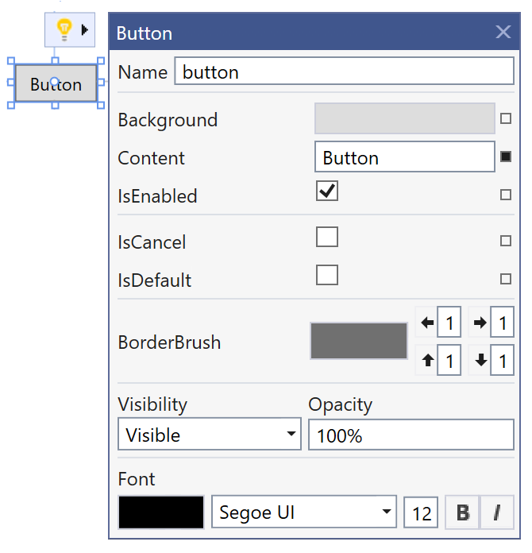

# Help us improve WPF and UWP XAML designer

We would like to make your experience developing WPF and UWP applications in Visual Studio better!

Currently we are investigating ways of improving the XAML Designer and making you more productive while developing UI for your apps. You can already check out our preview version of the new feature called Suggested Actions that enables easy access to common properties when a control is selected. This feature is available in  . To use it, first enable it through **Options** > **Preview Features** > **XAML Suggested Actions**. Once enabled click on a supported control and use the "light bulb" to expand and interact with the Suggested Actions UI.

We’d like to know, what else would you like to see in WPF or UWP XAML Designer . Please take this [survey](https://www.surveymonkey.com/collect/?sm=poUVtdL64_2Bid5IvS4yRGSOQpG6tvYboHNLOtAstKYJeeE2PfD4L2DfGrwMliUzr0) and tell us how we can improve Visual Studio and create better tools for you!

[Take the survey!](https://www.surveymonkey.com/collect/?sm=poUVtdL64_2Bid5IvS4yRGSOQpG6tvYboHNLOtAstKYJeeE2PfD4L2DfGrwMliUzr0) 

Thanks,

.NET Team

## Related post

Improvements to XAML tooling in Visual Studio 2019 version 16.7 Preview 1