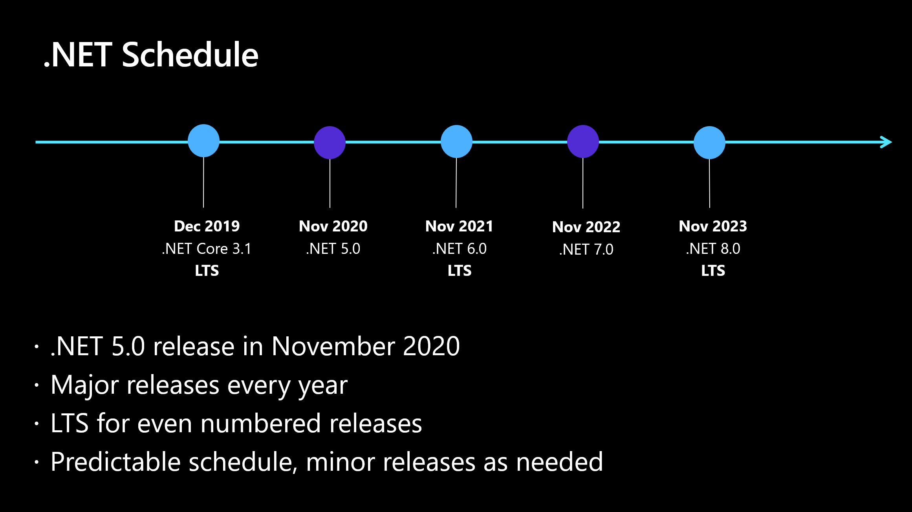

# The future of .NET Standard

Since [.NET 5 was announced][net5-post], many of you have asked what this means
for .NET Standard and whether it will still be relevant. In this post, I'm going
to explain how .NET 5 improves code sharing and replaces .NET Standard. I'll
also cover the cases where you still need .NET Standard.

## For the impatient: TL;DR

.NET 5 will be a single product with a uniform set of capabilities and APIs that
can be used for Windows desktop apps, cross-platform mobile apps, console apps,
cloud services, and websites:

 <!-- Use .mp4 on WordPress -->

To better reflect this, we've updated the [target framework names (TFMs)][net5-tfms]:

* `net5.0`. This is for code that runs everywhere. It combines and replaces the
  `netcoreapp` and `netstandard` names. This TFM will generally only include
  technologies that work cross-platform (except for pragmatic concessions, like we
  already did in .NET Standard).

* `net5.0-windows` (and later `net6.0-android` and `net6.0-ios`). These TFMs
  represent OS-specific flavors of .NET 5 that include `net5.0` plus OS-specific
  functionality.

We won't be releasing a new version of .NET Standard, but .NET 5 and all future
versions will continue to support .NET Standard 2.1 and earlier. You should
think of `net5.0` (and future versions) as the foundation for sharing code
moving forward.

And since `net5.0` is the shared base for all these new TFMs, runtime, library,
and language innovation is coordinated around this version number. For example,
in order to use C# 9, you need to use `net5.0` or `net5.0-windows`.

## What you should target

.NET 5 and all future versions will always support .NET Standard 2.1 and
earlier. The only reason to retarget from .NET Standard to .NET 5 is to gain
access to more runtime features, language features, or APIs. So, you can think of
.NET 5 as .NET Standard vNext.

What about new code? Should you still start with .NET Standard 2.0 or should you
go straight to .NET 5? It depends.

* **App components**. If you're using libraries to break down your application
  into several components, my recommendation is to use `netX.Y` where `X.Y` is
  the lowest number of .NET that your application (or applications) are
  targeting. For simplicity, you probably want all projects that make up your
  application to be on the same version of .NET because it means you can assume
  the same BCL features everywhere.

* **Reusable libraries**. If you're building reusable libraries that you plan on
  shipping on NuGet, you'll want to consider the trade-off between reach and
  available feature set. .NET Standard 2.0 is the highest version of .NET
  Standard that is supported by .NET Framework, so it will give you the most
  reach, while also giving you a fairly large feature set to work with. We'd
  generally recommend against targeting .NET Standard 1.x as it's not worth the
  hassle anymore. If you don't need to support .NET Framework, then you can
  either go with .NET Standard 2.1 or .NET 5. Most code can probably skip .NET
  Standard 2.1 and go straight to .NET 5.

So, what should you do? My expectation is that widely used libraries will end up
multi-targeting for both .NET Standard 2.0 and .NET 5: supporting .NET Standard
2.0 gives you the most reach while supporting .NET 5 ensures you can leverage
the latest platform features for customers that are already on .NET 5.

In a couple of years, the choice for reusable libraries will only involve the
version number of `netX.Y`, which is basically how building libraries for .NET
has always worked -- you generally want to support some older version in order
to ensure you get the most reach.

To summarize:

* Use `netstandard2.0` to share code between .NET Framework and all other
  platforms.
* Use `netstandard2.1` to share code between Mono, Xamarin, and .NET Core 3.x.
* Use `net5.0` for code sharing moving forward.

## Problems with .NET Standard

.NET Standard has made it much easier to create libraries that work on all .NET
platforms. But there are still three problems with .NET Standard:

1. **It [versions slowly][problem-1]**, which means you can't easily use the
   latest features.
2. **It needs a [decoder ring][problem-2]** to map versions to .NET
   implementations.
3. **It [exposes platform-specific features][problem-3]**, which means you can't
   statically validate whether your code is truly portable.

Let's see how .NET 5 will address all three issues.

## Problem 1: .NET Standard versions slowly

[.NET Standard was designed][ns-post] at a time where the .NET platforms weren't
converged at the implementation level. This made writing code that needs to work
in different environments hard, because different workloads used different .NET
implementations.

The goal of .NET Standard was to unify the feature set of the base class library
(BCL), so that you can write a single library that can run everywhere. And this
has served us well: .NET Standard is used by over 77% of the top 1000 packages.
And if we look at all packages that have been updated in the last 6 months, the
adoption is at 58%.


But standardizing the API set alone creates a tax. It requires coordination
whenever we're adding new APIs -- which happens all the time. The .NET
open-source community (which includes us) keeps innovating in the BCL by
providing new language features, usability improvements, new cross-cutting
features such as `Span<T>`, or supporting new data formats or networking
protocols.

And while we can provide new types as NuGet packages, we can't provide new APIs
on existing types this way. So, in the general sense, innovation in the BCL
requires shipping a new version of .NET Standard.

Up until .NET Standard 2.0, this wasn't really an issue because we only
standardized *existing* APIs. But in .NET Standard 2.1, we standardized brand new
APIs and that's where we saw quite a bit of friction.

Where does this friction come from?

.NET Standard is an API set that all .NET implementations have to support, so
there is an [editorial aspect][ns-process] to it in that all APIs must be
reviewed by the [.NET Standard review board][ns-board]. The board is comprised
of .NET platform implementers as well as representatives of the .NET community.
The goal is to only standardize APIs that we can truly implement in all current
*and* future .NET platforms. These reviews are necessary because there are
different implementations of the .NET stack, with different constraints.

We predicted this type of friction, which is why we said early on that .NET
Standard [will only standardize APIs][problem-1] that were already shipped in at
least one .NET implementation. This seems reasonable at first, but then you
realize that .NET Standard can't ship very frequently. So, if a feature
misses a particular release, you might have to wait for a couple of years before
it's even available and potentially even longer until this version of .NET
Standard is widely supported.

We felt for some features that opportunity loss was too high, so we did
unnatural acts to standardize APIs that weren't shipped yet (such as
`IAsyncEnumerable<T>`). Doing this for all features was simply too expensive,
which is why quite a few of them still missed the .NET Standard 2.1 train (such
as the new hardware intrinsics).

But what if there was a single code base? And what if that code base would have
to support all the aspects that make .NET implementations differ today, such
as supporting both just-in-time (JIT) compilation and ahead-of-time
(AOT) compilation?

Instead of doing these reviews as an afterthought, we'd make all these aspects
part of the feature design, right from the start. In such a world, the
standardized API set is, by construction, the common API set. When a feature is
implemented, it would already be available for everyone because the code base is
shared.

## Problem 2: .NET Standard needs a decoder ring

Separating the API set from its implementation doesn't just slow down the
availability of APIs. It also means that we need to [map .NET Standard versions
to their implementations][ns-table]. As someone who had to explain this table to
many people over time, I've come to appreciate just how complicated this
seemingly simple idea is. We've tried our best to make it easier, but in the
end, it's just inherent complexity because the API set and the implementations
are shipped independently.

We have unified the .NET platforms by adding yet another synthetic platform
below them all that represents the common API set. In a very real sense, this
[XKCD-inspired comic][xkcd] is spot on:

![How .NET platforms proliferate][xkcd-img]

We can't solve this problem without truly merging some rectangles in our layer
diagram, which is what .NET 5 does: it provides a unified implementation where
all parties build on the same foundation and thus get the same API shape and version number.

## Problem 3: .NET Standard exposes platform-specific APIs

When we designed .NET Standard, [we had to make pragmatic
concessions][problem-3] in order to avoid breaking the library ecosystem too
much. That is, we had to include some Windows-only APIs (such as file system
ACLs, the registry, WMI, and so on). Moving forward, we will avoid adding
platform-specific APIs to `net5.0`, `net6.0` and future versions. However, it's impossible for us to predict
the future. For example, with Blazor WebAssembly we have recently added a new
environment where .NET runs and some of the otherwise cross-platform APIs (such
as threading or process control) can't be supported in the browser's sandbox.

Many of you have complained that these kind of APIs feel like "landmines" - the
code compiles without errors and thus appears to being portable to any platform,
but when running on a platform that doesn't have an implementation for the given
API, you get runtime errors.

Starting with .NET 5, we're [shipping analyzers and code fixers][analyzer-post]
with the SDK that are on by default. This includes the [platform compatibility
analyzer][platform-compat-spec] that detects unintentional use of APIs that
aren't supported on the platforms you intend to run on. This feature replaces
the `Microsoft.DotNet.Analyzers.Compatibility` NuGet package.

Let's first look at Windows-specific APIs.

### Dealing with Windows-specific APIs

When you create a project targeting `net5.0`, you can reference the
`Microsoft.Win32.Registry` package. But when you start using it, you'll get the
following warnings:

```C#
private static string GetLoggingDirectory()
{
    using (RegistryKey key = Registry.CurrentUser.OpenSubKey(@"Software\Fabrikam"))
    {
        if (key?.GetValue("LoggingDirectoryPath") is string configuredPath)
            return configuredPath;
    }

    string exePath = Process.GetCurrentProcess().MainModule.FileName;
    string folder = Path.GetDirectoryName(exePath);
    return Path.Combine(folder, "Logging");
}
```

```text
CA1416: 'RegistryKey.OpenSubKey(string)' is supported on 'windows'
CA1416: 'Registry.CurrentUser' is supported on 'windows'
CA1416: 'RegistryKey.GetValue(string?)' is supported on 'windows'
```

You have three options on how you can address these warnings:

1. **Guard the call**. You can check whether you're running on Windows before
   calling the API by using `OperatingSystem.IsWindows()`.

2. **Mark the call as Windows-specific**. In some cases, it might make sense to
   mark the calling member as platform-specific via
   `[SupportedOSPlatform("windows")]`.

3. **Delete the code**. Generally not what you want because it means you lose
   fidelity when your code is used by Windows users, but for cases where a
   cross-platform alternative exists, you're likely better off using that over
   platform-specific APIs. For example, instead of using the registry, you could
   use an XML configuration file.

4. **Suppress the warning**. You can of course cheat and simply suppress the
   warning, either via `editor.config` or `#pragma warning disable`. However,
   you should prefer options (1) and (2) when using platform-specific APIs.

To **guard the call**, use the new static methods on the
[System.OperatingSystem] class, for example:

```C#
private static string GetLoggingDirectory()
{
    if (OperatingSystem.IsWindows())
    {
        using (RegistryKey key = Registry.CurrentUser.OpenSubKey(@"Software\Fabrikam"))
        {
            if (key?.GetValue("LoggingDirectoryPath") is string configuredPath)
                return configuredPath;
        }
    }

    string exePath = Process.GetCurrentProcess().MainModule.FileName;
    string folder = Path.GetDirectoryName(exePath);
    return Path.Combine(folder, "Logging");
}
```

To **mark your code as Windows-specific**, apply the new
`SupportedOSPlatform` attribute:

```C#
[SupportedOSPlatform("windows")]
private static string GetLoggingDirectory()
{
    using (RegistryKey key = Registry.CurrentUser.OpenSubKey(@"Software\Fabrikam"))
    {
        if (key?.GetValue("LoggingDirectoryPath") is string configuredPath)
            return configuredPath;
    }

    string exePath = Process.GetCurrentProcess().MainModule.FileName;
    string folder = Path.GetDirectoryName(exePath);
    return Path.Combine(folder, "Logging");
}
```

In both cases, the warnings for using the registry will disappear.

The key difference is that in second example the analyzer will now issue
warnings for the call sites of `GetLoggingDirectory()` because it is now
considered to be a Windows-specific API. In other words, you forward the
requirement of doing the platform check to your callers.

The `[SupportedOSPlatform]` attribute can be applied to the member, type, or
assembly level. This attribute is also used by the BCL itself. For example, the
assembly `Microsoft.Win32.Registry` has this attribute applied, which is the
reason that it knows that the registry is a Windows-specific API in the first
place.

Note that if you target `net5.0-windows`, this attribute is automatically applied
to your assembly. That means using Windows-specific APIs from `net5.0-windows`
will never generate any warnings because your entire assembly is considered to
be Windows-specific.

### Dealing with APIs that are unsupported in Blazor WebAssembly

Blazor WebAssembly projects run inside the browser sandbox, which constrains
which APIs you can use. For example, while thread and process creation are both
cross-platform APIs, we can't make these APIs work in Blazor WebAssembly, which
means they throw `PlatformNotSupportedException`. We have marked these APIs with
`[UnsupportedOSPlatform("browser")]`.

Let's say you copy & paste the `GetLoggingDirectory()` into a Blazor WebAssembly
application.

```C#
private static string GetLoggingDirectory()
{
    //...

    string exePath = Process.GetCurrentProcess().MainModule.FileName;
    string folder = Path.GetDirectoryName(exePath);
    return Path.Combine(folder, "Logging");
}
```

You'll get the following warning:

```text
CA1416 'Process.GetCurrentProcess()' is unsupported on 'browser'
CA1416 'Process.MainModule' is unsupported on 'browser'
```

To deal with these warnings, you have basically the same options
as with Windows-specific APIs.

You can **guard the call**:

```C#
private static string GetLoggingDirectory()
{
    //...

    if (!OperatingSystem.IsBrowser())
    {
        string exePath = Process.GetCurrentProcess().MainModule.FileName;
        string folder = Path.GetDirectoryName(exePath);
        return Path.Combine(folder, "Logging");
    }
    else
    {
        return string.Empty;
    }
}
```

Or you can mark the member as being unsupported by Blazor WebAssembly:

```C#
[UnsupportedOSPlatform("browser")]
private static string GetLoggingDirectory()
{
    //...

    string exePath = Process.GetCurrentProcess().MainModule.FileName;
    string folder = Path.GetDirectoryName(exePath);
    return Path.Combine(folder, "Logging");
}
```

Since the browser sandbox is fairly restrictive, not all class libraries and
NuGet packages should be expected to work in Blazor WebAssembly. Furthermore,
the vast majority of libraries aren't expected to run in Blazor
WebAssembly either.

That's why regular class libraries targeting `net5.0` won't see warnings for
APIs that are unsupported by Blazor WebAssembly. You have to explicitly indicate
that you intend to support your project in Blazor Web Assembly by adding the
`<SupportedPlatform>` item to your project file:

```XML
<Project Sdk="Microsoft.NET.Sdk">

  <PropertyGroup>
    <TargetFramework>net5.0</TargetFramework>
  </PropertyGroup>
  
  <ItemGroup>
    <SupportedPlatform Include="browser" />
  </ItemGroup>
  
</Project>
```

If you're building a Blazor WebAssembly application, you don't have to do this
because the `Microsoft.NET.Sdk.BlazorWebAssembly` SDK does this automatically.

## .NET versioning

As a library author, you're probably wondering when .NET 5 will be widely
supported. Moving forward, we'll ship .NET every year in November, with every
other year being a Long Term Support (LTS) release.

.NET 5 will ship in November 2020 and .NET 6 will ship in November 2021 as an
LTS. We created this fixed schedule to make it easier for you to plan your
updates (if you're an app developer) and predict the demand for supported .NET
versions (if you're a library developer).

Thanks to the ability to install .NET Core side-by-side, new versions are
adopted fairly fast with LTS versions being the most popular. In fact, .NET Core
3.1 was the fastest adopted .NET version ever.



The expectation is that every time we ship, we ship all framework names in
conjunction. For example, it might look something like this:

|.NET 5            | .NET 6            | .NET 7            |
|------------------|-------------------|-------------------|
|`net5.0`          | `net6.0`          | `net7.0`          |
|                  | `net6.0-android`  | `net7.0-android`  |
|                  | `net6.0-ios`      | `net7.0-ios`      |
|`net5.0-windows`  | `net6.0-windows`  | `net7.0-windows`  |
|`net5.0-someoldos`|                   |                   |

This means that you can generally expect that whatever innovation we did in the
BCL, you're going to be able to use it from all app models, no matter which
platform they run on. It also means that libraries shipped for the latest `net`
framework can always be consumed from all app models, as long as you run the latest
version of them.

This model removes the complexity around .NET Standard versioning because each
time we ship, you can assume that all platforms are going to support the new
version immediately and completely. And we cement this promise by using the
prefix naming convention.

However, we might add support for new platforms (such as Android and iOS that
come with .NET 6) and we might drop support for platforms that are no longer
relevant (illustrated by `net5.0-someoldos`). But dropping platforms will be a
big deal and we'll announce these decisions well in advance, so these changes
should never surprise you.

## .NET 5 as the combination of .NET Standard & .NET Core

.NET 5 and subsequent versions will be a single code base that supports desktop
apps, mobile apps, cloud services, websites, and whatever environment .NET will
run on tomorrow.

You might think "hold on, this sounds great, but what if someone wants to create
a completely new implementation". That's fine too. But virtually nobody will
start one from scratch. Most likely, it will be a fork of the current code base
([dotnet/runtime]), and even that might not be necessary. For example, Tizen
(the Samsung platform for smart appliances) uses an unchanged .NET Core
runtime/framework with a Samsung-specific app model on top.

And, even in cases where changes at the runtime or framework-level are
necessary, forking preserves a merge relationship, which allows maintainers to
keep pulling in new changes from the [dotnet/runtime] repo, benefiting from BCL
innovations in areas unaffected by their changes.

Granted, there are cases where one might want to create a very different "kind"
of .NET, such as a minimal runtime without the current BCL. But that would
mean that it couldn't leverage the existing .NET library ecosystem anyway, which
means it wouldn't have implemented .NET Standard either. We're generally not
interested in pursuing this direction, but the convergence of .NET Standard and
.NET Core doesn't prevent that nor does it make it any harder.

## Why there is no TFM for WebAssembly

We originally considered adding TFM for WebAssembly, such as `net5.0-wasm`. We
decided against for the following reasons:

* WebAssembly is more like an instruction set (such as x86 or x64) than like an
  operating system. And we generally don't offer divergent APIs between different
  architectures.

* WebAssembly's execution model in the browser sandbox is a key differentiator,
  but we decided that it makes more sense to only model this as a runtime check.
  Similar to how you check for Windows and Linux, you can use the `OperatingSystem`
  type. Since this isn't about instruction set, the method is called `IsBrowser()`
  rather than `IsWebAssembly()`.

* There are [runtime identifiers (RID)][rid] for WebAssembly, called `browser`
  and `browser-wasm`. They allow package authors to deploy different binaries
  when targeting WebAssembly in a browser.

As part of the compatibility analyzer, we have marked APIs that are unsupported
in the browser sandbox, such as `System.Diagnostics.Process`. If you use
those APIs from inside a browser app, you'll get a warning telling you that this
APIs is unsupported. A following blog post will go into more detail on this.

## Summary

`net5.0` is for code that runs everywhere. It combines and replaces the
`netcoreapp` and `netstandard` names. We also have platform-specific frameworks,
such as `net5.0-windows` (and later also `net6.0-android`, and `net6.0-ios`).

Since there is no difference between the standard and its implementation, you'll
be able to take advantage of new features much quicker than with .NET Standard.
And due to the naming convention, you'll be able to easily tell who can consume
a given library -- without having to consult the .NET Standard version table.

While .NET Standard 2.1 will be the last version of .NET Standard, .NET 5 and
all future versions will continue to support .NET Standard 2.1 and earlier. But
you should think of `netX.Y` as the foundation for sharing code moving forward.

Happy coding!

[problem-1]: https://github.com/dotnet/standard/tree/master/docs/governance#process
[problem-2]: https://dotnet.microsoft.com/platform/dotnet-standard#versions
[problem-3]: https://github.com/dotnet/standard/blob/master/docs/faq.md#why-do-you-include-apis-that-dont-work-everywhere
[net5-post]: https://devblogs.microsoft.com/dotnet/introducing-net-5/
[ns-post]: https://devblogs.microsoft.com/dotnet/introducing-net-standard/
[ns-growth-post]: https://devblogs.microsoft.com/dotnet/update-on-net-standard-adoption/
[ns-process]: https://github.com/dotnet/standard/tree/master/docs/governance#process
[ns-board]: https://github.com/dotnet/standard/blob/master/docs/governance/board.md
[ns-table]: https://dotnet.microsoft.com/platform/dotnet-standard#versions
[net5-tfms]: https://github.com/dotnet/designs/blob/master/accepted/2020/net5/net5.md
[dotnet/runtime]: https://github.com/dotnet/runtime
[xkcd]: https://xkcd.com/927
[xkcd-img]: https://devblogs.microsoft.com/dotnet/wp-content/uploads/sites/10/2014/12/7725.Pic6_.png
[platform-compat]: https://github.com/dotnet/platform-compat
[platform-compat-img]: https://github.com/dotnet/platform-compat/raw/master/docs/screenshot1.png
[platform-compat-spec]: https://github.com/dotnet/designs/pull/110
[rid]: https://docs.microsoft.com/en-us/dotnet/core/rid-catalog
[analyzer-post]: https://devblogs.microsoft.com/dotnet/automatically-find-latent-bugs-in-your-code-with-net-5/
[System.OperatingSystem]: https://docs.microsoft.com/dotnet/api/system.operatingsystem
