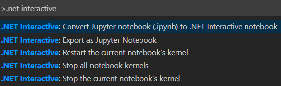
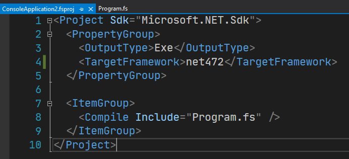
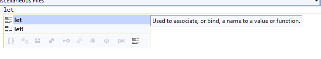
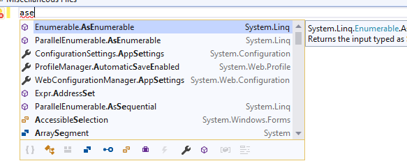

# F# 5 and F# tools update (again!)

We’re excited to announce more updates to F# 5 today! We shipped a lot of preview features since [F# 5 preview 1](https://devblogs.microsoft.com/dotnet/announcing-f-5-preview-1/), and they have all been stabilizing since that release including a [set of updates aligning with .NET 5 preview 4](https://devblogs.microsoft.com/dotnet/f-5-update-for-net-5-preview-4/). Today, we’re happy to announce some new language features, a sneak peek at using F# in VSCode notebooks, and some F# tooling updates that will align with Visual Studio 2019 Update 16.7.

You can get the latest F# 5 in these ways

* [Install the latest .NET 5 preview SDK](https://dotnet.microsoft.com/download/dotnet-core/5.0)
* [Install .NET for Jupyter/nteract](https://github.com/dotnet/interactive/#jupyter-and-nteract)
* [Install .NET for VSCode Notebooks](https://github.com/dotnet/interactive/#visual-studio-code)

If you’re using Visual Studio on Windows, you’ll need both the .NET 5 preview SDK and [Visual Studio Preview installed](https://visualstudio.microsoft.com/vs/preview/).

## Using F# 5 preview

You can use F# 5 preview via the [.NET 5 preview SDK](https://dotnet.microsoft.com/download/dotnet-core/5.0), or through the [.NET and Jupyter Notebooks support](https://devblogs.microsoft.com/dotnet/net-interactive-is-here-net-notebooks-preview-2/).

If you’re using the .NET 5 preview SDK, check out a [sample repository](https://github.com/cartermp/fs5preview) showing off some of what you can do with F# 5. You can play with each of the features there instead of starting from scratch.

If you’d rather use F# 5 in your own project, you’ll need to add a `LangVersion` property with `preview` as the value. It should look something like this:

<script src="https://gist.github.com/cartermp/3a12e552cc64918d697c430c7b5cfcf7.js"></script>

Alternatively, if you’re using Jupyter Notebooks and want a more interactive experience, check out a [sample notebook](https://gist.github.com/cartermp/6b91c3561c6a5efca4288dca37c15edc) that shows the same features, but has a more interactive output.

## New F# 5 features

This release has some new features! Let's dive in.

### Improvements to nuget references for F# scripts

Support for `#r "nuget:..."` has now been enhanced to support packages that pull in native dependencies. Prior to this update, some packages weren't 100% usable if they needed to call into certain kinds of native code. This is now resolved. The following is an example of the [FLIPs](https://www.nuget.org/packages/Flips/) library, which used to fail on the second-to-last line of code where it serialized a model. Now it works!

<script src="https://gist.github.com/cartermp/2adeac8ac012822b270509bc057490e6.js"></script>

Additionally, we now support referencing packages where the order of `.dll` references being passed to a compiler matters, such as [FParsec](https://www.nuget.org/packages/FParsec/). The following script now works:

<script src="https://gist.github.com/cartermp/9edcd5855a1eb453a4156e378d39f6a3.js"></script>

This is also a significant improvement over the "old" way to use a package like this, where you needed to manually ensure the ordering of the `.dlls` being passed to the compiler to be able to use it in scripts.

### Better interop with Nullable value types

[Nullable (value) types](https://docs.microsoft.com/dotnet/api/system.nullable-1) (called Nullable Types historically) have long been supported by F#, but interacting with them has traditionally been somewhat of a pain since you'd have to construct a `Nullable` or `Nullable<SomeType>` wrapper every time you wanted to pass a value. Now the compiler will implicitly convert a value type into a `Nullable<ThatValueType>` if the target type matches. The following code is now possible:

<script src="https://gist.github.com/cartermp/a0603f0e6da3693b2f243eabfbd977c7.js"></script>

### F# quotations improvements

This preview brings along a fundamental improvement to [F# Code Quotations](https://docs.microsoft.com/dotnet/fsharp/language-reference/code-quotations), a metaprogramming feature that lets you generate and manipulate an abstract syntax tree that represents the F# code.

Although powerful, F# Code Quotations have had a severe deficiency up until this point: they didn't carry "trait calls" to sufficiently represent the actual semantics of the code being "quoted" if it relied on type constraints. A common way this could manifest itself was "allowing" arithmetic that shouldn't actually compile, resulting in a runtime exception if evaluated.

These enhancements are particularly relevant to translating F# code to run on other runtimes like PyTorch or ONNX, a key scenario we're exploring as a means to attract developers in more "analytical" domains to F# and .NET. We also anticipate numerous smaller issues that F# developers using F# Code Quotations today had to work around to be resolved and "just work" the way they expect them to.

A trivial example of code that now just works is as follows:

<script src="https://gist.github.com/cartermp/86a805c4858a908a2c492ea920fd3555.js"></script>

This used to throw an exception. It now emits `-1` as you would expect it to.

To read more about this feature (warning: there is a _lot_ to read about), you can check out the RFC here: https://github.com/fsharp/fslang-design/blob/master/preview/FS-1071-witness-passing-quotations.md

### Improved stack traces in F# async and other computation expressions

Thanks to a contribution by [Nino Floris](https://github.com/NinoFloris), stack traces coming from caught exceptions in computation expressions (such as F# async) now retain more information. Consider the following code that uses the Ply library:

<script src="https://gist.github.com/cartermp/3c21f2a05876e4dc16778fa18a8c8a11.js"></script>

Prior to this change, the `origin` function would not appear in stack traces without a workaround in the Ply library (and any other library where this is a scenario). Now it shows the full trace:

```
System.InvalidOperationException: Generic error message.
   at Program.origin() in C:\Users\phcart\source\repos\ConsoleApp35\ConsoleApp35\Program.fs:line 5
   at Program.caller@8-1.Invoke(Unit unitVar) in C:\Users\phcart\source\repos\ConsoleApp35\ConsoleApp35\Program.fs:line 8
   at Ply.TplPrimitives.tryWith[u](FSharpFunc`2 continuation, FSharpFunc`2 catch)
--- End of stack trace from previous location where exception was thrown ---
   at Ply.TplPrimitives.tryWith[u](FSharpFunc`2 continuation, FSharpFunc`2 catch)
   at Program.caller@7.Invoke(Unit unitVar) in C:\Users\phcart\source\repos\ConsoleApp35\ConsoleApp35\Program.fs:line 7
   at Ply.TplPrimitives.ContinuationStateMachine`1.System-Runtime-CompilerServices-IAsyncStateMachine-MoveNext()
--- End of stack trace from previous location where exception was thrown ---
   at Program.main(String[] argv) in C:\Users\phcart\source\repos\ConsoleApp35\ConsoleApp35\Program.fs:line 17
```

## What's coming next

There are some more immediate updates we're making that we hope to release in the next set of .NET 5 previews, now that we've resolved some longstanding design issues. There isn't a way to try these changes out yet, but this is the direction we're heading.

### Finishing up nameof

We're finishing up our design changes for the `nameof` function and arrived at the following improvements:

* Change `nameof` on an operator to generate the symbol in source rather than the compiled name of the operator
* Allow `nameof` in `match` expressions
* Allowing taking the name of generic type parameters

The last point was tricky from a design standpoint, and results in `nameof` actually having two forms:

* `nameof expr`
* `nameof<'type-parameter>` / `nameof<^type-parameter>`

This second form for generic type parameters aligns `nameof` with the `typeof` and `typedefof` intrinsic functions that require a similar form. Here's what the changes look like in source code:

<script src="https://gist.github.com/cartermp/4b633fb5ad214a2538d0dd93a7b794ad.js"></script>

### Open type declarations

We're renaming the feature "open static classes" to "open type declarations". This is because we're making the following major changes:

* Syntax is now `open type SomeType` (old syntax was `open SomeType`)
* You can now open _any_ type, not just a static class like before, and expose static members and constants contained within it

Code will now look like this:

<script src="https://gist.github.com/cartermp/6901e59b8ab8a46ffa055b5ec02698d3.js"></script>

### Allow implementing the same interface at differen generic instantiations

As another example of F# open source community excellence, [Lukas Rieger](https://github.com/0x53A) contributed an initial design and implementation of this feature. In a future F# 5 preview, code like this will be able to compile:

<script src="https://gist.github.com/cartermp/d25aede7921a36e88ee46b9b11386b4a.js"></script>

## F# and VSCode notebooks

We're really excited to share the first preview of F# support in .NET Interactive for VSCode notebooks.




It's an early preview, but it supports some great features already

* Preliminary language service support
* Inline charting and formatting of data
* Compact data format (`.dib`) that makes code review easy
* Ability to import Jupyter notebooks (`.ipynb`) and convert to a `.dib`
* Ability to export a `.dib` notebook as a Jupyter notebook (`.ipynb`)

Some features on the more immediate roadmap include:

* QuickInfo
* Better IntelliSense
* Sharing F#-defined values with JavaScript cells
* Sharing F#-defined values with C# cells

We'd love to have you try it out and give us feedback on what you feel needs to be there. To do so, follow the [installation instructions](https://github.com/dotnet/interactive/blob/master/src/dotnet-interactive-vscode/README.md) and don't be shy when filing issues on GitHub!

## F# tooling updates for VS 16.7

In the forthcoming Visual Studio 16.7 update, we'll ship several improvements to F# tooling.

### .NET Framework projects default to SDK-style project files

We've deprecated the older "long-form" F# projects. They will still load in Visual Studio today, but any new projects you create will only be .NET SDK-style moving forward. The project files now look like this:



### IntelliSense Improvements

Keywords descriptions now show in completion lists:



Extended completion (showing completion for unimported types, an optional feature) now uses the same built-in UI that C# does. The completion window will dynamically resize depending on the size of the namespace to open:



When typing at the top of a file (such as in an F# script), using a code fixer via IntelliSense to add a necessary `open` declaration will now work correctly.

Various improvements to error recovery and data shown in tooltips have been contributed by [Eugene Auduchinok](https://github.com/auduchinok) and [Matt Constable](https://github.com/mcon).

### More performance improvements

The performance work for larger codebases is always ongoing, focused primarily on elminating some unnecessary memory usage over time. [Steffen Forkmann](https://github.com/forki/) also helped in this effort with some improvements.

Additionally, [Saul Rennison](https://github.com/saul) contributed an improvement to CPU time spend building F# projects at design-time in Visual Studio, a process that happens ambiently and many times over a session. The bottleneck identified has had its CPU time reduced by ~90%. If you have a lot of F# projects in a solution, you may notice that various things feel "quicker" than before.

Thank you to everyone who has contributed! F# is continually improving because of your work.

## The continuing F# 5 journey

We're still not done with F# 5, and aside from what I mentioned earlier about what's next, we'll be focused on these three things:

1. Continuing inclusion of language features when their design and implementations are stable
2. Continuing to improve the tooling performance for larger F# codebases
3. Making F# in Jupyter and Visual Studio Code Notebooks the best language for data science and analytical work

Later this year we will "close down" on F# 5, marking a period of time where we focus on stabilization and planning for the next F# language version. We don't have a date in mind for that year, but we're thinking it will be near the end of the Summer. Until that point, If you'd like to follow along on a much more detailed level, you can check out the [F# development repository](https://github.com/dotnet/fsharp). We're tracking the work we're focused on with a GitHub issue every 3 weeks, and we encourage you all to provide input to the list of things and let us know what you think.

Cheers, and happy F# coding!