# Learn about the latest .NET Productivity features

 The .NET Productivity team (a.k.a. Roslyn) is constantly thinking of new ways to make .NET developers more productive. We’ve been working hard to take the feedback you’ve sent us and turn it into tools that you want! In this post, I’ll cover some of the latest .NET productivity features available in [Visual Studio 2019](https://visualstudio.microsoft.com/downloads/).

## Tooling improvements

The feature that I’m most excited about is the [IntelliSense completion in DateTime and TimeSpan string literals](https://docs.microsoft.com/visualstudio/ide/reference/datetime-timespan-completion). This feature is extremely helpful because we all know remembering DateTime and TimeSpan formats is hard enough. Place your caret inside the DateTime or TimeSpan string literal and press (Ctrl + Space). You'll then see completion options and an explanation as to what each character means.

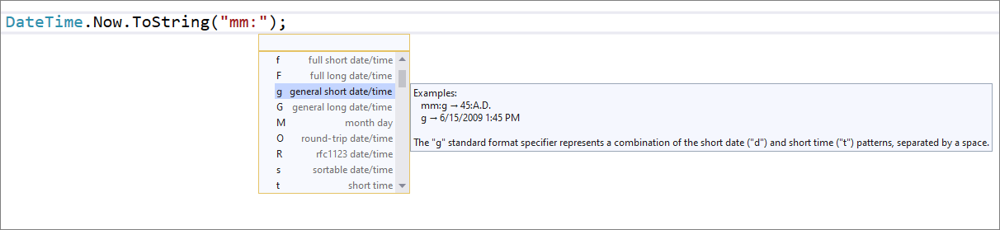

[Add file header](https://docs.microsoft.com/visualstudio/ide/reference/add-file-header) allows you to easily add file headers to existing files, projects, and solutions using [EditorConfig](https://docs.microsoft.com/visualstudio/ide/create-portable-custom-editor-options#add-an-editorconfig-file-to-a-project). You'll first need to add the file_header_template rule to your *.editorconfig* file. Then, set the value to equal the header text you'd like applied. Next, place your caret on the first line of any C# or Visual Basic file. Press **Ctrl**+**.** to trigger the **Quick Actions and Refactorings** menu and select **Add file header**.

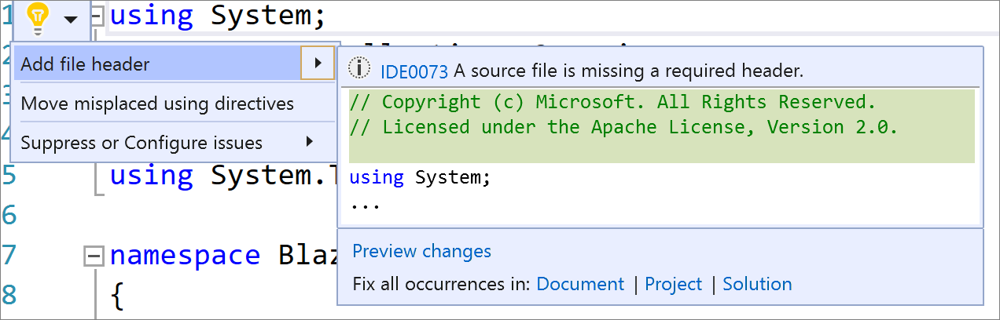

The [change method signature](https://docs.microsoft.com/visualstudio/ide/reference/change-method-signature) dialog now allows you to add a parameter. Place your caret within the method’s signature. Press **Ctrl**+**.** to trigger the **Quick Actions and Refactorings** menu and select **Change signature**. The following dialog will open where you can now select **Add** to add a parameter.

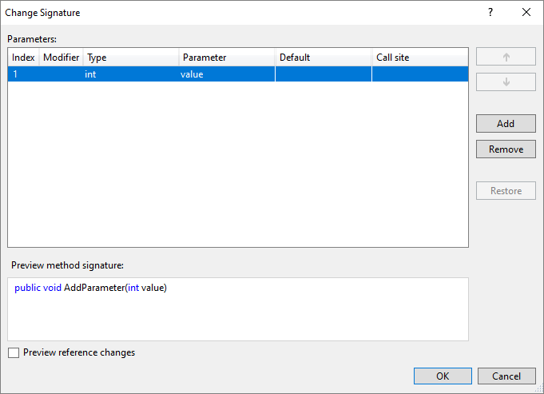

Once you select **Add**, the new **Add Parameter** dialog opens. The Add Parameter dialog allows you to add a type name and a parameter name. You can choose to make the parameter required or optional with a default value. You can then add a value at the call site and choose a named argument for that value or you can introduce a TODO variable. The TODO variable puts a TODO in your code so you can visit each error and go through each call site independently and decide what to pass. For optional parameters you have the option to omit the call site completely.

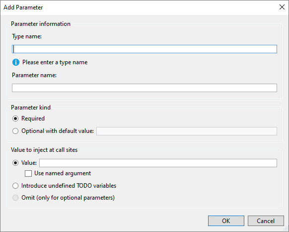

## Code fixes and refactorings

Code fixes and refactorings are the code suggestions the compiler provides through the light bulb and screwdriver icons. To trigger the **Quick Actions and Refactorings** menu, press (**Ctrl**+**.**) or (**Alt**+**Enter**). The following list shows the code fixes and refactorings that are new in Visual Studio 2019:

* The [add explicit cast](https://docs.microsoft.com/visualstudio/ide/reference/add-explicit-cast) code fix allows you to add an explicit cast when an expression cannot be implicitly cast. Place your caret on the error. Press **Ctrl**+**.** to trigger the **Quick Actions and Refactorings** menu and select **Add explicit cast**.

    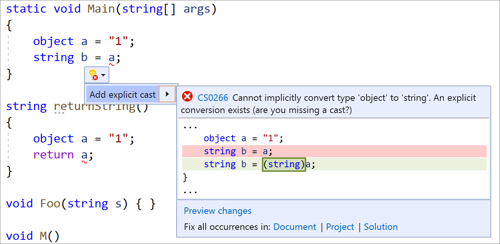

* The [simplify conditional expression](https://docs.microsoft.com/visualstudio/ide/reference/simplify-conditional-expression) refactoring simplifies conditional expressions to be more legible and concise. Place your caret on the conditional expression. Press **Ctrl**+**.** to trigger the **Quick Actions and Refactorings** menu and select **Simplify conditional expression**.

    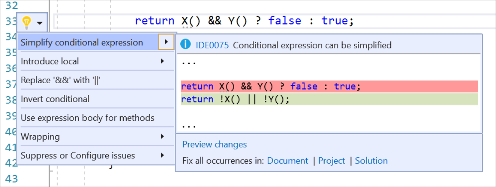

* Have you ever wished you could easily read or convert to a verbatim string? Now you have a refactoring at your fingertips to [convert between regular string and verbatim string literals](https://docs.microsoft.com/visualstudio/ide/reference/convert-between-regular-string-verbatim-string). Place your caret on either the regular string or the verbatim string literal. Press **Ctrl**+**.** to trigger the **Quick Actions and Refactorings** menu. Next, select from one of the following:

    Select **Convert to verbatim string**:

    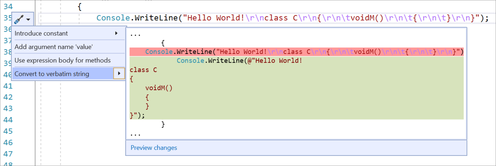

    Select **Convert to regular string**:

    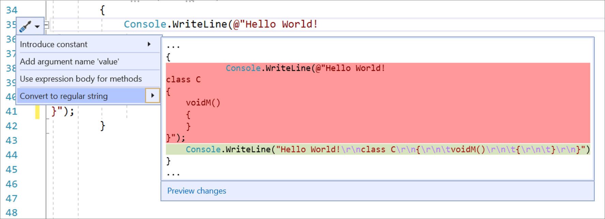

* The [add debugger display attribute](https://docs.microsoft.com/visualstudio/ide/reference/add-debugger-display-attribute) refactoring allows you to pin properties within the debugger programmatically in your code. Place your caret on the class name. Press **Ctrl**+**.** to trigger the **Quick Actions and Refactorings** menu and select **Add 'DebuggerDisplay' attribute**. This will add the debugger display attribute to the top of your class and generate an auto method that returns ToString(), which you can edit to return the property value you want pinned in the debugger.

    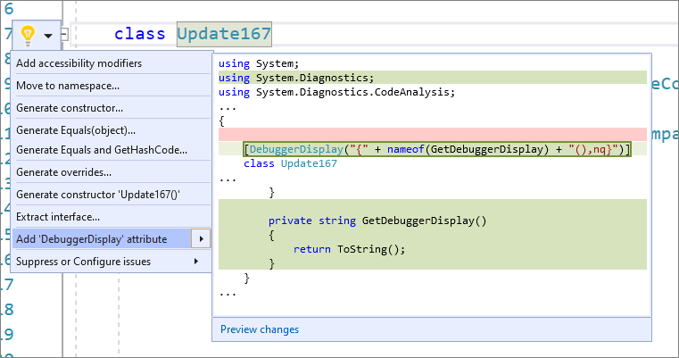

* The [generate comparison operators](https://docs.microsoft.com/visualstudio/ide/reference/generate-comparison-operators) refactoring generates a boilerplate with comparison operators for types that implement IComparable. Place your caret either inside the class or on IComparable. Press **Ctrl**+**.** to trigger the **Quick Actions and Refactorings** menu and select **Generate comparison operators**.

    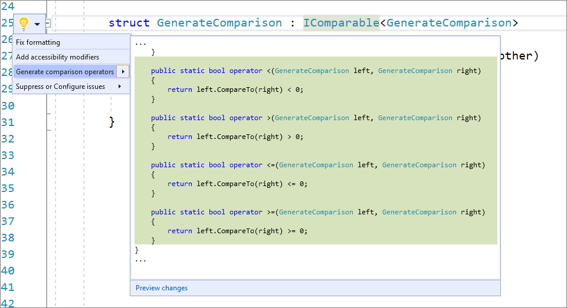

* The [generate IEquatable operators](https://docs.microsoft.com/visualstudio/ide/reference/generate-equals-structs) refactoring automatically adds the IEquatable as well as the equals and not equals operators for structs. Place your caret within the struct. Press **Ctrl** +**.** to trigger the **Quick Actions and Refactorings** menu and select **Generate Equals(object)**.

    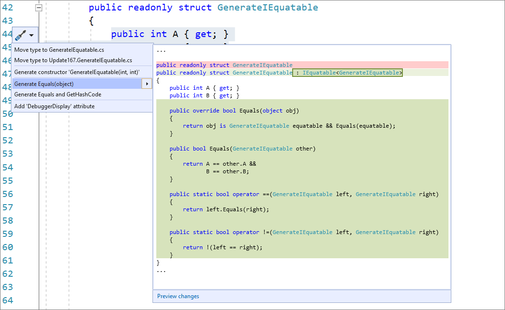

* The [generate properties when generating a constructor](https://docs.microsoft.com/visualstudio/ide/reference/generate-constructor#-generate-constructor-with-properties-c-only) allows you to easily create a constructor with properties in a type. Place your caret on the instance. Press **Ctrl**+**.** to trigger the **Quick Actions and Refactorings** menu and select **Select Generate constructor in <QualifiedName> (with properties)**.

    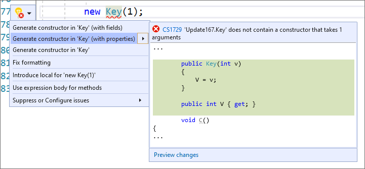

* There's now an easy fix for accidental assignments and comparisons. Place your caret on the warning. Press **Ctrl**+**.** to trigger the **Quick Actions and Refactorings** menu. Next, select from one of the following options:  

    For accidental assignments, select **Assign to '<QualifiedName>.value'**:

    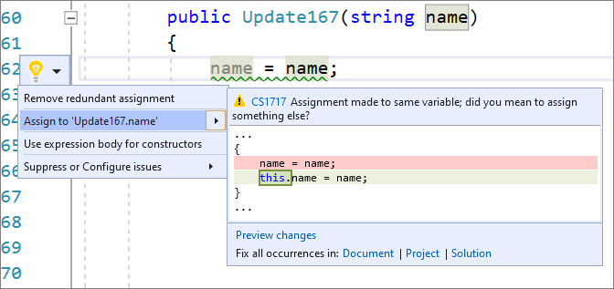

    For accidental comparisons, select **Compare to '<QualifiedName>.value'**:

    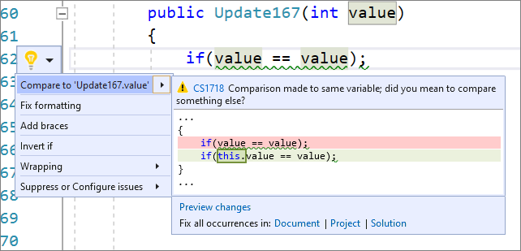

* The suppression operator warning and code fix helps you to easily identify and fix a suppression operator that has no effect. Place your caret on the suppression operator. Press **Ctrl**+**.** to trigger the **Quick Actions and Refactorings** menu. Next, select from one of the following:

   To remove the operator completely, select **Remove operator (preserves semantics)**:

    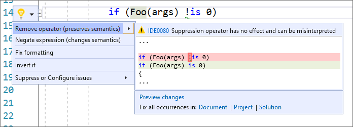

   A second code fix suggesting the correct negating expression is also available. To negate the expression, select **Negate expression (change semantics)**:

    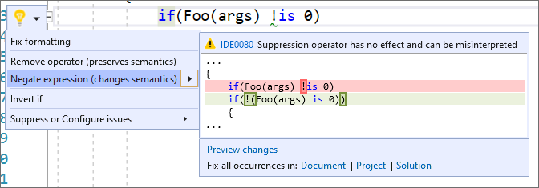

    You can also negate the expression with the new C# 9 `not` pattern if it's available in your project:

    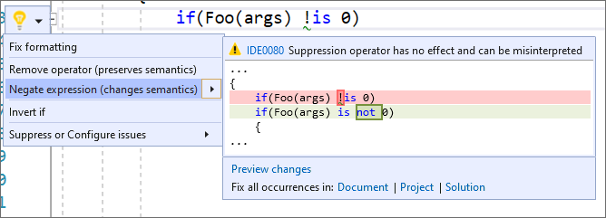

## Get involved

This was just a sneak peek of what's new in [Visual Studio 2019](https://visualstudio.microsoft.com/downloads/). For a complete list of what's new, see the [release notes](https://docs.microsoft.com/visualstudio/releases/2019/release-notes). And feel free to provide feedback on the [Developer Community](https://developercommunity.visualstudio.com/spaces/8/index.html) website, or using the [Report a Problem](https://docs.microsoft.com/visualstudio/ide/how-to-report-a-problem-with-visual-studio) tool in Visual Studio.
