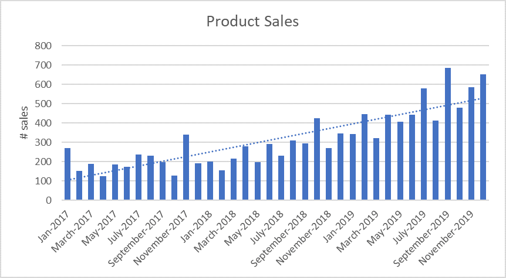
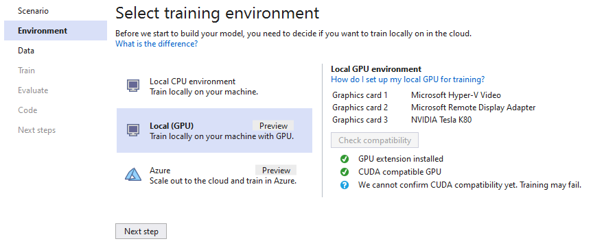
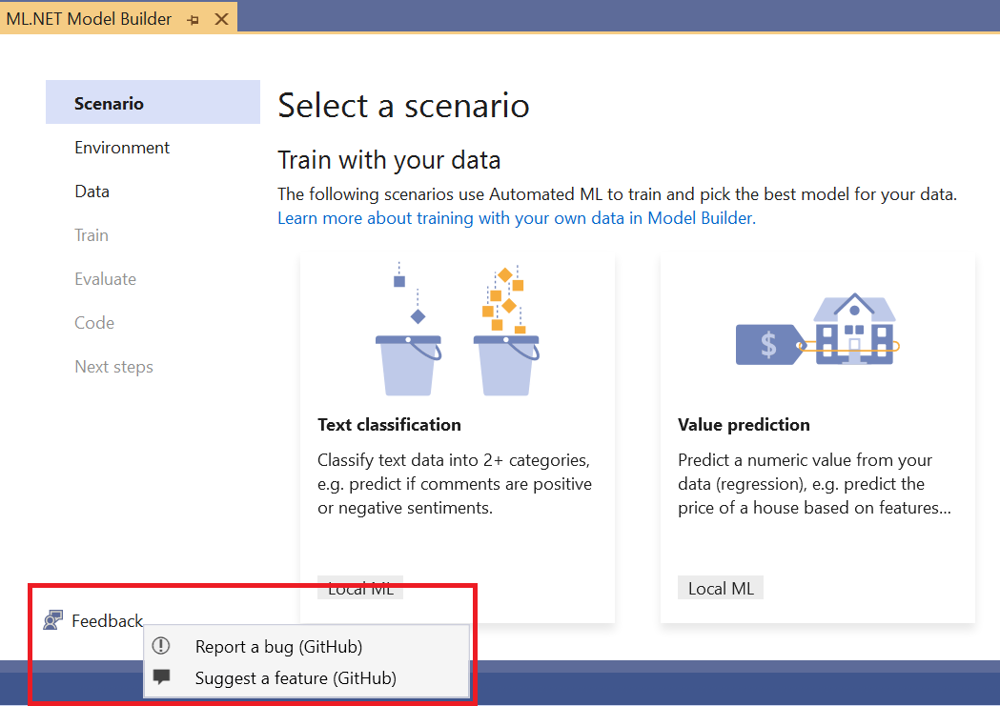

# August ML.NET API and Tooling Updates 

[ML.NET](https://dot.net/ml) is an open-source, cross-platform machine learning framework for .NET developers. It allows integrating machine learning into your .NET apps without requiring you to leave the .NET ecosystem or even have a background in ML or data science. ML.NET provides tooling (Model Builder UI in Visual Studio and the cross platform ML.NET CLI) that automatically trains custom machine learning models for you based on your scenario and data.

We recently released ML.NET 1.5 and 1.5.1 as well as new versions of Model Builder and the ML.NET CLI. These releases include numerous bug fixes and enhancements, as well as new features for anomaly detection and time series data, improvements to the TextLoader, local GPU training for image classification in Model Builder, and more.

In this post, I'm covering the following items:
1.	[New algorithms and features for anomaly detection and time series data](#new-algorithms-and-features-for-anomaly-detection-and-time-series-data)
2.	[AutoML for ranking scenario](#automl-for-ranking-scenario)
3.	[Updates to TextLoader](#updates-to-textloader)
4.	[Model Builder local GPU training for image classification](#model-builder-local-gpu-training-for-image-classification)
5.	[Feedback button in Model Builder](#feedback-button-in-model-builder)
6.	[Thanks to our contributors](#thanks-to-our-contributors)
7.	[Feedback](#feedback)
8.	[Get started and Resources](#get-started-and-resources)

## What’s new with the ML.NET API?

### New algorithms and features for anomaly detection and time series data
Time series data is a series of data points over time. A common example of time series data is monthly number of product sales over a year:



There are many applications for time series data and machine learning; anomaly detection and forecasting are two of the most commons scenarios which are also supported by ML.NET:

* With **anomaly detection**, you can find abnormal spikes in your time series data; for example, you could use anomaly detection to identify potentially fraudulant transactions on your credit card or spikes in power consumption based on daily readings from a meter.

* With **forecasting**, you can use past time series data to make predictions about future behavior; for example, you could use forecasting to project monthly sales based on previous months' sales or to predict the weather.

#### Detect Entire Anomaly by SrCnn algorithm
The ML.NET 1.5 update added a new anomaly detection algorithm called [DetectEntireAnomalyBySrCnn](https://docs.microsoft.com/dotnet/api/microsoft.ml.timeseriescatalog.detectentireanomalybysrcnn?view=ml-dotnet) which allows you to detect anomalies for an entire dataset at once; this is in contrast to the existing [DetectAnomalyBySrCnn](https://docs.microsoft.com/dotnet/api/microsoft.ml.timeseriescatalog.detectanomalybysrcnn?view=ml-dotnet) algorithm, which streams parts of the dataset and examines a window around points to find anomalies.

This new algorithm is faster than the DetectAnomalyBySrCnn algorithm and can work on arbitrarily-sized datasets since it can train on batches of a fixed size, but it also consumes more memory since it loads the entire dataset in memory. You can use the new DetectEntireAnomalyBySrCnn algorithm if you have all your data on hand.

However, if your time series data is streaming, you don’t have all your data on hand, or your data is too large to fit in memory, you can still use the previous DetectAnomalyBySrCnn algorithm.

Check out this [sample](https://docs.microsoft.com/dotnet/api/microsoft.ml.timeseriescatalog.detectentireanomalybysrcnn?view=ml-dotnet#examples) to see how to use the DetectEntireAnomalyBySrCnn algorithm.

#### Root cause detection
This update also added [root cause detection](https://github.com/dotnet/machinelearning/blob/master/docs/api-reference/time-series-root-cause-localization.md), which is a feature that can identify which inputs likely caused an anomaly. For example, say you have housing data for Seattle, and one of the house listings shows an abnormally high price (e.g. an anomaly) on August 6. Using root cause detection, you may find that the neighborhood and property type are the contributing factors to the abnormally high price. The 1.5.1 update also added the ability for you to define a threshold for root cause analysis which can influence which features are chosen as root causes.

The code below shows how to implement root cause detection and print the results (full sample can be found [here](https://github.com/dotnet/machinelearning/blob/master/docs/samples/Microsoft.ML.Samples/Dynamic/Transforms/TimeSeries/LocalizeRootCause.cs)).

```csharp
// Create a new ML context for ML.NET operations
var mlContext = new MLContext();

// Create a root cause localization input instance
DateTime timestamp = GetTimestamp();

var data = new RootCauseLocalizationInput(
    timestamp,
    GetAnomalyDimension(),
    new List<MetricSlice>()
    {
        new MetricSlice(timestamp, GetPoints())
    },
    AggregateType.Sum, 
    AGG_SYMBOL);

// Get the root cause localization result
RootCause prediction = mlContext.AnomalyDetection.LocalizeRootCause(data);

// Print the localization result
int count = 0;
foreach (RootCauseItem item in prediction.Items)
{
    count++;
    Console.WriteLine($"Root cause item #{count} ...");
    Console.WriteLine($"Score: {item.Score}, Path: {String.Join(" ",item.Path)}, Direction: {item.Direction}, Dimension:{String.Join(" ", item.Dimension)}");
}

//Item #1 ...
//Score: 0.26670448876705927, Path: DataCenter, Direction: Up, Dimension:[Country, UK] [DeviceType, ##SUM##] [DataCenter, DC1]
```

#### Time series seasonality and de-seasonality
The 1.5.1 update also added new capabilities for working with time series data, including [seasonality detection](https://github.com/dotnet/machinelearning/blob/master/docs/samples/Microsoft.ML.Samples/Dynamic/Transforms/TimeSeries/DetectSeasonality.cs) and the ability to [de-seasonalize](https://github.com/dotnet/machinelearning/blob/master/test/Microsoft.ML.TimeSeries.Tests/TimeSeriesDirectApi.cs#L727) seasonal data prior to anomaly detection. For example, say you had sales data from the past 5 years, and you noticed that sales always go up in the holiday months. Normally, this spike in sales would be counted as an anomaly, but now you can use ML.NET’s seasonality detection feature to identify this yearly occurrence and normalize the data against the seasonality before your anomaly detection analysis so that it does not show up as an anomaly.

### AutoML for ranking scenario
While ML.NET has supported the [ranking scenario](https://github.com/dotnet/machinelearning-samples/tree/master/samples/csharp/getting-started/Ranking_Web) for a while, it is now also supported by local AutoML. This means that you don’t have to worry about selecting an algorithm or manually tuning algorithm settings; instead, you can simply choose the ranking scenario and input your data, and AutoML will give you the best model based on your inputs.

Currently, you can use the AutoML.NET API for the ranking scenario, but we are working on adding AutoML ranking to tooling (Model Builder and the ML.NET CLI) as well.

The code below shows how to use the AutoML.NET API to create a ranking experiment and print the results (full sample can be found [here](https://github.com/dotnet/machinelearning/blob/master/docs/samples/Microsoft.ML.AutoML.Samples/RankingExperiment.cs)).

```csharp
MLContext mlContext = new MLContext();

// Load data
IDataView trainDataView = mlContext.Data.LoadFromTextFile<SearchData>(TrainDataPath, hasHeader: true, separatorChar: ',');

// Run AutoML Ranking experiment
ExperimentResult<RankingMetrics> experimentResult = mlContext.Auto()
    .CreateRankingExperiment(new RankingExperimentSettings(){ MaxExperimentTimeInSeconds = ExperimentTime })
    .Execute(trainDataView, testDataView, new ColumnInformation(){
                    LabelColumnName = LabelColumnName,
                    GroupIdColumnName = GroupColumnName
                    });

// Print metric from best model
RunDetail<RankingMetrics> bestRun = experimentResult.BestRun;

Console.WriteLine($"Total models produced: {experimentResult.RunDetails.Count()}");
Console.WriteLine($"Best model's trainer: {bestRun.TrainerName}");
Console.WriteLine($"Metrics of best model from validation data --");
PrintMetrics(bestRun.ValidationMetrics);
```

### Updates to TextLoader
The 1.5 update also improved the [TextLoader](https://docs.microsoft.com/dotnet/api/microsoft.ml.data.textloader?view=ml-dotnet) experience, which includes adding the following features:
-  Enabling the TextLoader to accept new lines in quoted fields.
-  Adding escapeChar support.
-  Adding public generic methods to the TextLoader catalog that accept Options objects.
-  Adding decimal marker option in the TextLoader.

You can see more updates to ML.NET in the [1.5](https://github.com/dotnet/machinelearning/blob/master/docs/release-notes/1.5.0/release-1.5.0.md) and [1.5.1](https://github.com/dotnet/machinelearning/blob/master/docs/release-notes/1.5.1/release-1.5.1.md) release notes.

## What’s new with ML.NET tooling?

### Model Builder local GPU training for image classification
You can now utilize your local GPU for faster Image Classification training via Model Builder in Visual Studio.

We tested local training with a dataset of ~77K images; comparing CPU with GPU, we got the following results:
-  CPU Training: 4h 19m 10s
-  GPU Training: 38m 57s

When you open Model Builder and select the Image Classification scenario, you will now see a 3rd option for Local GPU training (in addition to Local CPU training and Azure training).

After selecting Local (GPU) as your training environment, you can check to see if your machine is compatible for GPU training right in the Model Builder UI.


 
Compatibility requirements include:
1.	Installing the [ML.NET Model Builder GPU Support extension](https://marketplace.visualstudio.com/items?itemName=MLNET.ModelBuilderGPU) in the Visual Studio Marketplace or in the Extensions Manager in VS.
2.	A CUDA-compatible GPU.
3.	Installing [CUDA v10.0](https://developer.nvidia.com/cuda-10.0-download-archive) (make sure you get v.10.0, and not any newer version – you can’t have multiple version of CUDA installed).
4.	Installing [cuDNN v7.6.4 for CUDA 10.0](https://developer.nvidia.com/rdp/cudnn-download) (you can’t have multiple versions of cuDNN installed).
Currently, Model Builder can check that you have a CUDA-compatible GPU as well as make sure you have the GPU extension installed, but it can’t yet check that you have the correct versions of CUDA and cuDNN (we are working to add this compatibility check in a future release).

Don’t have a CUDA-compatible GPU but still want faster training? You can train in Azure, either by selecting the Azure training environment in Model Builder to utilize Azure ML or by creating an Azure VM with GPU and using Model Builder’s local GPU option for training.

You can read more about how to set up GPU training in the [ML.NET Docs](https://aka.ms/vsmbgpu).

### Feedback button in Model Builder
It’s now even easier to open GitHub issues for Model Builder. We’ve added a Feedback button so that you can start to file bugs or suggest features from the UI in Visual Studio.

Selecting “Report a bug” or “Suggest a feature” will open up GitHub in your browser with the corresponding template to fill out.



## Thanks to our contributors
For these updates, we had help from some other teams at Microsoft!

Thanks to [Klaus Marius Hansen](https://github.com/klausmh) and [Lisa Hua](https://github.com/lisahua) from the PowerBI team and [Shakira Sun](https://github.com/suxi-ms) and [Meng Ai](https://github.com/mengaims) from the Kensho team for all of your contributions!

## Feedback
We would love to hear your feedback!

If you run into any issues, please let us know by creating an issue in our GitHub repos (or use the new Feedback button in Model Builder!):
-  ML.NET API:
http://www.github.com/dotnet/machinelearning 
-  ML.NET Tooling (Model Builder & ML.NET CLI): http://www.github.com/dotnet/machinelearning-modelbuilder

## Get Started and Resources
Get started with ML.NET in this [tutorial](https://dotnet.microsoft.com/learn/ml-dotnet/get-started-tutorial/intro).

Learn more about ML.NET and Model Builder in [Microsoft Docs](https://aka.ms/mlnet-docs).
