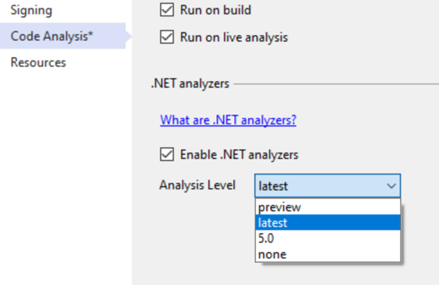
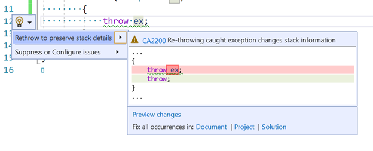
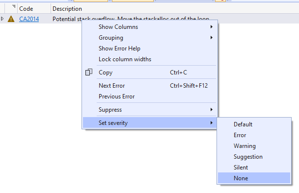
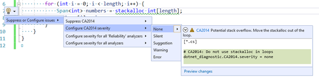
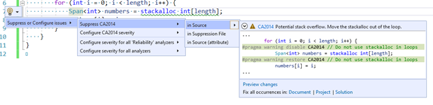
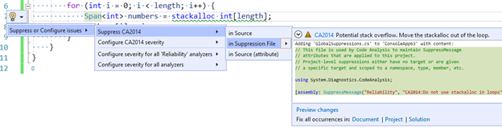
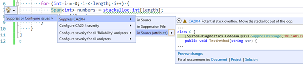

It's an exciting time to be writing code! Especially for .NET developers as the platform keeps getting smarter. We now include rich diagnostics and code suggestions in the .NET SDK by default. Before you would need to install NuGet packages or other stand-alone tools to get more code analysis. Now, you will automatically get these in the new .NET 5 SDK.

In the past, we've been reluctant to add new warnings to C#. This is because adding new warnings is technically a source breaking change for users who have warnings set as errors. However, there are a lot of cases we've come across over the years where we also really want to warn people that something was wrong, ranging from common coding mistakes to common API misuse patterns.

Starting with .NET 5, we're introducing what we're calling `AnalysisLevel` in the C# compiler to introduce warnings for these patterns in a safe way. The default Analysis Level for all projects targeting .NET 5 will be set to 5, meaning that more warnings (and suggestions to fix them) will be introduced.

Let's talk about what the possible values for `AnalysisLevel` mean in your project. First thing we should note: unless you override the default, `AnalysisLevel` is set based on your target framework:


| Target Framework              | Default for `AnalysisLevel`  |
|-------------------------------|-------------------------|
| `net5.0`                      | 5                       |
| `netcoreapp3.1` or lower      | 4                       |
| `netstandard2.1` or lower     | 4                       |
| `.NET Framework 4.8` or lower | 4                       |


However, what about the numbers 0-3? here is a more detailed breakdown of what each analysis level value means

| `AnalysisLevel` | Effect On C# Compiler | Advanced Platform API Analysis |

|----------------|--------|--------|
| 5              | Get new compiler language analysis (details below) | Yes |
| 4              | identical to passing `-warn:4` to the C# compiler in previous versions | No |
| 3              | identical to passing `-warn:3` to the C# compiler in previous versions | No |
| 2              | identical to passing `-warn:2` to the C# compiler in previous versions | No |
| 1              | identical to passing `-warn:1` to the C# compiler in previous versions | No |
| 0              | identical to passing `-warn:0` to the C# compiler in previous versions, turns off all emission of warnings |  No |

Since `AnalysisLevel` is tied to the target framework of your project, unless you change what your code targets, you will never change your default analysis level. You can manually set your analysis level though. For example, even if we are targeting .NET Core 3.1 or .NET Standard (and therefore have `AnalysisLevel` defaulted to 4) you can still opt into a higher level.


Here is an example of doing that:

```xml
<Project Sdk="Microsoft.NET.Sdk">

  <PropertyGroup>
    <OutputType>Exe</OutputType>
    <TargetFramework>netcoreapp3.1</TargetFramework>
    <!-- get more advanced warnings for this project -->
    <AnalysisLevel>5</AnalysisLevel>
  </PropertyGroup>

</Project>
```

If you always want to be on the highest supported analysis level you can specify `latest` in your project file:

```xml
<Project Sdk="Microsoft.NET.Sdk">

  <PropertyGroup>
    <OutputType>Exe</OutputType>
    <TargetFramework>netcoreapp3.1</TargetFramework>
    <!-- be automatically updated to the newest stable level -->
    <AnalysisLevel>latest</AnalysisLevel>
  </PropertyGroup>

</Project>
```

If you are _very_ adventurous and want to try out experimental compiler and platform analysis you can specify `preview` to get the latest, cutting-edge code diagnostics.

Please note that when you use `latest` or `preview, the analysis results might vary between machines, depending on the available SDK and the highest analysis level it offers.
```xml
<Project Sdk="Microsoft.NET.Sdk">

  <PropertyGroup>
    <OutputType>Exe</OutputType>
    <TargetFramework>netcoreapp3.1</TargetFramework>
    <!-- be opted into experimental code correctness warnings -->
    <AnalysisLevel>preview</AnalysisLevel>
  </PropertyGroup>

</Project>
```

Finally, we have `none` which means _"I don't want to see any new warnings."_ In this mode, you won't get any of the advanced API analysis nor new compiler warnings. This is useful if you need to update your framework but you're not ready to absorb new the warnings yet.

```xml
<Project Sdk="Microsoft.NET.Sdk">

  <PropertyGroup>
    <OutputType>Exe</OutputType>
    <TargetFramework>net5</TargetFramework>
    <!-- I am just fine thanks -->
    <AnalysisLevel>none</AnalysisLevel>
  </PropertyGroup>

</Project>
```


You can also configure the analysis level for a project from within Visual Studio via the Code Analysis property page. Just go navigate to the project property page from solution explorer. Then go to the Code Analysis tab.



In the future we will add a new analysis level for every release of .NET. The goal is to make sure that a given analysis level always represents the same set of analysis defaults (the rules and their severities). If we want to turn an existing rule on by default, we'll do this in an upcoming analysis level, instead of changing the existing level. This ensures that a given project/source always produces the same warning, regardless of how new the SDK is (unless the project uses `preview` or `latest`, of course).


Since all .NET 5 projects will be opted into _Analysis Level 5_, let's look at some of the new warnings and suggestions that will be offered:

### All New Warnings and Errors coming in Analysis Level 5

The ones in **bold** are going to be in level 5 by the time .NET 5 ships. The rest are new warnings are available _today_ in .NET 5 Preview 8 with Visual Studio 2019 16.8 Preview 2!

| Id                                                                                | Category             | Severity    | Description                                                            |
|-----------------------------------------------------------------------------------|----------------------|-------------|------------------------------------------------------------------------|
| [**CA1416**](#warn-when-code-does-not-work-across-all-platforms)                  | **Interoperability** | **Warning** | **Warn when code does not work across all platforms**                  |
| [CA1417](#do-not-use-outattribute-on-string-parameters-for-pinvokes)              | Interoperability     | Warning     | Do not use OutAttribute on string parameters for P/Invokes             |
| [CA1831](#use-asspan-instead-of-range-based-indexers-for-string-when-appropriate) | Performance          | Warning     | Use AsSpan instead of Range-based indexers for string when appropriate |
| [CA2013](#do-not-use-referenceequals-with-value-types)                            | Reliability          | Warning     | Do not use ReferenceEquals with value types                            |
| [CA2014](#do-not-use-stackalloc-in-loops)                                         | Reliability          | Warning     | Do not use `stackalloc` in loops                                       |
| [CA2015](#do-not-define-finalizers-for-types-derived-from-memorymanager)          | Reliability          | Warning     | Do not define finalizers for types derived from `MemoryManager<T>`     |
| [**CA2200**](#rethrow-to-preserve-stack-details)                                  | **Usage**            | **Warning** | **Rethrow to preserve stack details**                                  |
| [CA2247](#argument-passed-to-taskcompletionsource-calls-the-wrong-constructor)    | Usage                | Warning     | Argument passed to `TaskCompletionSource` calls the wrong constructor  |
| [CS0177](#track-definite-assignment-of-structs-across-assemblies)                 | Correctness          | Error       | track definite assignment of structs across assemblies                 |
| [**CS0185**](#do-not-allow-locks-on-non-reference-types)                          | **Correctness**      | **Error** | **do not allow locks on non-reference types**                          |
| [**CS7023**](#do-not-allow-as-or-is-on-static-types)                              | **Correctness**      | **Error** | **do not allow `as` or `is` on static types**                          |
| [CS8073](#warn-when-expression-is-always-true-or-false)                           | Usage                | Warning     | warn when expression is always false or true                           |

## Warnings and Errors for common mistakes

The first set of new warnings are intended to find latent bugs, often in larger codebases. These can be very easy to introduce without additional compiler analysis today.

### Warn when expression is always true or false

This new warning is extremely common. Consider the following code:

```csharp
public void M(DateTime dateTime)
{
    if (dateTime == null) // warning CS8073
    {
        return;
    }
}
```

`DateTime` is a `struct` and `struct`s cannot be `null`. Starting in .NET 5 we will warn about this case with `CS8073`. The warning message is:

```
Warning CS8073: The result of the expression is always 'false' since the value of type 'DateTime' is never equal to 'null' of type 'DateTime?'
```

It might seem rather obvious what this code is doing is unnecessary in isolation but consider that such a check might occur in a method with 10 parameters to validate. To fix this you can remove the code (since its always false it's not doing anything anyways), or change its type to `DateTime?` if `null` is an intended value for the parameter.

```csharp
public void M(DateTime? dateTime) // We accept a null DateTime
{
    if (dateTime == null) // No Warnings
    {
        return;
    }
}
```

### Do not allow as or is on static types

This next one is a nice little enhancement:

```csharp
static class Fiz
{
}

class P
{
    bool M(object o)
    {
        return o is Fiz; // CS7023
    }
}
```

Because class `Fiz` is a static class an instance object like `o` will never be able to be an instance of this type. We will get this warning:

```
Warning CS7023 The second operand of an 'is' or 'as' operator may not be static type 'Fiz'
```

The fix for this is to refactor our code (maybe we are actually checking against the wrong type to begin with), or to make the class `Fiz` non-static:

```csharp
class Fiz
{
}

class P
{
    bool M(object o)
    {
        return o is Fiz; // no error
    }
}
```

### Do not allow locks on non-reference types

`lock`ing on a non-reference type (like an `int`) does nothing because they are pass-by-value so a different version of them lives on every stack frame. In the past we would warn you about locking on non-reference types for simple cases like `lock(5)` but until recently we would not warn you for open generics like below.

```csharp
public class P
{
    public static void GetValue<TKey>(TKey key)
    {
        lock (key) // CS0185
        {
        }
    }

    static void Main()
    {
        GetValue(1);
    }
}
```

This is an error because passing in an int (which is allowed under this unconstrained generic) will not actually lock correctly. We'll see this error:

```
Error CS0185 'TKey' is not a reference type as required by the lock statement
```

To fix this we need to indicate that the `GetValue` method should only be given reference types. We can do this with the generic type constraint `where TKey : class`

```csharp
public class P
{
    public static void GetValue<TKey>(TKey key) where TKey : class
    {
        lock (key) // no error
        {
        }
    }
}
```

### Rethrow to preserve stack details

We're all good (?) developers so our code never throws exceptions, right? Well even the best developers need to handle exceptions in .NET and one of the common pitfalls new programmers fall into is this:

```csharp
try
{
    throw new Exception();
}
catch (Exception ಠ_ಠ)
{
    // probably logging some info here...

    // rethrow now that we are done
    throw ಠ_ಠ; // CA2200
}
```

In school I learned that if someone threw the ball at me and I caught it, I had to throw the ball back! Metaphors like this lead lots of folks to believe that `throw ex` is the correct way to re-throw this exception. Sadly, this will change the stacks in the original exception. Now you will get a warning that this is happening. It looks like this:

```
Warning CA2200 Re-throwing caught exception changes stack information
```

In nearly all cases the correct thing to do here is to simply use the `throw` keyword without mentioning the variable of the exception we caught.

```csharp
try
{
    throw new Exception();
}
catch (Exception ಠ_ಠ)
{
    // probably logging some info here...

    // rethrow now that we are done
    throw;
}
```

We also offer a code fix to easily fix up all of these at once in your document, project, or solution!


### Do not use ReferenceEquals with value types

Equality is a tricky topic in .NET. This next warning strives to make accidentally comparing a `struct` by reference apparent. Consider the code below:


```csharp
int int1 = 1;
int int2 = 1;
Console.WriteLine(object.ReferenceEquals(int1, int2)); // warning CA2013
```

This will box the two `int`s and `ReferenceEquals` will always return false as a result. We will see this warning description:

```
Warning CA2013: Do not pass an argument with value type 'int' to 'ReferenceEquals'. Due to value boxing, this call to 'ReferenceEquals' will always return 'false'.
```

The fix for this error is to either use the equality operator `==` or `object.Equals` like so:

```csharp
int int1 = 1;
int int2 = 1;
Console.WriteLine(int1 == int2); // using the equality operator is fine
Console.WriteLine(object.Equals(int1, int2));  // so is object.Equals
```

### Track definite assignment of structs across assemblies

This next warning is something that a lot of people may be surprised to learn wasn't already a warning:

```csharp
using System.Collections.Immutable;

class P
{
    public void M(out ImmutableArray<int> immutableArray) // CS0177
    {
    }
}
```

This rule is all about [definite assignment](https://docs.microsoft.com/dotnet/csharp/language-reference/language-specification/variables#definite-assignment), a useful feature in C# that makes sure you don't forget to assign values to your variables.

```
Error CS0177: The out parameter 'immutableArray' must be assigned to before control leaves the current method
```

`CS0177` is already issued for several different situations today, but not in the case previously shown. The history here is that this was a bug that traces itself all the way back to the original implementations of the C# compiler. Previously, the C# compiler ignored private fields of reference types in a value type imported from metadata when computing definite assignment. This very specific bug meant that a type like `ImmutableArray<T>` was able to escape definite assignment analysis. Ouch!

Now the compiler will correctly error for you and you can fix it by simply ensuring that it is always assigned a value, like so:

```csharp
using System.Collections.Immutable;

class P
{
    public bool M(out ImmutableArray<int> immutableArray) // no warning
    {
        immutableArray = ImmutableArray<int>.Empty;
    }
}
```

## Warnings for incorrect .NET API usage

The next examples are about correctly using .NET libraries. Analysis Levels allow for guarding against improper use of existing .NET APIs today, but it also has an impact on .NET library evolution moving forward. If a useful API is designed but it has the potential for misuse, a new warning that detects misuse can also be added in tandem with the new API.

### Do not define finalizers for types derived from MemoryManager

`MemoryManager` is a useful class for when you want to implement your own `Memory<T>` type. This is not something you're likely to find yourself doing a lot, but when you need it you _really_ need it. A new warning triggers for cases like this:

```csharp
class DerivedClass <T> : MemoryManager<T>
{
    public override bool Dispose(bool disposing)
    {
        if (disposing)
        {
            _handle.Dispose();
        }
    }
  
    ~DerivedClass() => Dispose(false); // warning CA2015
}
```

Adding a finalizer to this type can introduce holes in the garbage collector, which we all would prefer to avoid!

```
Warning CA2015 Adding a finalizer to a type derived from MemoryManager<T> may permit memory to be freed while it is still in use by a Span<T>.
```

The fix is to remove this finalizer, since it will cause very subtle bugs in your program that will be hard to find and fix.

```csharp
class DerivedClass <T> : MemoryManager<T>
{
    public override bool Dispose(bool disposing)
    {
        if (disposing)
        {
            _handle.Dispose();
        }
    }
 // No warning, since there is no finalizer here
}
```

### Argument passed to `TaskCompletionSource` calls the wrong constructor

This warning notifies us that we've used just _slightly_ the wrong enum.

```csharp
var tcs = new TaskCompletionSource<int>(TaskContinuationOptions.RunContinuationsAsynchronously); // warning CA2247
```

Unless you are already aware of the issue you may stare at this for a bit before you see it. The problem is that this constructor does not take a `TaskContinuationOptions` enum it takes a `TaskCreationOptions` enum. What is happening is that we are calling the constructor for `TaskCompletionSource` that accepts `object`! Considering how similar their names are and that they have very similar values this mistake is easy to make.

```
Warning CA2247: Argument contains TaskContinuationsOptions enum instead of TaskCreationOptions enum.
```

The fix is to pass in the correct enum type:

```csharp
var tcs = new TaskCompletionSource<int>(TaskCreationOptions.RunContinuationsAsynchronously); // no warning
```

### Warn when code does not work across all platforms

This last one is a doozy! I won't go into all its intricacies here (look forward to a future blog post on that topic). But the purpose of warnings here is to let you know that the APIs you are calling may not work on all the targets you are building for.

Let's say I have an app that runs on both Linux and Windows. I have a method that I use to get the path to create log files under and it has different behavior based on where it is running.

```csharp
private static string GetLoggingPath()
{
    var appDataDirectory = Environment.GetFolderPath(Environment.SpecialFolder.LocalApplicationData);
    var loggingDirectory = Path.Combine(appDataDirectory, "Fabrikam", "AssetManagement", "Logging");

    // Create the directory and restrict access using Windows
    // Access Control Lists (ACLs).

    var rules = new DirectorySecurity(); // CA1416
    rules.AddAccessRule(
        new FileSystemAccessRule(@"fabrikam\log-readers",
                                    FileSystemRights.Read,
                                    AccessControlType.Allow)
    );
    rules.AddAccessRule(
        new FileSystemAccessRule(@"fabrikam\log-writers",
                                    FileSystemRights.FullControl,
                                    AccessControlType.Allow)
    );

    if (!OperatingSystem.IsWindows())
    {
        // Just create the directory
        Directory.CreateDirectory(loggingDirectory);
    }
    else
    {
        Directory.CreateDirectory(loggingDirectory, rules);
    }

    return loggingDirectory;
}
```

I correctly use the [OperatingSystem](https://docs.microsoft.com/dotnet/api/system.operatingsystem) helper check if the OS is windows with `OperatingSystem.IsWindows()` and only pass the rules in in that case, but I actually have already uses platform specific APIs that will not work on Linux!

```
Warning CA1416: 'DirectorySecurity' is unsupported on 'Linux'
```

The correct way to handle this is to move all my platform specific code inside the `else` statement.

```csharp
private static string GetLoggingPath()
{
    var appDataDirectory = Environment.GetFolderPath(Environment.SpecialFolder.LocalApplicationData);
    var loggingDirectory = Path.Combine(appDataDirectory, "Fabrikam", "AssetManagement", "Logging");

    if (!OperatingSystem.IsWindows())
    {
        // Just create the directory
        Directory.CreateDirectory(loggingDirectory);
    }
    else
    {
        // Create the directory and restrict access using Windows
        // Access Control Lists (ACLs).

        var rules = new DirectorySecurity(); // CA1416
        rules.AddAccessRule(
            new FileSystemAccessRule(@"fabrikam\log-readers",
                                        FileSystemRights.Read,
                                        AccessControlType.Allow)
        );
        rules.AddAccessRule(
            new FileSystemAccessRule(@"fabrikam\log-writers",
                                        FileSystemRights.FullControl,
                                        AccessControlType.Allow)
        );

        Directory.CreateDirectory(loggingDirectory, rules);
    }

    return loggingDirectory;
}
```

## Low level coding help

There are also a few warnings that are useful when writing high-performance applications. These next set of warnings ensure you don't need to sacrifice safety for these cases.

### Do not use OutAttribute on string parameters for P/Invokes

Sometimes you need to interoperate with native code. .NET has the concept of platform invocations (P/Invokes) to make this process easier. However, there are a few gotchas in terms of sending data to and from native libraries in .NET.  Consider the code below:

```csharp
[DllImport("MyLibrary")]
private static extern void Goo([Out] string s); // warning CA1417
```

Unless you are very familiar with writing P/Invokes, it's not obvious what is wrong here. You normally apply `OutAttribute` to types that the runtime doesn't know about to indicate how the type should be marshaled. The `OutAttribute` implies that you are passing the data by value. It doesn't make sense for strings to be passed by value though and has the potential to crash the runtime.

```
Warning CA1417 Do not use the 'OutAttribute' for string parameter 's' which is passed by value. If marshalling of modified data back to the caller is required, use the 'out' keyword to pass the string by reference instead.
```

The fix for this is to either treat it as a normal out parameter (passing by reference).

```csharp
[DllImport("MyLibrary")]
private static extern void Goo(out string s); // no warning
```

or if you don't need the string marshaled back to the caller you can just do this:

```csharp
[DllImport("MyLibrary")]
private static extern void Goo(string s); // no warning
```

### Use AsSpan instead of Range-based indexers for string when appropriate

This is all about making sure that you don't accidentally allocate a string.

```csharp
class Program
{
    public void TestMethod(string str)
    {
        ReadOnlySpan<char> slice = str[1..3]; // CA1831
    }
}
```

In the code sample, it's clear that the intent is to index a string using the new [range-based index](https://docs.microsoft.com/dotnet/csharp/language-reference/proposals/csharp-8.0/ranges) feature in C#. Unfortunately, this will actually allocate a string unless you convert that string to a span first.

```
Warning CA1831 Use 'AsSpan' instead of the 'System.Range'-based indexer on 'string' to avoid creating unnecessary data copies
```

The fix is to just add AsSpan calls in this case:

```csharp
class Program
{
    public void TestMethod(string str)
    {
        ReadOnlySpan<char> slice = str.AsSpan()[1..3]; // no warning
    }
}
```

### Do not use stackalloc in loops

The [`stackalloc`](https://docs.microsoft.com/dotnet/csharp/language-reference/operators/stackalloc) keyword is great for when you want to make sure the operations you are doing are easy on the garbage collector. In the past, `stackalloc` was only allowed in unsafe code, but since C# 8 it's also been allowed outside of `unsafe` blocks so long as that variable is assigned to a `Span<T>` or a `ReadOnlySpan<T>`.

```csharp
class C
{
    public void TestMethod(string str)
    {
        int length = 3;
        for (int i = 0; i < length; i++)
        {
            Span<int> numbers = stackalloc int[length]; // CA2014
            numbers[i] = i;
        }
    }
}
```

Allocating a lot on the stack can lead to the famous StackOverflow exception, where we've allocated more memory on the stack than allowed. Allocating in a loop is especially perilous.

```
Warning CA2014 Potential stack overflow. Move the stackalloc out of the loop.
```

The fix is to move our `stackalloc` out of the loop.

```csharp
class C
{
    public void TestMethod(string str)
    {
        int length = 3;
        Span<int> numbers = stackalloc int[length]; // no warning
        for (int i = 0; i < length; i++)
        {
            numbers[i] = i;
        }
    }
}
```

## Configuring Analysis Levels

Now that you've seen how useful these warnings are, you probably never want to go back to a world without them right? Well, I know that the world doesn't always work that way. As mentioned at the beginning of this post, these are source breaking changes, and you should be able to take them on in a schedule that works for you. Part of the reason we're introducing this now is to get feedback in two areas:


1. If the small set of warnings we're introducing is too disruptive or not
2. If the mechanism for tuning the warnings is sufficient for your needs

### Going back to the .NET Core 3.1 analysis level

If you just want to go back to the way things were before .NET 5 (meaning the warnings you got in .NET Core 3.1) all you need to do is set the analysis level to 4 in your project file. Here is an example:

```xml
<Project Sdk="Microsoft.NET.Sdk">

  <PropertyGroup>
    <OutputType>Exe</OutputType>
    <TargetFramework>net5.0</TargetFramework>
    <!-- get the exact same warnings you used to -->
    <AnalysisLevel>4</AnalysisLevel>
  </PropertyGroup>

</Project>
```

### Turning off just a single rule

If there is a specific warning that you believe is not applicable to your codebase you can use an [editorconfig file](https://docs.microsoft.com/visualstudio/ide/create-portable-custom-editor-options) to turn it off for your codebase. You can do this by either setting the severity of the warning to 'none' from the error list.



Or by selecting 'none' from the lightbulb menu where the warning appears in the editor



### Turning off a single instance of a warning

If you want a warning to be on almost all the time and only suppress it in a few instances you can use the lightbulb menu to either:

- Suppress it in source.



- Suppress it in a separate suppression file.
  


- Suppress it in source with an attribute.



## Summary

I hope this has gotten you excited for all the improvements to code analysis that you can expect in .NET 5 and please [give us feedback](https://github.com/dotnet/roslyn-analyzers/issues/new) about this experience.
