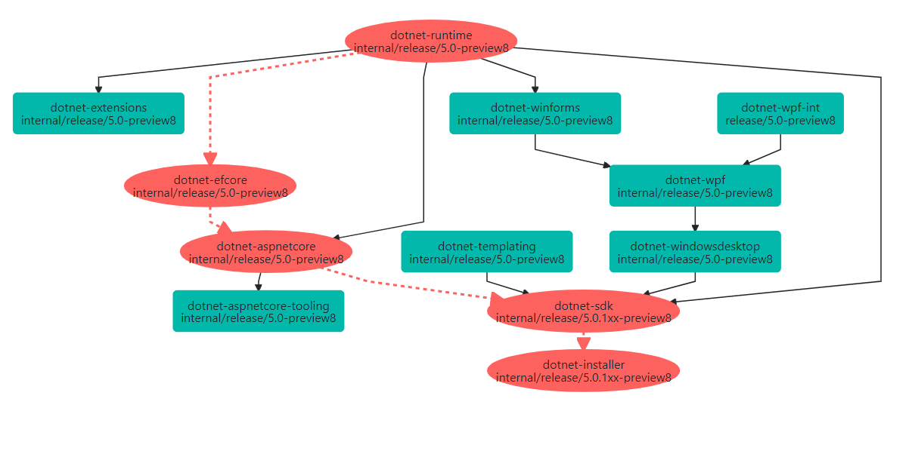

This is a deep technical dive into the machinery and processes used by the .NET Team to build and ship .NET. It will be of interest to those who wish to know about such topics as:
- How .NET builds a product developed across many repos.
- Safely handles security patches.
- Preps and validates a product for release.

This post begins by laying out the multi-repository world that makes up the .NET product, its inherent challenges, and how we deal with them. This is a review of some of the information presented in [The Evolving Infrastructure of .NET Core](https://devblogs.microsoft.com/dotnet/the-evolving-infrastructure-of-net-core/). Then it takes a close look at how we build, prep, and ship the product, especially around releases that include security fixes.

## Our Principles

- Developers use GitHub (and the tools and practices used/described there) as their primary development environment.
- Be transparent about how we build and ship.
- Be responsible with our response to security vulnerabilities and premature disclosure.

## A Land of Many Repos

.NET is developed not as a monolithic repo, but as a set of repos that have inter-dependencies on one another. See [.NET repositories](https://github.com/dotnet/core/blob/master/Documentation/core-repos.md) for information on where various functionality is developed. For instance, the `dotnet/runtime` repo builds the core .NET runtime and some additional NuGet packages. Its outputs are consumed by `dotnet/aspnetcore`, `dotnet/installer`, `dotnet/extensions`, and a few others. Consumption of dependencies in .NET takes a few forms:
- **Consuming information about the public API of a dependency** - After a major release, the public API doesn't change. During active development of a new major version, however, it may shift on a regular basis as new APIs or new features are introduced.
- **Referencing specific version numbers of assets produced in another repo** - For example, `dotnet/aspnetcore` may produce NuGet packages that encode a dependency on a specific version of `Microsoft.Extensions.Logging`.
- **Redistributing dependencies produced in another repo** - Some examples:
  - While `Microsoft.Extensions.Logging` is released as a standalone NuGet package on `https://nuget.org`, it is also re-packaged within the ASP.NET Core shared framework as part of the dotnet/aspnetcore build.
  - The ASP.NET Core runtime produced in the `dotnet/aspnetcore` build can be installed as a standalone component, but is also contained within the .NET SDK that is produced out of `dotnet/installer`.
- **Building dependencies from source code** - It isn't always possible to use or redistribute the .NET binaries built by Microsoft's CI system. Specifically, prebuilt binaries are typically forbidden in Linux distributions. This means dependencies are sometimes built from source code.

The upshot of this is that when we release a version of .NET, we cannot simply produce a build of each repo in parallel, sign, publish and release. Instead, we must ensure that the desired version of each dependency is referenced in all repos that make up the product and reference that dependency. Updating a version of a dependency in a repo means creating a new build against those updated dependencies, which in turn may require other repos to update their dependencies and rebuild. This set of inter-dependent repos forms a graph. In .NET 5, this dependency flow graph is currently 6 layers deep (`dotnet/runtime`-> `dotnet/winforms` -> `dotnet/wpf` -> `dotnet/windowsdesktop` -> `dotnet/sdk` -> `dotnet/installer`).

### Tracking our Dependencies

Given that this dependency graph is rather complex, we need automated ways to track and update it. We track dependencies via metadata in the `eng/Version.Details.xml` file of each repo. This file identifies the names and versions of a set of input dependencies. Each dependency also identifies the source commit and repo that was built to create it. For example, this excerpt is from `dotnet/installer`. It identifies that `dotnet/installer` has an input asset called `Microsoft.NET.Sdk` at version `5.0.100-rc.1.20403.9`, produced out of a build of `https://github.com/dotnet/sdk` at [`56005e13634b9388aa53596891bc2e8192e2978c`](https://github.com/dotnet/sdk/tree/56005e13634b9388aa53596891bc2e8192e2978c).

#### eng/Version.Details.xml (excerpt from [dotnet/installer @ dc95de00046550c2a5a053153ca78ef89a114fd7](https://github.com/dotnet/installer/blob/dc95de00046550c2a5a053153ca78ef89a114fd7/eng/Version.Details.xml))
```xml
<?xml version="1.0" encoding="utf-8"?>
<Dependencies>
  <ProductDependencies>
    <!-- Other dependencies.. -->
    <Dependency Name="Microsoft.NET.Sdk" Version="5.0.100-rc.1.20403.9">
      <Uri>https://github.com/dotnet/sdk</Uri>
      <Sha>56005e13634b9388aa53596891bc2e8192e2978c</Sha>
    </Dependency>
  </ProductDependencies>
</Dependencies>
```

The dependency names then correspond to a set of MSBuild property names present in an `eng/Versions.props` file that also lives in the repo:

#### eng/Versions.props (excerpt from [dotnet/installer @ dc95de00046550c2a5a053153ca78ef89a114fd7](https://github.com/dotnet/installer/blob/dc95de00046550c2a5a053153ca78ef89a114fd7/eng/Versions.props)
```xml
  <PropertyGroup>
    <!-- Dependencies from https://github.com/dotnet/sdk -->
    <MicrosoftNETSdkPackageVersion>5.0.100-rc.1.20403.9</MicrosoftNETSdkPackageVersion>
    <MicrosoftDotNetMSBuildSdkResolverPackageVersion>5.0.100-rc.1.20403.9</MicrosoftDotNetMSBuildSdkResolverPackageVersion>
    <MicrosoftNETBuildExtensionsPackageVersion>$(MicrosoftNETSdkPackageVersion)</MicrosoftNETBuildExtensionsPackageVersion>
    <MicrosoftDotnetToolsetInternalPackageVersion>$(MicrosoftNETSdkPackageVersion)</MicrosoftDotnetToolsetInternalPackageVersion>
  </PropertyGroup>
```

The repo is then free to use the `MicrosoftNETSdkPackageVersion` property as it wishes. In this case, it's used to specify the version of package named `Microsoft.NET.Sdk` as well as part of the path to an archive zip file produced in the `dotnet/sdk` build.

Notice that because the source information for a dependency is preserved within the `eng/Version.Details.xml` file, it's possible to look up the `eng/Version.Details.xml` at the source repo + commit and determine *its* dependencies. Doing so recursively builds up a graph of all dependencies present within the product. See below for a visualization of a recent Preview 8 build. We divide these dependencies into two categories:
- **Product** - Product dependencies represent those that are critical to product functionality. If the outputs of all builds contributing product dependencies to the graph are gathered together, along with existing external sources (e.g. `https://nuget.org`) the product should function as expected.
- **Toolset** - Toolset dependencies are not shipped with the product. They may represent inputs for testing purposes or build purposes. Without these, the product should function as expected. These are excluded from the product drop and not shipped on release day. These should not be confused with the compilers and build tools packaged with the SDK, like F#, C#, or MSBuild. Instead, these dependencies represent functionality that is used to package or sign the product, bootstrap testing, etc.

### Updating our Dependencies

We update our tracked dependencies automatically using a custom service called Maestro (see https://github.com/dotnet/arcade-services for the implementation). Every official build (on any branch) contains a stage that reports its status to the Maestro service. Maestro maintains a registry of metadata about the reported builds, including a list of their outputs, commits, repo urls, etc. Maestro then uses concepts called channels and subscriptions to determine what to do with these newly reported builds. We call this process 'dependency flow'.
- **Channels** - Not all builds are created with the same intent - A build of the `main` branch of `dotnet/efcore` may be intended for day to day development, meaning it's outputs should flow to other repos' branches that are also tracking day to day development. On the other hand, a build of a test branch is not intended to flow anywhere. Channels are effectively tags that signal **intent** for a build. Any build can be assigned to any channel.
- **Subscriptions** - Subscriptions map builds of a source repo that have a specific intent (assigned to a certain channel) onto a target branch in another repo. When a build is assigned to a channel, Maestro alters the state of the target branch to update its dependencies by modifying the `eng/Version.Details.xml` and `eng/Versions.props` files. It then [opens a pull request](https://github.com/dotnet/aspnetcore/pull/24941) with the changes.



*Note: The red path represents the longest path through the graph from a build time standpoint*

It's also interesting to note that channels affect publishing of a build's assets. A build not assigned to any channel does not publish its outputs anywhere. Assignment to a channel will trigger publishing of those assets, and the channel defines what the desired endpoints are. For instance, the channel for day to day development of .NET 5 indicates that files like Sdk installers or zip archives should be pushed to the `dotnetcli` storage account, and packages should be pushed to the `dotnet5` Azure DevOps NuGet feed. On the other hand, the channels used for the engineering services and tools push to the `dotnet-eng` NuGet package feed. What this means is that the **intent** of a build does not have to be known at build time. Channel assignment indicates intent *and* ensures that the outputs are published to the right locations based on that intent.

*One thing to note: Currently the Maestro system defining channels, subscriptions and dependency flow does not have a publicly available portal for visualization, though Maestro's behavior is publicly visible via dependency update pull requests. https://github.com/dotnet/arcade/issues/1818 covers this feature. Let us know if this is valuable by commenting or voting on the issue.*

#### A litte bit more on channels and intent

Typical product development workflows assign build intent based on branch. As the number of repos and scales up, this model tends to break down. Different teams have different development practices and branching strategies motivated by varying requirements. This is especially true when repos ship in multiple vehicles that run on separate schedules or have differing servicing requirements. For example the Roslyn C# compiler ships in the .NET SDK as well as separately in Visual Studio. By using subscriptions which pull builds that have been to assigned to channels, we end up with a cleaner producer/consumer model for the flow of dependencies.

For example, the `dotnet/sdk` repo pulls in a wide variety of input dependencies for .NET 5 Preview 8. One of those is the NuGet client. NuGet tends to produce new builds, test them, and then pick and choose which builds are ready for insertion into Visual Studio or the .NET SDK. Rather than have the `dotnet/sdk` team keep track of which branches NuGet is using at the time and the state of the builds, they simply set up a subscription to target the `release/5.0.1xx-preview8` with NuGet.Client builds assigned to the 'VS 16.8' channel. Similarly, the NuGet team also doesn't need to anything about the SDK's branching structure, only that they want builds intended for VS 16.8.

### Coherency and Incoherency

Day to day, code gets checked into each repo, builds of those code changes are performed, and those builds are assigned to channels. Maestro uses the subscription information to flow new outputs produced by those builds to other repos. For development channels, this process occurs on a continual basis. The product is constantly evolving and changing. Because some repos flow through the dependency graph along multiple paths, there may be varying versions of a single dependency within the product at any given moment. We call this state "incoherent". For day to day builds, this is usually fine. The output product generally behaves as expected, and teams can take their time reacting to breaking changes, introducing new functionality, or dealing with failures in dependency update PRs. When creating a product for release, however, we want a single version of each asset referenced within the repo dependency graph. A single version of the runtime, a single version of aspnetcore, a single version of each NuGet package, etc. We call this state "coherent".

Incoherency represents a *possible* error state. For an example let’s take a look at the .NET shared framework runtime. It exposes a specific public API surface area. While multiple versions of it may be referenced in the repo dependency graph, the SDK ships with just one. This runtime must satisfy all of the demands of the transitively referenced components (e.g. WinForms and WPF) that may execute on that runtime. If the runtime does not satisfy those demands (e.g. breaking API change, bug, etc.), failures may occur. In an incoherent graph, because all repositories have not ingested the same version of the shared framework, there is a possibility that a breaking change has been missed.

## Producing and Releasing a Product

Let's now take a look at the workflow by which we build and release the product.

We can think of the Maestro subscriptions as forming a flow graph, each edge representing flow of changes between repositories. If no additional 'real' (not dependency flow) changes are made in any repo in the graph, then eventually the flow of changes will cease and the product will reach an unchanging, coherent state where there is a single version of each dependency. This is what we drive for on a regular basis for preview and servicing releases. The general flow for each release is as follows:

1. **Prep for the new release** - Update branding (e.g. version numbers, preview identifiers, which packages will ship) for the upcoming release. If this is a preview, then new branches are forked from the primary development branches, and stabilization is done in the new branches.
2. **Commit changes** -  Commit any changes necessary for the release (e.g. approved bug fixes) in each repo.
3. **Iterate until coherent** - Allow new builds to complete and dependencies flow until we reach a coherent state.
4. **Prep dotnet/source-build release** - The coherent product's source code dependencies are fed through the [dotnet/source-build](https://github.com/dotnet/source-build) project.
5. **Validate** - Perform additional validation that isn't present in PR/CI testing (e.g. test Visual Studio Scenarios).
6. **Send dotnet/source-build to partners** - The product's source code is sent to partners (e.g Red Hat) that need to build .NET from source in their own CI.
7. **Fix if necessary** - If any issues are found, prepare any additional changes, commit, and go back to step 3.
8. **Release** - The product is now ready to ship, as a set of binaries in the appropriate packages for each supported operating system.

This process sometimes completes significantly in advance of a scheduled release date. That's what we hope for. When that happens, the assets just wait in Azure blob storage and various package feeds, to be released on the scheduled ship date. Other times, this process completes very near the scheduled ship date, and there is very little breathing room. This is particularly challenging when the scheduled ship date is immovable, like when it is tied to the first day of a big conference.

### Code Flow

Day to day development of .NET is done on GitHub. For releases containing security fixes, we need a non-public place to commit those fixes, combined with any non-security changes made publicly on GitHub. Committing and building internally prevents early disclosure of vulnerabilities that would place customer applications at risk. To satisfy this requirement, we maintain two parallel sets of branches in an Azure DevOps repo:
- **A direct copy of a corresponding branch in GitHub** - For example, if there is a `release/5.0` branch in GitHub's `dotnet/runtime` repo, there is a `release/5.0` branch in the Azure DevOps `dotnet-runtime` repo and the `HEAD` always matches. Every time a commit is made into GitHub, the `dotnet-runtime` repo does a fast-forward merge to pull in the new changes.
- **A corresponding `internal/release/5.0` branch that is related to the `release/5.0` branch** - Every time a commit is made to GitHub's `release/5.0` branch, the commit is *merged* into `internal/release/5.0`. If there are no security fixes committed to the `internal/release/5.0` branch, its HEAD matches the `release/5.0` branch. If there are, then `HEAD` diverges.

This parallel set of branches gives us a way to produce a product with security fixes while performing as many of our changes in the open as possible:
- **When we build a release without security fixes** - The `internal/release/...` branches are unused. All commits and dependency flow occur against the GitHub `release/...` branches.
- **When we build a release with security fixes** - Those specific fixes are checked into the appropriate `internal/release/...` branch in Azure DevOps and dependency flow targets the `internal/release/...` branch in each repo. Any changes that are not security or dependency flow related are committed to the corresponding public GitHub branch, then automatically merged into the `internal/release/...` branch. On release day, we open a PR to merge the `internal/release/...` branch back into the  public release branch (e.g. if commit was in `internal/release/5.0`, we merge it back to `release/5.0`). This resets the internal branch state back to matching the public branch state, readying us for the next release.

There is one unfortunate side effect of the public -> internal merges. If dependency flow is enabled on both public and internal branches, i.e. public builds flow to public GitHub branches and internal builds flow to internal branches, then every dependency flow commit on the public side would conflict as it is merged into the internal branches. This requires extensive, error-prone, manual intervention as there can be 10s of dependency flow commits/day, spread across many repos. To avoid this, we largely turn off public dependency flow when building an internal release, except for some leaf nodes in the graph (e.g. roslyn, fsharp, MSBuild, etc.), and internal dependency flow when building a public release. Thus, the runtime and SDK functionality packaged with the daily builds of the publicly available installer falls out of date until release day. The .NET team will be looking into robust ways to maintain both public and internal builds in parallel in the future.

### Shipping and Non-Shipping Assets

.NET divides the **outputs** of each build into two categories:
- **Shipping** - These are assets that should appear on external endpoints like `https://nuget.org`, the .NET download sites, etc. These assets typically get "stable" versions (e.g. 5.0.6) rather than "non-stable" versions (e.g. 5.0.6-servicing.20364.11) when building for RTM and servicing releases.
- **Non-Shipping** - These are assets that do not appear on external endpoints. They *always* have non-stable versions. They are sometimes known as transport packages.

Typically, non-shipping assets exist for the purpose of inter-repo transport. For instance, `dotnet/sdk` produces a package called "Microsoft.NET.Sdk" which is only redistributed from within the `dotnet/installer` output (zip and tar.gz files, for example) and does not appear on `https://nuget.org`. We always use non-stable versioning for non-shipping packages so that their versions remain unique build to build.

### Stable builds and Dependency Flow

There is one particularly interesting implication of our multi-repo OSS development environment. As discussed earlier in this deep dive, the repos tend to have strong dependency ties to one another. They redistribute many binaries and reference specific version numbers (e.g. NuGet package versions) from their dependencies. For example, `Microsoft.Extensions.Logging` is built out of `dotnet/runtime`, has its contents redistributed in the `dotnet/aspnetcore` shared framework, but *also* ships independently to `https://nuget.org`. When we build a new version of `Microsoft.Extensions.Logging` for a release, we want it to have a stable *and* predictable version number. We want `5.0.6`, not `5.0.6-servicing.20364.11`. But what happens when we need to build `dotnet/runtime` more than once for a given release? The first build of `dotnet/runtime` built `Microsoft.Extensions.Logging` version `5.0.6`, and the subsequent build also did the same. As a rule, NuGet feeds are immutable. We can't simply overwrite the old package, nor would we want to. So how do we flow this new instance of `Microsoft.Extensions.Logging` and ensure that the downstream repos pick up the correct package?

The .NET team solves this by having 3 sets of NuGet feeds our build infrastructure:
- **Shipping feeds** - These contain *non-stable*, *shipping* packages produced in day to day builds. There are internal and public variants of these for each major product version:
  - dotnet5 - This feed is seen in each product repo's `NuGet.config` file and is publicly accessible.
  - dotnet5-internal - This feed is automatically added to the `NuGet.config` of a repo when doing official builds. Adding it at build time avoids NuGet restore issues when building publicly, where it is not accessible. This feed only recieves new packages when doing internal builds.
- **Non-shipping feeds** - These contain *non-stable*, *non-shipping* packages produced in day to day builds. Such packages *always* have unique version numbers for each new build. There are internal and public variants of these for each major product version:
  - dotnet5-transport - This feed is seen in each product repo's `NuGet.config` file and is publicly accessible.
  - dotnet5-internal-transport - This feed is automatically added to the `NuGet.config` of a repo when doing official builds. Adding it at build time avoids NuGet restore issues when building publicly, where it is not accessible. This feed only recieves new packages when doing internal builds.
- **Isolated feeds** - These feeds are created dynamically for each build for its *stable*, *shipping* packages. The feeds are named based on the repo and sha that was built. Maestro will then update the `NuGet.config` file in a dependency update PR to include any feeds required to access the desired stable packages. Each build ensures a clean NuGet cache to avoid accidentally picking up the wrong instance of a stable package. On release day these assets are pushed to `https://nuget.org` and any isolated feed containing packages with shipped versions are cleared out. This ensures that `https://nuget.org` is the "source of truth". Subsequent Maestro dependency updates will automatically remove these isolated feeds as they are no longer needed. A sample NuGet.config is shown below, from https://github.com/dotnet/cli/blob/v3.1.300/NuGet.config:

```xml
<?xml version="1.0" encoding="utf-8"?>
<configuration>
  <packageSources>
    <clear />
    <!--Begin: Package sources managed by Dependency Flow automation. Do not edit the sources below.-->
    <add key="darc-int-dotnet-core-setup-0c2e69c" value="https://pkgs.dev.azure.com/dnceng/_packaging/darc-int-dotnet-core-setup-0c2e69ca/nuget/v3/index.json" />
    <add key="darc-int-dotnet-corefx-059a4a1" value="https://pkgs.dev.azure.com/dnceng/_packaging/darc-int-dotnet-corefx-059a4a19/nuget/v3/index.json" />
    <!--End: Package sources managed by Dependency Flow automation. Do not edit the sources above.-->
    <add key="dotnet-core" value="https://dotnetfeed.blob.core.windows.net/dotnet-core/index.json" />
    <add key="dotnet-tools" value="https://pkgs.dev.azure.com/dnceng/public/_packaging/dotnet-tools/nuget/v3/index.json" />
    <add key="dotnet3" value="https://pkgs.dev.azure.com/dnceng/public/_packaging/dotnet3/nuget/v3/index.json" />
    ...
  </packageSources>
</configuration>
```

The separation of shipping and non-shipping packages into different feeds is useful. Combining the required shipping package feeds with the standard `https://nuget.org` feed means that the NuGet restore behavior seen *after* a product releases will closely match how we validate pre-release. Non-shipping packages cannot accidentally appear in the restore graph. This also gives developers a cleaner `NuGet.config` file when consuming daily development builds. See [Installers and Binaries](https://github.com/dotnet/installer#installers-and-binaries) and [Sample NuGet Config](https://github.com/dotnet/core/blob/master/samples/nuget.config) examples.

#### Internal isolated feeds and public builds

Recently, a [developer noticed](https://twitter.com/randompunter/status/1290233811871993856) that they were unable to build the tagged [v3.1.300](https://github.com/dotnet/cli/tree/v3.1.300) commit. The 3.1.300 SDK release was built internally, so the isolated "darc-int-" feeds automatically propagated into the `NuGet.config` file are not publicly available. While these feeds are empty after release day, simply their inclusion in the `NuGet.config` file will cause the NuGet restore step to fail. This behavior has long been a complaint among the .NET teams. On release day, the internal to public merge PRs require manual fixups (removal of any darc-int- feeds) to pass. The good news is that this shouldn't be a problem for future releases. The .NET Engineering Services team has recently merged a change into Maestro which disables the "darc-int" NuGet sources by default. Therefore, a public build of a repo will "assume" any internal source is not required (which is true after release day), while internal builds will automatically enable those sources. Going forward, this should ensure that commits tagged for release are always buildable without source modification on the day of release.

### Prep and Validation

After we have a coherent product with all desired fixes, we run it through an Azure DevOps pipeline which handles preparing a full product drop and handoff for additional validation. We utilize Maestro in an interesting way to do this. Starting at `dotnet/installer`, Maestro traverses the dependency graph starting at the `dotnet/installer` commit that we wish to ship and finds every unreleased dependency that contributes to that graph. It then locates all individual repo builds associated with those dependencies and the full set of Microsoft CI assets produced by those builds. Each of these assets has a set of endpoints associated with them, which is updated upon publishing. Maestro locates and downloads all the assets, placing them in a directory that is ready to be validated and released.

Our additional prep and validation is wide ranging, but includes activities such as:
- NuGet package consistency checks.
- Signing checks.
- Insertion .NET into Visual Studio and Visual Studio for Mac for release via those deployment systems.
- Verification that bugs expected to be fixed in the release are resolved.

Bugs or issues found in this stage are evaluated for severity and changes are made in the appropriate product repos if necessary. Otherwise, on to release!

### Release!

Release day is largely about pushing the new product build to various endpoints (e.g. `https://dot.net`, `https://nuget.org`, docker registries, etc.) and publishing release notes and blog posts. GitHub repos are tagged at the commit that was built for release (e.g. [dotnet/runtime preview 7 tag](https://github.com/dotnet/runtime/tree/v5.0.0-preview.7.20364.11)), and if the release was built internally to address a security issue, the `internal/release/...` branches are merged back into the corresponding public GitHub branches.

In [dotnet/source-build](https://github.com/dotnet/source-build), the released .NET source code goes through the public PR process. This ensures the `dotnet/source-build` infrastructure can build .NET from source, from the same exact commits, without access to internal Microsoft assets. After applying any source-build-specific fixes and merging the PR, `dotnet/source-build` is tagged for that release.

## ...And on to the next cycle!

After release is done, we begin prep for the next one by updating 'branding' in each repo (updating the version numbers to match the targets for the next release). Then bug fixes are merged and the process of building and shipping the product starts over again.
