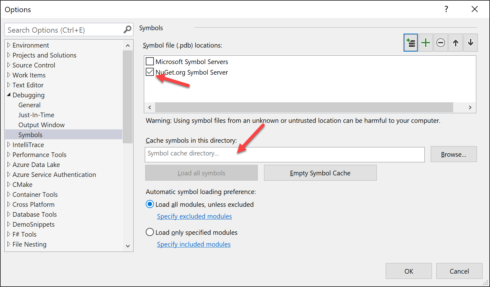

# Improving Debug-time Productivity with Source Link

How many times have you been in the debugger tracking down a bug, stepping through code, looking at what local variable values changed, when you hit a wall -- the value isn't what you expected and you can't step into the method that produced it because it's from a library? Or, you set a conditional breakpoint waiting to examine how some value got set, then noticing a call stack that's mostly greyed out, not letting you see what happened earlier in the call stack? Wouldn't it be great if you could easily step into, set breakpoints, and use all of the debugger's features on external library code?

Source Link can get you there for many libraries that have it enabled. With Souce Link enabled libraries, the debugger can download the underlying source files as you step in, and you can set breakpoints/tracepoints like you would with any other source. Source Link-enabled debugging makes it easier to understand the full flow of your code from your code down to the runtime. Source Link is language-agnostic, so you can benefit from it for any .NET language and for some native libraries.

As Source Link downloads source files from the internet, it's not enabled by default. 

### Visual Studio

There are a couple steps to enable it:

1. Go to **Tools -> Options -> Debugging -> Symbols** and ensure that the 'NuGet.org Symbol Server' option is checked. Specifying a directory for the symbol cache is a good idea to avoid downloading the same symbols again.
  
  If you would like to step into the .NET runtime code, you will also need check the 'Microsoft Symbol Servers' option. 

2. Disable 'Just My Code` in **Tools -> Options -> Debugging -> General** since we want the debugger to attempt to locate symbols for code outside your solution.
  
  Verify that `Enable Source Link support` is checked (it is by default). If you would like to step into .NET Framework code, you will also need to check 'Enable .NET Framework source stepping'. This is not required for .NET Core.

Here's a demo showing the experience in the debugger once set up: *[Ed: record better demo?]*
<iframe src="https://www.youtube-nocookie.com/embed/gyRGhCQPkB4?start=61" frameborder="0" allowfullscreen="true"></iframe>

### Visual Studio Code

Visual Studio Code had debugger settings configured per project in the `launch.json`:

```json
"justMyCode": false,
"symbolOptions": {
    "searchMicrosoftSymbolServer": true,
    "searchNuGetOrgSymbolServer": true
},
"suppressJITOptimizations": true,
"env": {
    "COMPlus_ZapDisable": "1",
    "COMPlus_ReadyToRun": "0"
}
```

### Visual Studio for Mac


## Notes

A few notes:

1. Not every library on nuget.org will have their .pdb files indexed. If you find that the debugger cannot find a pdb file for an open source library you are using, please encourage the open source library to upload their PDBs (see here for instructions).
2. Most libraries on nuget.org are **not** ahead-of-time compiled, so if you are only trying to debug into this library and not the .NET Framework itself, you can likely omit the env section from above. Using an optimized .NET Framework will significantly improve performance in some cases.
3. Only Microsoft provided libraries will have their .pdb files on the Microsoft symbol server, so you can disable that option if you are only interested in an OSS library.

In a future post we'll show you how to create libraries and applications with Source Link enabled so your users can benefit. 