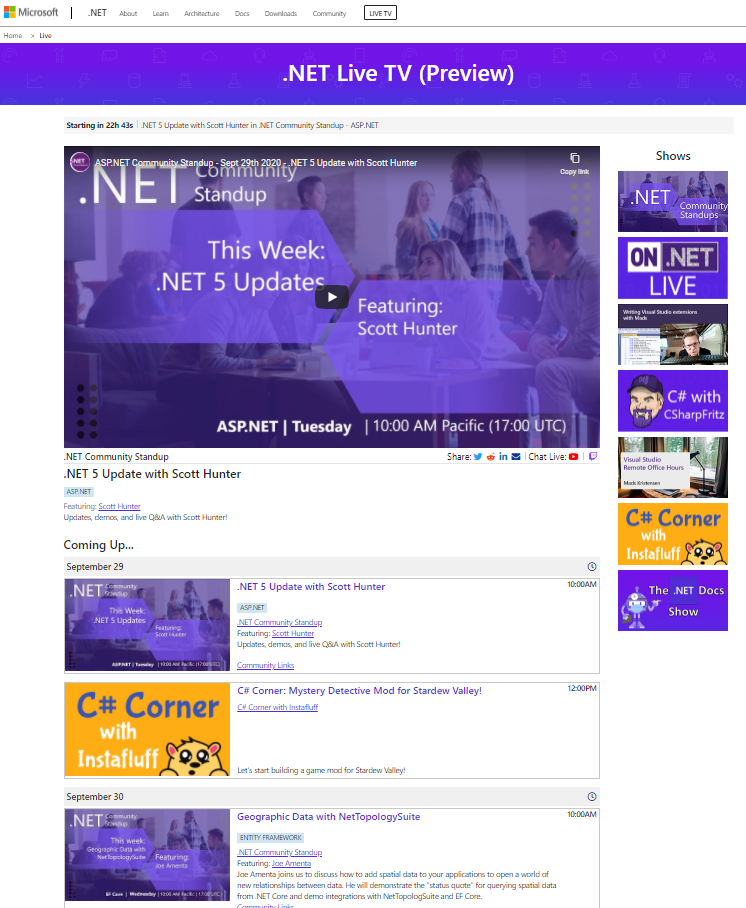
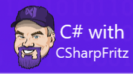
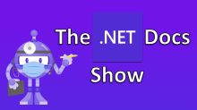
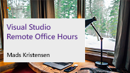
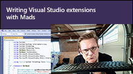

Today, we are launching [.NET Live TV](https://live.dot.net), your one stop shop for all .NET and Visual Studio live streams across Twitch and YouTube. We are always looking for new ways to bring great content to the developer community and innovate in ways to interact with you in real-time. Live streaming gives us the opportunity to deliver more content where everyone can ask questions and interact with the product teams. 

We started our journey several years ago with the [.NET Community Standup](https://dotnet.microsoft.com/platform/community/standup) series. It's a weekly "behind the scenes" live stream that shows you what goes into building the runtimes, languages, frameworks, and tools we all love. As it grew, so did our dreams of delivering even more awesome .NET live stream content.

.NET Live TV takes things to a whole new level with the introduction of new shows and a new website. It is a single place to bookmark so you can stay up to date with live streams across several Twitch and YouTube channels and with a single click can join in the conversation. 

Here are some of the new shows that recently launched that you can look forward to:

## Expanded .NET Community Standups
What started as the ASP.NET Community Standup has grown into 7 unique shows throughout the month! Here is a quick guide to the schedule of the shows that all start at **10:00 AM Pacific**:

* **Tuesday**: ASP.NET hosted by Jon Galloway
* **Wednesday**: Rotating - Entity Framework hosted by Jeremy Likness & Machine Learning hosted by Bri Achtman
* **1st Thursday**: Xamarin hosted by Maddy Leger
* **2nd Thursday**: Languages & Runtime hosted by Immo Landwerth
* **3rd Thursday**: .NET Tooling hosted by Kendra Havens
* **4th Thursday**:  .NET Desktop hosted by Olia Gavrysh

## Packed Week of .NET Shows!

| Day | Time (PT) | Show | Description | 
|-----|:------------:|:-------------------:|----------|
|**Monday**| 6:00 AM |  |  Join Jeff Fritz (csharpfritz) in this start from the beginning series to learn C# in this talk-show format that answers viewers questions and provides interactive samples with every episode. |
|| 9:00 AM |  | Join David Pine, Scott Addie, Cam Soper, and more from the Developer Relations team at Microsoft each week as they highlight the amazing community members in the .NET community. | 
|| 11:00 AM |  |  A weekly show dedicated to the topic of working from home. Mads Kristensen from the Visual Studio team invites guests onto the show for conversations about anything and everything related to Visual Studio and working from home. |
| **Tuesday** | 10:00 AM |  | Join members from the ASP.NET teams for our community standup covering great community contributions for ASP.NET, ASP.NET Core, and more. | 
| | 12:00 PM |  | Join Instafluff (Raphael) each week live on Twitch as he works on fun C# game related projects from his C# corner. |
| **Wednesday** | 10:00 AM |  | Join the Entity Framework and the Machine learning teams for their community standups covering great community contributions. | 
| **Thursday** | 10:00 AM |  | Join the Xamarin, Languages & Runtime, .NET Tooling, and .NET Desktop teams covering great community contributions for each subject. |
| | 2:00 PM |  | Join Cecil Phillip as he hosts and interviews amazing .NET contributors from the .NET teams and the community. |
| **Friday** | 2:00 PM |  | Join Mads Kristensen from the Visual Studio team each week as he builds extensions for Visual Studio live!  |

## More to come!
Be sure to bookmark [live.dot.net](https://live.dot.net) as we are living streaming 5 days a week and adding even more shows soon!
