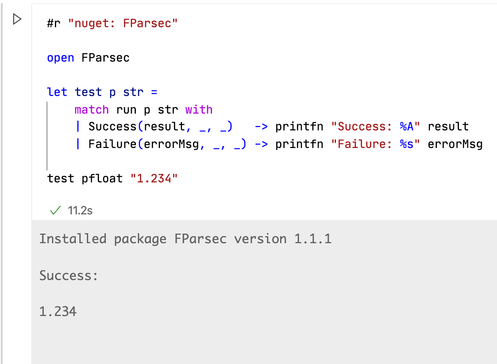
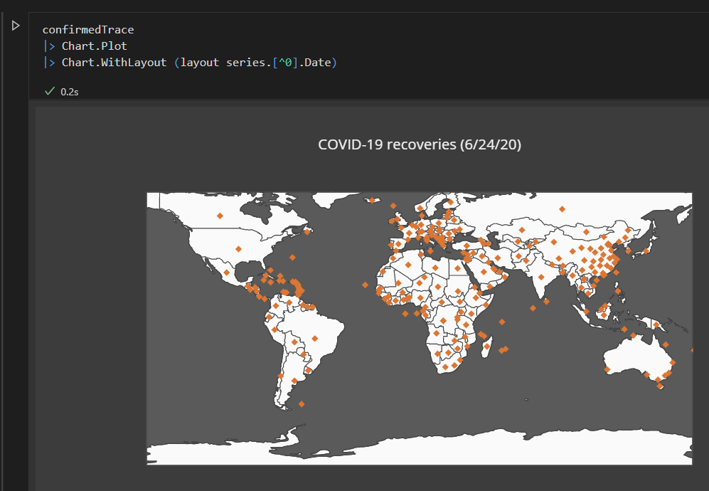

# Announcing F# 5 RC

Today, we're excited to announce the release candidate for F# 5. It ships with [.NET 5 RC1](https://devblogs.microsoft.com/dotnet/announcing-net-5-0-rc-1). Like .NET 5 RC 1, this release of F# 5 is near-final and under a "go live" license. Our primary focus for F# 5 is now addressing any remaining critical bugs that should be fixed before the final release. We're looking forward to your feedback!

To date, we've shipped several previews since the beginning of the year:

* [F# 5 preview 1](https://devblogs.microsoft.com/dotnet/announcing-f-5-preview-1/)
* [F# 5 update for .NET 5 preview 5](https://devblogs.microsoft.com/dotnet/f-5-update-for-net-5-preview-4/)
* [F# 5 update for June](https://devblogs.microsoft.com/dotnet/f-5-and-f-tools-update-for-june/)
* [F# 5 update for August](https://devblogs.microsoft.com/dotnet/f-5-update-for-august/)

This is our final update before the release.

You can get the the F# release candidate in the following ways:

* [Install the latest .NET 5 preview SDK](https://dotnet.microsoft.com/download/dotnet-core/5.0)
* [Install .NET for Jupyter/nteract](https://github.com/dotnet/interactive/#jupyter-and-nteract)
* [Install .NET for VSCode Notebooks](https://github.com/dotnet/interactive/#visual-studio-code)

If you’re using Visual Studio on Windows, you’ll need both the .NET 5 preview SDK and [Visual Studio Preview installed](https://visualstudio.microsoft.com/vs/preview/).

## What F# 5 is all about

From F# 4.1 to F# 5, the chief focus for F# has been bringing up great support for .NET Core (now .NET 5). With F# 5, we're considering this journey mostly complete. F# 5 marks the start of a new era of F# evolution centered around three main things:

1. Interactive programming
2. Making analytical-oriented programming convenient and fun
3. Great fundamentals and performance for functional programming on .NET

We started F# 5 with roughly these same goals, stating in the first preview that ["F# 5 is focused on better interactive and analytical programming"](https://devblogs.microsoft.com/dotnet/announcing-f-5-preview-1/#f-5-is-focused-on-better-interactive-and-analytical-programming). This remains true, though we did end up bringing in a few more orthogonal features that everyone can enjoy regardless of how they're using F#.

## Using F# 5 preview

You can use F# 5 preview via the [.NET 5 preview SDK](https://dotnet.microsoft.com/download/dotnet-core/5.0), or through the [.NET and Jupyter Notebooks support](https://devblogs.microsoft.com/dotnet/net-interactive-is-here-net-notebooks-preview-2/).

If you’re using the .NET 5 preview SDK, check out the [sample repository](https://github.com/cartermp/fs5preview) which shows off some of what you can do with F# 5. You can play with each of the features there instead of starting from scratch.

If you’d rather use F# 5 in your own project, you’ll need to add a `LangVersion` property with `preview` as the value. It should look something like this:

```xml
<Project Sdk="Microsoft.NET.Sdk">

  <PropertyGroup>
    <OutputType>Exe</OutputType>
    <TargetFramework>net5.0</TargetFramework>
    <LangVersion>preview</LangVersion>
  </PropertyGroup>

  <ItemGroup>
    <Compile Include="Program.fs" />
  </ItemGroup>

</Project>
```

```html
<script src="https://gist.github.com/cartermp/3a12e552cc64918d697c430c7b5cfcf7.js"></script>
```

## Package references in F# scripts

F# 5 brings support for package references in F# scripts with `#r "nuget:..."` syntax. Here's how it looks for most packages:

```fsharp
#r "nuget: Newtonsoft.Json"

open Newtonsoft.Json

let o = {| X = 2; Y = "Hello" |}

printfn "%s" (JsonConvert.SerializeObject o)
```

```html
<script src="https://gist.github.com/cartermp/6a93ccf9a24ac0bd7760d271289ccf56.js"></script>
```

Package references support packages with native dependencies, such as ML.NET.

Package references also support packages with special requirements about referencing dependent `.dll`s. For example, the [FParsec](https://www.nuget.org/packages/FParsec/) package used to require that users manually ensure that its dependent `FParsecCS.dll` was referenced first before `FParsec.dll` was referenced in F# Interactive. This is no longer needed, and you can simply just reference the package like this:

```fsharp
#r "nuget: FParsec"

open FParsec

let test p str =
    match run p str with
    | Success(result, _, _)   -> printfn "Success: %A" result
    | Failure(errorMsg, _, _) -> printfn "Failure: %s" errorMsg

test pfloat "1.234"
```

```html
https://gist.github.com/cartermp/9edcd5855a1eb453a4156e378d39f6a3#file-fsharp5-net5p6-2-fsx
```

Package references are the basis for acquiring any package when using F# in Jupyter Notebooks or VSCode Notebooks.

## Support for Jupyter, nteract, and VSCode Notebooks

To coincide with package references, F# 5 is fully supported in Jupyter Notebooks, nteract, and VSCode Notebooks.

Here's an example of what the VSCode Notebooks support looks like:



It also supports inline charting:



And allows you to import and export Jupyter Notebooks:


VSCode Notebooks themselves are still in preview, but they already support quite a few features:

* Preliminary language service support
* Inline charting and formatting of data
* Compact data format (`.dib`) that makes code review easy
* Ability to import Jupyter notebooks (`.ipynb`) and convert to a `.dib`
* Ability to export a `.dib` notebook as a Jupyter notebook (`.ipynb`)
* Sharing F#-defined values with JavaScript cells
* Sharing F#-defined values with C# cells

There are more features on the roadmap:

* QuickInfo
* Better IntelliSense
* Sharing more complex data with C# and JavaScript

We'd love to have you try it out and give us feedback on what you feel needs to be there. To do so, follow the [installation instructions](https://github.com/dotnet/interactive/blob/master/src/dotnet-interactive-vscode/README.md) and don't be shy when filing issues on GitHub!

## String Interpolation

String Interpolation is one of the most highly-requested language features and the very first feature that we had an initial design for in the [F# Language Design repository](https://github.com/fsharp/fslang-design). The design has undergone a lot of discussion over the years, but finally a breakthrough on how to best handle it was made by [Yatao Li](https://github.com/yatli), who also supplied an initial implementation.

F# interpolated strings are fairly similar to C# or JavaScript interpolated strings, in that they let you write code in "holes" inside of a string literal. Here's a basic example:

```fsharp
// Basic interpolated string
let name = "Phillip"
let age = 29
printfn $"Name: {name}, Age: {age}"

// Inline expressions
printfn $"I think {3.0 + 0.14} is close to {System.Math.PI}!"
```

```html
<script src="https://gist.github.com/cartermp/4ed6b98cf35c650bef637b82efd26dc6.js"></script>
```

However, F# interpolated strings also allow for typed interpolations, just like the `sprintf` function, to enforce that an expression inside of an interpolated context conforms to a particular type. It uses the same format specifiers.

```fsharp
// Typed interpolation
// '%s' requires the interpolation to be of type string
// '%d' requires the interpolation to be an integer
let name = "Phillip"
let age = 29

printfn $"Name: %s{name}, Age: %d{age}"

// This gives an error because the types don't match!
printfn $"Name: %s{age}, Age: %d{name}"
```

```html
<script src="https://gist.github.com/cartermp/af61c08e3b2b6bfb810d7302b50a0328.js"></script>
```

For more advanced usage, you can write multiple expressions inside of an interpolation (and technically almost an entire program). That said, it's usually better to keep function definitions outside of interpolated strings as much as possible!

## Support for nameof

Another highly-requested feature of F# 5 is `nameof` which resolves the symbol it's being used for and produces its name in F# source. This is useful in various scenarios, such as logging, and protects your logging against changes in source code.

```fsharp
let months =
    [
        "January"; "February"; "March"; "April";
        "May"; "June"; "July"; "August"; "September";
        "October"; "November"; "December"
    ]

let lookupMonth month =
    if (month > 12 || month < 1) then
        invalidArg (nameof month) (sprintf "Value passed in was %d." month) // use 'nameof' on the parameter name

    months.[month-1]

printfn "%s" (lookupMonth 12)
printfn "%s" (lookupMonth 1)
printfn "%s" (lookupMonth 13) // Throws an exception!
```

```html
<script src="https://gist.github.com/cartermp/d3bb6ffadc7751b1616e42f3f96fbcb8.js"></script>
```

The last line will throw an exception and "month" will be shown in the error message.

You can take a name of nearly everything in F#:

```fsharp
module M =
    let f x = nameof x

printfn "%s" (M.f 12)
printfn "%s" (nameof M)
printfn "%s" (nameof M.f)
```

```html
<script src="https://gist.github.com/cartermp/678dc8cde08565cbbb9726a0e65ffbdd.js"></script>
```

Three final additions are changes to how operators work: the addition of the `nameof<'type-parameter>` form for generic type parameters, and the ability to use `nameof` as a pattern in a pattern match expression.

```fsharp

nameof(+) // gives '+'
nameof op_Addition // gives 'op_Addition'

type C<'TType> =
    member _.TypeName = nameof<'TType> // Nameof with a generic type parameter via 'nameof<>'

/// Simplified version of EventStore's API
[<Struct; IsByRefLike>]
type RecordedEvent = { EventType: string; Data: ReadOnlySpan<byte> }

/// My concrete type:
type MyEvent =
    | AData of int
    | BData of string

// use 'nameof' instead of the string literal in the match expression
let deserialize (e: RecordedEvent) : MyEvent =
    match e.EventType with
    | nameof AData -> AData (JsonSerializer.Deserialize<int> e.Data)
    | nameof BData -> BData (JsonSerializer.Deserialize<string> e.Data)
    | t -> failwithf "Invalid EventType: %s" t
```

```html
<script src="https://gist.github.com/cartermp/4b633fb5ad214a2538d0dd93a7b794ad.js"></script>
```

The `nameof<'type-parameter>` form aligns with how `typeof` and `typedefof` work in F# today.

## Open Type declarations

F# 5 also adds support for open type declarations. An open type declaration is like opening a static class in C#, except with some different syntax and some slightly different behavior to fit F# semantics.

With Open Type Declarations, you can `open` any type to expose static contents inside of it. Additionally, you can `open` F#-defined unions and records to expose their contents. For example, this can be useful if you have a union defined in a module and want to access its cases, but don't want to open the entire module.

```fsharp
open type System.Math

let x = Min(1.0, 2.0)

module M =
    type DU = A | B | C

    let someOtherFunction x = x + 1

// Open only the type inside the module
open type M.DU

printfn "%A" A
```

```html
<script src="https://gist.github.com/cartermp/b2a30361927427314ab781c1bb30be98.js"></script>
```

## Enhanced Slicing

Slicing data types is critical when doing analytical work on sets of data. To that end, we enhanced F# slicing in two areas for release, with one still considered preview.

### Consistent behavior for built-in data types

Behavior for slicing the built-in FSharp.Core data types (array, list, string, 2D array, 3D array, 4D array) used to not be consistent prior to F# 5. Some edge-case behavior threw an exception and some wouldn't. In F# 5, all built-in types now return empty slices for slices that are impossible to generate:

```fsharp
let l = [ 1..10 ]
let a = [| 1..10 |]
let s = "hello!"

// Before: would return empty list
// F# 5: same
let emptyList = l.[-2..(-1)]

// Before: would throw exception
// F# 5: returns empty array
let emptyArray = a.[-2..(-1)]

// Before: would throw exception
// F# 5: returns empty string
let emptyString = s.[-2..(-1)]
```

```html
<script src="https://gist.github.com/cartermp/ce0fedfe32fdc15682998f4c123552fa.js"></script>
```

### Fixed-index slices for 3D and 4D arrays in FSharp.Core

The built-in 3D and 4D array types have always supported slices, but they did not support fixing a particular index (such as the `y`-dimension in a 3D array). Now they do!

To illustrate this, consider the following 3D array:

*z = 0*
|x\y|0|1|
|---|-|-|
|**0**|0|1|
|**1**|2|3|

*z = 1*
|x\y|0|1|
|---|-|-|
|**0**|4|5|
|**1**|6|7|

What if you wanted to extract the slice `[| 4; 5 |]` from the array? This is now very simple!

```fsharp
// First, create a 3D array to slice

let dim = 2
let m = Array3D.zeroCreate<int> dim dim dim

let mutable count = 0

for z in 0..dim-1 do
    for y in 0..dim-1 do
        for x in 0..dim-1 do
            m.[x,y,z] <- count
            count <- count + 1

// Now let's get the [4;5] slice!
m.[*, 0, 1]
```

```html
<script src="https://gist.github.com/cartermp/bafe4eef54fc8ae664b90ad3240928ed.js"></script>
```

This kind of slice used to not be possible prior to F# 5.

### Preview: reverse indexes

We decided to keep the ability to do reverse indexes in preview for F# 5. There are still some quirks to work out with respect to `System.Range` and `System.Index` interop that we want to get right before releaseing fully.

The syntax is `^idx`. Here’s how you can an element 1 value from the end of a list:

```fsharp
let xs = [1..10]

// Get element 1 from the end:
xs.[^1]

// From the end slices

let lastTwoOldStyle = xs.[(xs.Length-2)..]

let lastTwoNewStyle = xs.[^1..]

lastTwoOldStyle = lastTwoNewStyle // true
```

```html
<script src="https://gist.github.com/cartermp/e706d75e3077b59e0f177f358f628af8.js"></script>
```

You can also define reverse indexes for your own types. To do so, you’ll need to implement the following method:

```fsharp
GetReverseIndex: dimension: int -> offset: int
```

Here’s an example for the `Span<'T>` type:

```fsharp

open System

type Span<'T> with
    member sp.GetSlice(startIdx, endIdx) =
        let s = defaultArg startIdx 0
        let e = defaultArg endIdx sp.Length
        sp.Slice(s, e - s)

    member sp.GetReverseIndex(_, offset: int) =
        sp.Length - offset

let printSpan (sp: Span<int>) =
    let arr = sp.ToArray()
    printfn "%A" arr

let run () =
    let sp = [| 1; 2; 3; 4; 5 |].AsSpan()

    // Pre-# 5.0 slicing on a Span<'T>
    printSpan sp.[0..] // [|1; 2; 3; 4; 5|]
    printSpan sp.[..3] // [|1; 2; 3|]
    printSpan sp.[1..3] // |2; 3|]

    // Same slices, but only using from-the-end index
    printSpan sp.[..^0] // [|1; 2; 3; 4; 5|]
    printSpan sp.[..^2] // [|1; 2; 3|]
    printSpan sp.[^4..^2] // [|2; 3|]

run() // Prints the same thing twice
```

```html
<script src="https://gist.github.com/cartermp/d0abbcf3e1140126bf8dd0a3ddb36a95.js"></script>
```

We feel that these three enhancements will make slicing data types more convenient in F# 5. What do you think?

## Applicative Computation Expressions

Computation expressions (CEs) are used today to model “contextual computations”, or in more functional programming friendly terminology, monadic computations. However, they are a more flexible construct than just offering syntax for monads (you can encode monoids or even a computation expression that [explicitly violates every monad law if you like](http://www.fssnip.net/qR/title/A-bindreturn-computation-expression-that-does-not-satisfy-any-of-the-monad-laws)).

F# 5 introduces applicative CEs, which are a slightly different form of CE than what you’re perhaps used to. Applicative CEs allow for significantly more efficient computations provided that every computation is independent, and their results are merely accumulated at the end. When computations are independent of one another, they are also trivially parallelizable. This benefit comes at a restriction, though: computations that depend on previously-computed values are not allowed.

The follow example shows a basic applicative CE for the `Result` type.

```fsharp
// First, define a 'zip' function
module Result =
    let zip x1 x2 = 
        match x1,x2 with
        | Ok x1res, Ok x2res -> Ok (x1res, x2res)
        | Error e, _ -> Error e
        | _, Error e -> Error e

// Next, define a builder with 'MergeSources' and 'BindReturn'
type ResultBuilder() =
    member _.MergeSources(t1: Result<'T,'U>, t2: Result<'T1,'U>) = Result.zip t1 t2
    member _.BindReturn(x: Result<'T,'U>, f) = Result.map f x

let result = ResultBuilder()

let run r1 r2 r3 =
    // And here is our applicative!
    let res1: Result<int, string> =
        result {
            let! a = r1
            and! b = r2
            and! c = r3
            return a + b - c
        }

    match res1 with
    | Ok x -> printfn "%s is: %d" (nameof res1) x
    | Error e -> printfn "%s is: %s" (nameof res1) e

let printApplicatives () =
    let r1 = Ok 2
    let r2 = Ok 3 // Error "fail!"
    let r3 = Ok 4

    run r1 r2 r3
    run r1 (Error "failure!") r3
```

```html
<script src="https://gist.github.com/cartermp/8540e3fb1edf647f3c7ee8e4352c5941.js"></script>
```

Work for Applicative CEs was done in collaboration with [G-Research](https://www.gresearch.co.uk/), who frequently contribute to the F# ecosystem. Thanks, folks!

If you’re a library author who exposes CEs in their library today, there are some additional considerations you’ll need to be aware of. These will be documented in the [Computation Expressions](https://docs.microsoft.com/dotnet/fsharp/language-reference/computation-expressions) article by release.

For consumers of applicative CEs, things aren’t too different from the CEs that you already use. The previously-mentioned restriction around independent computations is the key concept to understand.

## Overloads of custom keywords in computation expressions

Computation expressions are a powerful feature for library and framework authors. They allow you to greatly improve the expressiveness of your components by letting you define well-known members and form a DSL for the domain you're working in.

We've enhanced computation expressions to allow for [Applicative forms](https://devblogs.microsoft.com/dotnet/announcing-f-5-preview-1/#applicative-computation-expressions) already. This time, [Diego Esmerio](https://github.com/Nhowka) and [Ryan Riley](https://github.com/panesofglass) contributed a design an implementation to allow for overloading custom keywords in computation expressions. This new feature allows code like the following to be written:

```fsharp
open System

type InputKind =
    | Text of placeholder:string option
    | Password of placeholder: string option

type InputOptions =
  { Label: string option
    Kind : InputKind
    Validators : (string -> bool) array }

type InputBuilder() =
    member t.Yield(_) =
      { Label = None
        Kind = Text None
        Validators = [||] }

    [<CustomOperation("text")>]
    member this.Text(io, ?placeholder) =
        { io with Kind = Text placeholder }

    [<CustomOperation("password")>]
    member this.Password(io, ?placeholder) =
        { io with Kind = Password placeholder }

    [<CustomOperation("label")>]
    member this.Label(io, label) =
        { io with Label = Some label }

    [<CustomOperation("with_validators")>]
    member this.Validators(io, [<ParamArray>] validators) =
        { io with Validators = validators }

let input = InputBuilder()

let name =
    input {
    label "Name"
    text
    with_validators
        (String.IsNullOrWhiteSpace >> not)
    }

let email =
    input {
    label "Email"
    text "Your email"
    with_validators
        (String.IsNullOrWhiteSpace >> not)
        (fun s -> s.Contains "@")
    }

let password =
    input {
    label "Password"
    password "Must contains at least 6 characters, one number and one uppercase"
    with_validators
        (String.exists Char.IsUpper)
        (String.exists Char.IsDigit)
        (fun s -> s.Length >= 6)
    }
```

```html
<script src="https://gist.github.com/cartermp/802d640dd1188100a30da93137d4fc6b.js"></script>
```

Prior to this change, you could write the `InputBuilder` type as it is, but you couldn't use it the way it's used in the previous example. Since overloads, optional parameters, and now `System.ParamArray` types are allowed, everything just works as you'd expect it to.

## Improved stack traces in F# async and other computation expressions

Thanks to a contribution by [Nino Floris](https://github.com/NinoFloris), stack traces coming from caught exceptions in computation expressions (such as F# async) now retain more information. Consider the following code that uses the [Ply](https://www.nuget.org/packages/Ply/) library:

```fsharp
open FSharp.Control.Tasks
open System

let origin (): unit = invalidOp "Generic error message."
let caller() = task {
    try
        return origin()
    with
    | :? ArgumentNullException -> return ()
    | :? ArgumentException -> return ()
    // This isn't catching InvalidOperationException, so the stacktrace should stay the same
}

[<EntryPoint>]
let main argv =
    try caller().GetAwaiter().GetResult() |> ignore
    with ex -> Console.WriteLine(ex)
    0
```

```html
<script src="https://gist.github.com/cartermp/3c21f2a05876e4dc16778fa18a8c8a11.js"></script>
```

Prior to F# 5, the `origin` function would not appear in stack traces without a workaround in the Ply library (and any other library where this is a scenario). Now it shows the full trace:

```
System.InvalidOperationException: Generic error message.
   at Program.origin() in C:\Users\phcart\source\repos\ConsoleApp35\ConsoleApp35\Program.fs:line 5
   at Program.caller@8-1.Invoke(Unit unitVar) in C:\Users\phcart\source\repos\ConsoleApp35\ConsoleApp35\Program.fs:line 8
   at Ply.TplPrimitives.tryWith[u](FSharpFunc`2 continuation, FSharpFunc`2 catch)
--- End of stack trace from previous location where exception was thrown ---
   at Ply.TplPrimitives.tryWith[u](FSharpFunc`2 continuation, FSharpFunc`2 catch)
   at Program.caller@7.Invoke(Unit unitVar) in C:\Users\phcart\source\repos\ConsoleApp35\ConsoleApp35\Program.fs:line 7
   at Ply.TplPrimitives.ContinuationStateMachine`1.System-Runtime-CompilerServices-IAsyncStateMachine-MoveNext()
--- End of stack trace from previous location where exception was thrown ---
   at Program.main(String[] argv) in C:\Users\phcart\source\repos\ConsoleApp35\ConsoleApp35\Program.fs:line 17
```

```html
<script src="https://gist.github.com/cartermp/4147b1ceefd84c67c55cc17f6a199784.js"></script>
```

## Improved .NET interop

F# 5 features several improvements to .NET interop.

## Interfaces can be implemeneted at different generic instantiations

You can now implement the same interface at different generic instantiations. [Lukas Rieger](https://github.com/0x53A) contributed an initial design and implementation of this feature.

```fsharp
type IA<'T> =
    abstract member Get : unit -> 'T

type MyClass() =
    interface IA<int> with
        member x.Get() = 1
    interface IA<string> with
        member x.Get() = "hello"

let mc = MyClass()
let iaInt = mc :> IA<int>
let iaString = mc :> IA<string>

iaInt.Get() // 1
iaString.Get() // "hello"
```

```html
<script src="https://gist.github.com/cartermp/d25aede7921a36e88ee46b9b11386b4a.js"></script>
```

### Default interface member consumption

F# 5 lets you consume [interfaces with default implementations](https://docs.microsoft.com/dotnet/csharp/whats-new/csharp-8#default-interface-methods).

Consider an interface defined in C# like this:

```csharp
using System;

namespace CSharp
{
    public interface MyDim
    {
        public int Z => 0;
    }
}
```

```html
<script src="https://gist.github.com/cartermp/f18e9e91d23ac32c0bcf13f82f8888e2.js"></script>
```

You can consume it in F# through any of the standard means of implementing an interface:

```fsharp
open CSharp

// You can implement the interface via a class
type MyType() =
    member _.M() = ()

    interface MyDim

let md = MyType() :> MyDim
printfn "DIM from C#: %d" md.Z

// You can also implement it via an object expression
let md' = { new MyDim }
printfn "DIM from C# but via Object Expression: %d" md'.Z
```

```html
<script src="https://gist.github.com/cartermp/6a9eddd1fcb4f117baa93710fc9e7400.js"></script>
```

This lets you safely take advantage of C# code and .NET components written in modern C# when they expect users to be able to consume a default implementation.

### Better interop with nullable value types

[Nullable (value) types](https://docs.microsoft.com/dotnet/api/system.nullable-1) (called Nullable Types historically) have long been supported by F#, but interacting with them has traditionally been somewhat of a pain since you'd have to construct a `Nullable` or `Nullable<SomeType>` wrapper every time you wanted to pass a value. Now the compiler will implicitly convert a value type into a `Nullable<ThatValueType>` if the target type matches. The following code is now possible:

```fsharp
#r "nuget: Microsoft.Data.Analysis"

open Microsoft.Data.Analysis

let dateTimes = PrimitiveDataFrameColumn<DateTime>("DateTimes")

// The following line used to fail to compile
dateTimes.Append(DateTime.Parse("2019/01/01"))

// The previous line is now equivalent to this line
dateTimes.Append(Nullable<DateTime>(DateTime.Parse("2019/01/01")))

dateTimes
```

```html
<script src="https://gist.github.com/cartermp/a0603f0e6da3693b2f243eabfbd977c7.js"></script>
```

## Improved compiler performance

Lastly, F# 5 brings along some performance improvements for the compiler and editor tooling.

F# compiler performance has steadily improved over the years. I'll demostrate this by compiling the core project in the [FSharpPlus](https://github.com/fsprojects/FSharpPlus) library. This core project makes use of a lot of F# constructs in a way that acts as a great stress test for the compiler itself. I ran the following commands against F# 5, F# 4.7, and F# 4.5.

```console
dotnet clean
dotnet msbuild /m:1 /clp:PerformanceSummary
```

These commands clean the output directories and force msbuild to run serially (though it would likely be serial anyways since it's compiling a single project), and reports timings for all tasks run during build. The following table shows the time it took for the `Fsc` task to complete, which is the F# compiler:

|F# version|Time to compile (second, rounded)|
|----------|------------------------|
|F# 5|49 seconds|
|F# 4.7|68 seconds|
|F# 4.5|101 seconds|

There was a big improvement from F# 4.5 to F# 4.7, and another big jump with F# 5 as well!

Your own results may vary a bit depending on a variety of factors, but if you try this out yourself you should see a fairly similar spread. It's also worth noting that everything else in the .NET toolchain has improved too, so it's not just the F# compiler getting faster when you use F# 5 with .NET 5.

## The road to release

We're now 100% feature complete for F# 5. Any further updates will only be bug fixes between now and the release later this year.

We're tracking all F# 5 and Visual Studio 16.8 issues with [this milestone on GitHub](https://github.com/dotnet/fsharp/milestone/35). These are the problems that are most on our radar right now. If you notice something odd in the release candidate and associated Visual Studio 16.8 tooling, please file a bug! We'll triage it and see if it makes sense to place in this milestone.

Lastly, we'd like to thank all of our open source contributers who have helped get F# 5 to where it is today. All of your contributions, from full-on feature development to simply filing a bug are appreciated. Thank you.

Cheers, and happy F# coding!
