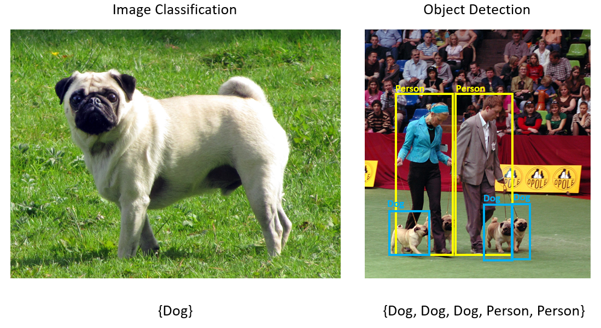
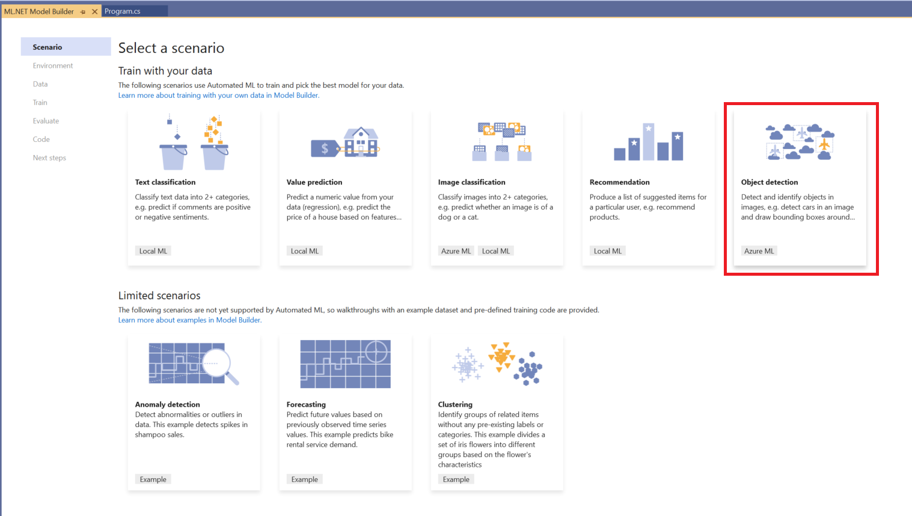
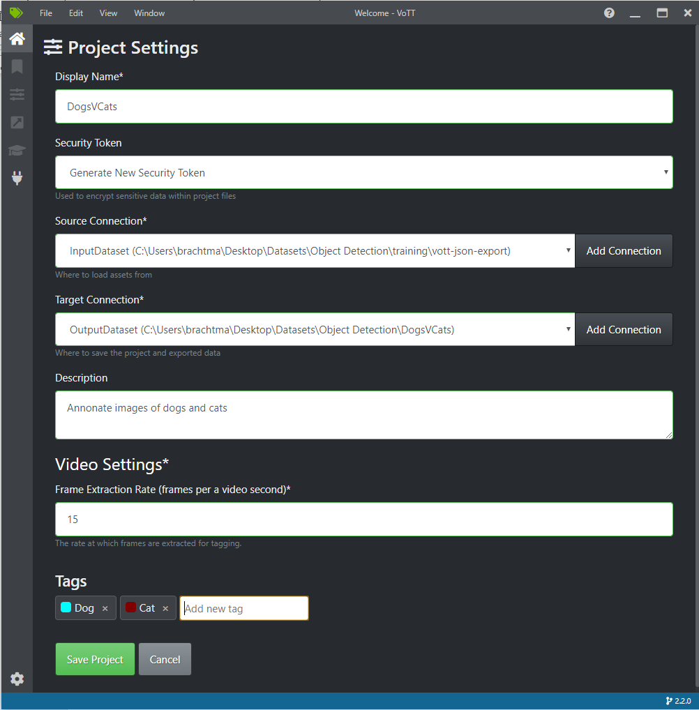
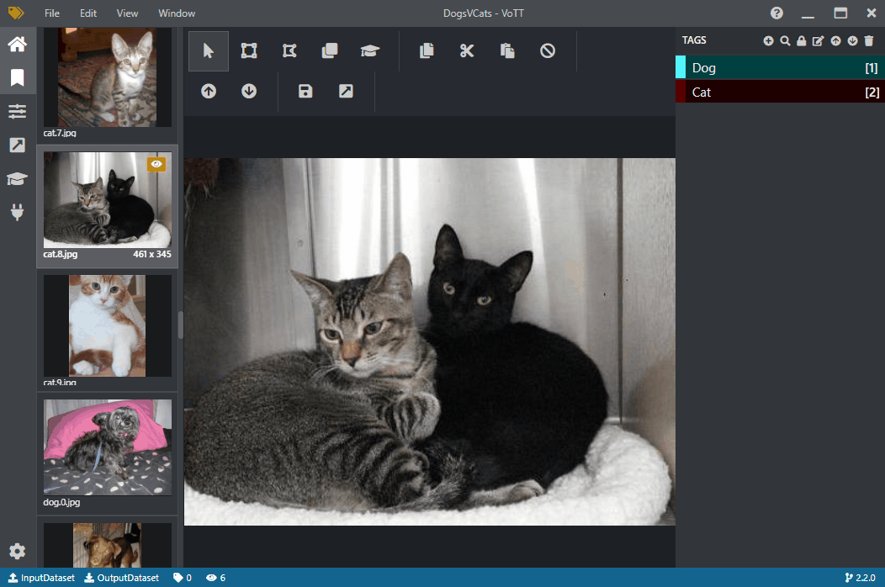
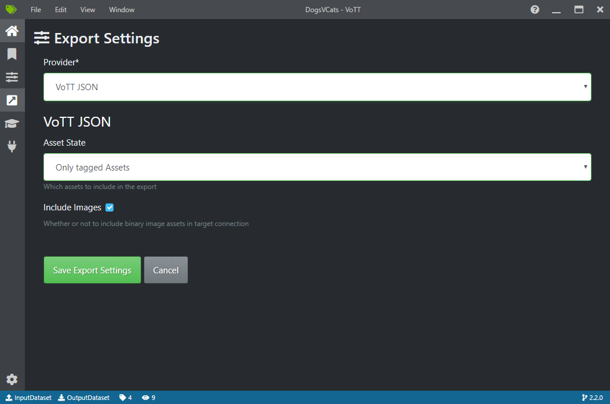
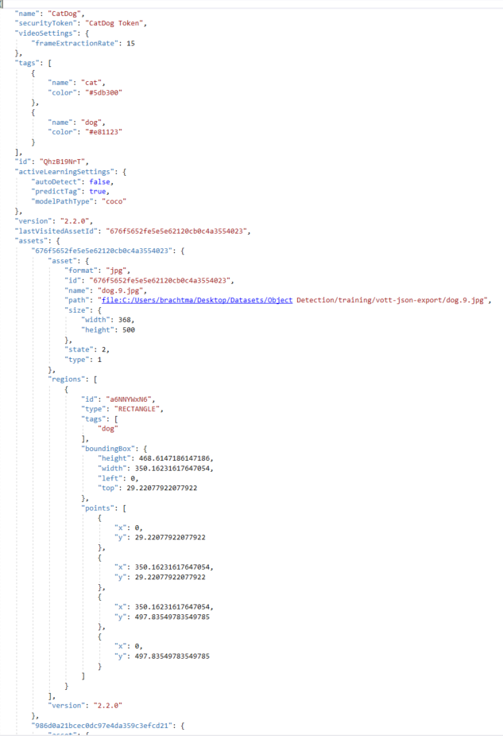
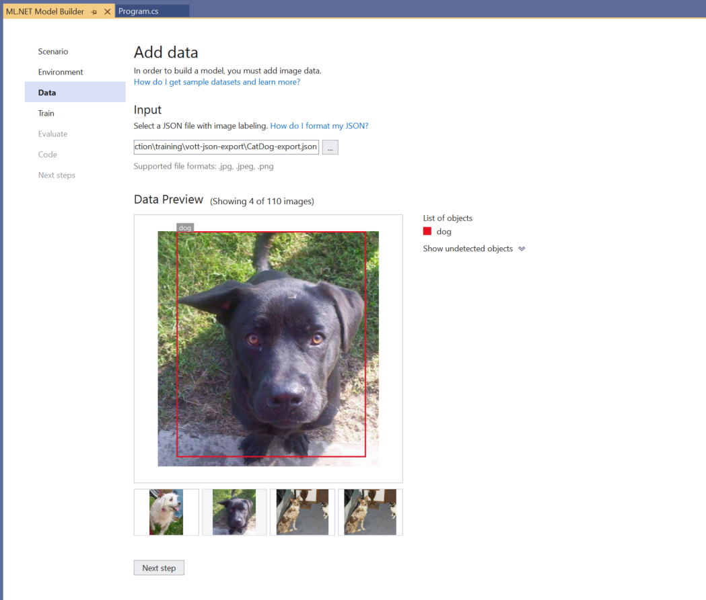
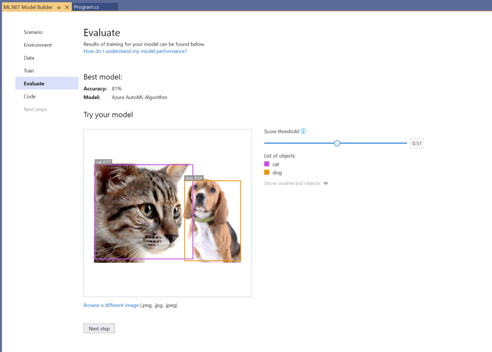
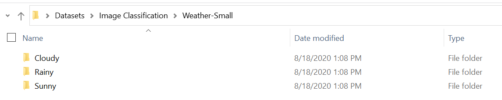
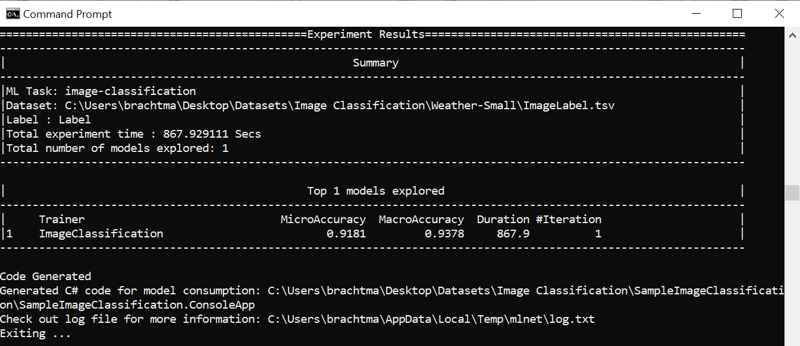

[ML.NET](https://dot.net/ml) is an open-source, cross-platform machine learning framework for .NET developers. It enables integrating machine learning into your .NET apps without requiring you to leave the .NET ecosystem or even have a background in ML or data science. ML.NET provides tooling (Model Builder UI in Visual Studio and the cross platform ML.NET CLI) that automatically trains custom machine learning models for you based on your scenario and data.

This release of ML.NET (1.5.2) brings numerous bug fixes and enhancements, while tooling updates include the ability to train object detection models using Azure ML via Model Builder and to locally train image classification models with the ML.NET CLI.

In this post, we’ll cover the following items:

1. [Object detection in Model Builder](#object-detection-in-model-builder)
2. [Image classification in ML.NET CLI](#image-classification-in-mlnet-cli)
3. [ML.NET 1.5.2](#mlnet-152)
4. [Feedback](#feedback)
5. [Get started and resources](#get-started-and-resources)

## Object detection in Model Builder

Object detection is a computer vision problem. While closely related to image classification, object detection performs image classification at a more granular scale. Object detection both locates and categorizes entities within images. Use object detection when images contain multiple objects of different types.



Some use cases for object detection include:

- Self-Driving Cars
- Robotics
- Face Detection
- Workplace Safety
- Object Counting
- Activity Recognition

While previously ML.NET offered the ability to consume pre-trained TensorFlow and ONNX models for object detection via the ML.NET API, you can now use Model Builder in Visual Studio to train custom object detection models with the power of Azure and AutoML.



After selecting the object detection scenario and setting up your Azure ML workspace in Model Builder, you must input your data. Currently, Model Builder does not offer a way to annotate images, so you must use an external tool to draw bounding boxes around objects in your training images.

If you need to label your images, we recommend trying out [VoTT](https://github.com/Microsoft/VoTT), an open source annotation and labeling tool for image and video assets.

After downloading VoTT, you can create a new VoTT project and choose a dataset from your Local File System (Azure Blob Storage and Bing Image search are also options, but Model Builder currently only supports training from a local dataset). This is simply a folder that contains all the images that you’d like to annotate.

After selecting the folder path to your dataset of images for your Source Connection, you can then choose an output folder for the Target Connection.

You can skip the Video Settings, and then add in your Tags (any objects that you want to be detected in your images):



After saving your project, all images found in the Source Connection folder will appear, and you can start labeling your images like this:



When you’re done labeling, you can go to the Export section (4th icon down on the left toolbar), select “VoTT JSON” as the Provider and “Only tagged Assets” as the Asset State (Include images is optional). When you hit Save Export Settings, the VoTT JSON will be generated in the Target Connection folder that you specified during VoTT project creation.



The VoTT JSON looks like this:



You can then use this VoTT JSON as the dataset input for the Data step in Model Builder.
Model Builder currently only accepts the format of JSON generated by VoTT, but we plan to add support for more formats in the future. If there is a dataset format for object detection that you'd like to see supported in Model Builder, leave your feedback on [GitHub](https://github.com/dotnet/machinelearning-modelbuilder/issues/new?assignees=&labels=&template=feature_request.md&title=).



After inputting your data and moving to the Train step in Model Builder, you can hit Start training, which uploads your data to Azure and begins the training with Azure ML. When training is finished, your trained ML.NET model is downloaded so that you can test it out locally.

In the Evaluate step, you can see your model’s accuracy as well as make predictions on test images:



The score shown on each detected bounding box indicates the confidence of the detected object. For instance, in the screenshot above, the score on the bounding box around the cat indicates that the model is 77% sure that the detected object is a cat.

The score threshold, which can be increased or decreased with the threshold slider, will add and remove detected objects based on their scores. For instance, if the threshold is .51, then the model will only show objects that have a score / confidence of .51 or above. As you increase the threshold, you will see less detected objects, and as you decrease the threshold, you will see more detected objects.

Once you are satisfied with your model’s performance, you can generate the model and consumption code in the Code step in Model Builder and integrate your model into your end-user application.

## Image classification in ML.NET CLI

In addition to classification, regression, and recommendation, you can use the cross-platform [ML.NET CLI](https://docs.microsoft.com/dotnet/machine-learning/automate-training-with-cli) to locally train custom image classification models.

All you need for this scenario is dataset of images that you’d like to use for training. For instance, let’s look at the weather example, where you want to classify an image as rainy, cloudy, or sunny.

First you need to make sure you have your images in the correct format, which is a folder that organizes the photos into separated labeled sub-folders like this:



In this case, each folder contains 30 images of the corresponding weather.

Once you have your dataset, you can use the following command in the ML.NET CLI to start training:

```console
mlnet image-classification --dataset “Weather-Small”
```

When training is done, the CLI will output the accuracy of your model and will generate the necessary projects for model consumption and re-training:



## ML.NET 1.5.2

Last month we announced ML.NET 1.5.1, which had a regression that is fixed with ML.NET 1.5.2. Thus, we recommend that you skip 1.5.1 and update to 1.5.2.

This release also closed over 30 reported bugs and added ONNX enhancements to support more types for ONNX export.

You can see more in the [1.5.2 release notes](https://github.com/dotnet/machinelearning/releases/tag/v1.5.2).

## Feedback

We would love to hear your feedback!

If you run into any issues, please let us know by creating an issue in our GitHub repos (or use the new Feedback button in Model Builder!):

- ML.NET API: github.com/dotnet/machinelearning
- ML.NET Tooling (Model Builder & ML.NET CLI): github.com/dotnet/machinelearning-modelbuilder

## Get started and resources

Get started with ML.NET in this [tutorial](https://dotnet.microsoft.com/learn/ml-dotnet/get-started-tutorial/intro).

Learn more about ML.NET and Model Builder in [Microsoft Docs](https://aka.ms/mlnet-docs).

Tune in to the [Machine Learning .NET Community Standup](https://dotnet.microsoft.com/platform/community/standup) every other Wednesday at 10am Pacific Time.