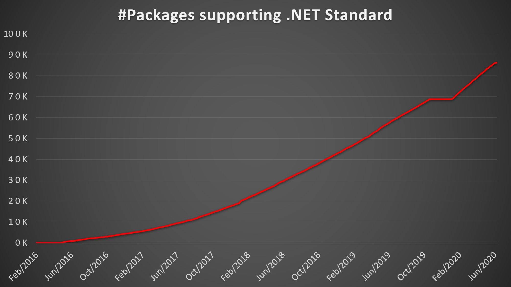

This is the introduction to your post. It's the post's first paragraph. Don't
put a heading in front of it. The title will be the post's first heading.

## First actual heading

Your content's first heading should be an H2 because the title is the page's
H1.

For pictures, make sure to include alt text for your picture so that our posts
are accessible.



A bullet point list:

* Bullet
* Another bullet

Some code:

```csharp
Console.WriteLine("Hello, World!");
```

## Summary

Some summary or call to action.
