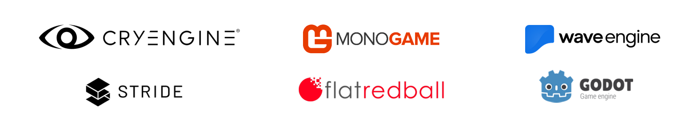

Developing games is multi-disciplined compared to developing business apps and services. Games need design skills spanning UI, audio, gameplay, and art direction. It also requires engineering skills for graphics, gameplay, audio, cloud services, and develops. Sometimes you need to get low level and play around with hardware registries in assembly to optimize performance for a specific device. Do you need to build all those layers yourself when making a game, or is there a better way? Of course, there is a better way. The .NET ecosystem offer many choices for folks like you who want to make games, but do not want to build everything from scratch.

Game Engines
------------
Developers used to build their games from scratch each time. Now, developers have obstructed a lot of reusable code in their games and created a set of APIs and tools that they can reuse whenever they start a new game. These _Game Engines_ contain obstructions of graphics, input, media API. They also might contain design tools and assets managers for visual and audio assets. You can think about them as an IDE but for more than just code. Some game companies started releasing their engines commercially. Microsoft had its own engine at some point, free to use, called [XNA](https://www.microsoft.com/download/details.aspx?id=23714&WT.mc_id=gamedev-blog-abhamed). XNA was built with .NET and enabled you to make games for Windows and Xbox 360.

With the popularity of XNA, more game engines started using .NET. The Mono runtime, now part of .NET 5, was a great choice because it was able to run C# code on many platforms including Android, iOS, PC, Mac, and Linux. Mono also supported dedicated game consoles like Xbox, PlayStation, and Nintendo platforms. Now with .NET including Mono with .NET 5, we are seeing some game engines getting ready to upgrade.

Engines built with .NET Core 3.1 
--------------------------------
### MonoGame
When XNA got discontinued, the open-source community ported XNA to Mono, made it cross platform, and called it [MonoGame](https://www.monogame.net/?WT.mc_id=gamedev-blog-abhamed). It has since advanced beyond the scope of XNA. MonoGame only has a programming API for all .NET languages and 1 GUI app that is used to manage assets. MonoGame is more of a lean framework that is used as a base for a game engine. MonoGame just got updates to version 3.8 where it uses .NET Core 3.1 and NuGet, with a plan to upgrade to .NET 5 in the future. An example of a game engine that uses MonoGame as framework is [FlatRedBall](http://flatredball.com). Many indie developers who have used XNA previously sill use MonoGame for all their cross-platform game development. There is also a more accurate reimplementation of XNA, made open-source by the community, called XFA that you could choose if you needed to port you older XNA game to a newer code base.

### Stride
[Stride](https://stride3d.net/) (formally Xenko) is another pure C# and .NET engine that was developed by Silicon Studios. It's a complete integrated engine with a graphical editor. Stride is open-source and royalty free. Different parts of the engine can be used independently thanks to its modular design. Stride also uses .NET Core 3.1 in their latest 4.0 release. I really like the part in their documentation that focuses on folks who have used Unity before.

### WaveEngine
Another Engine that is purely .NET is [WaveEngine](https://www.waveengine.net/). WaveEngine is free with many of it's components open-sourced. Their latest 3.0 preview released just upgraded to .NET Core 3.1. It offers exciting features like running 3D scenes in a browser using .NET WebAssembly (Mono WASM), Azure remote rendering, and support for HoloLens 2. WaveEngine has many mixed reality features, like spatial audio, ready to use out of the box.

### NeoAxis
[NeoAxis](https://www.neoaxis.com/) is an engine that was pointed out to me after I published my previous blog post about [using .NET for game development](https://devblogs.microsoft.com/dotnet/game-development-with-net). It's also completely written with .NET, open-source, and royalty free. It supports a full set of features, in including the addition of Android support in the latest release. 

Engines embedding .NET
----------------------
### Unity

[Unity](https://unity.com/), developed in C++, was one of the earlier commercial engines to use .NET to provide C# scripting and multi-platform targeting. Unity is an integrated engine with a programming API interface as well as visual editing tools for graphics, audio, profiling, and debugging. Unity quickly became of the most used game engine for all real-time graphics applications like games, VR, and simulations. There is a big ecosystem supporting Unity, from an asset store for plugins and starter packs, to game services ready for Unity like Microsoft Azure PlayFab. Unity is a commercial engine, but its free to use until certain revenue thresholds. It is also free to use for some educational and personal uses.

### Godot

[Godot](https://godotengine.org/) is a royalty free, multi-platform, open-source engine developed using C++. It's a fully integrated game development engine. It also uses .NET to deliver C# scripting. Godot has been gaining popularity as of late and its community is growing rapidly. It has also gained support and grants from both Microsoft and Epic games.

### CryEngine

The famous [CryEngine](https://www.cryengine.com/) also uses .NET. The engine was built in C++, but it uses the .NET to enable C# scripting. It's a powerful game engine with a great history powering AAA games. You only pay royalties when you exceed a revenue threshold.

Which engine is right for you?
------------------------------
The most important point when choosing a game engine is how to get support. For beginners, asking peers, or folks online for help is an essential part of learning and remaining motivated. For professionals, enterprise level support is essential to mitigate technical risks. By far, Unity has one of the biggest and most active communities. It also offers paid high-quality enterprise support. In addition, Unity also has one of the biggest ecosystems of services and plugins supporting the engine. Godot has also been gaining more popularity amongst hobbyists and its momentum has been accelerating as well.

Another thing to consider are your own skills, and how well an engine will support you. If you come from a .NET background and want the latest C# features, maybe a pure .NET engine like Stride, WaveEngine, or even MonoGame would suit you best. You can use all the familiar tools with them, like NuGet and the CLI.

An engine with active development gives you security that bugs will get fixed and new platforms and features will be supported. Commercial engines might be better for you if that is a concern.

An important consideration when choosing an engine is the price. All the game engines mentioned above are free to start with. Some have royalties attached to them once you reach a revenue threshold. Some of the engines are completely free and royalty free. You choose where the loot goes depending on your financial plans.

Game design can dictate which engine you should use too. One engine might be more suitable than others for certain types of games. For example, using a fully integrated commercial engine to make a text-based adventure might be overkill.
Rendered

We'd love to hear from you
--------------------------
You have a .NET game devevelopment related project, plugin, library, or game you want to blog about on the .NET blog? Is there a .NET game development topic that you want me to write about?

* Send an email to abdullah.hamed at Microsoft,
* Leave us a pointer in the comments section below.
* Tweet at [Abdullah (@indiesaudi)](https://twitter.com/indiesaudi) 
