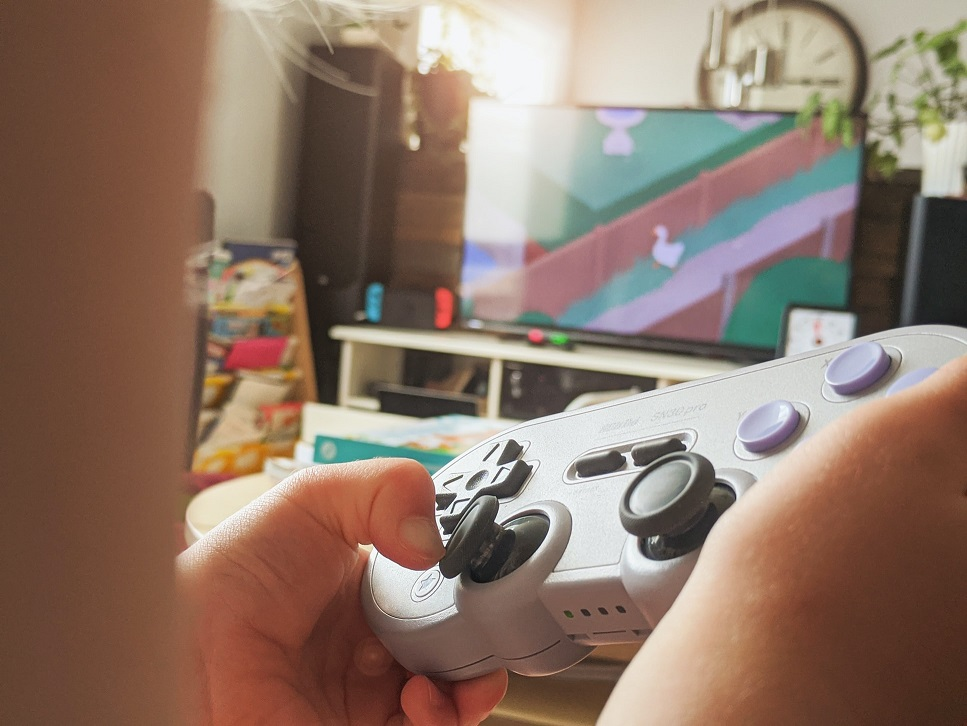
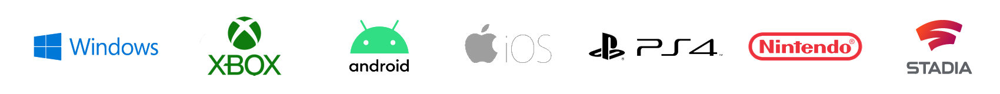

We've launched a new [Game Development with .NET](https://dotnet.microsoft.com/apps/games?WT.mc_id=gamedev-blog-abhamed) section on our site. It's designed for current .NET developers to explore all the choices available to them when developing games. It's also designed for new developers trying to learn how to use .NET by making games. We've also launched a new [game development Learn portal for .NET](https://dotnet.microsoft.com/learn/games?WT.mc_id=gamedev-blog-abhamed) filled with tutorials, videos, and documentation provided by Microsoft and others in the .NET game development community. Finally, we launched a step-by-step [Unity get-started tutorial](https://dotnet.microsoft.com/learn/games/unity-tutorial/intro?WT.mc_id=gamedev-blog-abhamed) that will get you started with Unity and writing C# scripts for it in no time. We are excited to show you what .NET has to offer to you when making games. .NET is also part of [Microsoft Game Stack](https://developer.microsoft.com/apps/games?WT.mc_id=gamedev-blog-abhamed), a comprehensive suite of tools and services just for game development.

## .NET for game developers

.NET is cross-platform. With .NET you can target over 25+ different platforms with 1 code base. You can make games for, but not limited to, Windows, macOS, Linux, Android, iOS, Xbox, PlayStation, Nintendo, and mixed reality devices. 

C# is the most popular programming language in game development. The wider .NET community is also big. There is no lack of expertise and support you can find from individuals and user groups, locally or online.

.NET does not just cover building your game. You can build you game's website with [ASP.NET](https://dotnet.microsoft.com/apps/aspnet?WT.mc_id=gamedev-blog-abhamed), your mobile app using [Xamarin](https://dotnet.microsoft.com/apps/xamarin?WT.mc_id=gamedev-blog-abhamed), and even do remote rendering with [Microsoft Azure](https://azure.microsoft.com/solutions/gaming?WT.mc_id=gamedev-blog-abhamed). Your skills will transfer cross the entire game development pipeline.
  
  

## Available game engines

The first step to developing games in .NET is to choose a [game engine](https://dotnet.microsoft.com/apps/games/engines?WT.mc_id=gamedev-blog-abhamed). You can think of engines as development frameworks and tools, an IDE for game development. There are many game engines that use .NET and they differ widely. Some of the engines are commercial and some are completely royalty free and open source. I am excited to see some of them planning to adopt .NET 5 soon. Just choose the engine that better works for you and your game. I am writing another blog post, coming soon, that will help you learn about .NET game engines, and which one would be best for you.

### Online services for your game

If you're building you game with .NET, then you have a wide choice on how to build your online [game services](https://dotnet.microsoft.com/apps/games/services?WT.mc_id=gamedev-blog-abhamed). You can use ready-to-use services like [Microsoft Azure PlayFab](https://playfab.com?WT.mc_id=gamedev-blog-abhamed). You can also build from scratch on [Microsoft Azure](https://docs.microsoft.com/gaming/azure?WT.mc_id=gamedev-blog-abhamed). .NET also runs on multiple operating systems, clouds, and services, it doesn't limit you to use Microsoft's platforms.

## Tools will be available for you

All the [.NET tools](https://dotnet.microsoft.com/apps/games/tools?WT.mc_id=gamedev-blog-abhamed) you are used to also work when making games. [Visual Studio](https://visualstudio.microsoft.com/vs/features/game-development?WT.mc_id=gamedev-blog-abhamed) is a great IDE that works with all .NET game engines on Windows and macOS. It provides word-class debugging, AI-assisted code completion, code refactoring, and cleanup. In addition, it provides real-time collaboration and productivity tools for remote work. [GitHub](https://github.com?WT.mc_id=gamedev-blog-abhamed) also provides all your DevOps needs. Host and review code, manage projects, and build software alongside 50 million developers with GitHub.

## The ecosystem

The [.NET game development ecosystem](https://dotnet.microsoft.com/apps/games/ecosystem?WT.mc_id=gamedev-blog-abhamed) is rich. Some of the .NET game engines depend on foundational work done by the open-source community to create managed graphics APIs like [SharpDX](http://sharpdx.org?WT.mc_id=gamedev-blog-abhamed), [SharpVulkan](https://github.com/jwollen/SharpVulkan?WT.mc_id=gamedev-blog-abhamed), [Vulkan.NET](https://github.com/mono/VulkanSharp?WT.mc_id=gamedev-blog-abhamed), and [Veldrid](https://github.com/mellinoe/veldrid?WT.mc_id=gamedev-blog-abhamed). [Xamarin](https://dotnet.microsoft.com/apps/xamarin?WT.mc_id=gamedev-blog-abhamed) also enables using platform native features on iOS and Android. Beyond the .NET community, each game engine also has their own community and user groups you can join and interact with. .NET is an open-source platform with over 60,000+ contributors. It's free and a solid stable base for all your current and future game development needs.

## Learn more and start developing

Head to our new [Game Development with .NET](https://dotnet.microsoft.com/apps/games?WT.mc_id=gamedev-blog-abhamed) site to get an overview of what .NET provides for you when making games. We've launched a step-by-step [Unity get-started tutorial](https://dotnet.microsoft.com/learn/games/unity-tutorial/intro?WT.mc_id=gamedev-blog-abhamed) to get you scripting with C# as quick as possible. If you're looking for tutorials, videos, and documentations to get your started, head to our new [game development Learn portal for .NET](https://dotnet.microsoft.com/learn/games?WT.mc_id=gamedev-blog-abhamed) for more resources.

## Show us the work you do for .NET game development

We'd love to see the work you do for the .NET game developer. Please reach out to us if you'd like us to talk about the games you're making, the APIs you're developing, the plug-ins you're distributing, or any .NET project remotely related to game development. Did you write a great blog post, or just read one? Do you want everyone to know about an amazing new .NET game development contribution or a useful plug-in or tool? Do you have an analysis of game development pipeline using .NET? 

We'd love to hear from you, and feature your contributions on future posts:

* Send an email to abdullah.hamed at Microsoft
* Leave us a pointer in the comments section below
* Send [Abdullah (@indiesaudi)](https://twitter.com/indiesaudi) tips on Twitter about .NET game development
