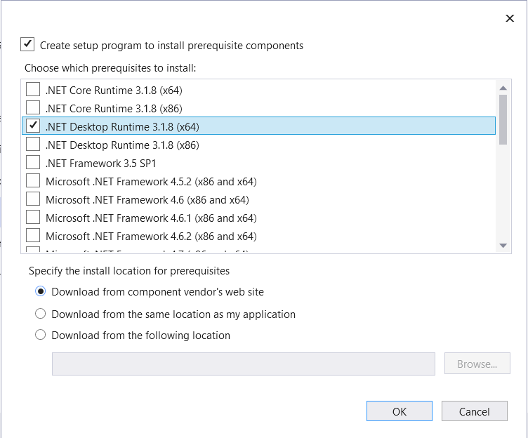
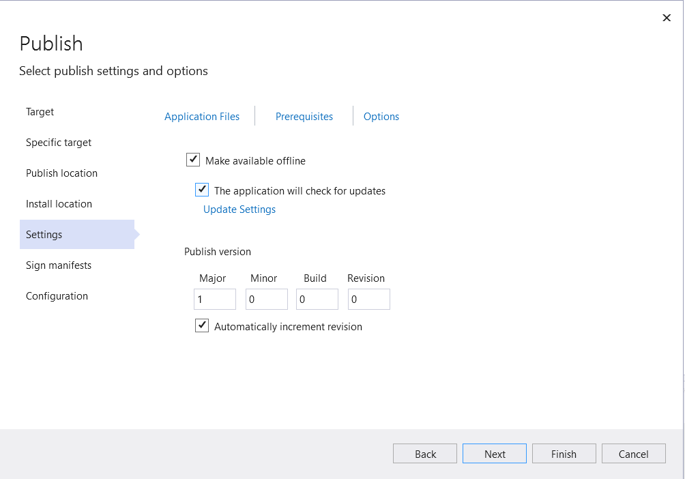
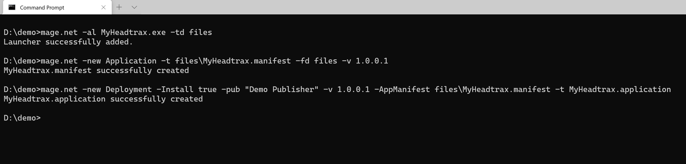
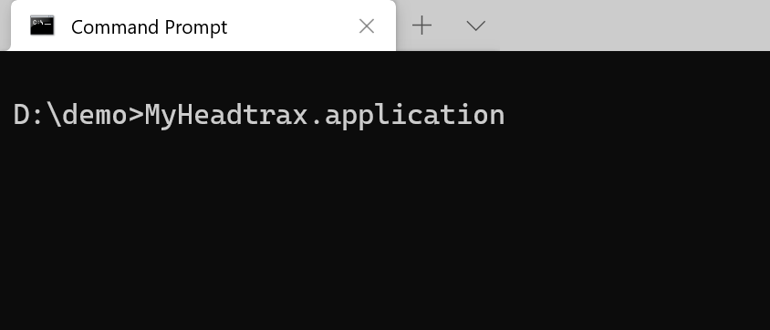
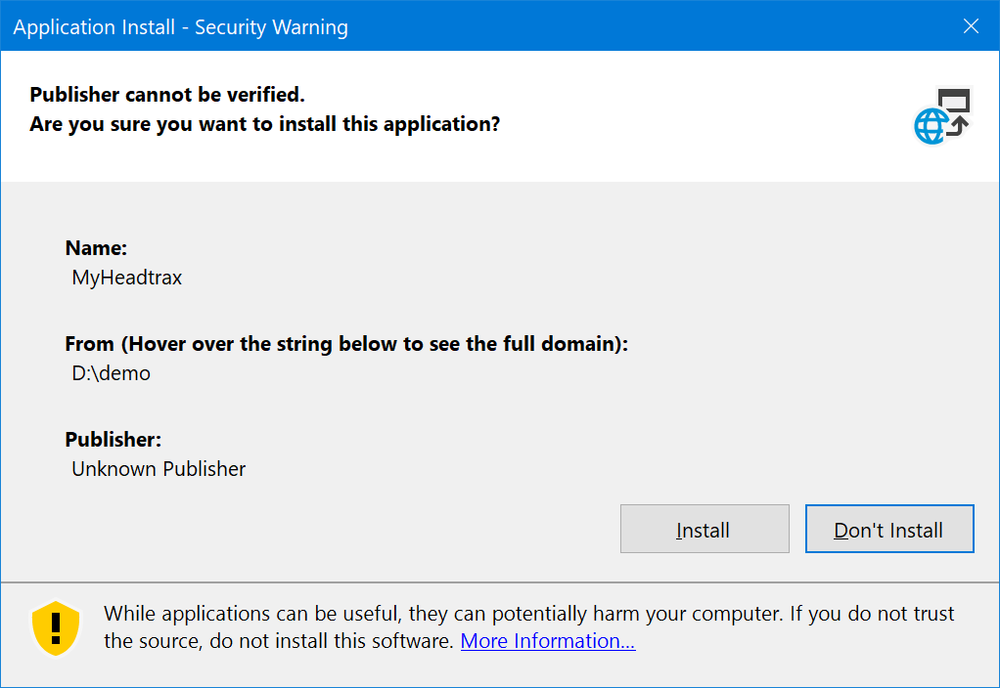
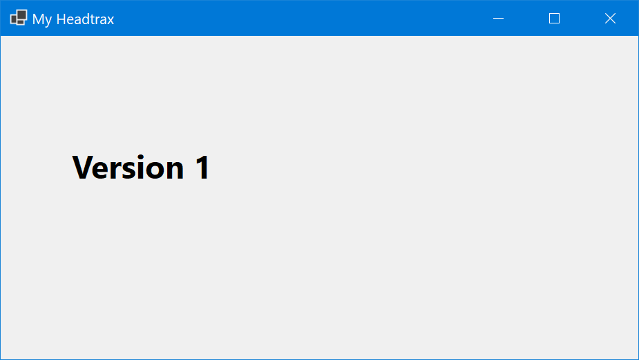
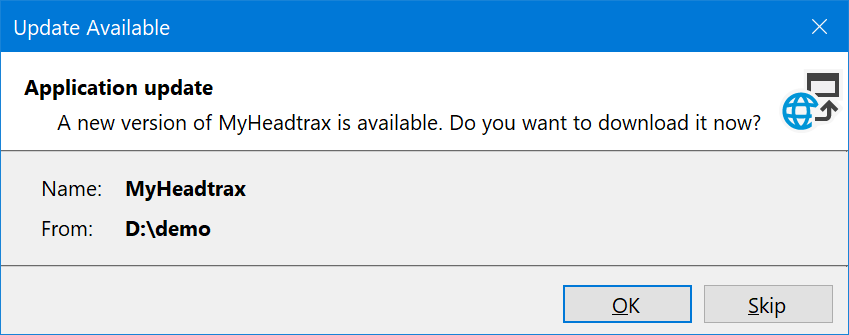

# Announcing .NET 5.0 RC2

Today, we are shipping [.NET 5.0 Release Candidate 2 (RC2)](https://dotnet.microsoft.com/download/dotnet/5.0). It is a near-final release of .NET 5.0, and the last of two RCs before the official release in November. RC2 is a "go live" release; you are supported using it in production. At this point, we're looking for reports of any remaining critical bugs that should be fixed before the final release.

We also released new versions of ASP.NET Core and EF Core today.

You can [download .NET 5.0](https://dotnet.microsoft.com/download/dotnet/5.0), for Windows, macOS, and Linux:

* [Installers and binaries](https://dotnet.microsoft.com/download/dotnet/5.0)
* [Container images](https://hub.docker.com/_/microsoft-dotnet)
* [Snap installer](https://snapcraft.io/dotnet-sdk)
* [Release notes](https://github.com/dotnet/core/tree/master/release-notes/5.0)
* [Known issues](https://github.com/dotnet/core/blob/master/release-notes/5.0/5.0-known-issues.md)
* [GitHub issue tracker](https://github.com/dotnet/core/issues)

You need the latest preview version of [Visual Studio](https://visualstudio.microsoft.com/vs/preview/) (including [Visual Studio for Mac)](https://visualstudio.microsoft.com/vs/mac/) to use .NET 5.0.

.NET 5.0 includes [many improvements](https://github.com/dotnet/runtime/issues/37269), notably [single file applications](https://github.com/dotnet/runtime/issues/36590), [smaller container images](https://github.com/dotnet/dotnet-docker/issues/1814#issuecomment-625294750), more capable [JsonSerializer APIs](https://github.com/dotnet/runtime/issues/41313), a complete set of [nullable reference type annotations](https://twitter.com/terrajobst/status/1296566363880742917), new [target framework names](https://github.com/dotnet/designs/blob/master/accepted/2020/net5/net5.md),  and support for [Windows ARM64](https://github.com/dotnet/runtime/issues/36699). [Performance has been greatly improved](https://devblogs.microsoft.com/dotnet/performance-improvements-in-net-5/), in the NET libraries, in the GC, and the JIT. [ARM64](https://github.com/dotnet/runtime/issues/35853) was a [key focus for performance investment](https://devblogs.microsoft.com/dotnet/arm64-performance-in-net-5/), resulting in much better throughput and smaller binaries. .NET 5.0 includes new language versions, [C# 9](https://devblogs.microsoft.com/dotnet/welcome-to-c-9-0/) and [F# 5.0](https://devblogs.microsoft.com/dotnet/f-5-update-for-august/).

Today is an auspicious day because we're kicking off the 2020 .NET@Microsoft internal conference. There will be many speakers from the .NET team, but also architects from services teams that rely on .NET in the Microsoft cloud, sharing their victories and also their challenges. I'm presenting (unsurprisingly) "What's new in .NET 5.0". My talk will be easy; I'll just read the .NET 5.0 blog posts, preview by preview! It will be a great talk. More seriously, the conference is our opportunity to make the case why Microsoft teams should adopt .NET 5.0 soon after it is available. At least one large team I know of is running on RC1 in production. The [official .NET Microsoft site](https://dotnet.microsoft.com/) has been running on .NET 5.0 since Preview 1. It is now running RC2. The case we'll make to Microsoft teams this week is very similar to the case that I've intended to make to you across all of these .NET 5.0 blog posts. .NET 5.0 is a great release and will improve the fundamentals of your app.

Speaking of conferences, please save the date for [.NET Conf 2020](https://www.dotnetconf.net/). This year, .NET 5.0 will launch at .NET Conf 2020! Come celebrate and learn about the new release. We're also celebrating our 10th anniversary and we're working on a few more surprises. You won't want to miss this one.

Just like I did for [.NET 5.0 Preview 8](https://devblogs.microsoft.com/dotnet/announcing-net-5-0-preview-8/) and [.NET 5.0 RC1](https://devblogs.microsoft.com/dotnet/announcing-net-5-0-rc-1/), I've chosen a selection of features to look at in more depth and to give you a sense of how you'll use them in real-world usage. This post is dedicated to C# 9 pattern matching, Windows ARM64, and ClickOnce.

## C# 9 Pattern Matching

[Pattern matching](https://devblogs.microsoft.com/dotnet/new-features-in-c-7-0/#pattern-matching) is a language feature was first added in [C# 7.0](https://devblogs.microsoft.com/dotnet/new-features-in-c-7-0). It's best to let Mads reintroduce the concept. This is what he had to say when he originally introduced the feature.

> C# 7.0 introduces the notion of *patterns*, which, abstractly speaking, are syntactic elements that can test that a value has a certain "shape", and extract information from the value when it does.

That's a really great description, perfectly worded.

The C# team has added new patterns in each of the [C# 7](https://devblogs.microsoft.com/dotnet/new-features-in-c-7-0/#pattern-matching), [C# 8](https://devblogs.microsoft.com/dotnet/do-more-with-patterns-in-c-8-0/#property-patterns), and [C# 9](https://devblogs.microsoft.com/dotnet/welcome-to-c-9-0/#improved-pattern-matching) versions. In this post, you'll see patterns from each of those language versions, but we'll focus on the new patterns in C# 9.

The three new patterns in C# 9 are:

- Logical patterns, using the keywords `and`, `or`, and `not`. The poster child example is `foo is not null`.
- Relational patterns, using relational operators such as `<` and `>=`. This is most useful as part of `when` clauses.
- Simple type patterns, using solely a type and no other syntax for matching.

I'm a big fan of the [BBC Sherlock](https://en.wikipedia.org/wiki/Sherlock_(TV_series)) series. I've written a [small app](https://gist.github.com/richlander/c911b8e3a0aefcefee9e01ee338a5fdd#file-program-cs) that determines if a given character should have access to a given piece of content within that series. Easy enough. The app is written with two constraints: stay true to the show timeline and characters, and be a great demonstration of patterns. If anything, I suspect I've failed most on the second constraint. You'll find a broader set of patterns and styles than one would expect in a given app (particularly such a small one).

When I'm using patterns, I sometimes want to do something subtly different than a pattern I'm familiar with achieves and am not sure how to extend that pattern to satisfy my goal. Given this sample, I'm hoping you'll discover more approaches than perhaps you were aware of before, and can extend your repertoire of familiar patterns.

There are two switch expressions within the app. Let's start with the smaller of the two.

```csharp
    public static bool IsAccessOKAskMycroft(Person person) => person switch
    {
        // Type pattern
        OpenCaseFile f when f.Name == "Jim Moriarty"    => true,
        // Simple type pattern
        Mycroft                                         => true,
        _                                               => false,
    };
```

The first two patterns are type patterns. The first pattern is supported with C# 8. The second one -- `Mycroft` -- is an example of the new simple type pattern. With C# 8, this pattern would require an identifier, much like the first pattern, or at the very least a discard such as `Mycroft _`. In C# 9, the identifier is no longer needed. Yes, `Mycroft` is a type in the app.

Let's keep to simple a little longer, before I show you the other switch expression. The following `if` statement demonstrates a logical pattern, preceded by two instances of a type pattern using `is`.

```csharp
        if (user is Mycroft m && m.CaresAbout is not object)
        {
            Console.WriteLine("Mycroft dissapoints us again.");
        }
```

 The type isn't known, so the `user` variable is tested for the `Mycroft` type and is then assigned to `m` if that test passes. A property on the `Mycroft` object is tested to be `not` an object. A test for `null` would have also worked, but wouldn't have demonstrated a logical pattern.

The other switch expression is a lot more expansive.

```csharp
    public static bool IsAccessOkOfficial(Person user, Content content, int season) => (user, content, season) switch 
    {
        // Tuple + property patterns
        ({Type: Child}, {Type: ChildsPlay}, _)          => true,
        ({Type: Child}, _, _)                           => false,
        (_ , {Type: Public}, _)                         => true,
        ({Type: Monarch}, {Type: ForHerEyesOnly}, _)    => true,
        // Tuple + type patterns
        (OpenCaseFile f, {Type: ChildsPlay}, 4) when f.Name == "Sherlock Holmes"  => true,
        // Property and type patterns
        {Item1: OpenCaseFile {Type: var type}, Item2: {Name: var name}} 
            when type == PoorlyDefined && name.Contains("Sherrinford") && season >= 3 => true,
        // Tuple and type patterns
        (OpenCaseFile, var c, 4) when c.Name.Contains("Sherrinford")              => true,
        // Tuple, Type, Property and logical patterns 
        (OpenCaseFile {RiskLevel: >50 and <100 }, {Type: StateSecret}, 3) => true,
        _                                               => false,
    };
```

The only really interesting pattern is the very last one (before the discard: `-`), which tests for a `Risklevel` that is `>50 and <100`. There are many times I've wanted to write an `if` statement with that form of logical pattern syntax without needing to repeat a variable name. This logical pattern could also have been written in the following way instead and would have more closely matched the syntax demonstrated in the [C# 9 blog post](https://devblogs.microsoft.com/dotnet/welcome-to-c-9-0/#improved-pattern-matching). They are equivalent.

```csharp
        (OpenCaseFile {RiskLevel: var riskLevel}, {Type: StateSecret}, 3) when riskLevel switch
            {
                >50 and <100        => true,
                _                   => false
            }                                           => true,
```

I'm far from a language expert. [Jared Parsons](https://twitter.com/jaredpar) and [Andy Gocke](https://twitter.com/andygocke) gave me a lot of help with this section of the post. Thanks! The key stumbling block I had was with a switch on a tuple. At times, the positional pattern is inconvenient, and you only want to address one part of the tuple. That's where the property pattern comes in, as you can see in the following code.


```csharp
{Item1: OpenCaseFile {Type: var type}, Item2: {Name: var name}} 
            when type == PoorlyDefined && name.Contains("Sherrinford") && season >= 3 => true,
```

There is a fair bit going on there. The key point is that the tuple properties are being tested, as opposed to matching a tuple positionally. That approaches provides a lot more flexibility. You are free to intermix these approaches within a given switch expression. Hopefully that helps someone. It helped me.

If there has been a pattern with the last three C# (major) versions, it has been patterns. I certainly hope the C# team matches that pattern going forward. I imagine it is the shape of things, and there are certainly more values to extract.

## ClickOnce

[ClickOnce](https://docs.microsoft.com/visualstudio/deployment/walkthrough-manually-deploying-a-clickonce-application) has been a popular .NET deployment option for many years. It's now supported for .NET Core 3.1 and .NET 5.0 Windows apps. We knew that many people would want to use ClickOnce for application deployment when we added Windows Forms and WPF support to .NET Core 3.0. In the past year, the .NET and Visual Studio teams worked together to enable ClickOnce publishing, both at the command line and in Visual Studio.

We had two goals from the start of the project:

* Enable a familiar experience for ClickOnce in Visual Studio.
* Enable a modern CI/CD for ClickOnce publishing with command-line flows, with either MSBuild or the Mage tool.

It's easiest to show you the experience in pictures.

Let's start with the Visual Studio experience, which is centered around project publishing.


The primary deployment model we're currently supporting  is [framework dependent apps](https://docs.microsoft.com/dotnet/core/deploying/). It is easy to take a dependency on the .NET Desktop Runtime (that's the one that contains WPF and Windows Forms). Your ClickOnce installer will install the .NET runtime on user machines if it is needed. We also intend to support self-contained and single file apps.



You might wonder if you can still be able to take advantage of ClickOnce offline and updating features. Yes, you can.



The same install locations and manifest signing features are included. If you have strict signing requirements, you will be covered with this new experience.

Now, let's switch to the command line [Mage](https://docs.microsoft.com/dotnet/framework/tools/mage-exe-manifest-generation-and-editing-tool) experience.

The big change with [Mage](https://docs.microsoft.com/dotnet/framework/tools/mage-exe-manifest-generation-and-editing-tool) is that it is now a .NET tool, distributed on NuGet. That means you don't need to install anything special on your machine. You just need the .NET 5.0 SDK and then you can install Mage as a .NET tool. You can use it to publish .NET Framework apps as well, however, SHA1 signing and partial trust support have been removed.

The Mage installation command follows:

```console
dotnet tool install -g Microsoft.DotNet.Mage
```

The following commands configure and publish a sample application.



The next command launches the ClickOnce application.



And then the familiar ClickOnce installation dialog appears.



After installing the application, the app will be launched.



After re-building and re-publishing the application, users will see an update dialog.



And from there, the updated app will be launched.

Note: The name of the Mage .NET tool will change from `mage.net` to `dotnet-mage` for the final release. The NuGet package name will remain the same.

This quick lap around ClickOnce publishing and installation should give you a good idea of how you might use ClickOnce. Our intention has been to enable a parity experience with the existing ClickOnce support for .NET Framework. If you find that we haven't lived up to that goal, please tell us.

ClickOnce browser integration is the same as with .NET Framework, supported in Edge and Internet Explorer. Please tell us how important it is to support the other browsers for your users.

## Windows Arm64

MSI installers are now available for Windows Arm64, as you can see in the following image of the .NET 5.0 SDK installer.


To further prove the point, I ran the [dotnet-runtimeinfo](https://www.nuget.org/packages/dotnet-runtimeinfo) tool on my Arm64 machine to demonstrate the configuration.

```console
C:\Users\rich>dotnet tool install -g dotnet-runtimeinfo
You can invoke the tool using the following command: dotnet-runtimeinfo
Tool 'dotnet-runtimeinfo' (version '1.0.2') was successfully installed.

C:\Users\rich>dotnet-runtimeinfo
**.NET information
Version: 5.0.0
FrameworkDescription: .NET 5.0.0-rc.2.20475.5
Libraries version: 5.0.0-rc.2.20475.5
Libraries hash: c5a3f49c88d3d907a56ec8d18f783426de5144e9

**Environment information
OSDescription: Microsoft Windows 10.0.18362
OSVersion: Microsoft Windows NT 10.0.18362.0
OSArchitecture: Arm64
ProcessorCount: 8
```

The .NET 5.0 SDK does not currently contain the Windows Desktop components -- Windows Forms and WPF -- on Windows Arm64. This late change was initially shared in the [.NET 5.0 Preview 8 post](https://devblogs.microsoft.com/dotnet/announcing-net-5-0-preview-8/#windows-arm64). We are hoping to add the Windows desktop pack for Windows Arm64 in a 5.0 servicing update. We don't currently have a date to share. For now, the SDK, console and ASP.NET Core applications are supported on Windows Arm64.

## Closing

We're now so close to finishing off this release, and sending it out for broad production use. We believe it is ready. The production use that it is already getting at Microsoft brings us a lot of confidence. We're looking forward to you getting the chance to really take advantage of .NET 5.0 in your own environment.

It's been a long time since we've shared our social media pages. If you are on social media, check out the dotnet pages we maintain:

- [Twitter](https://twitter.com/dotnet)
- [Facebook](https://www.facebook.com/Dotnet/)
