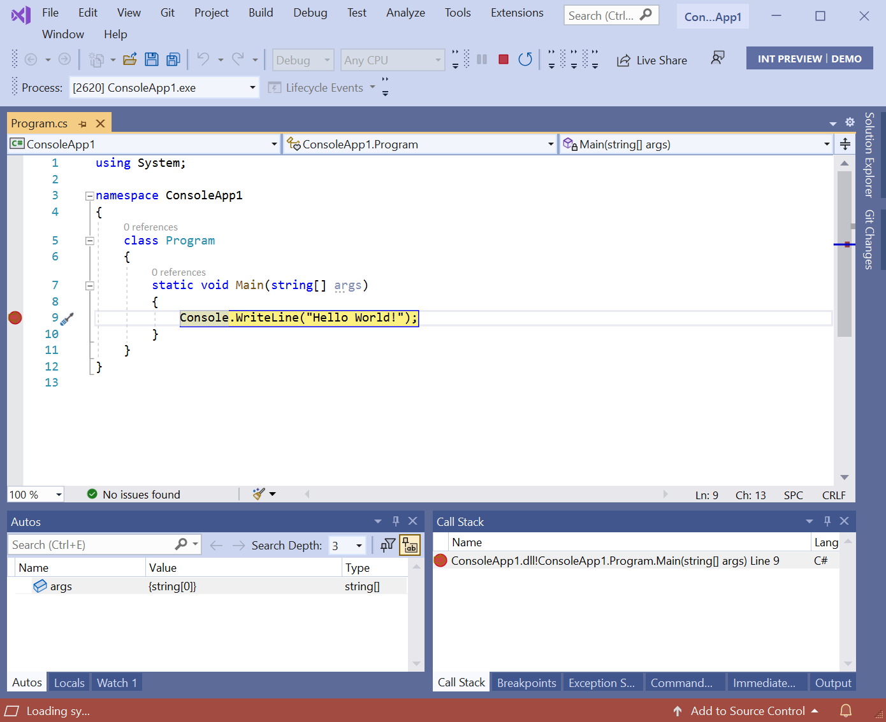
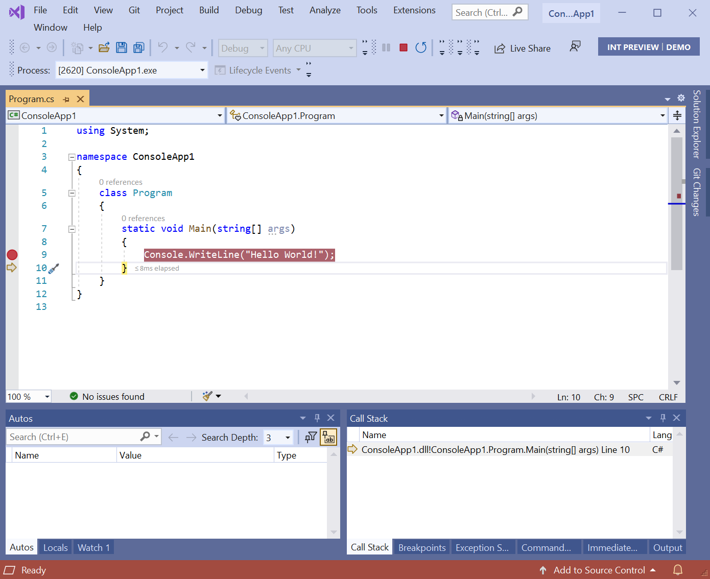
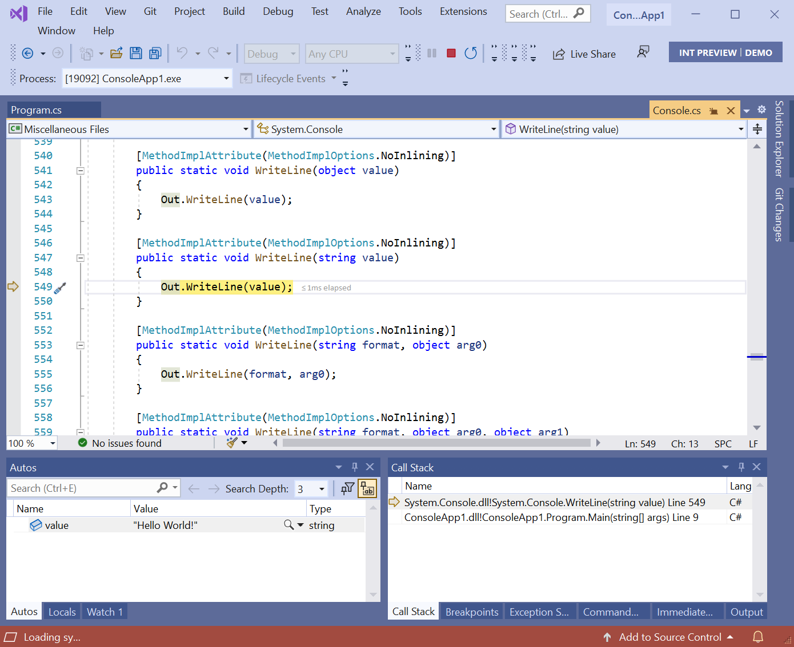
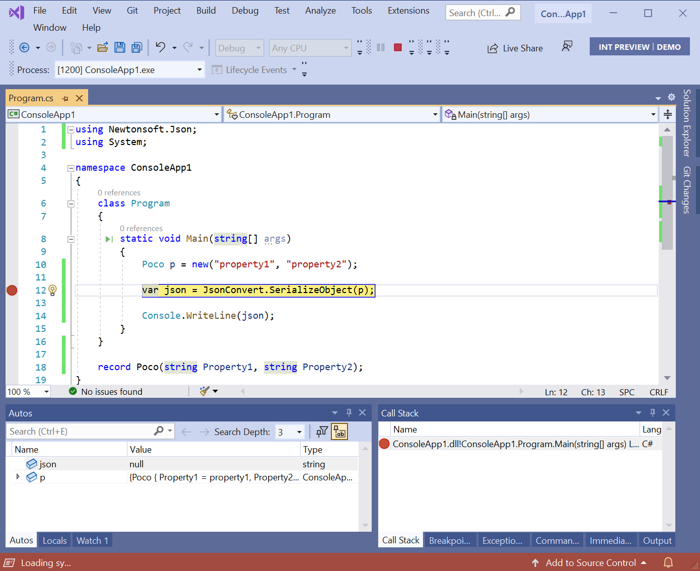
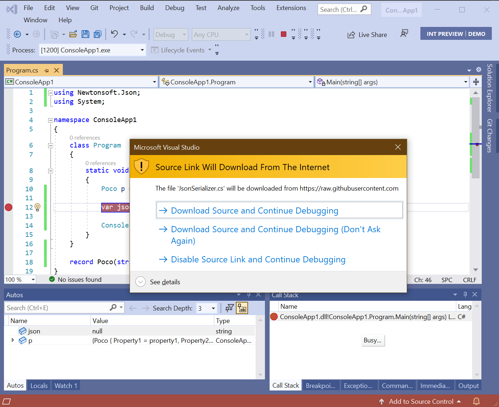
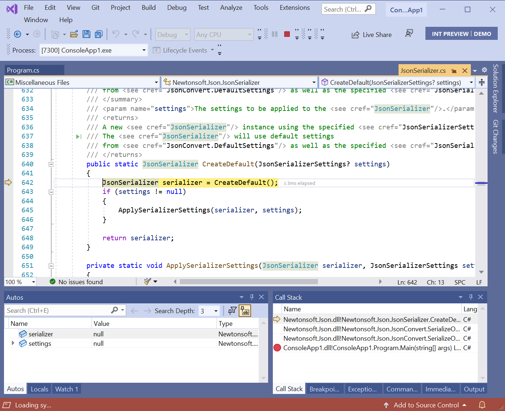
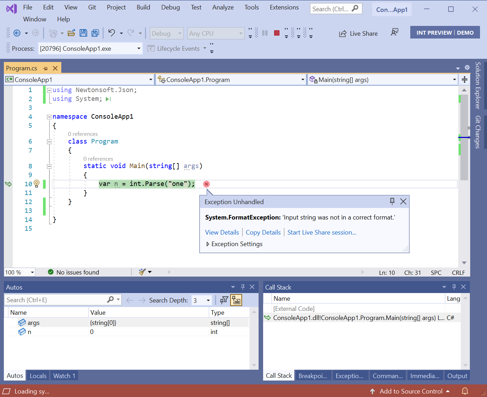
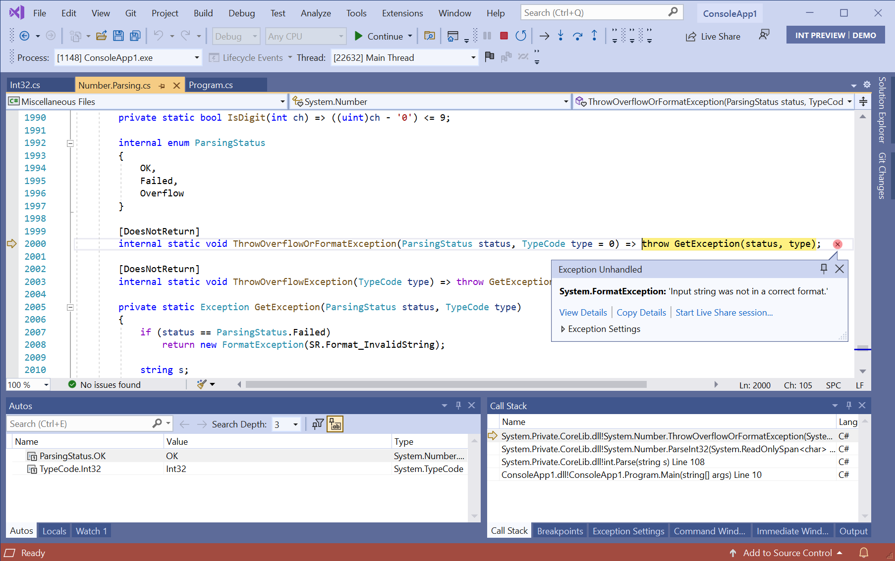
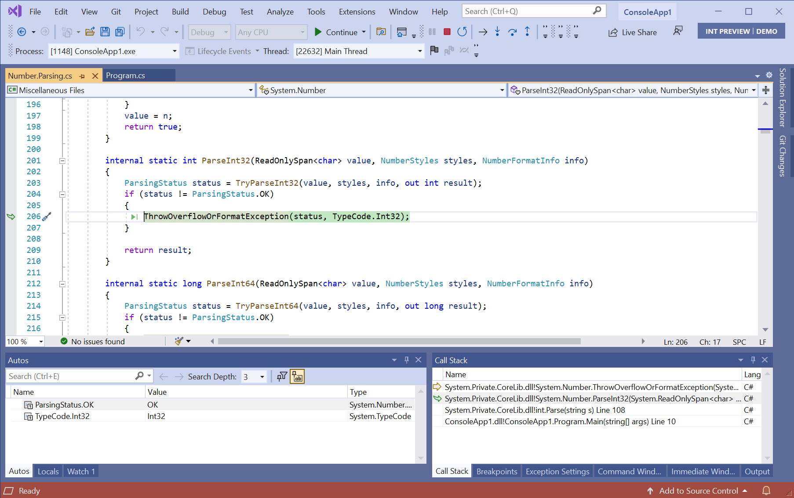
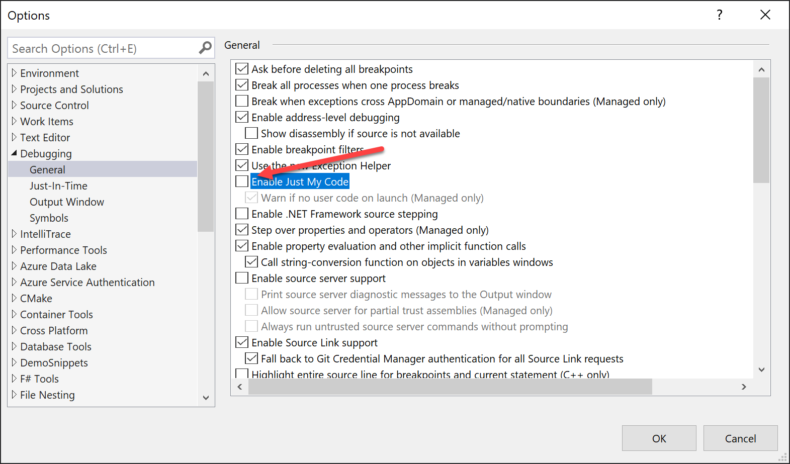

How many times have you been in the debugger tracking down a bug, stepping through code, looking at what local variable values changed, when you hit a wall -- the value isn't what you expected and you can't step into the method that produced it because it's from a library or .NET framework itself? Or, you set a conditional breakpoint waiting to examine how some value got set, then noticing a call stack that's mostly greyed out, not letting you see what happened earlier in the call stack? Wouldn't it be great if you could easily step into, set breakpoints, and use all of the debugger's features on NuGet dependencies or the framework itself?

.NET development practices in 2020 are a lot different and better in many ways than they were ten years ago. The biggest change is that the .NET platform is open source and maintained on GitHub. Many of the NuGet libraries that we all use on a daily basis are also maintained on GitHub. That means that the source I'd really like to see in my debugger is just one HTTPS GET away. We could have this wonderfully productive ecosystem where we could all debug with source, for all of our dependencies, all the time. That would be nice! In fact, the Source Link project, which was started by Cameron Taggart, realized this and built an experience that did just that. Let me tell you about it.

With Source Link-enabled libraries, the debugger can download the underlying source files as you step in, and you can set breakpoints/tracepoints like you would with any other source. Source Link-enabled debugging makes it easier to understand the full flow of your code from your code down to the runtime. Source Link is language-agnostic, so you can benefit from it for any .NET language and for some native libraries.

### Debugging the framework
Let's look at an example. Sometimes you want to step into the framework to see what's going on, especially if something is happening that you didn't expect. With Source Link, you can step into framework methods just like you can with your own code, inspect all variables, and set breakpoints.

If you tried it without Source Link, here's what you'd see, before and after hitting F11 to step in.




The debugger does not step into `Console.WriteLine` because there are no symbols or source for it. Once we configure Source Link, when we step in, we get a different result:



You can see that Visual Studio has downloaded the matching source and stepped into the method. If you look at the `Autos` window, it shows the local variables passed in. You can step into, over, and out of the framework code as much as you'd like.

### Debugging a dependency
Often times, the issue you're trying to solve is in a dependency. Wouldn't it be great if you could step into the source for your dependencies too? If the dependency added Source Link information during its build, you can! Here's an example with `Newtonsoft.Json`. Because `Newtonsoft.Json` was built with Source Link information, you can step into its code:

 



When I stepped in, the debugger skipped a couple of methods that were marked with `DebuggerStepThrough` and stopped on the next statement in the `CreateDefault` method. Since the source comes from the internet (GitHub, in this case), you're prompted to allow it, either for just a single file or for all files.

### Exceptions
Source Link helps you with exceptions that come from the framework or dependencies. How many times have you seen this message and what you really want is to examine the variables?

 



With Source Link, the debugger will take you to the spot where the exception is thrown where you can then navigate the call stack and investigate.

## Enabling Source Link

As Source Link downloads source files from the internet, it's not enabled by default. Here's how to enable it:

### Visual Studio

There are a couple steps to enable it:

1. Go to **Tools** > **Options** > **Debugging** > **Symbols** and ensure that the 'NuGet.org Symbol Server' option is checked. Specifying a directory for the symbol cache is a good idea to avoid downloading the same symbols again.
  
  If you'd like to step into the .NET framework code, you'll also need check the 'Microsoft Symbol Servers' option. 

2. Disable `Just My Code` in **Tools** > **Options** > **Debugging** > **General** since we want the debugger to attempt to locate symbols for code outside your solution.
  
  Verify that `Enable Source Link support` is checked (it is by default). If you'd like to step into .NET Framework code, you'll also need to check 'Enable .NET Framework source stepping'. This is not required for .NET Core.

### Visual Studio Code

Visual Studio Code had debugger settings configured per project in the `launch.json`:

```json
"justMyCode": false,
"symbolOptions": {
    "searchMicrosoftSymbolServer": true,
    "searchNuGetOrgSymbolServer": true
},
"suppressJITOptimizations": true,
"env": {
    "COMPlus_ZapDisable": "1",
    "COMPlus_ReadyToRun": "0"
}
```

### Visual Studio for Mac


## Notes

A few notes:

1. Not every library on nuget.org will have their .pdb files indexed. If you find that the debugger cannot find a pdb file for an open source library you are using, please encourage the open source library to upload their PDBs (see here for instructions).
2. Most libraries on nuget.org are **not** ahead-of-time compiled, so if you are only trying to debug into this library and not the .NET Framework itself, you can likely omit the env section from above. Using an optimized .NET Framework will significantly improve performance in some cases.
3. Only Microsoft provided libraries will have their .pdb files on the Microsoft symbol server, so you can disable that option if you are only interested in an OSS library.

In a future post we'll show you how to create libraries and applications with Source Link enabled so your users can benefit. 
