The article was written 

A game or simulation can influence the real world through other mediums than just screens and speakers, such as using dedicated haptic “rumble pads” controllers. I wanted to extend that influence to include altering the colors in the player’s environment. What if we could synchronize the light cast on the player’s character with actual lights in the player’s room? A search light casting its beam across their face, or onboard an alien infested space craft with the murky emergency lights filling their room? With my willing assistant, Terrance, a .NET NuGet package, a couple of Philips Hue lights, and Unity 3D, let’s see if it can be achieved.

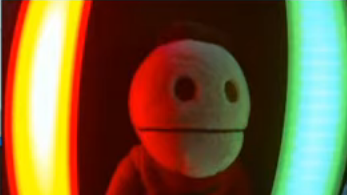

Spoiler alert – if you want to see a quick test of the results, then watch my Unity Dev Log 6a - [Physical Light Teaser](https://youtu.be/Ht1of0WcGiI)

Philips Hue Play Bars
---------------------

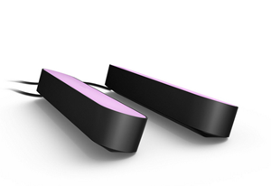 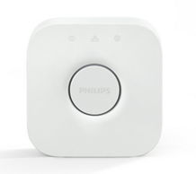

There are numerous controllable lights but for this demonstration I am using the Philips Hue Play Bars. These are LED lights that can emit a range of colors. They are controlled by a Philips Bridge, which in turn is programmable via a [REST API](https://developers.meethue.com/develop/hue-api/lights-api/) (note, you have to sign up to the API). Since this is .NET, there's likely to be a NuGet package out there to make, ahem, “light work” out of using this API. For the demo, I’m using the open-source [Q42.HueApi](https://www.nuget.org/packages/Q42.HueApi/) NuGet package.  

Creating the demo
-----------------

The first step is to create a new Unity project and set the **Project Settings** > **Player** to .NET Standard.

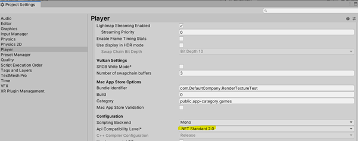

## Adding the Q42 NuGet Package to Unity

Currently, adding NuGet packages into Unity requires a more manual approach than perhaps you are used to. You might find a better approach, but I created a small .NET console project and added the package. Then, you can take the two managed .NET Framework 4.x DLLs, `Q42.HueApi` and `Q42.HueApi.ColorConverters` and place them into the Unity Project under the Plugins folder. 
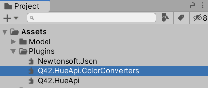

Now, you have everything ready to code against.

Controlling the lights
----------------------
This section is a basic introduction to controlling the Philips lights.
### The initial handshake
The very first thing you need to do is get the Application Key (App Key) from the bridge. This requires you to supply a couple of facts: 

1. Application Name – the name of your Unity app. It doesn’t have to be accurate. It's just a way to differentiate it with your Philips Bridge.
2. Device Name – the name of the device the App is running on. Again, just needs to be unique to your Bridge.

## Getting the Bridges

To get an App Key from the Bridge you now need to discover the Bridge like in the following example:

```csharp
public async Task RegisterAppWithHueBridge()
{
    IBridgeLocator locator = new HttpBridgeLocator();
    var timeout = TimeSpan.FromSeconds(5);
    var bridges = await locator.LocateBridgesAsync(timeout);
 
    // Assuming we have only one bridge
    var bridge = bridges.First();
    string ipAddressOfTheBridge = bridge.IpAddress;
    var client = new LocalHueClient(ipAddressOfTheBridge);
 
    // Get the key
    var appKey = await client.RegisterAsync(
        hueSettings.AppName, 
        hueSettings.DeviceName); 
}
```

Note the comment, this requires physically pressing the accept connection button on your Philips Bridge, that is, it can take some time to walk to the device and back again. If you want to use this in a real application, then you'll need to provide a nice ‘waiting’ UI.
The good thing is that you only need to go through the process once. Once you have the key you can hang on to it, so you will want to store that somewhere. I serialize it to disk by setting the property of a custom made HueSettings MonoBehaviour that resides in the game hierarchy. For example:

```csharp
public class HueSettings : MonoBehaviour
{
    [SerializeField]
    string appKey;
 
    [SerializeField]
    string appName;
 
    [SerializeField]
    string deviceName;
 
    public string AppKey { get => appKey; set => appKey = value; }
    
    public string AppName { get => appName; set => appName = value; }
 
    public string DeviceName { get => deviceName; set => deviceName = value; }
}
```
## Getting the Lights

Once you've connected to the located Bridge, you can initialize the client with the App Key and discover the available lights connected to that Bridge.

```csharp
this.client = new LocalHueClient(ipAddressOfTheBridge);
 
 
if (!string.IsNullOrEmpty(hueSettings.AppKey))
{
    client.Initialize(hueSettings.AppKey);
}
 
this.lights = await client.GetLightsAsync();

```
## Setting the light color
Almost there, now how to control the lights…

```csharp
public async Task ChangeLight(string lightName, UnityEngine.Color color)
{
    if (client == null)
    {
        return;
    }
 
    var lightToChange = lights.FirstOrDefault((l) => l.Name == lightName);
    if (lightToChange != null)
    {
        var command = new LightCommand();
        var lightColor = new RGBColor(color.r, color.g, color.b);
        command.TurnOn().SetColor(lightColor);
 
        var lightsToAlter = new string[] { lightToChange.Id };
        await client.SendCommandAsync(command, lightsToAlter);
    }
}
```

Each light is identified by a name configured in the Philips App. You can either discover the names from the returned lights enumerable or just supply the known names. Whichever way you choose, once you have a light object you can Send a Command to it or to several lights at the same time. In the previous example, a command is created to Turn On the light (doesn’t matter if it’s already on) and then Set the Color of the light. Careful though, you must convert from a Unity color to a Philips color via the RGBColor class.
One last thing to remember is to turn off the lights when your app closes. You could do this from the `OnDestroy()` or `OnApplicationQuit()` Unity methods. One trick is to send a Command to all the lights by not supplying any target lights.

```csharp
public async Task TurnOff()
{
    if (client != null)
    {
        var command = new LightCommand();
        command.TurnOff();
        await client.SendCommandAsync(command);
    }
}
```

Now that you have control over the lights, let’s do something with them.

Capturing in-game light information
------------------------------------
The problem – capturing the total light on a surface, not just single rays but multiple light sources, reflections, and so on.
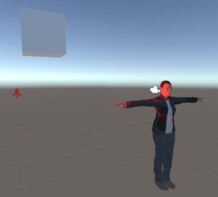

In my scene, I have a single spotlight source directed at the side of a character’s face. What I want to do is to match the Philips light located to the right of the player to the same color. We could just grab the color the light is set to and use that. That’s okay but as you’ll see next, it’s not very accurate.

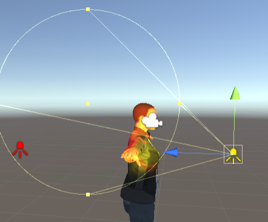

Now, you have multiple light sources on the characters face and the resulting color is a combination of them. In fact, it’s a combination of all sorts of light emitters. The lighting of the face consists of multiple light sources, reflections, ambient light, shadows, etc. Also, objects can affect the light before it reaches the character’s face. For example, a window blind.

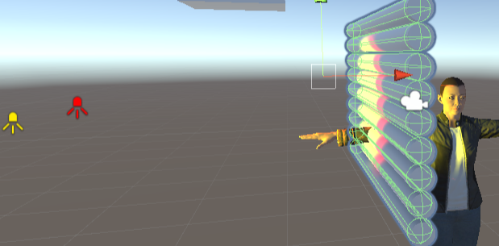

This means you need a way to examine the light on the character’s face rather than simply aggregate the light emitters. 

## Capture the light via a Camera

The solution I'm using is to place a dedicated camera near to the character’s face. Its only job is to capture the face, therefore its Viewport and Clipping Planes have been constrained to only capture the side of the face.

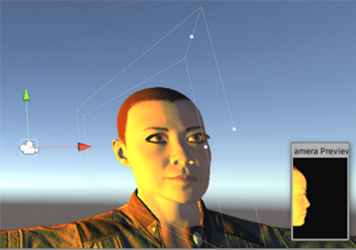

The real magic behind this is that each camera can render its results to a Target Texture.
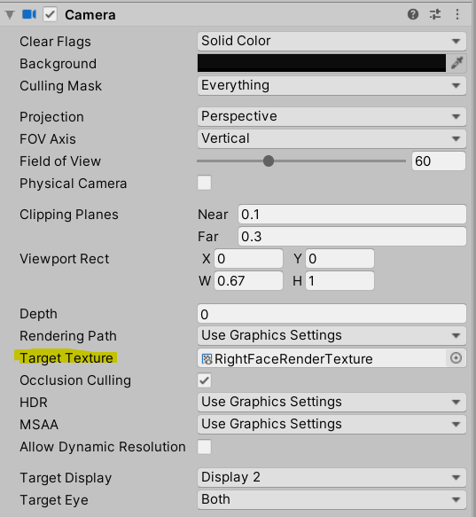

By referencing the same texture in code, you can analyze the colors.

```csharp
this.colourCamera = GetComponent<Camera>();
this.renderTexture = this.colourCamera.targetTexture;
```

In Unity, you can use a Coroutine to implement a long-polling color analysis and light setting method.
```csharp
private IEnumerator FindAndSendAverageColor()
{
    while (!isCalculatingFaceAverage)
    { 
        // create a copy of the texture
        Texture2D tex2d = new Texture2D(renderTexture.width,
                                renderTexture.height,
                                TextureFormat.RGB24, false);
        RenderTexture.active = renderTexture;
        tex2d.ReadPixels(new Rect(0, 0, 
                                renderTexture.width,
                                renderTexture.height),
                                0, 0);
        tex2d.Apply();
 
        // get all the colors
        var detectorX = renderTexture.width;
        var detectorY = renderTexture.height;
        var colours = tex2d.GetPixels(0, 0, 
            renderTexture.width, renderTexture.height);
 
 
        var averageColor = AverageWeightedColor(colours);
 
        // set the light and breath or ignore and breath
        if (averageColor.r + averageColor.g + averageColor.b > 0)
        {
 
            hueLightHelper.ChangeLight(hueLightName, this.averageColor)
                .ConfigureAwait(false);
 
            yield return new WaitForSeconds(0.2f);
        }
        else
        {
            yield return new WaitForSeconds(0.5f);
        }
    }
}
```

The Camera is rendering what it can see to the texture. You then calculate the average colors, using an algorithm of our choice, and set your chosen Philips light to the result. In this demo, I used a very simple average with a little twist to say the resulting colors must total something with enough color/light (colorGate) to make it interesting, that is, ignore deep shadows.

```csharp
private Color AverageWeightedColor(Color[] colors) 
{
    var total = 0;
    var r = 0f; var g = 0f; var b = 0f;
    for (var i = 0; i< colors.Length; i++) 
    {
        if (colors[i].r + colors[i].g + colors[i].b > colorGate)
        {
            r += colors[i].r > colorGate ? colors[i].r : 0f;
            g += colors[i].g > colorGate ? colors[i].g : 0f;
            b += colors[i].b > colorGate ? colors[i].b : 0f;
            total++;
        }
    }
    return new Color(r/total, g/total, b/total, 1);
}
```

You can now capture the light cast onto a game object, the character in this case, and emit a corresponding color to a light in the real world.

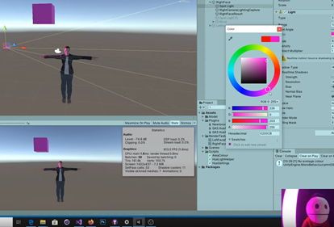

Or however many lights you want to use. My video camera NB struggles to capture the actual light color. Honestly, it’s much closer in real life.
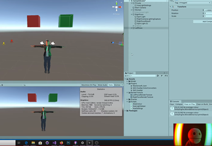

Summary
-------

One of the major advantages of Unity is that it is able to utilize libraries from the wider .NET ecosystem allowing the game developer to, literally, bring other tools and hardware into play. In this post we have utilized a .NET library for Philips Hue to control the lighting, capture light information in Unity, and then apply the colors to Hue lights in the real world. I hope you enjoy an emmersive time playing with Unity and Philips Hue.

You can find a YouTube video version of this and more links at [Unity Dev Log 6a - Physical Light Teaser](https://youtu.be/Ht1of0WcGiI) and [Unity Dev Log 6b - Implementing Physical Lights.](https://youtu.be/MzQ-4NvdFeo)

A version of the scripts used can be found at the [paulio/UnityPhilipsLights](https://github.com/paulio/UnityPhilipsLights) repository on GitHub.
