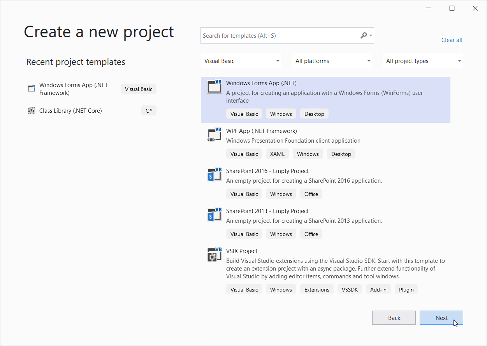
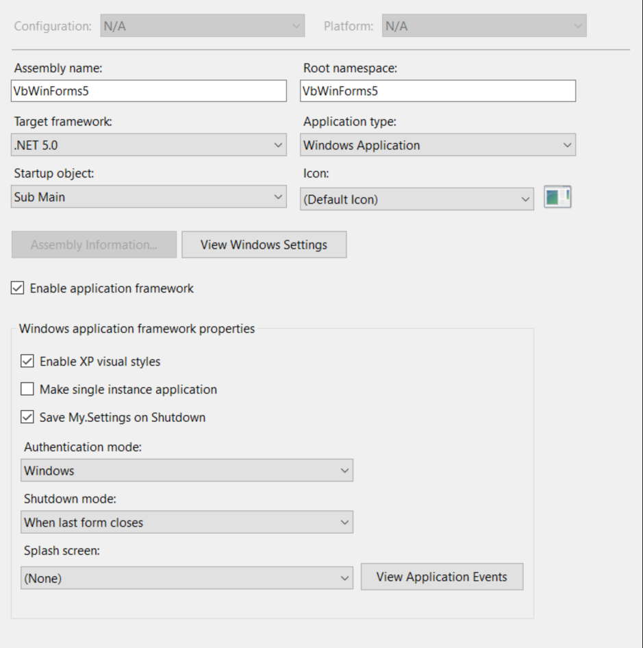
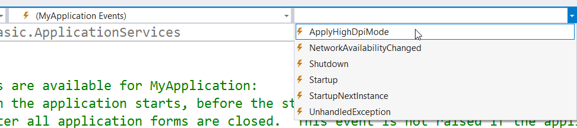
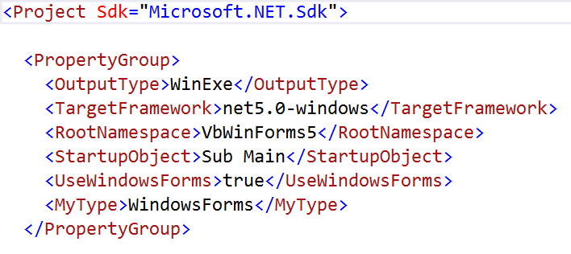
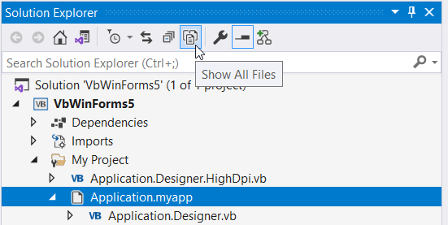

Visual Basic, along with its Application Framework, is  supported in ..NET 5 and Visual Studio 16.8! Visual Studio 16.8 includes the Windows Forms Designer, so Visual Basic is ready for you to migrate existing applications or create new applications.

While .NET Core has had Visual Basic since the first release, and WinForms since it was released in .NET Core 3.1, it did not include the Application Framework library and WinForms Designer support Visual Basic programmers expect. .NET 5 is the next version of .NET Core and we think .NET 5 is ready for you to migrate existing .NET Framework apps or create new WinForms applications.

We’re excited about the updates for Visual Basic in .NET 5, but first
a reminder that you can base your decision to migrate to .NET 5 on whether or not you want its new features
and how you need to interop with .NET 5 applications. The .NET Framework will
be supported as part of Windows for a very long time. New features will not be added to .NET Framework . New features, including new WinForms features, will be added only to .NET 5 and future versions. 

Visual Studio 16.8 and .NET 5 include the following updates for WinForms
development in .NET 5:

-   **Designer Event Handling support:** Visual Basic events are hooked up with
    a *Handles* keyword on the code behind method. This presented significant
    challenges to the WinForms designer and did not work correctly in .NET Core
    3.1. This has been fixed.

-   **Application Framework:** The Visual Basic Application Framework provides
    event-based startup, meaning you don’t need a `Sub Main` for WinForms
    applications. A new version of the Application Framework is available in
    .NET 5.

-   **Single Instance applications:** .NET 5 introduces Single Instance
    Applications to the .NET Core family. The new version also has updated logic
    that should work well in more scenarios.

-   **Updates to Visual Studio dialogs:** Updates have been made to a few
    dialogs to support Visual Basic features in the new project format. This
    work is ongoing.

-   **Visual Basic WinForms template**: We waited to add the template to Visual
    Studio until you could create WinForms applications with the Application
    Framework. This new template is the default in Visual Studio, and available via a switch on `dotnet new` in the .NET CLI.

-   **Additional Visual Basic Runtime features:** The last few versions of .NET
    Core have ported features of the Visual Basic Runtime. We believe this work
    is complete and that missing features can’t work the same way on .NET 5.

### Creating .NET 5 Application Framework WinForms Apps in Visual Studio

You’ll find the new .NET 5 template in the Create New Project dialog. Naming has
been updated for templates, and you’ll find the .NET Framework templates names
include “Framework” and the templates that simply indicate .NET are for .NET 5.



Many aspects of a WinForms Application Framework App’s behavior are controlled
through settings in the Project Property Designer, which is shown by selecting
*Properties* in the context menu of a VB Project in the Solution Explorer:



**Target Framework:** The Visual Basic Application Framework is not supported in
.NET Core 3.1 or earlier versions of .NET Core. As a result, if you switch the
Target Framework in the Application Designer to .NET Core 3.1, an Application
Framework based project will no longer compile. (See also sections “Creating
.NET Core 3.1 or .NET 5 Apps at the Command Line” and “Known Issues”.)

**Enable Application Framework:** The Application Framework is enabled by
default. When it is enabled, it provides easy one-click configuration settings
and a simplified access to the coded application events (see below).

**Enable XP visual styles:** This option enables the OS-controlled themed
rendering of controls, which was first introduced in Windows XP and retained the
name going forward.

**Make single instance application:** If this option is clicked, the Application
Framework makes sure, that a WinForms App is only started once. (Tip: If this
option is not used, the [StartUpNextInstance application
event](https://docs.microsoft.com/dotnet/api/microsoft.visualbasic.applicationservices.windowsformsapplicationbase.startupnextinstance?view=net-5.0)
lets you control whether another instance of the WinForms app can be started).

**Save My Settings on Shutdown:** Automatically saves settings properties when
the WinForms application is closed. Note that the settings feature is not yet
fully implemented in the new WinForms Designer for Visual Basic.

**Authentication mode:** This option controls whether the *User* property
mirrors the Windows User through the *My*-namespace, or if you want to implement
the user management yourself. Please note, that this does not cause any login
dialog to be displayed or other authentication – it is exclusively for how the
*User* property in the *My* namespace works.

**Splash screen:** Lets you pick a Splash screen form, which gets automatically
displayed, when the WinForms app starts.

### Differences from .NET Framework

.NET 5 is in the .NET Core family and has differences in the APIs and libraries
that are available, the Project System, and how applications are deployed. Check out this
[blog post for porting applications to .NET
Core](https://devblogs.microsoft.com/dotnet/porting-desktop-apps-to-net-core/).

In general, your experience in Visual Studio will be similar for .NET 5 and .NET
Framework. One difference is how you hook up Application Framework events for
startup, network availability change detection, shutdown and unhandled exception
notification. An empty *ApplicationEvents.vb* file to contain these events is
created by the WinForms template in .NET 5, while in .NET Framework the file is
not created until the developer clicks the *View Application Events* button. As
a result, the procedure for wiring applications events in your application is:

1.  Switch to the *ApplicationEvents.vb* code file in the code editor.

2.  From the middle dropdown view in the Code editor, chose *(MyApplication
    Events)*.

3.  From the right dropdown view in the Code editor, chose the application
    event, you want to wire up.

4.  This will create the handler where you can add your code.

### New Application Framework Event *ApplyHighDpiMode*

Beginning with .NET 5, the Application Framework provides a new application
event named *ApplyHighDpiMode*. The default is *SystemAware* which provides the
same crisp high dpi rendering at design time and runtime.  




If you want to start your WinForms App with a different high Dpi setting, you can
do that easily by handling the *ApplyHighDpiMode* application event:

-   Open the *ApplicationEvent.vb* code file in the editor.

-   From the middle dropdown list, chose *MyApplication Events*.

-   From the right list of events (see screenshot), pick *ApplyHighDpiMode* to
    insert the event handler stub.

-   Add the following code (the sample set it to *PerMonitorV2*):

```Visual Basic
Partial Friend Class MyApplication
    Private Sub MyApplication_ApplyHighDpiMode(
        sender As Object, e As ApplyHighDpiModeEventArgs) Handles Me.ApplyHighDpiMode

        e.HighDpiMode = HighDpiMode.PerMonitorV2

    End Sub
End Class
```

The high DPI mode set in the *ApplyHighDpiMode* event cannot be changed after
the first Form has been displayed, and it should be set only once.

## Creating .NET Core 3.1 or .NET 5 VB WinForms Apps with the CLI

While we highly recommend Visual Studio and its WinForms Designer, you can also
create applications outside Visual Studio, using the .NET CLI. You need the .NET
5 SDK, which is installed with Visual Studio, or you can download it here.

When you create a
Visual Basic WinForms app at the command line, the Application Framework is NOT
used by default and you can select either .NET Core 3.1 or .NET 5. Since the
Application Framework’s infrastructure was added to the runtime in.NET 5 you
cannot create Application Framework applications targeting .NET Core 3.1.

With the CLI, you create a new Visual Basic Forms app with the command *dotnet
new*:

```sh
**dotnet new winforms -o outputDirectoryName --language VB**
```

You control with the command line options how the project should get created:

**--output outputDirectoryName :** Determines the VB WinForms project name. A
subfolder with this name is automatically created.

**--language vb:** Determines that a Visual Basic WinForms project is created.
If the *--language* option is omitted, a C\# project is created. If you want
`dotnet new` to default to Visual Basic, set the environment variable
`DOTNET_NEW_PREFERRED_LANG=VB`.

By default, `dotnet new` generates a .NET Core 5.0 WinForms Project without the
Application Framework, similar to how a C# WinForms project works. . The application starts with a `Sub Main` method in module
called *Program.vb* which handles all the necessary set up:

```Visual Basic
Friend Module Program

    ' Start and set HighDpiMode, Styles and TextRenderingDefault.
    <STAThread()>
    Friend Sub Main(args As String())
        Application.SetHighDpiMode(HighDpiMode.SystemAware)
        Application.EnableVisualStyles()
        Application.SetCompatibleTextRenderingDefault(False)
        Application.Run(New Form1)
    End Sub

End Module
```

If you want to create a .NET 5 WinForms VB Project with
Application Framework support from the command line, then you should use these additional options:

```sh
dotnet new winforms -o VbForms5AF --language VB --framework net5.0
--use-app-framework
```

**--framework:** Determines which .NET version the WinForms App is created. The
Target Framework Monikers are

-   *netcoreapp3.1* for .Net Core 3.1 Apps

-   *net5.0-windows* for .NET 5 Apps

-   *net6.0-windows* for .NET 6 Apps. (.NET 6 is in very early Beta, and the
    [SDK can be downloaded from
    here](https://aka.ms/dotnet/net6/dev/Sdk/dotnet-sdk-win-x86.exe).)

**--use-app-framework:** When this option is present (only possible from .NET
5.0 and above), a Visual Basic WinForms App based on the Application Framework is
created. The resulting project files are the same as the files created by using
the VB .NET 5.0 WinForms template of Visual Studio.

## Changed Project File Format

.NET Core and .NET 5 applications use a new project file (*.vbproj*) format. The
new format is designed to be read and understood by humans as well as MSBuild.
Files are no longer listed explicitly. Rather, all files in the folder where the
*.vbproj* file is saved and any subfolders are *implicitly* part of the project.
This is called *globbing*. You’ll see project level imports, project and package
reference and *Option* settings in this file as well.

The new project file looks like:



Visual Basic project files start with the `<Project SDK>` tag. For WinForms apps
this tag needs to be…

-   …*Microsoft.NET.Sdk* for .NET 5 (and higher versions) apps and

-   …*Microsoft.NET.WindowsDesktop* for .NET Core 3.1 apps.

To change the Target Framework in a WinForms App (either Visual Basic, C\# or F\#),
change the *Target Framework* setting by editing the project file.

**Important:** The Project Properties Designer does not currently support
changing between .NET 5 and .NET Core 3.1. And if you inadvertently change it
there, your project may not compile. Change the Target Framework manually in the
*.vbproj* file to the one you need.

Change the *TargetFramework* tag to…

-   …*netcoreapp3.1* for .NET 3.1 Apps. Please keep in mind, that 3.1 apps don’t
    support the Visual Basic Application Framework.

-   …*net5.0-windows* for .NET 5.0 Apps.

## Known Issues

In Visual Studio 16.8, the WinForms Designer still has a few features missing.
Also, the project system, which manages the Project Dialog, does not fully
support the Application Framework.

### Selecting the Startup Form in a .NET 5.0 Application Framework App

In the Project Property Designer, the selection of the *Start Object* is not
currently functional. To work around this issue:

-   To change the default setting to a different form, make sure that the
    solution explorer shows all files. If needed, change this setting in the
    Solution Explorer’s toolbar:



(04 - EditApplicationMyApp.png)

-   Expand the branch *My Project* in the solution Explorer.

-   Click on *Application.myapp* to show it in the code editor. Now, change the
    *\<MainForm\>* setting to the Form, with which you want the WinForms app to
    start.

-   Save the file, to initiate the code generation, that sets the Form you
    selected as the new start form.

## Reporting bugs and suggesting features

Have any comments, suggestions or have you found bugs? Please submit issues
via Visual Studio Feedback or as issues in the WinForms GitHub repository. WinForms is
open source and developed in the open. Visit
<https://github.com/dotnet/winforms>, and get engaged! Happy coding!
