The .NET Productivity team (a.k.a. Roslyn) wants to help you be more productive! We’ve seen a lot of excitement in the past few months over our latest features which automate and reduce editing tasks to a single click and help save you time. In this post, I’ll cover some of the latest .NET productivity features available in [Visual Studio 2019](https://visualstudio.microsoft.com/downloads/).

## Tooling improvements

Starting in .NET 5.0, Roslyn analyzers are included with the [.NET SDK](https://docs.microsoft.com/dotnet/fundamentals/code-analysis/overview). Roslyn analyzers are enabled, by default, for projects that target .NET 5.0 or later. You can enable them on projects that target earlier .NET versions by setting the [EnableNETAnalyzers](https://docs.microsoft.com/dotnet/core/project-sdk/msbuild-props#enablenetanalyzers) property to *true*. You can also use the Project Properties to enable/disable .NET analyzers. To access the Project Properties, right-click on a project within Solution Explorer and select Properties. Next, select the Code Analysis tab where you can either select or clear the checkbox to Enable .NET analyzers.

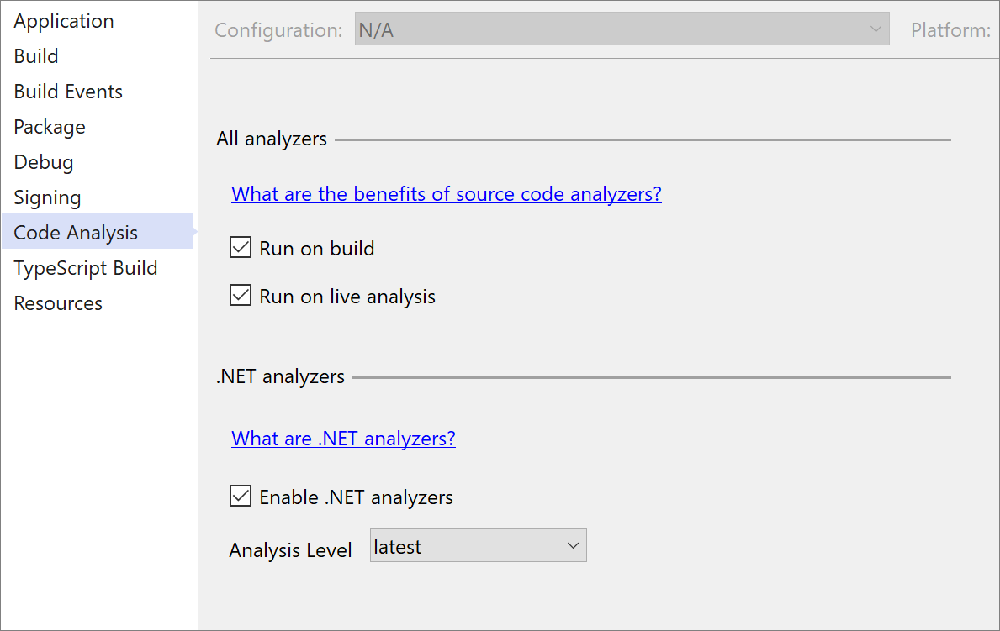

Another exciting feature is [inline parameter name hints](https://docs.microsoft.com/visualstudio/ide/reference/options-text-editor-csharp-advanced?view=vs-2019#editor-help) that inserts adornments for literals, casted literals, and object instantiations prior to each argument in function calls. In 16.9 Preview 1, we also added inline type hints for variables with inferred types and lambda parameter types. You’ll first need to turn this option on in *Tools* > *Options* > *Text Editor* > *C#* or *Basic* > *Advanced* and select **Display inline parameter name hints** and **Display inline type hints**. You can also use the shortcut **Alt**+**F1** to briefly view hints.

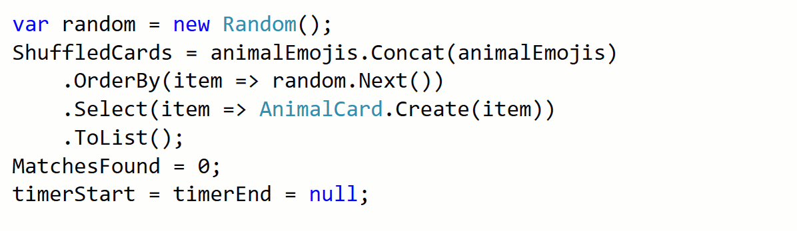

You can now extract members from a selected class to a new base class with the new Extract Base Class refactoring. Place your cursor on either the class name or a highlighted member. Press **Ctrl**+**.** to trigger the **Quick Actions and Refactorings** menu. Select **Pull member(s) up to new base class** or **Extract base class**. The new **Extract Base Class** dialog will open where you can specify the name for the base class and location of where it should be placed. You can select the members that you want to transfer to the new base class and choose to make the members abstract by selecting the checkbox in the **Make abstract** column.

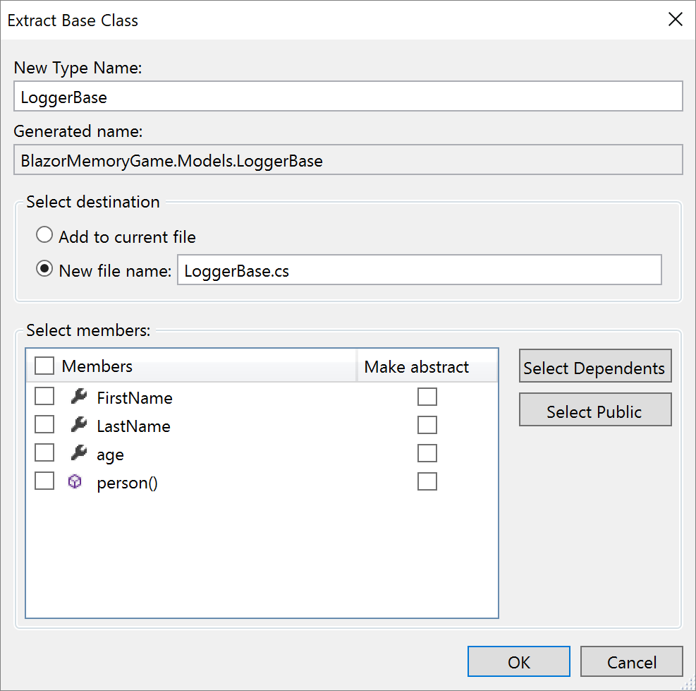

[Code cleanup](https://docs.microsoft.com/visualstudio/ide/code-styles-and-code-cleanup?view=vs-2019#apply-code-styles) has new configuration options that can apply formatting and file header preferences set in your [EditorConfig](https://docs.microsoft.com/visualstudio/ide/create-portable-custom-editor-options?view=vs-2019#add-an-editorconfig-file-to-a-project) file across a single file or an entire solution.

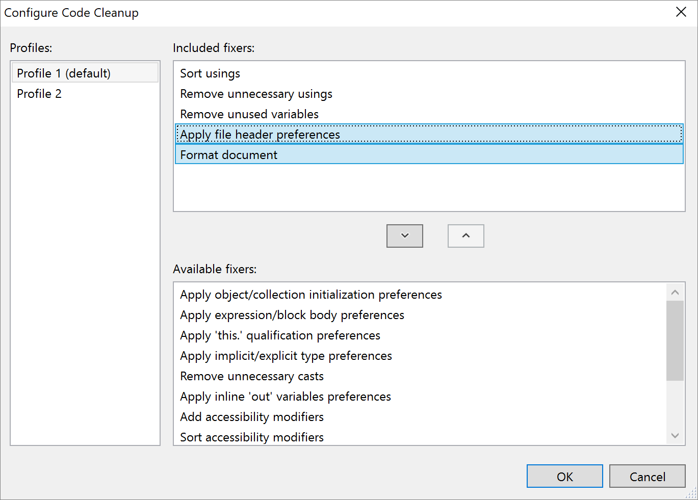

## Code fixes and refactorings

Code fixes and refactorings are the code suggestions the compiler provides through the light bulb and screwdriver icons. To trigger the **Quick Actions and Refactorings** menu, press (**Ctrl**+**.**) or (**Alt**+**Enter**). The following list shows the code fixes and refactorings that are new in Visual Studio 2019:

* The [inline method](https://docs.microsoft.com/visualstudio/ide/reference/inline-method?view=vs-2019) refactoring helps you replace usages of a static, instance, and extension method within a single statement body with an option to remove the original method declaration. Place your cursor on the usage of the method. Press **Ctrl**+**.** to trigger the **Quick Actions and Refactorings** menu. Next select from one of the following options:

    Select **Inline `<QualifiedMethodName>`** to remove the inline method declaration:

    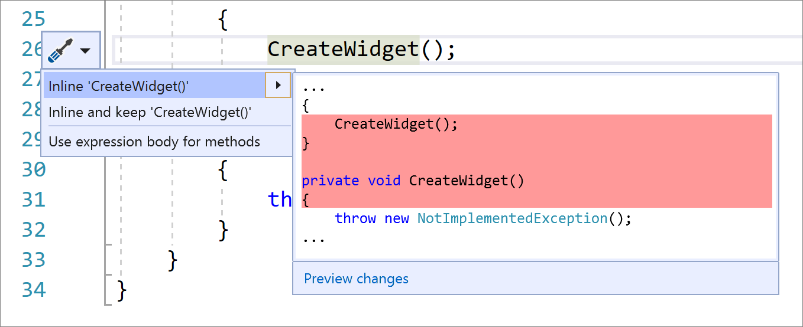

    Select **Inline and keep `<QualifiedMethodName>`** to preserve the original method declaration:

    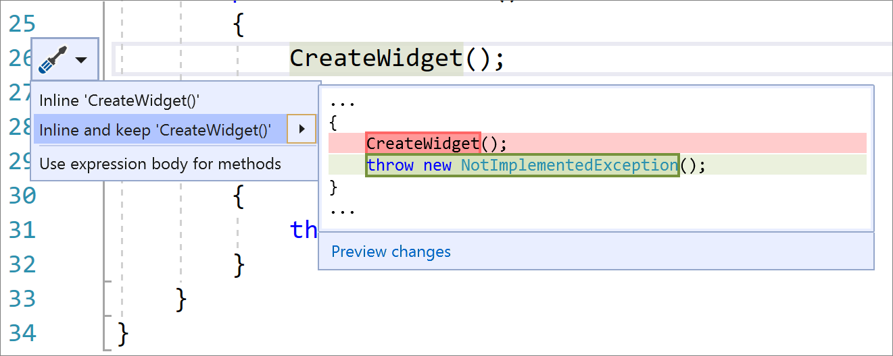

* The [use pattern matching](https://docs.microsoft.com/visualstudio/ide/reference/use-pattern-matching?view=vs-2019) refactoring introduces the new C# 9 pattern combinators. Along with the pattern matching suggestions, such as converting `==` to use `is` where applicable, this code fix also suggests the pattern combinators `and`, `or` and `not` when matching multiple different patterns and negating. Place your cursor inside the statement. Press **Ctrl**+**.** to trigger the **Quick Actions and Refactorings** menu and select **Use pattern matching**.

    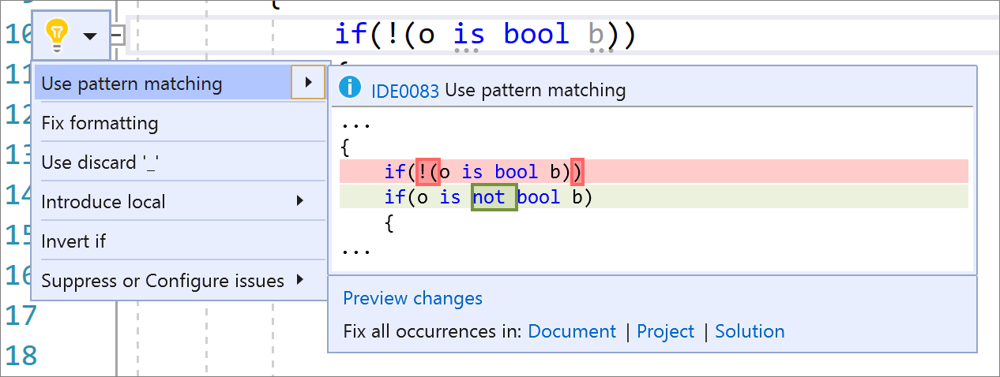

* The [make class abstract](https://docs.microsoft.com/visualstudio/ide/reference/make-class-abstract?view=vs-2019) refactoring allows you to easily make a class abstract when you’re trying to write an abstract method in a class that isn’t abstract. Place your cursor on the method error. Press **Ctrl**+**.** to trigger the **Quick Actions and Refactorings** menu and select **Make class ‘abstract’**.

    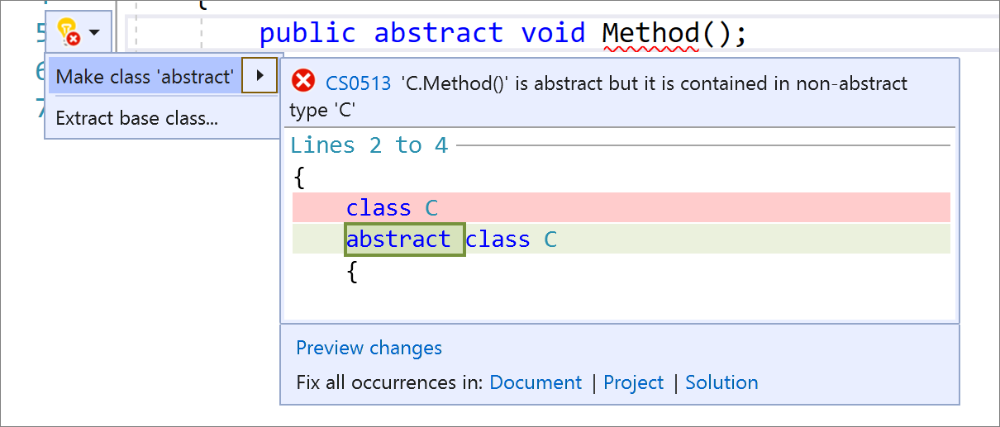

* The convert [typeof to nameof](https://docs.microsoft.com/visualstudio/ide/reference/convert-typeof-to-nameof?view=vs-2019) refactoring allows you to easily convert instances of *typeof(`<QualifiedType>`).Name* to *nameof(`<QualifiedType>`)* in C# and instances of *GetType(`<QualifiedType>`).Name* to *NameOf(`<QualifiedType>`)* in Visual Basic. Using *nameof* instead of the name of the type avoids the reflections involved when retrieving an object. Place your cursor within the *typeof(`<QualifiedType>`).Name*. Press **Ctrl**+**.** to trigger the **Quick Actions and Refactorings** menu and select **Convert 'typeof' to 'nameof'**.

    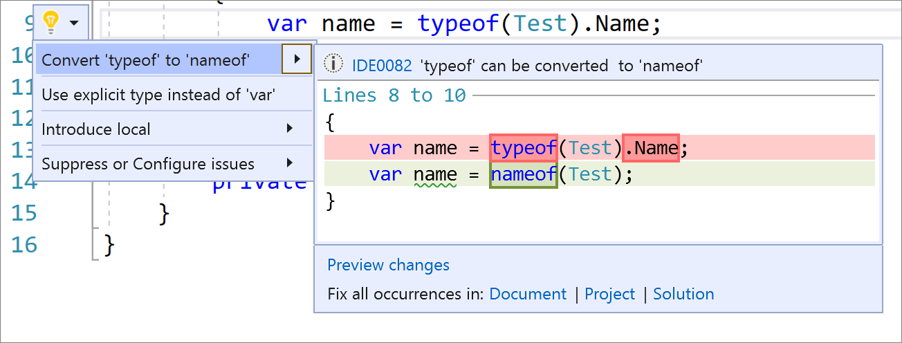

* Visual Basic had multiple ways of passing parameters, *ByVal* and *ByRef*, and for a long time *ByVal* has been optional. We now fade *ByVal*to say it's not necessary along with a code fix to remove the unnecessary *ByVal*. Place your cursor on the ByVal keyword. Press **Ctrl**+**.** to trigger the **Quick Actions and Refactorings** menu and select **‘ByVal’ keyword is unnecessary and can be removed**.

    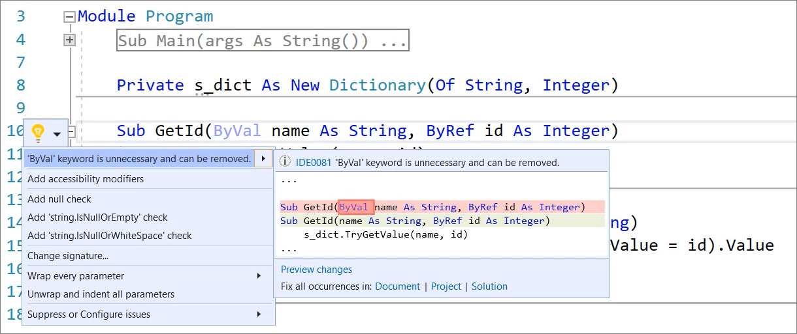

* Now, there’s also a code fix to remove the `in` keyword where the argument shouldn’t be passed by reference. Place your cursor on the error. Press **Ctrl**+**.** to trigger the **Quick Actions and Refactorings** menu and select **Remove ‘in’ keyword**.

    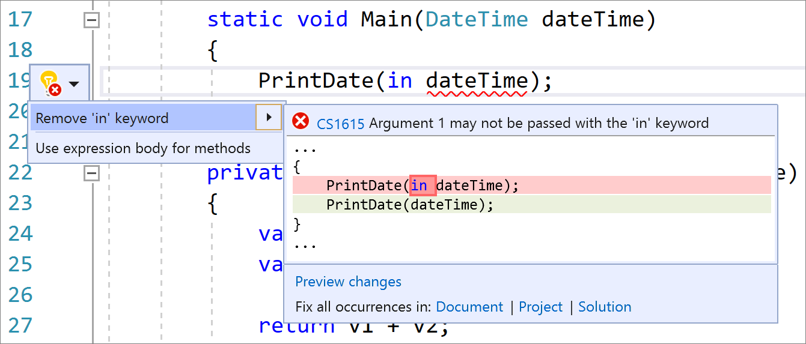

* In 16.9 Preview 1, we also added a code fix that removes redundant equality expressions for both C# and Visual Basic. Place your cursor on the redundant equality expression. Press **Ctrl**+**.** to trigger the **Quick Actions and Refactorings** menu and select **Remove redundant equality**.

    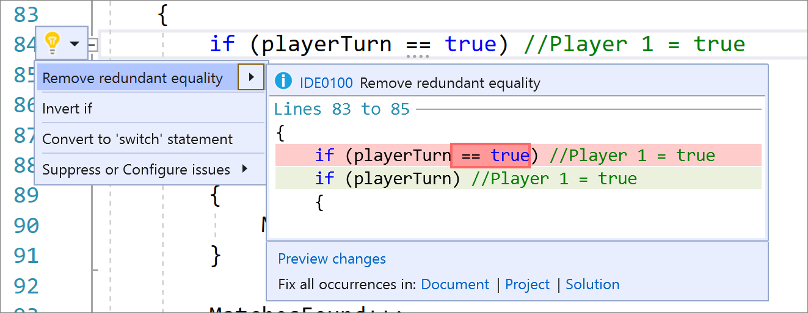

* And the last refactoring we added in 16.9 Preview 1 suggests [using ‘new(…)’](https://docs.microsoft.com/visualstudio/ide/reference/use-new?view=vs-2019) in non-contentious scenarios. Place your cursor on the field declaration. Press **Ctrl**+**.** to trigger the **Quick Actions and Refactorings** menu and select **Use 'new(…)'**.

    

## Get involved

This was just a sneak peek of what's new in [Visual Studio 2019](https://visualstudio.microsoft.com/downloads/). For a complete list of what's new, see the [release notes](https://docs.microsoft.com/visualstudio/releases/2019/release-notes). And feel free to provide feedback on the [Developer Community](https://developercommunity.visualstudio.com/spaces/8/index.html) website, or using the [Report a Problem](https://docs.microsoft.com/visualstudio/ide/how-to-report-a-problem-with-visual-studio) tool in Visual Studio. You can also share your feedback with us on [GitHub](https://github.com/dotnet/roslyn/issues) or tweet @roslyn, we'd love to hear what you think!
