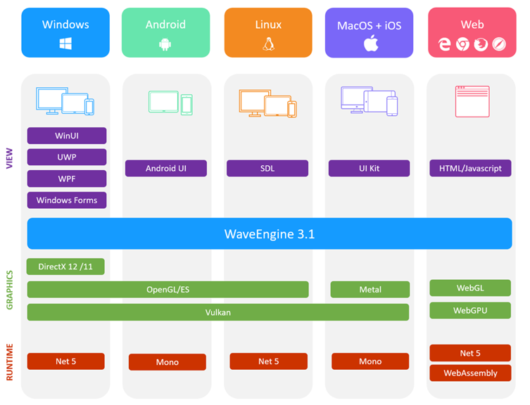
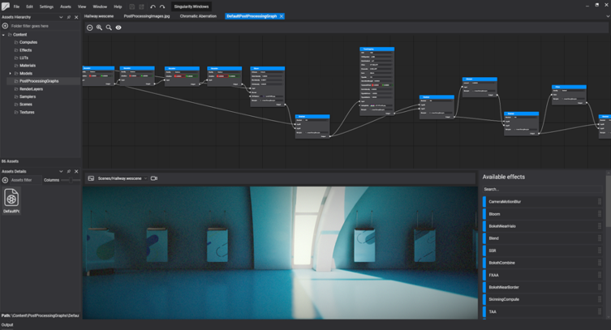

*Javier is a Computer Science Engineer who has always had a passion for 3D graphics and software architecture. His professional achievements include being MVP for Windows DirectX and DirectX XNA for the last nine years, Xbox Ambassador, as well as Microsoft Student Partner and Microsoft Most Valuable Student during his years at college. Currently he works at Plainconcepts as Research Team Lead leading the talented team working on WaveEngine*.

We are glad to announce that aligned with Microsoft we have just released WaveEngine 3.1 with official support for .NET 5 and C# 9. So if you are a C# .NET 5 developer you can start creating 3D apps based on .NET 5 today. Download it from the [WaveEngine download page](https://waveengine.net/Downloads) right now and start creating 3D apps based on .NET 5 today.

##From .NET Core 3.1 to .NET 5
To make this possible we started working on this one year ago, when we decide to rewrite our low-level graphics abstraction API to support the new Vulkan, DirectX12 and Metal graphics APIs. At that time, it was a project based on .NET Framework with an editor based on GTK# which had problems to support new resolutions, multiscreen or the new DPI standards. At that time, we were following all the great advances in performance that Microsoft was doing in .Net Core and the future framework called .NET 5 and we decided that we had to align our engine with this to take advantage of all the new performance features, so we started writing a new editor based on WPF and .NET Core and changed all our extensions and libraries to .NET Core. This took us one year of hard work but the results comparing our old version 2.5 and the new one 3.1 in terms of performance and memory usage are awesome, around 4-5x faster.

Now we have official support for .NET 5 and this technology is ready for .NET 6 so we are glad to become one of the first engines to support it.
This is an overview of what we are building with WaveEngine 3.1 and .NET 5:

We are using .NET 5 runtime and compilers in all platforms where it is possible, Windows, Linux, MacOS and Web and we use Mono where it is not possible, but we are ready for .NET 6 so that we can finally unify this to only use one runtime and compilers for all our supported platforms.
One of the most interesting features that you can see in this diagram is that WaveEngine is easy to integrate with several user interface technologies like WPF, Windows Forms or SDL. If you need to integrate a 3D graphics viewer for data visualization inside new projects with .NET 5 this is a great technology to use.

##WASM
Another interesting technology inside .NET 5 is a new compiler called “dotnet-wasm” with the ability to compile C# code directly to WASM to run on web browsers. Microsoft is pushing this technology as the heart of Blazor and we are able to take advantage of this to run WaveEngine on the web platform using dotnet-wasm, emscripten and WebGL/WebGPU. It is something that we have been dreaming of for years and now it is possible, here you can see it in action in project Paidia:

<iframe width="640" height="480" title="Play the interactive game 'Escape Factory'. You control one robot, an AI agent controls the other one. Try to collaborate, in order to break free from the factory room" class="embed-responsive-item" src="https://ms-paidia-playground.azurewebsites.net/" allowfullscreen=""></iframe>

(The [Project Paidia demo](https://innovation.microsoft.com/en-us/exploring-project-paidia) is a simple game with a new artificial intelligent model running using ONNX.js and WaveEngine on the browser)

##New post processing pipeline
With the new .NET 5 release we will also publish a new tool inside our standalone editor to edit the postprocessing pipeline with a graph editor. We believe this is something new in this area which will allow users to design professional postprocessing pipelines in theirs apps. It looks like this:

The new postprocessing pipeline is completely based on Compute Shader where it is possible to apply new techniques such as LDS (Local Data Share) to improve the standard performance based on Pixel shader. Every box in the editor graph is a compute shader with inputs and outputs, the user can write their compute shader in our effects editor or use some of the built-in ones included in the new version. 

As our Standard Material the new version comes with a Standard Post-Processing graph that users can edit to adapt to their needs. The standard graph comes with all these techniques: TAA (temporal antialiasing), Bokeh DoF (Depth of Field), SSAO (Screen Space Ambient Occlusion), SSR (Screen Space Reflections), Camera Motion Blur, Bloom, Grain, Vignette, Color Gradient and FXAA.
In this video you can see all these techniques applied at the same time in a demo project: 

[[embed url=https://www.youtube.com/embed/YlygX3Hdp5I]]

<iframe width="560" height="315" src="https://www.youtube.com/embed/YlygX3Hdp5I" frameborder="0" allow="accelerometer; autoplay; clipboard-write; encrypted-media; gyroscope; picture-in-picture" allowfullscreen></iframe>

##Resources
Start now developing 3D apps with .NET 5 and C# 9 following the next steps: 
1.	[Download WaveEngine 3.1](https://waveengine.net/Downloads) 
2.	Try the [new samples based on .NET 5](https://github.com/WaveEngine/Samples)
3.	[Deliver your valuable feedback to us](https://github.com/WaveEngine/Feedback)

